# 🌬️ Apache Airflow 3.x — Complete Masterclass Notes

> **Purpose:** Detailed revision notes covering every topic from the Airflow masterclass.
> Includes concepts, architecture diagrams, code examples, flowcharts, and real-world scenarios.

---

## Table of Contents

1. [What is Apache Airflow?](#1-what-is-apache-airflow)
2. [Why Airflow? — The Orchestration Problem](#2-why-airflow--the-orchestration-problem)
3. [DAG Fundamentals](#3-dag-fundamentals)
4. [Core Components & Architecture](#4-core-components--architecture)
5. [Executors](#5-executors)
6. [Installation & Setup (Docker Compose)](#6-installation--setup-docker-compose)
7. [Writing Your First DAG](#7-writing-your-first-dag)
8. [DAG Syncing & Parsing (Behind the Scenes)](#8-dag-syncing--parsing-behind-the-scenes)
9. [DAG Versioning](#9-dag-versioning)
10. [Operators](#10-operators)
11. [XComs — Passing Data Between Tasks](#11-xcoms--passing-data-between-tasks)
12. [Parallel Tasks](#12-parallel-tasks)
13. [Branching — Conditional DAGs](#13-branching--conditional-dags)
14. [Scheduling](#14-scheduling)
15. [Incremental Load & Templating](#15-incremental-load--templating)
16. [Assets (Data-Driven Scheduling)](#16-assets-data-driven-scheduling)
17. [DAG Orchestration (Parent-Child DAGs)](#17-dag-orchestration-parent-child-dags)
18. [Managing Airflow Resources](#18-managing-airflow-resources)
19. [Quick Reference Tables](#19-quick-reference-tables)

---

## 1. What is Apache Airflow?

**Apache Airflow** is an **open-source workflow orchestration framework** originally developed at **Airbnb** and later donated to the **Apache Software Foundation**.

> **One-liner definition:** Airflow lets you **author**, **schedule**, and **monitor** data pipelines (workflows) programmatically using Python.

### Key Characteristics

| Feature | Description |
|---------|-------------|
| **Open Source** | Free to use; massive community |
| **Python-based** | DAGs are written in Python — no XML/YAML |
| **Orchestrator** | Manages *when* and *in what order* tasks run (does NOT process data itself) |
| **Extensible** | 1000+ provider packages (AWS, GCP, Azure, Snowflake, dbt, etc.) |
| **Scalable** | Can handle thousands of DAGs across an enterprise |
| **Modern SDK** | Airflow 3.x introduced a new `airflow.sdk` with decorator-based API |

> ⚠️ **Common Misconception:** Airflow is NOT an ETL tool. It **orchestrates** tools like Spark, dbt, Python scripts that do the actual processing.

---

## 2. Why Airflow? — The Orchestration Problem

### The Real-World Problem

Imagine you are a data engineer with these tasks:

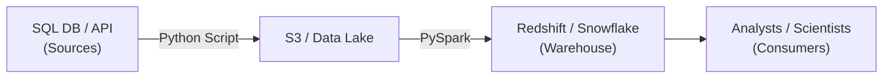

**Two fundamental challenges:**

| # | Challenge | Without Airflow | With Airflow |
|---|-----------|----------------|--------------|
| 1 | **Sequencing** — Task B must run only after Task A succeeds | Manual monitoring / cron + shell scripts | Dependencies defined in code |
| 2 | **Repetition** — Run the pipeline daily/hourly automatically | System cron (fragile, no retries, no visibility) | Built-in scheduler with retry logic, SLAs, alerting |

### What "Orchestration" Means

The word comes from **music**: an orchestrator coordinates which instruments play, in what order, and when.

Similarly, Airflow:
- Defines the **sequence** (dependencies) of tasks
- **Schedules** them on a timeline
- **Monitors** execution (success / failure / retry)
- Provides a **web UI** for visibility

---

## 3. DAG Fundamentals

### What is a DAG?

**DAG = Directed Acyclic Graph**

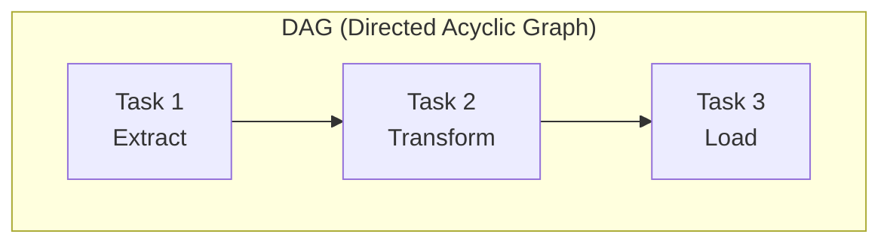

| Term | Meaning |
|------|---------|
| **Directed** | Tasks have a defined direction (A → B, never random) |
| **Acyclic** | No cycles — a task cannot loop back to create a circular dependency |
| **Graph** | A collection of nodes (tasks) connected by edges (dependencies) |

### DAG vs Task

| Concept | Description |
|---------|-------------|
| **DAG** | The entire workflow / pipeline (the "big picture") |
| **Task** | A single unit of work inside a DAG (e.g., run a Python function, execute a SQL query, run a bash command) |
| **Dependency** | The relationship between tasks (Task A must complete before Task B) |

### Example DAG Structure

```
DAG: daily_sales_pipeline
├── Task 1: extract_from_mysql
├── Task 2: transform_with_spark
├── Task 3: load_to_snowflake
└── Task 4: notify_slack
```

Dependencies: `extract → transform → load → notify`

---

## 4. Core Components & Architecture

### High-Level Architecture

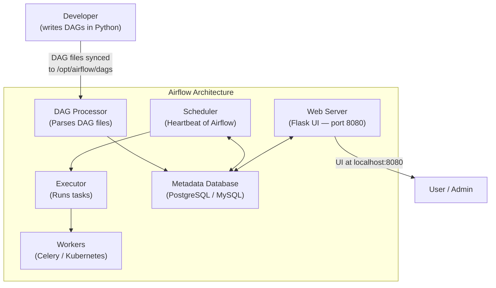

### Component Breakdown

| Component | Role | Analogy |
|-----------|------|---------|
| **Web Server** | UI for monitoring DAGs, tasks, logs | The dashboard on your car |
| **Scheduler** | Determines *when* to run DAGs, sends tasks to executor | The engine timing system |
| **Executor** | Decides *how* tasks run (locally, on Celery, on K8s) | The transmission |
| **Metadata DB** | Stores DAG state, task status, XCom values, variables | The car's computer memory |
| **DAG Processor** | Reads Python DAG files, parses them, stores in DB | File scanner |
| **Workers** | Actually execute the task code (in distributed setups) | The wheels |
| **Triggerer** | Handles deferred/async tasks (new in Airflow 2.2+) | Cruise control |

### Database Tables (PostgreSQL)

When Airflow initializes, it creates **65+ tables** in the `public` schema:

| Key Table | Purpose |
|-----------|---------|
| `dag` | DAG metadata (is_paused, schedule, etc.) |
| `serialized_dag` | Stores the full serialized DAG definition |
| `dag_run` | Records of each DAG execution |
| `task_instance` | Status of each task in each DAG run |
| `xcom` | Cross-communication data between tasks |
| `log` | Execution logs |

**Accessing the DB manually:**
```bash
# Enter the PostgreSQL container
docker exec -it airflow-postgres-1 psql -u airflow

# List all tables
\dt

# Query DAG table
SELECT * FROM dag;
```

---

## 5. Executors

The **executor** determines *how and where* tasks are executed.

| Executor | How It Works | When to Use |
|----------|-------------|-------------|
| **SequentialExecutor** | Runs one task at a time, single process | Development/testing only |
| **LocalExecutor** | Runs tasks in parallel as local subprocesses | Small-to-medium workloads on a single machine |
| **CeleryExecutor** | Distributes tasks to remote Celery workers via a message broker (Redis/RabbitMQ) | Large-scale, multi-machine production |
| **KubernetesExecutor** | Spins up a new K8s pod for each task | Cloud-native, auto-scaling environments |

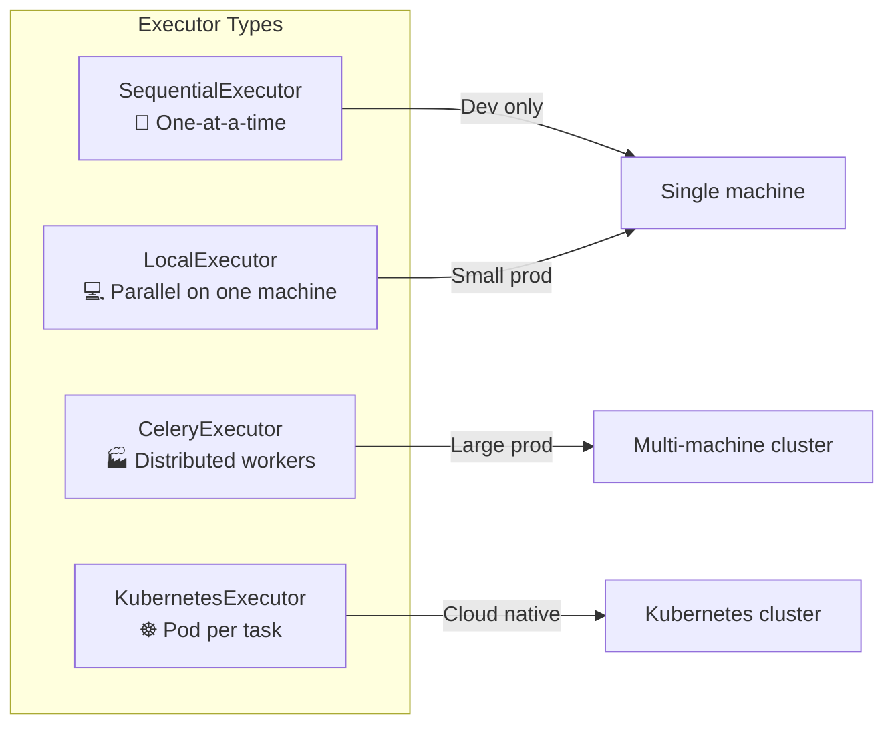

### Setting the Executor

In `airflow.cfg`:
```ini
[core]
executor = LocalExecutor
```

Or via Docker Compose environment variable:
```yaml
AIRFLOW__CORE__EXECUTOR: LocalExecutor
```

---

## 6. Installation & Setup (Docker Compose)

### Prerequisites
- Docker Desktop installed
- Python 3.x (for local development)
- VS Code (recommended)

### Step-by-Step Setup

#### 1. Create Project Structure
```
airflow-project/
├── dags/           # Your DAG files go here
├── logs/           # Airflow logs (auto-generated)
├── config/         # Airflow config (auto-generated)
├── plugins/        # Custom plugins
├── docker-compose.yaml
└── .env
```

#### 2. Download the Official Docker Compose File
```bash
curl -LfO 'https://airflow.apache.org/docs/apache-airflow/stable/docker-compose.yaml'
```

#### 3. Create the `.env` File
```bash
# This sets the Airflow UID to your user ID (avoids permission issues on Linux)
echo -e "AIRFLOW_UID=$(id -u)" > .env
```

> ⚠️ **Important:** Always create the `.env` file. Without it, you may encounter permission-related errors.

#### 4. Initialize Airflow
```bash
docker compose up airflow-init
```

This creates the admin user and initializes the metadata database.

#### 5. Start All Services
```bash
docker compose up -d
```

> The `-d` flag runs containers in **detached** (background) mode.

#### 6. Access the UI
- **URL:** `http://localhost:8080`
- **Username:** `airflow`
- **Password:** `airflow`

### Docker Containers Created

| Container | Service |
|-----------|---------|
| `airflow-webserver-1` | Web UI |
| `airflow-scheduler-1` | Scheduler |
| `airflow-worker-1` | Celery worker (if using CeleryExecutor) |
| `airflow-triggerer-1` | Async task triggerer |
| `airflow-postgres-1` | PostgreSQL metadata DB |
| `redis-1` | Redis message broker (Celery) |

### Key Configuration (`airflow.cfg`)

| Setting | Default | Description |
|---------|---------|-------------|
| `dag_bag_import_timeout` | 30s | Max time to parse a DAG file |
| `dags_folder` | `/opt/airflow/dags` | Where Airflow looks for DAG files |
| `executor` | `SequentialExecutor` | Task execution strategy |
| `is_paused_upon_creation` | `True` | New DAGs start paused |

---

## 7. Writing Your First DAG

### The TaskFlow API (Decorator-Based — Airflow 3.x)

```python
from airflow.sdk import dag, task
from pendulum import datetime

@dag(
    dag_id="first_dag",
    start_date=datetime(2026, 1, 1, tz="UTC"),
    schedule=None,       # Manual trigger only
    catchup=False,
    tags=["example"]
)
def first_dag():
    
    @task.python()
    def first_task():
        print("This is the first task")
    
    @task.python()
    def second_task():
        print("This is the second task")
    
    @task.python()
    def third_task():
        print("This is the third task")
    
    # Define dependencies using bitshift operator >>
    first = first_task()
    second = second_task()
    third = third_task()
    
    first >> second >> third  # first → second → third

# Register (instantiate) the DAG
first_dag()
```

### Key Concepts

| Element | Description |
|---------|-------------|
| `@dag` decorator | Defines the DAG and its properties |
| `@task.python()` | Registers a Python function as a task |
| `@task.bash()` | Registers a bash command as a task |
| `>>` (bitshift) | Defines dependency: left runs before right |
| `dag_id` | Unique name for the DAG (defaults to function name) |
| `start_date` | The earliest date from which DAG runs can be scheduled |
| `schedule` | How often to run (`"@daily"`, cron expression, or `None`) |
| `catchup` | If True, runs for all missed intervals since `start_date` |

### Task Decorator Variants

```python
@task                   # Default: Python task
@task.python()          # Explicit Python task
@task.bash()            # Bash command task
@task.branch()          # Branching decision task
@task.branch_external_python()
@task.virtualenv()      # Runs in a virtual environment
```

### Dependency Definition Methods

```python
# Method 1: Bitshift operator (recommended)
task_a >> task_b >> task_c

# Method 2: set_downstream / set_upstream
task_a.set_downstream(task_b)
task_b.set_upstream(task_a)

# Method 3: List for fan-out / fan-in
task_a >> [task_b, task_c, task_d]  # fan-out
[task_b, task_c, task_d] >> task_e  # fan-in
```

---

## 8. DAG Syncing & Parsing (Behind the Scenes)

### How DAGs Get From VS Code to the Airflow UI

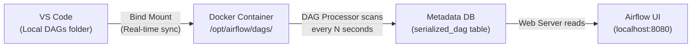

### Step-by-Step Flow

1. **Write DAG** locally in `./dags/` folder
2. **Bind mount** syncs the file instantly into the Docker container at `/opt/airflow/dags/`
3. **DAG Processor** scans the folder every `dag_bag_import_timeout` seconds (default: 30s)
4. **Parser** reads the Python file, validates syntax, extracts the DAG structure
5. **Serialized DAG** is stored in the PostgreSQL database
6. **Web Server** reads from the DB and displays the DAG in the UI

### Bind Mounts vs Volumes

| Feature | Bind Mount | Docker Volume |
|---------|-----------|---------------|
| **Data persistence** | Tied to host path | Managed by Docker |
| **Use case** | Development (sync files in real-time) | Production (persist data) |
| **Airflow usage** | DAG files, config | PostgreSQL data |

### Troubleshooting: DAG Not Appearing in UI

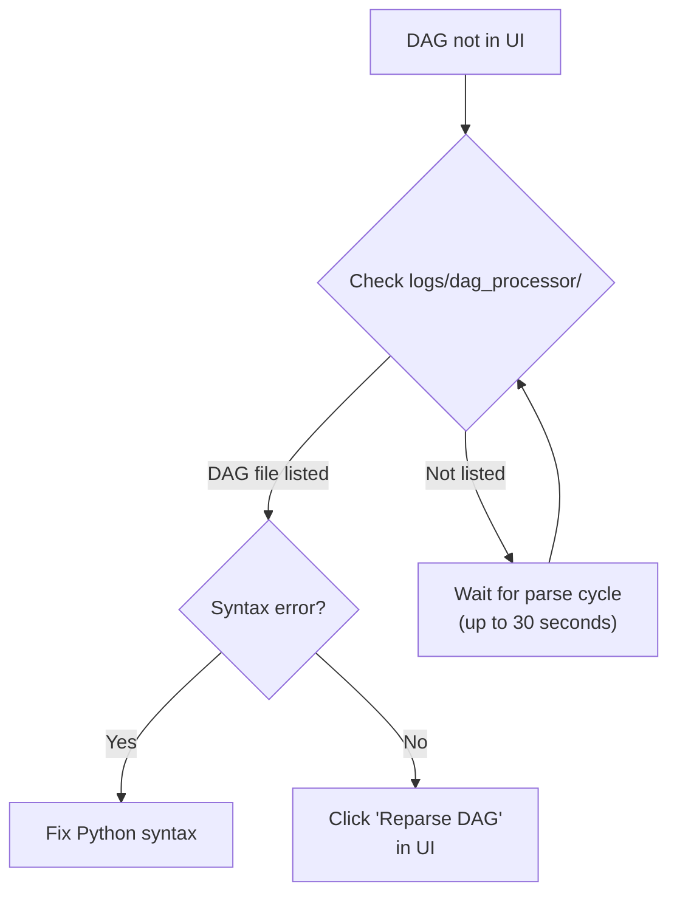

**Key checks:**
1. Check `logs/dag_processor/` for your DAG file entry
2. Wait at least 30 seconds for the parse cycle
3. Check for syntax errors (they prevent the DAG from appearing)
4. Use the "Reparse DAG" option in the UI hamburger menu

### Verifying Inside the Container

```bash
# Enter any Airflow container
docker exec -it airflow-webserver-1 bash

# Navigate to DAGs folder
cd /opt/airflow/dags
ls  # You should see your DAG files

# Check current location
pwd  # /opt/airflow
ls   # dags/ logs/ config/ plugins/
```

---

## 9. DAG Versioning

Airflow 3.x automatically tracks **versions** of your DAGs.

### How It Works

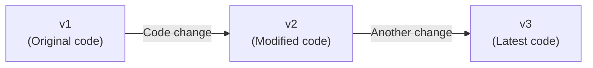

- Every **significant change** to a DAG file creates a new version (v1, v2, v3, ...)
- Minor changes may not trigger a new version
- You can **view any previous version** in the UI
- You can **trigger a specific version** (e.g., run v1 even though v2 is the latest)

### Viewing Versions in UI

1. Open DAG in Airflow UI
2. Click the **version dropdown** (shows v1, v2, etc.)
3. Select a version to see its code and graph
4. Each DAG run shows which version was used

### Important Notes

- The **latest parsed version** is always the default for new runs
- Previous versions are stored for **audit and rollback** purposes
- **Do not switch versions** in production with scheduled DAGs — it can cause inconsistencies

---

## 10. Operators

Operators define **what type of work** a task performs.

### Common Operators

| Operator | Purpose | Example |
|----------|---------|---------|
| `PythonOperator` / `@task.python()` | Execute a Python function | Data processing, API calls |
| `BashOperator` / `@task.bash()` | Execute a bash command | Shell scripts, CLI tools |
| `EmailOperator` | Send emails | Notifications |
| `DummyOperator` / `EmptyOperator` | No-op placeholder | DAG structure clarity |
| `BranchPythonOperator` / `@task.branch()` | Conditional branching | Choose which path to follow |
| `TriggerDagRunOperator` | Trigger another DAG | DAG orchestration |

### Python Task Example

```python
@task.python()
def extract_data():
    print("Extracting data from API")
    data = {"users": [1, 2, 3, 4, 5]}
    return data
```

### Bash Task Example

```python
@task.bash()
def run_shell_command():
    return "echo 'Hello from Bash!' && date"
```

### Using the Traditional Operator (Import-Based)

```python
from airflow.operators.bash import BashOperator

run_this = BashOperator(
    task_id="run_bash_command",
    bash_command="echo 'Hello World'",
)
```

> **Best Practice (Airflow 3.x):** Use `@task.python()` and `@task.bash()` decorators instead of importing operators directly. The decorator approach is cleaner and more Pythonic.

---

## 11. XComs — Passing Data Between Tasks

### What is XCom?

**XCom = Cross-Communication** — the mechanism for passing data between tasks.

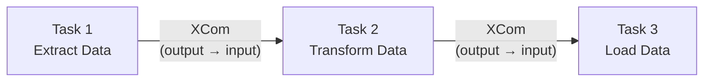

### Method 1: Automatic XCom (Return Value)

The simplest approach — just **return** a value from a task function and pass it as an argument to the next task.

```python
from airflow.sdk import dag, task
from pendulum import datetime

@dag(
    dag_id="xcoms_auto_dag",
    start_date=datetime(2026, 1, 1, tz="UTC"),
    schedule=None,
    catchup=False
)
def xcoms_auto_dag():
    
    @task.python()
    def first_task():
        """Extract data — returns a dict"""
        print("Extracting data - First task")
        fetched_data = {"data": [1, 2, 3, 4, 5]}
        return fetched_data  # ← Automatically pushed to XCom
    
    @task.python()
    def second_task(data: dict):
        """Transform data — receives output of first_task"""
        print("Transforming data")
        fetched_data = data["data"]
        transformed = fetched_data * 2  # Duplicate the list
        return {"transformed_data": transformed}
    
    @task.python()
    def third_task(data: dict):
        """Load data"""
        print("Loading data")
        load_data = data
        return load_data
    
    # Airflow automatically creates dependencies 
    # because return values are passed as arguments
    first = first_task()
    second = second_task(first)   # first's output → second's input
    third = third_task(second)    # second's output → third's input

xcoms_auto_dag()
```

> **Key Insight:** When you pass the return value of one task as an argument to another, Airflow 3.x **automatically infers dependencies** — you don't need `>>` operators!

### Method 2: Manual XCom (Push/Pull via `**kwargs`)

For more control, use `ti.xcom_push()` and `ti.xcom_pull()`.

```python
@dag(
    dag_id="xcoms_manual_dag",
    start_date=datetime(2026, 1, 1, tz="UTC"),
    schedule=None,
    catchup=False
)
def xcoms_manual_dag():
    
    @task.python()
    def first_task(**kwargs):
        """Manually push data to XCom"""
        # Extract task instance from kwargs (context dict)
        ti = kwargs["ti"]
        
        fetched_data = {"data": [1, 2, 3, 4, 5]}
        
        # Manually push with a custom key
        ti.xcom_push(key="return_result", value=fetched_data)
        # Note: no return statement needed!
    
    @task.python()
    def second_task(**kwargs):
        """Manually pull data from XCom"""
        ti = kwargs["ti"]
        
        # Pull data from first_task using task_id and key
        fetched_data = ti.xcom_pull(
            task_ids="first_task",
            key="return_result"
        )
        
        data = fetched_data["data"]
        transformed = data * 2
        
        ti.xcom_push(key="return_result", value={"transformed": transformed})
    
    @task.python()
    def third_task(**kwargs):
        ti = kwargs["ti"]
        result = ti.xcom_pull(task_ids="second_task", key="return_result")
        print(f"Final data: {result}")
    
    # Must define dependencies manually (no argument passing)
    first = first_task()
    second = second_task()
    third = third_task()
    first >> second >> third

xcoms_manual_dag()
```

### Auto vs Manual XCom

| Feature | Auto (Return) | Manual (Push/Pull) |
|---------|--------------|-------------------|
| **Key used** | `return_value` (default) | Custom key name |
| **Dependencies** | Auto-inferred | Must define with `>>` |
| **Control** | Less | Full control |
| **Readability** | Cleaner for simple DAGs | Better for complex DAGs |
| **Best for** | Simple linear flows | Complex graphs, multiple outputs |

### Viewing XCom Values in UI

1. Click on a **task instance** in the UI
2. Go to the **XCom** tab
3. You'll see the key-value pairs pushed by that task

---

## 12. Parallel Tasks

### Fan-Out / Fan-In Pattern

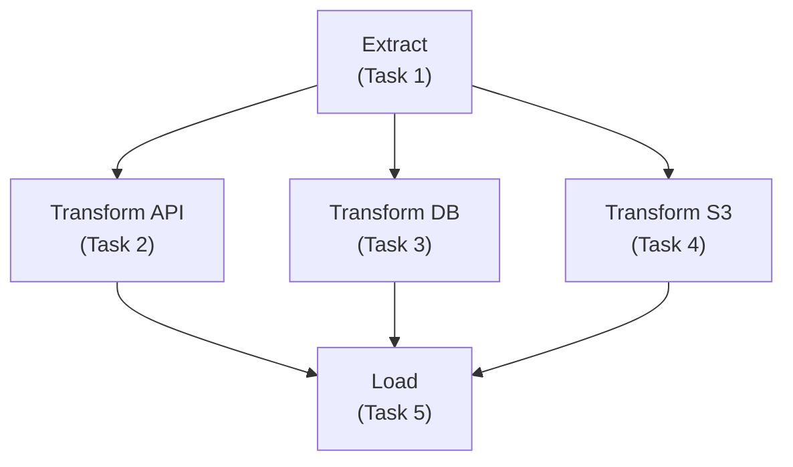

### Code Example

```python
@dag(
    dag_id="parallel_dag",
    start_date=datetime(2026, 1, 1, tz="UTC"),
    schedule=None,
    catchup=False
)
def parallel_dag():
    
    @task.python()
    def extract_task(**kwargs):
        ti = kwargs["ti"]
        extracted = {
            "api_data": [1, 2, 3],
            "db_data": [4, 5, 6],
            "s3_data": [7, 8, 9]
        }
        ti.xcom_push(key="return_value", value=extracted)
    
    @task.python()
    def transform_api(**kwargs):
        ti = kwargs["ti"]
        data = ti.xcom_pull(task_ids="extract_task", key="return_value")
        api_data = data["api_data"]
        result = [x * 10 for x in api_data]
        ti.xcom_push(key="return_value", value=result)
    
    @task.python()
    def transform_db(**kwargs):
        ti = kwargs["ti"]
        data = ti.xcom_pull(task_ids="extract_task", key="return_value")
        db_data = data["db_data"]
        result = [x * 10 for x in db_data]
        ti.xcom_push(key="return_value", value=result)
    
    @task.python()
    def transform_s3(**kwargs):
        ti = kwargs["ti"]
        data = ti.xcom_pull(task_ids="extract_task", key="return_value")
        s3_data = data["s3_data"]
        result = [x * 10 for x in s3_data]
        ti.xcom_push(key="return_value", value=result)
    
    @task.bash()
    def load_task(**kwargs):
        ti = kwargs["ti"]
        api = ti.xcom_pull(task_ids="transform_api", key="return_value")
        db = ti.xcom_pull(task_ids="transform_db", key="return_value")
        s3 = ti.xcom_pull(task_ids="transform_s3", key="return_value")
        return f"echo 'Loaded: API={api}, DB={db}, S3={s3}'"
    
    # Define dependencies
    ext = extract_task()
    t_api = transform_api()
    t_db = transform_db()
    t_s3 = transform_s3()
    load = load_task()
    
    # Fan-out: extract → [three parallel transforms]
    ext >> [t_api, t_db, t_s3]
    
    # Fan-in: [three transforms] → load
    [t_api, t_db, t_s3] >> load

parallel_dag()
```

### Dependency Syntax for Parallel Tasks

```python
# Fan-out: one task → multiple tasks
task_a >> [task_b, task_c, task_d]

# Fan-in: multiple tasks → one task
[task_b, task_c, task_d] >> task_e

# Combined
task_a >> [task_b, task_c, task_d] >> task_e
```

---

## 13. Branching — Conditional DAGs

### What is Branching?

Branching lets you **choose which path** a DAG follows based on a condition at runtime.

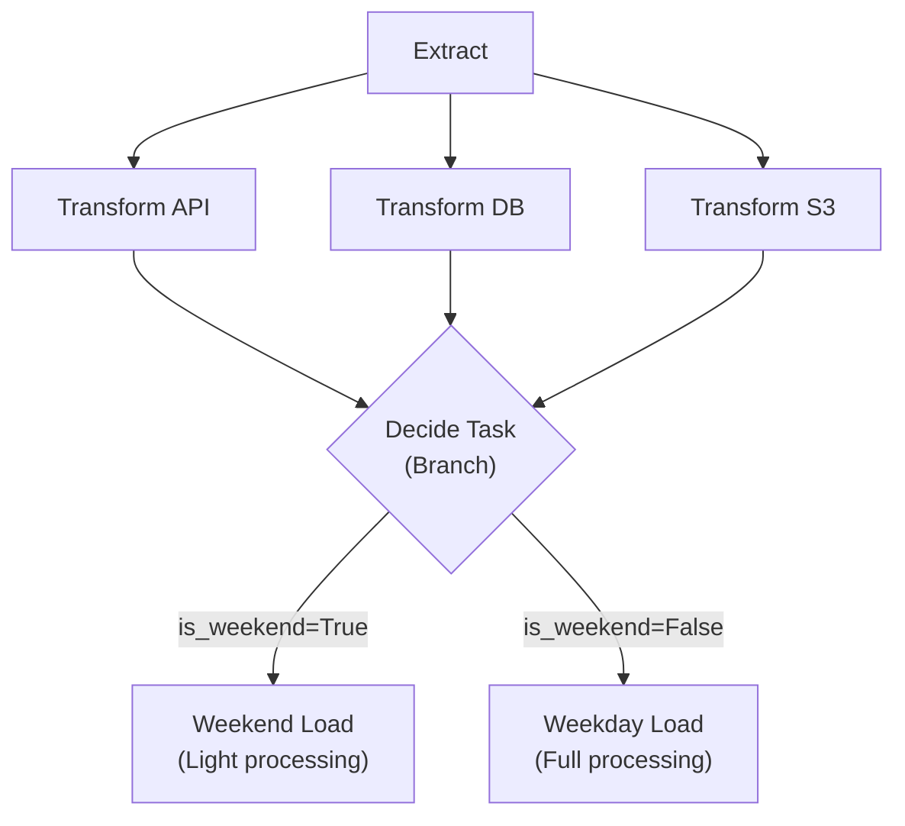

### Code Example

```python
from airflow.sdk import dag, task
from pendulum import datetime
import pendulum

@dag(
    dag_id="branch_dag",
    start_date=datetime(2026, 1, 1, tz="UTC"),
    schedule=None,
    catchup=False
)
def branch_dag():
    
    @task.python()
    def extract_task():
        return {"data": [1, 2, 3]}
    
    @task.branch()
    def decide_task():
        """Returns the task_id of the branch to follow"""
        today = pendulum.now()
        is_weekend = today.day_of_week in [5, 6]  # Saturday=5, Sunday=6
        
        if is_weekend:
            return "weekend_load"  # Return task_id
        else:
            return "weekday_load"  # Return task_id
    
    @task.python()
    def weekend_load():
        print("Running weekend load — light processing")
    
    @task.python()
    def weekday_load():
        print("Running weekday load — full processing")
    
    # Define flow
    ext = extract_task()
    decision = decide_task()
    wk_end = weekend_load()
    wk_day = weekday_load()
    
    ext >> decision >> [wk_end, wk_day]

branch_dag()
```

### How Branching Works

1. The `@task.branch()` decorated function **returns a task_id** (string)
2. Only the task whose ID matches the returned value will **execute**
3. All other downstream branches are **skipped** (shown in pink in the UI)

> **Important:** The branch function returns the **task_id**, not the task function name. These are usually the same when using decorators, but be careful with custom `task_id` parameters.

---

## 14. Scheduling

### Four Key Scheduling Parameters

| Parameter | Required? | Description |
|-----------|-----------|-------------|
| `start_date` | ✅ Yes | The earliest date from which DAG runs can begin |
| `end_date` | ❌ Optional | When to stop scheduling (default: runs forever) |
| `schedule` | ✅ Yes | How often the DAG runs |
| `catchup` | ❌ Optional | Whether to backfill missed intervals (default: `False` in 3.x) |

### Method 1: Presets

```python
@dag(
    schedule="@daily",     # Runs daily at midnight UTC
    start_date=datetime(2026, 1, 26, tz="America/Halifax"),
    catchup=False,
    is_paused_upon_creation=False   # Auto-enable on deploy
)
```

| Preset | Equivalent Cron | Runs At |
|--------|----------------|---------|
| `@once` | — | Run only once |
| `@hourly` | `0 * * * *` | Every hour at minute 0 |
| `@daily` | `0 0 * * *` | Every day at midnight |
| `@weekly` | `0 0 * * 0` | Every Sunday at midnight |
| `@monthly` | `0 0 1 * *` | First day of every month at midnight |
| `@yearly` | `0 0 1 1 *` | January 1st at midnight |
| `None` | — | Manual trigger only |

### Method 2: Cron Syntax

```python
from airflow.timetables.trigger import CronTriggerTimetable

@dag(
    schedule=CronTriggerTimetable(
        "0 16 * * MON-FRI",          # 4:00 PM, Mon-Fri
        timezone="America/Halifax"
    ),
    start_date=datetime(2026, 1, 26, tz="America/Halifax"),
    catchup=True
)
```

#### Cron Expression Format

```
┌───────────── minute (0-59)
│ ┌───────────── hour (0-23)
│ │ ┌───────────── day of month (1-31)
│ │ │ ┌───────────── month (1-12)
│ │ │ │ ┌───────────── day of week (MON-SUN or 0-6)
│ │ │ │ │
* * * * *
```

| Example | Meaning |
|---------|---------|
| `0 16 * * *` | Every day at 4:00 PM |
| `0 16 * * MON-FRI` | Weekdays at 4:00 PM |
| `30 9 1 * *` | 9:30 AM on the 1st of every month |
| `*/15 * * * *` | Every 15 minutes |
| `0 0 * * 0` | Every Sunday at midnight |

> **Pro tip:** Use [crontab.guru](https://crontab.guru) to validate cron expressions.

### Method 3: Delta Trigger (Frequency-Based)

For schedules that don't fit cron patterns (e.g., "every 3 days"):

```python
from airflow.timetables.trigger import DeltaTriggerTimetable
from pendulum import duration

@dag(
    schedule=DeltaTriggerTimetable(
        duration(days=3)    # Run every 3 days
    ),
    start_date=datetime(2026, 1, 26, tz="America/Halifax"),
    catchup=True
)
```

### Why Delta Instead of Cron?

Cron resets at month boundaries:
```
Jan: 1, 4, 7, 10, 13, 16, 19, 22, 25, 28, 31
Feb: 1, 4, 7, ...  ← WRONG! Should be 3, 6, 9... (continuing from Jan 31)
```

Delta maintains a **continuous interval** regardless of month boundaries:
```
Jan 1 → Jan 4 → Jan 7 → ... → Jan 31 → Feb 3 → Feb 6 → ...
```

### Catchup (Backfill)

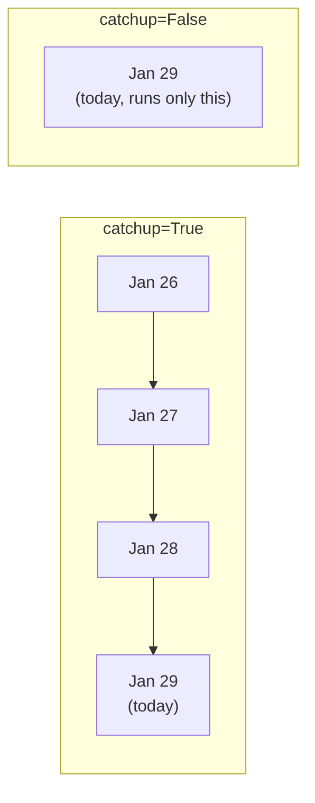

- **`catchup=True`**: Runs DAG for ALL missed intervals since `start_date`
- **`catchup=False`**: Only runs for the current/latest interval
- In Airflow 3.x, `catchup` defaults to **False**
- Also called **backfill** or **initial load**

### Using `pendulum` for Start Dates

```python
from pendulum import datetime

# ✅ Recommended: timezone-aware
start_date = datetime(2026, 1, 1, tz="America/Halifax")

# ❌ Not recommended: timezone-naive (defaults to UTC)
start_date = datetime(2026, 1, 1)
```

> **Why pendulum?** It handles timezone conversions automatically. Python's built-in `datetime` requires manual timezone management.

---

## 15. Incremental Load & Templating

### What is Incremental Load?

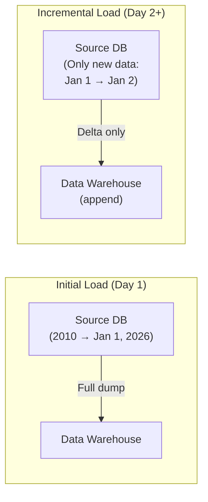

| Load Type | What It Loads | When Used |
|-----------|--------------|-----------|
| **Initial/Full Load** | ALL historical data | First-time migration |
| **Incremental Load** | Only NEW/CHANGED data since last run | Daily/hourly updates |

### Interval-Based Scheduling for Incremental Load

Unlike trigger-based scheduling, **interval-based scheduling** runs a DAG for a **time interval**, not a point in time.

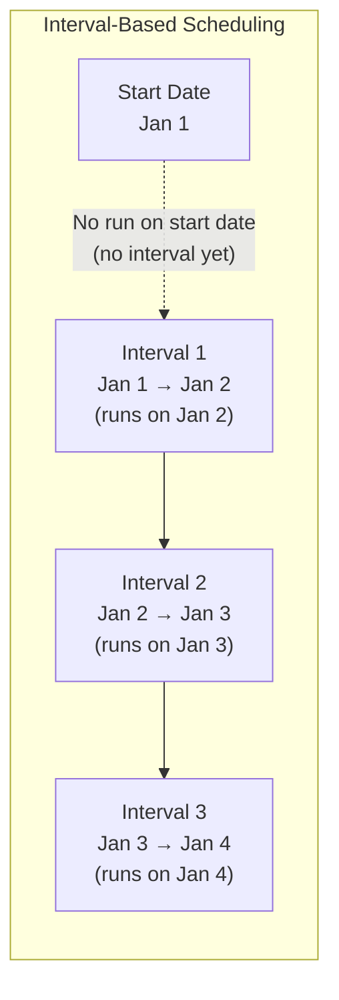

> ⚠️ **Critical Interview Concept:** The DAG **does NOT run on the start_date**. It runs at the **end** of the first interval (start_date + 1 schedule period). This is because it needs a complete interval (from → to) to operate.

### Key Date Variables

| Variable | Description |
|----------|-------------|
| `data_interval_start` | Start of the current interval (e.g., Jan 1) |
| `data_interval_end` | End of the current interval (e.g., Jan 2) |

### Accessing Dates in Python Tasks (via `**kwargs`)

```python
from airflow.timetables.interval import CronDataIntervalTimetable

@dag(
    schedule=CronDataIntervalTimetable(
        cron="@daily",
        timezone="America/Halifax"
    ),
    start_date=datetime(2026, 1, 26, tz="America/Halifax"),
    end_date=datetime(2026, 1, 31, tz="America/Halifax"),
    catchup=True
)
def incremental_dag():
    
    @task.python()
    def incremental_data_fetch(**kwargs):
        # Access interval dates from kwargs
        date_interval_start = kwargs["data_interval_start"]
        date_interval_end = kwargs["data_interval_end"]
        
        print(f"Fetching data from {date_interval_start} to {date_interval_end}")
        
        # Real-world: use these dates in your SQL query
        # query = f"SELECT * FROM orders WHERE created_at BETWEEN '{date_interval_start}' AND '{date_interval_end}'"
```

### Accessing Dates in Bash Tasks (Jinja Templating)

```python
    @task.bash()
    def incremental_data_process():
        # Double curly braces = Jinja template variables
        # Automatically rendered by Airflow for bash operators
        return "echo 'Processing data from {{ data_interval_start }} to {{ data_interval_end }}'"
```

### Python vs Bash Templating

| Feature | Python Tasks | Bash Tasks |
|---------|-------------|------------|
| **Access method** | `kwargs["data_interval_start"]` | `{{ data_interval_start }}` |
| **Template engine** | Python kwargs dictionary | Jinja2 templating |
| **Variables available** | All context variables via `**kwargs` | All Jinja macros |

### Common Jinja Template Variables

| Variable | Description |
|----------|-------------|
| `{{ ds }}` | Execution date as `YYYY-MM-DD` |
| `{{ ts }}` | Execution timestamp |
| `{{ data_interval_start }}` | Interval start datetime |
| `{{ data_interval_end }}` | Interval end datetime |
| `{{ dag_run.run_id }}` | Current DAG run ID |
| `{{ task.task_id }}` | Current task ID |

---

## 16. Assets (Data-Driven Scheduling)

### What are Assets?

**Assets** (new in Airflow 2.4, enhanced in 3.x) enable **data-driven scheduling** — a DAG runs automatically when an upstream dataset/asset is updated.

### Traditional vs Asset-Based Approach

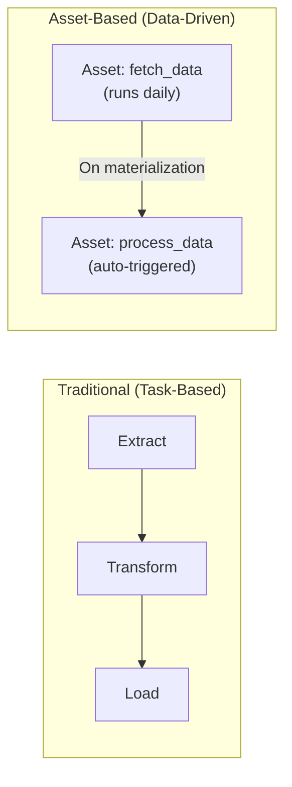

| Approach | Trigger | Best For |
|----------|---------|----------|
| **Task dependencies** | Previous task completes | Within a single DAG |
| **Asset dependencies** | Upstream data is updated | Cross-DAG, data-aware pipelines |

### How Assets Work Under the Hood

An asset is essentially a **DAG with a single task**, decorated with `@asset`.

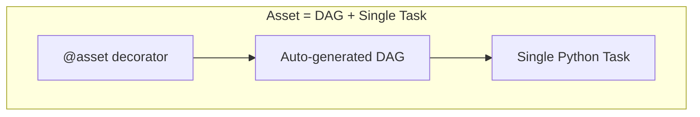

### Creating a Producer Asset

```python
# File: asset_producer.py
from airflow.sdk import dag, task, asset
from pendulum import datetime
import os

@asset(
    schedule="@daily",
    uri="file:///opt/airflow/logs/data/data_extract.txt",  # Optional but recommended
    name="fetch_data"
)
def fetch_data(self):
    """Producer asset — fetches and stores data"""
    # Create directory if it doesn't exist
    os.makedirs(os.path.dirname(self.uri), exist_ok=True)
    
    # Write data to the URI location
    with open(self.uri, "w") as f:
        f.write("Data fetched successfully\n")
    
    print(f"Data written to {self.uri}")
```

### Creating a Consumer Asset (Dependent)

```python
# File: asset_consumer.py
from airflow.sdk import dag, task, asset
from asset_producer import fetch_data  # Import the upstream asset
import os

@asset(
    schedule=fetch_data,  # ← Triggered when fetch_data is materialized!
    uri="file:///opt/airflow/logs/data/data_processed.txt",
    name="process_data"
)
def process_data(self):
    """Consumer asset — runs automatically when fetch_data completes"""
    os.makedirs(os.path.dirname(self.uri), exist_ok=True)
    
    with open(self.uri, "w") as f:
        f.write("Data processed successfully\n")
    
    print(f"Data processed and written to {self.uri}")
```

### Key Concepts

| Concept | Description |
|---------|-------------|
| **Materialization** | Running/executing an asset (fancy word for "run") |
| **URI** | Location identifier for the asset's data (S3 path, file path, table name) |
| **Producer** | The asset that creates/updates data |
| **Consumer** | The asset that triggers when the producer is materialized |
| **`self.uri`** | Access the URI inside the asset function |

### Viewing Assets in UI

- **Assets tab** in the Airflow UI shows all registered assets
- Each asset shows its URI, schedule, and materialization history
- Consumer DAG runs show `run_type = asset_triggered`

### Assets CLI

```bash
# Inside a Docker container:
airflow assets list   # Lists all registered assets
```

### When to Use Assets vs Traditional DAGs

| Use Assets When... | Use Traditional DAGs When... |
|-------------------|---------------------------|
| Cross-DAG data dependencies | Tasks within a single workflow |
| Data validation before triggering downstream | Simple linear pipelines |
| Event-driven data pipelines | Time-based scheduling is sufficient |
| You want data lineage tracking | No cross-DAG coordination needed |

---

## 17. DAG Orchestration (Parent-Child DAGs)

### Why Orchestrate DAGs?

In real-world scenarios, you may have **hundreds of DAGs** across departments (Sales, Marketing, Finance). You need a **parent DAG** to coordinate them.

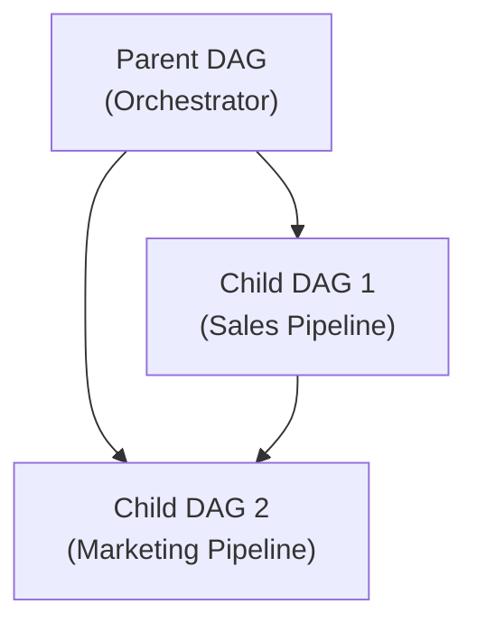

### Using `TriggerDagRunOperator`

```python
# File: dag_orchestrate_parent.py
from airflow.sdk import dag, task
from airflow.operators.trigger_dagrun import TriggerDagRunOperator
from pendulum import datetime

@dag(
    dag_id="parent_orchestrator_dag",
    start_date=datetime(2026, 1, 1, tz="UTC"),
    schedule=None,
    catchup=False
)
def parent_orchestrator_dag():
    
    trigger_first = TriggerDagRunOperator(
        task_id="trigger_sales_dag",
        trigger_dag_id="first_orchestrator_dag",  # DAG ID of the child
        wait_for_completion=True  # ← Wait for child to finish before continuing
    )
    
    trigger_second = TriggerDagRunOperator(
        task_id="trigger_marketing_dag",
        trigger_dag_id="second_orchestrator_dag",
        wait_for_completion=True
    )
    
    trigger_first >> trigger_second  # Sales must complete before Marketing

parent_orchestrator_dag()
```

### Key Parameters of `TriggerDagRunOperator`

| Parameter | Description |
|-----------|-------------|
| `task_id` | ID of this task in the parent DAG |
| `trigger_dag_id` | DAG ID of the child DAG to trigger |
| `wait_for_completion` | If `True`, parent waits until child finishes (default: `False`) |
| `conf` | Dict of config to pass to the triggered DAG |
| `execution_date` | Specific execution date for the triggered DAG |

### Important Gotchas

1. **Child DAGs must be enabled** (unpaused) — otherwise they'll be queued but not executed
2. **`wait_for_completion=True`** makes the parent slower but ensures sequential execution
3. **Don't use simple function calls** to trigger DAGs — you must use `TriggerDagRunOperator` because Airflow needs the executor/operator to properly manage the run

---

## 18. Managing Airflow Resources

### Starting and Stopping Airflow

```bash
# Start all services (detached mode)
docker compose up -d

# Stop all containers (removes them)
docker compose down

# View running containers
docker ps

# View logs for a specific service
docker compose logs -f airflow-webserver
```

### Default Credentials

| Setting | Value |
|---------|-------|
| **UI URL** | `http://localhost:8080` |
| **Username** | `airflow` |
| **Password** | `airflow` |

### Container Directory Structure

```
/opt/airflow/
├── dags/       ← Your DAG Python files
├── logs/       ← Task execution logs
│   ├── dag_processor/   ← DAG parsing logs
│   └── scheduler/       ← Scheduler logs
├── config/     ← airflow.cfg
└── plugins/    ← Custom plugins
```

---

## 19. Quick Reference Tables

### DAG Decorator Parameters

| Parameter | Type | Default | Description |
|-----------|------|---------|-------------|
| `dag_id` | str | Function name | Unique identifier |
| `start_date` | datetime | Required | Earliest scheduled date |
| `end_date` | datetime | None | Stop scheduling after this |
| `schedule` | str/Timetable/None | None | Schedule configuration |
| `catchup` | bool | False (3.x) | Backfill missed intervals |
| `tags` | list[str] | [] | UI tags for filtering |
| `is_paused_upon_creation` | bool | True | Start paused when deployed |
| `max_active_runs` | int | 16 | Max concurrent DAG runs |
| `default_args` | dict | {} | Default args for all tasks |

### Task Context Variables (`**kwargs` / Jinja)

| Variable | Python Access | Jinja Access | Description |
|----------|--------------|-------------|-------------|
| Task Instance | `kwargs["ti"]` | `{{ ti }}` | Current task instance |
| DAG Run | `kwargs["dag_run"]` | `{{ dag_run }}` | Current DAG run |
| Interval Start | `kwargs["data_interval_start"]` | `{{ data_interval_start }}` | Schedule interval start |
| Interval End | `kwargs["data_interval_end"]` | `{{ data_interval_end }}` | Schedule interval end |
| Execution Date | `kwargs["ds"]` | `{{ ds }}` | Logical date (YYYY-MM-DD) |
| Run ID | `kwargs["run_id"]` | `{{ run_id }}` | DAG run ID |

### Airflow CLI Commands (Inside Container)

| Command | Description |
|---------|-------------|
| `airflow dags list` | List all DAGs |
| `airflow dags trigger <dag_id>` | Manually trigger a DAG |
| `airflow dags pause <dag_id>` | Pause a DAG |
| `airflow dags unpause <dag_id>` | Unpause a DAG |
| `airflow tasks list <dag_id>` | List tasks in a DAG |
| `airflow tasks test <dag_id> <task_id> <date>` | Test a single task |
| `airflow assets list` | List all assets |
| `airflow db check` | Check DB connection |

### Common Errors & Solutions

| Error | Cause | Solution |
|-------|-------|----------|
| DAG not showing in UI | Not parsed yet | Wait 30s, or click "Reparse DAG" |
| DAG not showing in UI | Syntax error in Python file | Check `logs/dag_processor/` for error details |
| Task stuck in "queued" | Executor not running properly | Restart containers: `docker compose restart` |
| Permission errors | Missing `.env` file | Create `.env` with `AIRFLOW_UID=$(id -u)` |
| Import timeout | DAG file too complex | Increase `dag_bag_import_timeout` in `airflow.cfg` |
| `CeleryExecutor` errors | Environment not set up | Ensure Redis is running; check `.env` file |
| Child DAG queued but not running | Child DAG is paused | Enable (unpause) the child DAG in the UI |

---

## 🏁 Summary Flowchart — The Complete Airflow Journey

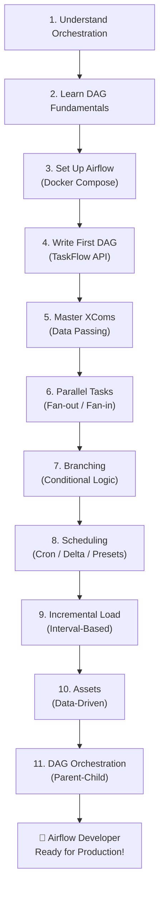

---

> **💡 Final Tips:**
> - Always use `pendulum` for dates (timezone-aware by default)
> - Use `@task.python()` and `@task.bash()` decorators (Airflow 3.x best practice)
> - Keep DAG files clean — don't put heavy processing logic in DAG definitions
> - Use `catchup=False` in production unless you specifically need backfilling
> - Always create the `.env` file before running `docker compose up`
> - Use `wait_for_completion=True` when orchestrating dependent child DAGs
