# 🅰️ Ansible — Complete Notes (Beginner → Roles)

> **Source:** `txt_file/ansible.txt` (Hindi video transcript, ~3.5 hrs) — translated, reorganized, and supplemented with information from the official Ansible documentation.
> Sections marked **➕ Extra** are additions that aren't in the video but are useful to know.

---

## 📑 Table of Contents

1. [What is Ansible?](#1-what-is-ansible)
2. [The Problem Ansible Solves](#2-the-problem-ansible-solves)
3. [Advantages of Ansible](#3-advantages-of-ansible)
4. [Architecture & Core Components](#4-architecture--core-components)
5. [YAML Basics](#5-yaml-basics)
6. [Lab Setup (Control Node + Managed Node)](#6-lab-setup-control-node--managed-node)
7. [Installing Ansible](#7-installing-ansible)
8. [Ansible Configuration (`/etc/ansible`)](#8-ansible-configuration-etcansible)
9. [Your First Playbook](#9-your-first-playbook)
10. [Playbook with Multiple Tasks (debug)](#10-playbook-with-multiple-tasks-debug-module)
11. [Install & Start a Package (yum/dnf + service)](#11-install--start-a-package-yum--service)
12. [Finding Modules & Parameters (Docs)](#12-finding-modules--parameters)
13. [Inventory File (Hosts)](#13-inventory-file-hosts)
14. [Running Playbooks on Remote Servers](#14-running-playbooks-on-remote-servers)
15. [Copy Module (owner, group, mode, backup)](#15-copy-module)
16. [File Module (create/delete files & dirs, permissions)](#16-file-module)
17. [Running Scripts on Remote Servers (shell module)](#17-running-scripts-on-remote-servers-shell-module)
18. [Cron Jobs (cron module)](#18-cron-jobs-cron-module)
19. [User Management (user module)](#19-user-management-user-module)
20. [Setting User Passwords (password_hash)](#20-setting-user-passwords)
21. [Killing a Process & Restarting a Service](#21-killing-a-process--restarting-a-service)
22. [Downloading Files (get_url module)](#22-downloading-files-get_url-module)
23. [Firewall Management (firewalld module)](#23-firewall-management-firewalld-module)
24. [Non-root Users & Privilege Escalation (become)](#24-non-root-users--privilege-escalation-become)
25. [Ad-hoc Commands](#25-ad-hoc-commands)
26. [Tags](#26-tags)
27. [Variables (Playbook & Inventory)](#27-variables)
28. [Handlers](#28-handlers)
29. [Conditionals (`when`)](#29-conditionals-when)
30. [Facts & Built-in Variables (setup module)](#30-facts--built-in-variables-setup-module)
31. [Loops (`loop`, `with_items`)](#31-loops)
32. [Roles](#32-roles)
33. [Ansible Galaxy](#33-ansible-galaxy)
34. [Red Hat Ansible Tower / AWX / AAP](#34-red-hat-ansible-tower--awx--aap)
35. [Troubleshooting — Errors Seen in the Video](#35-troubleshooting--errors-seen-in-the-video)
36. [➕ Extra: Useful Topics Not in the Video](#36--extra-useful-topics-not-in-the-video)
37. [Revision Cheat Sheet](#37-revision-cheat-sheet)
38. [Interview / Self-Test Questions](#38-interview--self-test-questions)

---

## 1. What is Ansible?

> **One-line definition:** Ansible is an **open-source IT automation tool**, maintained by **Red Hat**, used for **configuration management, application deployment, and task automation** across many servers at the same time.

| Property | Detail |
|---|---|
| Type | IT automation / Configuration management tool |
| Maintained by | Red Hat (originally created by Michael DeHaan, 2012) |
| Written in | **Python** (that's why `python3` gets installed as a dependency) |
| Config language | **YAML** (playbooks, inventory, vars) |
| Architecture | **Agentless** — uses **SSH** (Linux) / WinRM (Windows) |
| Model | **Push-based** — control node pushes tasks to managed nodes |
| Cost | Free & open source (Ansible Core); paid enterprise version = Ansible Automation Platform |

### Typical use cases (from the video)
- Install **one application on many servers** (e.g., Apache/Nginx on 4 servers).
- Install **multiple applications on multiple servers**.
- Create **user accounts on many servers** when new employees join.
- Servers can run **different distributions** (Ubuntu, Red Hat, CentOS…) — Ansible handles them all.

---

## 2. The Problem Ansible Solves

**Scenario:** An organization has 4 servers (A, B, C, D). Task: install & set up the **Apache web server** on all four.

### ❌ Manual approach
Log in to each server **one by one** → install → configure → start.

**Problems:**
- ⏱️ **Time-consuming**
- ⚠️ **Error-prone** (human mistakes)
- 🔁 **Repetitive** — same steps on every server

> 💡 **Rule of thumb:** *Wherever something is repetitive, automate it.*

### ✅ Ansible approach
Install Ansible on **one machine only** (control node). Write the configuration (what to do + on which servers) in YAML files once. Run it → all 4 servers are configured **at the same time**.

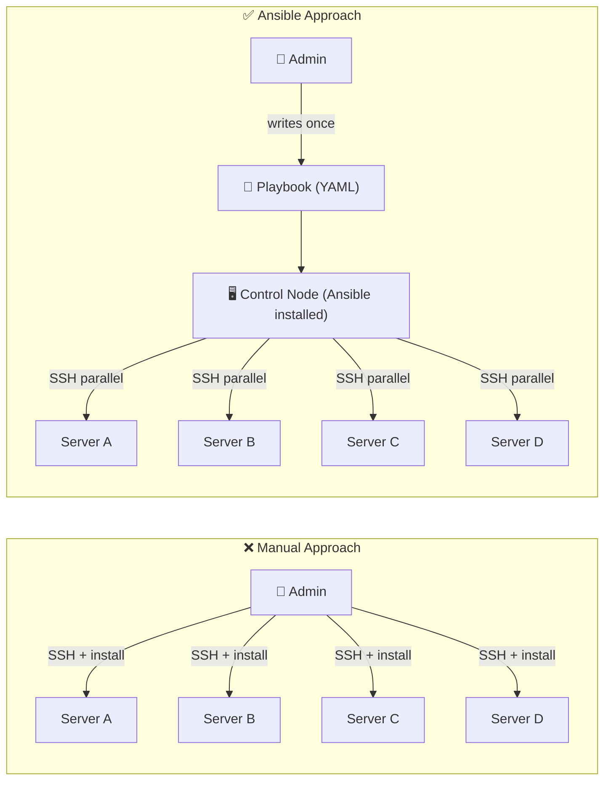

---

## 3. Advantages of Ansible

| # | Advantage | Explanation |
|---|---|---|
| 1 | **Simple & easy to use** | Playbooks are written in YAML — easy to read, write, and configure. No programming language needed. |
| 2 | **Agentless architecture** | Ansible is installed only on the control node. Nothing to install on remote servers (only SSH + Python). Unlike client-server tools (Puppet, Chef) that need an agent on every node. |
| 3 | **Configuration management** | Automates configuration management, application deployment, infrastructure management. |
| 4 | **Scalability** | Manages a large number of systems simultaneously. Going from 4 → 10 servers? Just add them to the inventory. |
| 5 | **Idempotency** | Playbooks can be run **multiple times without changing the system state** if it is already in the desired state. |
| 6 | **Open source** | Free, large community, lots of help available. |
| 7 | **Integration with other tools** | Docker, Kubernetes, AWS, Azure, GCP, Jenkins, Git, ticketing tools, etc. |

> 🔑 **Idempotency** = running the same playbook 1 time or 100 times produces the same end result. Ansible checks the current state first and only changes what's needed (you will see `ok` vs `changed` in the output).

---

## 4. Architecture & Core Components

Ansible has **3 main components** you must remember:

| Component | What it is | Format |
|---|---|---|
| **Inventory** | List of managed servers (hostnames/IPs), optionally grouped | INI or YAML |
| **Playbook** | File that defines *what tasks* to run *on which hosts* | YAML |
| **Module** | Small program that does one specific task (install package, copy file, create user…) | Built into Ansible |

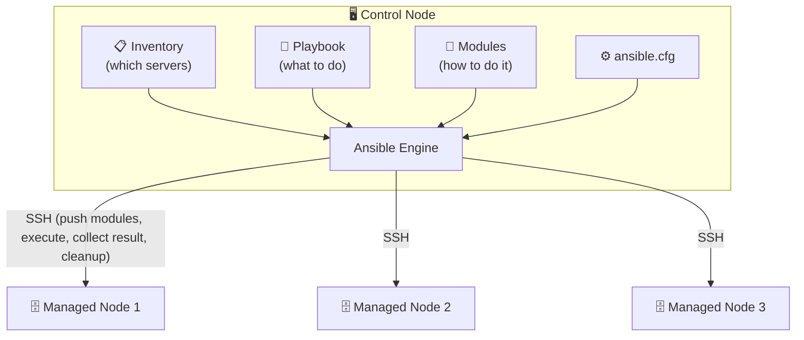

### 4.1 Module
- A **small program to do one task** — the smallest unit of work.
- Examples: start a service, install/upgrade a package, create a file, search a file, create a user.
- There are **thousands** of modules (`ping`, `debug`, `yum`, `dnf`, `apt`, `service`, `copy`, `file`, `shell`, `command`, `cron`, `user`, `get_url`, `firewalld`, `setup`…).

### 4.2 Inventory
- Contains **information about the servers** on which tasks must be performed (hostnames / IPs).
- Servers can be **grouped** (e.g., `[webservers]`, `[dbservers]`) so you can target only a subset.

### 4.3 Playbook
- "Play" = executing / running something. A **playbook** contains the **tasks to be performed**.
- Written in **YAML**.
- One playbook can contain **multiple tasks** (create a directory, install an app, start a service…).
- Each item under `tasks:` that calls a module is a task.

### ➕ Extra: How Ansible executes a task (behind the scenes)

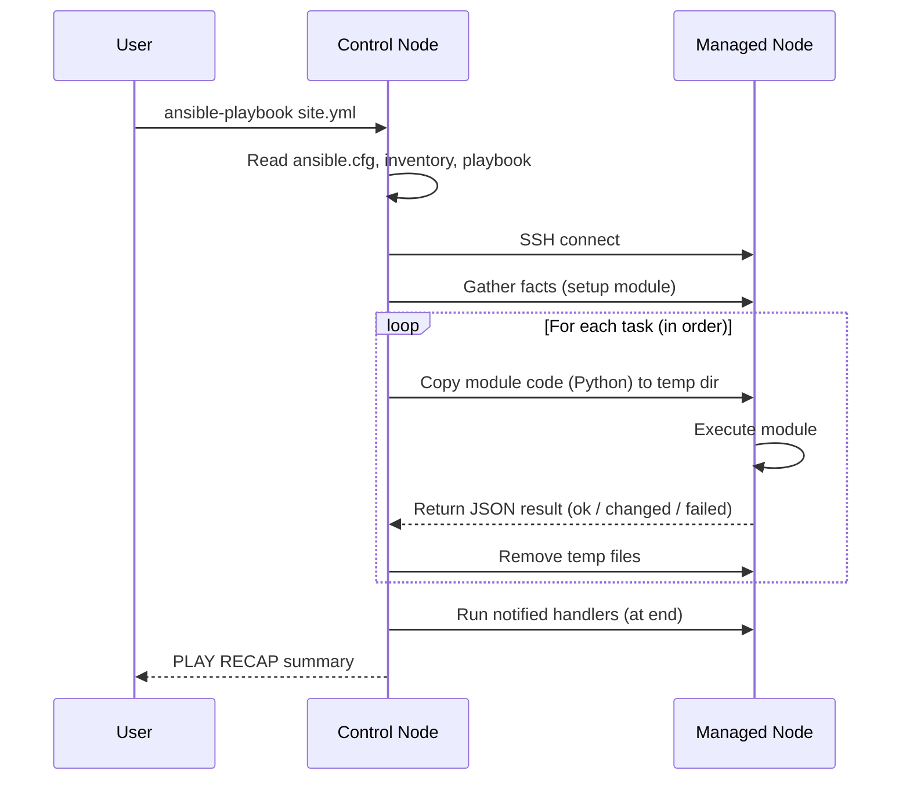

---

## 5. YAML Basics

Ansible uses **YAML** ("YAML Ain't Markup Language") — human-readable, indentation-based.

```yaml
---                     # 3 hyphens = start of a YAML document
employees:              # key (dictionary)
  - name: John          # "-" = list item
    age: 30
    department: IT
  - name: Jane
    age: 28
    department: HR
```

### Key YAML rules
| Rule | Example |
|---|---|
| Starts with `---` (optional but conventional) | `---` |
| Key–value with `: ` (colon + space) | `name: nginx` |
| List items start with `- ` (hyphen + space) | `- name: task1` |
| **Indentation = spaces only (no tabs)**, usually 2 | |
| Same level items must have the **same indentation** | |
| Comments start with `#` | `# comment` |
| Booleans | `true/false`, `yes/no` |
| Strings with special chars / Jinja2 `{{ }}` at start **must be quoted** | `name: "{{ app }}"` |

> ⚠️ **Indentation is critical.** Removing even one space before `name:` broke the playbook in the video. Use `--syntax-check` before running.

> 💡 **Tip from video:** If you're new to `vi`, write YAML in **VS Code** (with the YAML extension) for auto-formatting, then copy it to the server.

---

## 6. Lab Setup (Control Node + Managed Node)

Minimum: **2 servers / VMs** (local VMs, cloud instances, anything).

| Role | Example in video | Purpose |
|---|---|---|
| **Control node (main server)** | CentOS VM (`centos01`) | Ansible is installed here |
| **Managed node (remote server)** | Red Hat / CentOS VM (`centos-qa`) | Tasks are executed here |

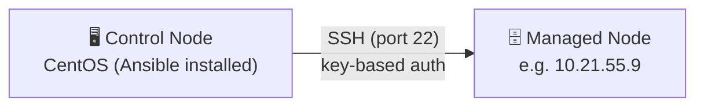

### Step 1 — Check connectivity
On the **remote server**, get its IP:
```bash
ifconfig          # or: ip a
```
From the **control node**, test SSH:
```bash
ssh root@10.21.55.9      # use another user if you don't have root
# type "yes" for fingerprint, then password
exit
```

### Step 2 — Passwordless login (SSH key-based auth) ⭐ IMPORTANT
**Why?** During automation Ansible will connect repeatedly; being asked for a password every time is not practical.

Run these **on the control node** (where Ansible will be installed):

```bash
# 1. Generate an SSH key pair (press Enter for all defaults)
ssh-keygen
#   -> creates ~/.ssh/id_rsa (private key) and ~/.ssh/id_rsa.pub (public key)

# 2. Copy the public key to the remote server (asks the password ONE last time)
ssh-copy-id root@10.21.55.9
#   -> "Number of key(s) added: 1"

# 3. Verify — should log in WITHOUT a password now
ssh root@10.21.55.9
```

> Think of the public key as an **identity card / certificate**: the remote server recognizes the control node as a valid user.
> Repeat `ssh-copy-id` for **every** remote server.

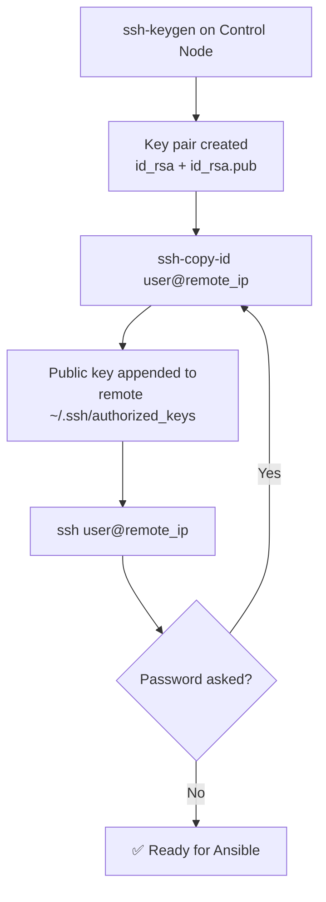

---

## 7. Installing Ansible

Official docs: *Installing Ansible on specific operating systems* (docs.ansible.com).

### On RHEL / CentOS / Fedora
```bash
# dnf is the newer package manager; use yum if dnf is not available
sudo dnf install ansible
# ❌ Error: "Unable to find a match: ansible"
#    Reason: Ansible is not in the default repos on RHEL/CentOS

# ✅ Fix: enable EPEL repository first
sudo dnf install epel-release
sudo dnf install ansible        # installs python3 + dependencies too
```

> `sudo` is not needed if you are logged in as root, but in corporate environments you usually aren't root.

### ➕ Extra: Other ways
```bash
# Ubuntu / Debian
sudo apt update
sudo apt install software-properties-common
sudo add-apt-repository --yes --update ppa:ansible/ansible
sudo apt install ansible

# Any OS via pip
python3 -m pip install --user ansible
```

### Verify installation
```bash
ansible --version          # shows "ansible [core x.y.z]", config file, python version
ansible localhost -m ping  # test Ansible on the same machine
```
Expected output:
```json
localhost | SUCCESS => {
    "changed": false,
    "ping": "pong"
}
```
`ping` → `pong` = Ansible works ✅ (Note: Ansible's `ping` module is **not ICMP ping** — it checks SSH login + Python availability.)

---

## 8. Ansible Configuration (`/etc/ansible`)

After installation, a folder `/etc/ansible/` is created:

```bash
cd /etc/ansible
ls -ltr
# ansible.cfg   hosts   roles/
```

| File/Dir | Purpose |
|---|---|
| `ansible.cfg` | Main configuration file (initially almost empty) |
| `hosts` | **Default inventory file** (contains many commented examples) |
| `roles/` | Default location for roles |

### Generate a full sample config (with all options commented)
```bash
ansible-config init --disabled -t all > ansible.cfg
vi ansible.cfg      # lots of documented options to refer & change
```

### ➕ Extra: Config file precedence (first found wins)
1. `ANSIBLE_CONFIG` environment variable
2. `./ansible.cfg` (current directory)
3. `~/.ansible.cfg` (home directory)
4. `/etc/ansible/ansible.cfg`

```ini
# Example minimal ansible.cfg
[defaults]
inventory = ./hosts
remote_user = root
host_key_checking = False

[privilege_escalation]
become = False
become_method = sudo
```

---

## 9. Your First Playbook

Organize playbooks in a separate folder (location is **not mandatory** — any accessible path works):

```bash
mkdir /etc/ansible/playbooks
cd /etc/ansible/playbooks
vi first_playbook.yml
```

### `first_playbook.yml`
```yaml
---
- name: Basic Playbook          # name of the PLAY (description)
  hosts: localhost              # WHERE to run (same machine for now)

  tasks:                        # list of tasks (same indent as name/hosts)
    - name: Test connectivity   # task description (for humans)
      ping:                     # MODULE to use (no arguments needed)
```

### Anatomy of a playbook

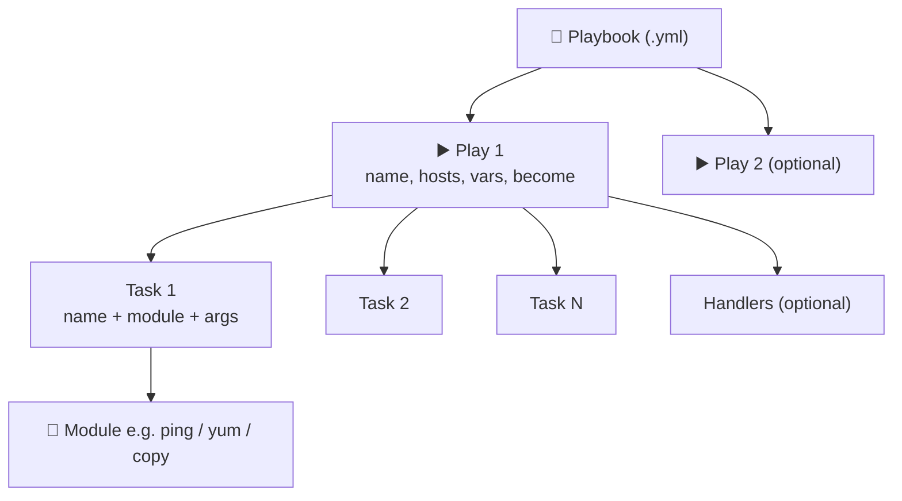

| Keyword | Meaning |
|---|---|
| `---` | Start of YAML |
| `- name:` (top) | Name of the play — appears in output as `PLAY [Basic Playbook]` |
| `hosts:` | Target hosts: `localhost`, `all`, a group name, or an IP |
| `tasks:` | List of tasks, executed **sequentially (top to bottom)** |
| `- name:` (under tasks) | Description of the task (shows as `TASK [...]`) |
| `ping:` | Module name followed by colon |

### Run it
```bash
ansible-playbook first_playbook.yml          # relative path if same folder
ansible-playbook /full/path/first_playbook.yml
```
> No special file permissions (no `chmod +x`) are needed for playbooks.

### Understanding the output
```text
PLAY [Basic Playbook] **********************************************

TASK [Gathering Facts] *********************************************
ok: [localhost]

TASK [Test connectivity] *******************************************
ok: [localhost]

PLAY RECAP *********************************************************
localhost : ok=2  changed=0  unreachable=0  failed=0  skipped=0  rescued=0  ignored=0
```

| Status | Meaning |
|---|---|
| `ok` | Task succeeded; **nothing changed** (already in desired state) |
| `changed` | Task succeeded and **modified** something on the host |
| `failed` | Task failed |
| `skipped` | Task skipped (e.g., `when` condition false) |
| `unreachable` | Could not connect to host |
| `ignored` | Failed but `ignore_errors: yes` was set |

- **Gathering Facts** runs automatically first (collects info about the host).
- **PLAY RECAP** = summary — very useful when a playbook has 100+ tasks.
- The warning about "provided hosts list is empty / only localhost" can be ignored at this stage.

### Syntax check before running ✅
```bash
ansible-playbook first_playbook.yml --syntax-check
```
It shows the line/column with the problem instead of running a broken playbook.

---

## 10. Playbook with Multiple Tasks (debug module)

Tasks are a **list** — add more items with `- name:` at the same indentation.

```yaml
---
- name: Basic Playbook
  hosts: localhost

  tasks:
    - name: Test connectivity
      ping:

    - name: "Print output"
      debug:
        msg: "All right"
```

- `debug` module → prints custom messages in the output (like logging/print).
- Tasks run **in sequence** → put the task you want first **at the top**.

Output snippet:
```text
TASK [Print output] ************************************************
ok: [localhost] => {
    "msg": "All right"
}
```

---

## 11. Install & Start a Package (yum + service)

### `pkg_install.yml`
```yaml
---
- name: Install and start the service
  hosts: localhost

  tasks:
    - name: Installing nginx
      yum:                       # use 'dnf' on newer RHEL, 'apt' on Ubuntu/Debian
        name: nginx              # ⚠️ REAL package name (not a description)
        state: present           # ensure package is installed

    - name: Starting the nginx service
      service:
        name: nginx              # service name
        state: started           # ensure service is running
        enabled: true            # start automatically on boot
```

> ⚠️ **Two kinds of `name`:**
> - `- name:` at task level → just a **description**
> - `name:` inside a module → the **actual package/service/user name** — must be exact.

### Parameter meanings
| Module | Parameter | Values | Meaning |
|---|---|---|---|
| `yum`/`dnf`/`apt` | `name` | package name | which package |
| | `state` | `present` / `installed`, `latest`, `absent` / `removed` | ensure installed / upgrade / remove |
| `service` | `name` | service name | which service |
| | `state` | `started`, `stopped`, `restarted`, `reloaded` | desired state |
| | `enabled` | `true`/`false` | start at boot |

### Run & verify
```bash
nginx                                   # before: command not found
ansible-playbook pkg_install.yml --syntax-check
ansible-playbook pkg_install.yml        # changed=2, ok=3
systemctl status nginx                  # active (running), enabled
```

> 📌 Package modules depend on the distro: **`yum`/`dnf` for RHEL/CentOS**, **`apt` for Ubuntu/Debian**. ➕ Extra: the generic **`package`** module auto-selects the right manager.

---

## 12. Finding Modules & Parameters

Search **"Ansible modules"** → official docs (docs.ansible.com → *Collection Index* / *All modules*).

- Modules are listed **A → Z** — there are countless modules.
- Use **Ctrl+F** to search (e.g., `service` → "Manage services").
- Each module page shows:
  - **Synopsis** (what it does, e.g., "Controls services on remote hosts")
  - **Parameters** table — look for **`required`** ones (e.g., `name` is required for `service`)
  - **Examples** ⭐ (copy-paste friendly)
  - **Return values**
- Modules are also grouped by **category** (Files modules: `acl`, `find`, `copy`, `file`, …).

### ➕ Extra: Docs from the command line
```bash
ansible-doc -l                 # list all modules
ansible-doc -l | grep firewall
ansible-doc service            # full docs for the service module
ansible-doc -s copy            # short snippet/syntax for the copy module
```

> Modern Ansible uses **FQCN** (Fully Qualified Collection Names) like `ansible.builtin.copy`, `ansible.posix.firewalld`. Short names (`copy`) still work for builtins.

---

## 13. Inventory File (Hosts)

Default inventory: **`/etc/ansible/hosts`** — contains many helpful commented examples.

```bash
less /etc/ansible/hosts
vi /etc/ansible/hosts
```

### Formats (INI style)
```ini
# --- Ungrouped hosts (put at the top, before any [group]) ---
10.21.55.9
green.example.com
192.168.100.1

# --- Grouped hosts ---
[webservers]
alpha.example.org
beta.example.org
192.168.1.100
192.168.1.110

[dbservers]
db01.intranet.mydomain.net
db02.intranet.mydomain.net
10.25.1.56

# ➕ Extra: ranges
[web_range]
www[001:006].example.com
```

**Why groups?** If you manage web servers, DB servers, app servers… you can run a playbook **only on `webservers`** instead of every server.

### Verify the inventory
```bash
ansible-inventory --list       # JSON view: all, ungrouped, groups
ansible-inventory --graph      # ➕ Extra: tree view
```

### Test connection to all inventory hosts (ad-hoc)
```bash
ansible all -m ping
# all  -> every host in the inventory
# -m   -> module
```

### ➕ Extra: Custom inventory file & YAML format
```bash
ansible-playbook -i ./my_inventory.ini site.yml
```
```yaml
# inventory.yml
all:
  hosts:
    10.21.55.9:
  children:
    webservers:
      hosts:
        web1:
          ansible_host: 10.21.55.10
        web2:
          ansible_host: 10.21.55.11
```

---

## 14. Running Playbooks on Remote Servers

Just change `hosts:` from `localhost` to `all` (or a group name):

```yaml
---
- name: Basic Playbook
  hosts: all              # all hosts in inventory
  # hosts: webservers     # OR only a specific group
  tasks:
    - name: Test connectivity
      ping:
```

```bash
ansible-playbook first_playbook.yml
```

### Install nginx on the remote server
Update the IP in `/etc/ansible/hosts`, then in `pkg_install.yml` change `hosts: localhost` → `hosts: all` and run:
```bash
ansible-playbook pkg_install.yml
# On remote: nginx installed, systemctl status nginx -> active (running), enabled
```

> 🚀 To do the same on **5 / 10 / 100 servers**, just add their IPs to the inventory — **one command** configures all of them.

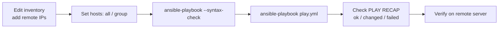

---

## 15. Copy Module

Copies files **from the control node to remote servers**.

### `02_copy_files.yml`
```yaml
---
- name: Copy files to remote
  hosts: all

  tasks:
    - name: Copy files
      copy:
        src: /root/myfile.txt     # file on CONTROL node (must exist)
        dest: /tmp/               # location on REMOTE node
        owner: paul               # file owner on remote (user must exist there)
        group: paul               # group owner on remote
        mode: "0777"              # permissions (octal) ...
        # mode: "u=rw,g=rw,o=rw"  # ... or symbolic format
        backup: true              # keep backup of old file if it changes
```

Prepare the source file:
```bash
touch /root/myfile.txt
echo "hello" > /root/myfile.txt
ansible-playbook 02_copy_files.yml
```

### Key observations from the video
| Situation | Result |
|---|---|
| First run | `changed` — file copied to `/tmp/myfile.txt` |
| Run again, no changes | `ok` — **idempotent**, nothing copied |
| Without `owner/group/mode` | Remote file keeps the **same owner/permissions as the source** (e.g., root:root) — other users may not access it |
| Added `owner: paul` | `changed` — owner changed to paul |
| Changed `mode` | Permissions updated |
| Source content changed | Remote file **overwritten** — old content lost |
| `backup: true` + content changed | Old file saved as `myfile.txt.<pid>.<timestamp>~` ✅ |
| `backup: true` but no change | `ok` — no backup taken (nothing changed) |

### Permission formats
| Format | Example | Meaning |
|---|---|---|
| Octal | `"0777"`, `"0644"` | Always **quote** it and include the leading `0` |
| Symbolic | `"u=rwx,g=rw,o=r"` | Comma-separated, like `chmod` |
| Symbolic (all) | `"u=rw,g=rw,o=rw"` | Read/write for everyone |

> 💡 `ok` vs `changed` tells you whether something **really** changed on the server or the playbook simply ran.

---

## 16. File Module

Create/delete files and directories, change permissions/ownership on **remote** servers.

### `03_file_module.yml`
```yaml
---
- name: File module examples
  hosts: all

  tasks:
    - name: Creating file
      file:
        path: /tmp/newfile.txt
        state: touch               # create empty file (like `touch`)
        owner: paul
        group: paul
        mode: "u=rwx,g=rw,o=r"

    - name: Creating a directory
      file:
        path: /tmp/myfolder
        state: directory           # create directory (like `mkdir -p`)
```

### Delete file / directory
```yaml
    - name: Delete file
      file:
        path: /tmp/newfile.txt
        state: absent              # delete

    - name: Delete directory (recursively, with contents)
      file:
        path: /tmp/myfolder
        state: absent
```

### Change permissions of an existing file — `04_change_permission.yml`
```yaml
---
- name: Change permission
  hosts: all
  tasks:
    - name: Change permission
      file:
        path: /tmp/myfile.txt
        mode: "u=r,g=r"            # rw-rw-rw-  ->  r--r-----
```

### `state` values for the file module
| `state` | Action |
|---|---|
| `touch` | Create empty file / update timestamp |
| `directory` | Create directory (parents too) |
| `absent` | Delete file or directory (**recursive** for dirs) |
| `file` | Ensure the path is an existing file (modify attributes only) |
| `link` / `hard` | ➕ Create symlink / hard link (`src` required) |

---

## 17. Running Scripts on Remote Servers (shell module)

### The script on the remote server (`/tmp/script/test.sh`)
```bash
#!/bin/bash
echo "Hey Buddy"
touch test_script_file
```
```bash
chmod u+x /tmp/script/test.sh   # needs execute permission!
./test.sh                        # prints "Hey Buddy", creates test_script_file
```

### `05_script_run.yml` (basic)
```yaml
---
- name: Run script
  hosts: all
  tasks:
    - name: Run script
      shell: /tmp/script/test.sh       # absolute path to the script
```

### 🐞 Problem 1: The file was created in the wrong place
- Running via Ansible, the **working directory** is the remote user's **home directory** (`/root` for root), not `/tmp/script`.
- So `test_script_file` was created in `/root/`.

**Fix A:** use an absolute path inside the script:
```bash
touch /tmp/script/test_script_file
```

**Fix B (Ansible way):** use `chdir` ✅

### 🐞 Problem 2: Where did "Hey Buddy" go?
Output of scripts run remotely isn't shown on your terminal. Usual practice → **redirect output to a log file**.

### `05_script_run.yml` (improved)
```yaml
---
- name: Run script
  hosts: all
  tasks:
    - name: Run script
      shell: ./test.sh > test.log      # run relative to chdir, log output
      args:
        chdir: /tmp/script             # change into this dir BEFORE running
```
Result on remote: `test_script_file` + `test.log` (containing `Hey Buddy`) in `/tmp/script/`.

> ❗ Initially written as `shell: test.sh` → error, because a script in the current dir must be run as `./test.sh`.

### ➕ Extra: Related modules
| Module | Use |
|---|---|
| `command` | Runs a command **without a shell** (no pipes `|`, redirects `>`, env vars) — safer, default for ad-hoc |
| `shell` | Runs via `/bin/sh` — supports pipes, redirects, `&&` |
| `script` | **Copies a local script** from the control node to remote and runs it |
| `register` + `debug` | Capture & print output: see below |

```yaml
- name: Run and capture output
  shell: /tmp/script/test.sh
  register: script_out

- name: Show output
  debug:
    var: script_out.stdout
```

---

## 18. Cron Jobs (cron module)

Cron = schedule a task/script to run at a specific time/date in the future (repeatedly).

```text
┌───────────── minute (0-59)
│ ┌─────────── hour (0-23)
│ │ ┌───────── day of month (1-31)
│ │ │ ┌─────── month (1-12)
│ │ │ │ ┌───── day of week (0-6, 0 = Sunday)
│ │ │ │ │
* * * * *  command_to_run
```

### `06_cron_jobs.yml` — add a cron job
```yaml
---
- name: Cron setup
  hosts: all
  tasks:
    - name: Add cron job
      cron:
        name: "Run test script"     # identifier for the job (needed to modify/remove)
        minute: "30"
        hour: "18"                  # 6:30 PM
        day: "15"                   # 15th of the month   (use "*" for every day)
        month: "*"                  # every month — ⚠️ quote the asterisk
        weekday: "*"                # 0=Sun ... 6=Sat
        user: paul                  # crontab of which user (default: root)
        job: "/tmp/script/test.sh"  # command / script to run
```

Verify on remote (logged in as paul):
```bash
crontab -l
# Before: no crontab for paul
# After:
#Ansible: Run test script
30 18 15 * * /tmp/script/test.sh
```
> Ansible adds a marker comment `#Ansible: <name>` — that's how it **identifies** the job later.

### Remove a cron job — `07_cron_modify.yml`
```yaml
---
- name: Remove cron
  hosts: all
  tasks:
    - name: Remove cron job
      cron:
        name: "Run test script"   # EXACT same name used when creating
        user: paul                # ⚠️ required, otherwise it looks in root's crontab
        state: absent
```

### Modify a cron job
Re-run the **create** playbook with the **same `name`** and the new values (e.g., `hour: "20"`) → the existing entry is **updated**.
> If you change the `name` even slightly, Ansible creates a **new** job instead.

### Disable (comment out) without deleting
```yaml
    - name: Disable cron job
      cron:
        name: "Run test script"
        minute: "30"
        hour: "20"
        user: paul
        job: "/tmp/script/test.sh"
        disabled: true           # adds '#' in front of the line
```

### Environment variables in crontab
```yaml
    - name: Add env variable to crontab
      cron:
        name: VAR                 # here 'name' = variable name
        env: yes                  # this entry is an env var, not a job
        job: "test.sh"            # here 'job' = variable value
        user: paul
        insertbefore: PATH        # place it before the existing PATH var
        # insertafter: PATH       # ...or after it

    - name: Remove env variable
      cron:
        name: VAR
        env: yes
        user: paul
        state: absent
```
Result:
```text
VAR="test.sh"
PATH=/usr/bin:/bin
#Ansible: Run test script
30 20 * * * /tmp/script/test.sh
```

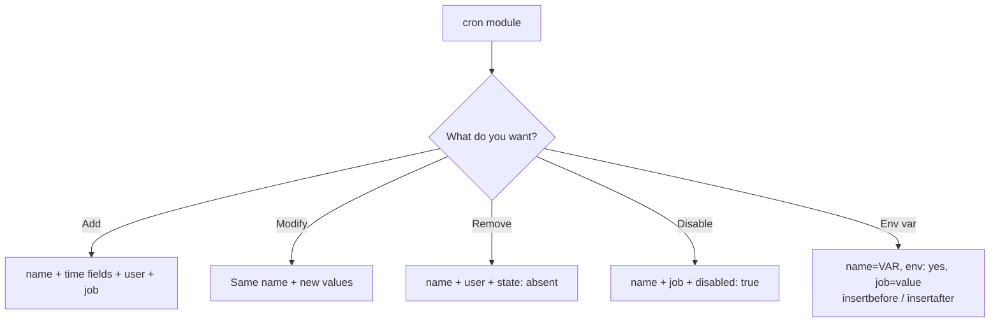

---

## 19. User Management (user module)

Very useful for admins: e.g., a new employee needs access to 10 servers → create the user everywhere with one playbook.

Check before:
```bash
id nick                # id: 'nick': no such user
cat /etc/passwd        # list of users
```

### `08_user_management.yml`
```yaml
---
- name: User management
  hosts: all
  tasks:
    - name: User creation
      user:
        name: nick                   # username (required)
        comment: "New user for QA team"   # optional (GECOS field)
        home: /home/nick             # home directory (optional, default /home/<name>)
        shell: /bin/bash             # default login shell
        group: qa                    # PRIMARY group (must already exist!)
        # groups: qa,nick            # SECONDARY/supplementary groups (comma-separated)
```

Verify:
```bash
tail /etc/passwd       # nick added
id nick                # uid=...(nick) gid=...(qa) groups=...(qa)
ls -ld /home/nick
```

### Group must exist
Error: `Group qa does not exist` → create it first:
```bash
groupadd qa            # (groupdel to remove)
cat /etc/group | grep qa
```
➕ Or the Ansible way:
```yaml
    - name: Ensure group qa exists
      group:
        name: qa
        state: present
```

### Multiple groups
```yaml
      user:
        name: nick
        groups: qa,nick       # member of both
        append: yes           # ➕ keep existing groups, add these (recommended)
```

### Delete a user (and their home directory)
```yaml
    - name: Remove user
      user:
        name: nick
        state: absent
        remove: yes           # also delete home dir & mail spool (like userdel -r)
```
```bash
id nick         # no such user
ls -l /home     # nick's home dir gone
```

---

## 20. Setting User Passwords

### `09_set_password.yml`
```yaml
---
- name: Set password
  hosts: all
  tasks:
    - name: Set password
      user:
        name: nick
        update_password: always     # always | on_create
        password: "{{ 'abcd123' | password_hash('sha512') }}"
```

| `update_password` | Behavior |
|---|---|
| `always` | Update the password if it differs from the current one |
| `on_create` | Only set the password when the user is newly created |

### Why the hash?
- ❌ `password: abcd123` → **Warning:** *"The input password appears not to have been hashed. The 'password' argument must be encrypted for this module to work properly."*
  - The `password` parameter expects an **already-hashed** value (as stored in `/etc/shadow`). Plain text is also insecure over the network.
- ✅ Use the Jinja2 filter `password_hash('sha512')` (note: **sha512**, not sha256/"sas").
- ❗ The whole value must be wrapped in **double quotes** because it starts with `{{` — otherwise YAML error.
- You may see a **deprecation warning** about the underlying crypt library (on newer Python, install `passlib`). The password still works.

Verify:
```bash
su - nick      # enter abcd123 -> logged in ✅
```

> ➕ **Best practice:** never hard-code passwords in playbooks — use **Ansible Vault** (see [Extra](#36--extra-useful-topics-not-in-the-video)).

---

## 21. Killing a Process & Restarting a Service

### First, know the Linux way
```bash
systemctl status nginx          # active (running)
pgrep nginx                     # list PIDs of nginx
pgrep nginx | xargs kill        # find PIDs and kill them in one step
pgrep nginx                     # nothing -> killed
systemctl start nginx           # start again -> new PIDs
```

### `11_kill_process.yml`
```yaml
---
- name: Find a process and kill it
  hosts: all
  tasks:
    - name: Kill nginx process
      shell: "pgrep nginx | xargs kill"
      ignore_errors: yes            # don't stop the playbook if this fails

    - name: Start the service
      service:
        name: nginx
        state: started
```

- 2nd run when no process exists → `kill` gets "not enough arguments" → task **fails** but shows `...ignoring` and the play continues (`ignored=1`).
- Verify restart: **PIDs change** after the service starts again.

> ➕ Extra: For a clean restart, simply use `service: name=nginx state=restarted`. ➕ For killing processes there's also `community.general.pkill`-style approaches, but `shell` + `pgrep` is fine for learning.

---

## 22. Downloading Files (get_url module)

Download files from **HTTP / HTTPS / FTP** URLs directly on remote servers — e.g., download/upgrade/deploy a file on 10 servers.

### `10_download_file.yml`
```yaml
---
- name: Download files
  hosts: all
  tasks:
    - name: Download file
      get_url:
        url: https://www.python.org/ftp/python/3.12.0/Python-3.12.0.tgz
        dest: /tmp/script/          # destination dir/file on remote
        owner: paul                 # ⚠️ 'owner', NOT 'user'
        group: paul
        mode: "0777"
```

> ❌ `user: paul` → **"Unsupported parameters"** error. Correct parameter is **`owner`**.

Verify: `ls -l /tmp/script/` → file owned by `paul:paul` with `rwxrwxrwx`.

➕ Useful extra params: `checksum: "sha256:<hash>"`, `force: yes`, `timeout: 30`, `url_username/url_password`.

---

## 23. Firewall Management (firewalld module)

**Scenario:** nginx is running on the remote VM (listens on **port 80**), but opening `http://10.21.55.9` from the host browser → **site unreachable**, because the **firewall** blocks external access.

### `12_firewall.yml`
```yaml
---
- name: Firewall changes
  hosts: all
  tasks:
    - name: Enable a service / port
      firewalld:
        # service: nginx           # ❌ error: "nginx is not among existing services"
        port: 80/tcp               # ✅ port + protocol
        permanent: true            # persist across reboots
        state: enabled             # enabled | disabled

    - name: Reload the firewalld
      service:
        name: firewalld
        state: reloaded            # apply the permanent changes
```

- Firewall rules can target a **service** (standard/known names like `http`, `https`, `ssh`), a **port** (`80/tcp`), or a **source** network.
- After any firewall change you must **reload** firewalld for it to take effect.
- After running → browser shows the **nginx default page** ✅

### Find valid firewalld service names
```bash
firewall-cmd --get-services
firewall-cmd --get-services | grep http     # -> http, https ... (not "httpd"/"nginx")
```

> ➕ Extra: `immediate: true` applies the rule instantly without a reload. The module's FQCN is `ansible.posix.firewalld` (collection `ansible.posix`).

---

## 24. Non-root Users & Privilege Escalation (become)

In real companies you rarely get **root** — you get a normal user + **sudo privileges**.

### Step 1 — SSH keys for the non-root user too
Logged in as `paul` on the control node, running a playbook fails: *"Failed to connect to the host via ssh"*. Fix:
```bash
ssh-keygen
ssh-copy-id paul@10.21.55.9      # specify the user, not just the IP
```
Now normal tasks (download, copy into user-writable dirs) work.

### Step 2 — Tasks that need root
Restarting firewalld as paul → **`NotAuthorizedException`** (not authorized).

Add `become: true` (equivalent to `sudo`) at **play level** or **task level**:
```yaml
---
- name: Firewall changes
  hosts: all
  become: true                   # run all tasks with sudo
  tasks:
    - name: Enable port 80
      firewalld:
        port: 80/tcp
        permanent: true
        state: enabled
    - name: Reload firewalld
      service:
        name: firewalld
        state: reloaded
        # become: true           # ...or only on specific tasks
```

Next error: **"Missing sudo password"** → ask for it at runtime:
```bash
ansible-playbook 12_firewall.yml --ask-become-pass     # short form: -K
# BECOME password: ******
```

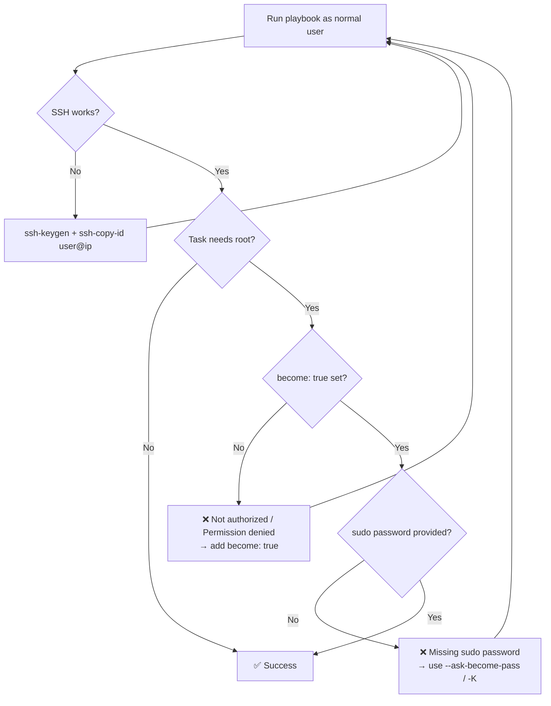

| Keyword / Flag | Meaning |
|---|---|
| `become: true` | Escalate privileges (default method `sudo`, default user `root`) |
| `become_user: postgres` | ➕ Become a specific user |
| `become_method: sudo/su` | ➕ Escalation method |
| `-b` / `--become` | CLI equivalent of `become: true` |
| `-K` / `--ask-become-pass` | Prompt for sudo password |

---

## 25. Ad-hoc Commands

**Ad-hoc** = quick **one-time tasks** run directly from the command line — **no playbook needed**. E.g., you manage 10 servers and suddenly need to check free RAM on one.

### Syntax
```bash
ansible <hosts> -m <module> -a "<module arguments>" [options]
```
- `<hosts>` = `localhost`, `all`, a **group** name, a host alias, or an **IP**
- `-m` = module · `-a` = arguments (`key=value` pairs separated by spaces, inside quotes)
- Same inventory file is used.

### Examples from the video
```bash
# Ping
ansible localhost -m ping
ansible all -m ping
ansible 10.21.55.9 -m ping            # direct IP

# Copy a file (non-root user -> needs sudo for root-owned dest)
ansible all -m copy -a "src=/home/paul/paul_file dest=/tmp/script" -b --ask-become-pass
ansible all -m copy -a "src=/home/paul/paul_file dest=/tmp/script mode=0777" -b -K

# Restart / reload a service
ansible all -m service -a "name=nginx state=reloaded"

# Run a remote script
ansible all -m shell -a "/tmp/script/test.sh"

# Monitoring commands
ansible all -m command -a "free -h"   # memory usage
ansible all -m command -a "df -h"     # disk usage

# Install a package
ansible all -m yum -a "name=vim state=present"     # apt on Ubuntu
```
> Error *"Destination /tmp/script not writable"* → directory owned by root → add `-b -K`.

### Ad-hoc vs Playbook
| Ad-hoc | Playbook |
|---|---|
| One-liner on CLI | YAML file |
| Quick, one-time tasks | Repeatable, complex, multi-step automation |
| Not saved / version-controlled | Stored in Git, reusable |
| `ansible` command | `ansible-playbook` command |

---

## 26. Tags

**Problem:** A playbook has 5 tasks, but you only want to run 1–2 of them. Creating a separate playbook is not a good approach → use **tags**.

### Add tags (same indent level as the task's `name`)
```yaml
---
- name: Install and start the service
  hosts: all
  tasks:
    - name: Installing nginx
      yum:
        name: nginx
        state: present
      tags: i-nginx

    - name: Starting the nginx service
      service:
        name: nginx
        state: started
        enabled: true
      tags: ss-nginx
```

### Use tags
```bash
ansible-playbook 01_app_install.yml --list-tags        # show all tags
ansible-playbook 01_app_install.yml --tags i-nginx     # run ONLY tagged task(s)
ansible-playbook 01_app_install.yml --skip-tags ss-nginx   # run all EXCEPT these
ansible-playbook 01_app_install.yml --tags "i-nginx,ss-nginx"  # ➕ multiple
```

> ➕ Special tags: `always` (always runs unless skipped explicitly), `never` (runs only when explicitly requested). A task can have a list: `tags: [install, web]`.

---

## 27. Variables

### 27.1 Variables in a playbook (`vars`)
**Problem:** `nginx` is repeated in multiple tasks. A generic "app install" playbook shouldn't hard-code it.

```yaml
---
- name: Install and start the service
  hosts: all
  vars:
    app: nginx                      # define once

  tasks:
    - name: Installing {{ app }}
      yum:
        name: "{{ app }}"           # use with {{ }}  (quotes required!)
        state: present

    - name: Starting {{ app }}
      service:
        name: "{{ app }}"
        state: started
        enabled: true
```
➡️ To install **httpd** instead, change only `app: httpd` — even if it's used in 10 places.

> 🐞 In the video, switching to `httpd` failed at the service start step: **httpd and nginx both listen on port 80** — two services cannot bind the same port. Not a playbook problem.

### 27.2 Variables in the inventory (host alias)
Remembering IPs is hard → give hosts friendly names:
```ini
# /etc/ansible/hosts
server_a ansible_host=10.21.55.9
```
```bash
ansible server_a -m ping       # SUCCESS
```
Playbooks work the same; you just see `server_a` instead of the IP in output.

### ➕ Extra: Common inventory variables & group vars
```ini
[webservers]
web1 ansible_host=10.0.0.11 ansible_user=paul ansible_port=22
web2 ansible_host=10.0.0.12

[webservers:vars]
http_port=80
ansible_python_interpreter=/usr/bin/python3
```
Other places to define variables: `group_vars/<group>.yml`, `host_vars/<host>.yml`, `vars_files:`, role `defaults/` & `vars/`, and the CLI (`-e "app=httpd"` — highest precedence).

```yaml
- hosts: all
  vars_files:
    - vars/common.yml
```

---

## 28. Handlers

**Problem:** In the firewall playbook, *"Reload firewalld"* runs **every time**, even when the "enable port" task made **no change** (`ok`). Reloading should happen **only when something changed**.

**Solution: Handlers** — special tasks that run **only when notified** by a task that reports **`changed`**.

### Firewall playbook with a handler
```yaml
---
- name: Firewall changes
  hosts: all
  become: true

  tasks:
    - name: Enable a service
      firewalld:
        port: 80/tcp
        permanent: true
        state: enabled
      notify: Reload firewalld        # trigger handler by EXACT name
      # notify:                       # multiple handlers -> list
      #   - Reload firewalld
      #   - Restart nginx

  handlers:                           # same indent level as 'tasks'
    - name: Reload firewalld
      service:
        name: firewalld
        state: reloaded
```

### Behavior
| Run | "Enable" task status | Handler |
|---|---|---|
| Port state changed (enabled → disabled or vice versa) | `changed` | ✅ `RUNNING HANDLER [Reload firewalld]` |
| Already in desired state | `ok` | ❌ Not run |

- Handlers run **at the end of the play**, after all tasks (not immediately after the notifying task).
- A handler runs **only once** even if notified by several tasks.
- The `notify` name must **exactly match** the handler's `name`.

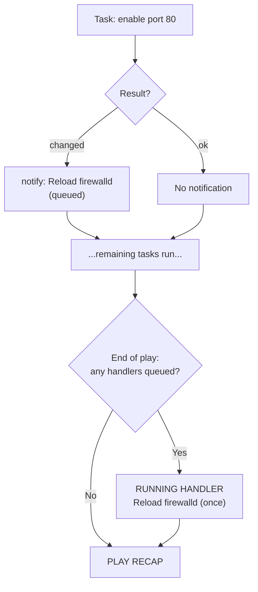

> ➕ Force handlers to run mid-play: `- meta: flush_handlers`.

---

## 29. Conditionals (`when`)

Run a task **only if a condition is true**.

**Use case:** One playbook that installs Apache on **both Ubuntu and Red Hat** — package name and module differ:
- Red Hat → `yum`/`dnf`, package **`httpd`**
- Ubuntu → `apt`, package **`apache2`**

### `13_conditions.yml`
```yaml
---
- name: Install Apache on any OS
  hosts: all
  become: true
  tasks:
    - name: Install httpd on RedHat
      yum:
        name: httpd
        state: present
      when: ansible_os_family == "RedHat"

    - name: Install apache2 on Ubuntu
      apt:
        name: apache2
        state: present
      when: ansible_os_family == "Debian"     # ⚠️ see note below
```

> ⚠️ **Correction / important:** For Ubuntu, `ansible_os_family` is **`"Debian"`**, not `"Ubuntu"`. To match Ubuntu specifically, use `ansible_distribution == "Ubuntu"`. (The video wrote `"Ubuntu"` with `os_family`; it was skipped anyway since the target was CentOS.)

Output: the RedHat task → `ok/changed`; the Ubuntu task → **`skipping`** (`skipped=1`).

- `when` is at the **same indent as the module** (task level).
- No `{{ }}` needed inside `when` — it's already a Jinja2 expression.

### ➕ Extra: More conditional patterns
```yaml
when: ansible_distribution == "CentOS" and ansible_distribution_major_version == "8"

when:                       # list = AND
  - ansible_os_family == "RedHat"
  - ansible_memtotal_mb > 1024

when: ansible_os_family == "RedHat" or ansible_os_family == "Debian"

when: result.rc != 0        # based on a registered variable
when: my_var is defined
```

---

## 30. Facts & Built-in Variables (setup module)

Where does `ansible_os_family` come from? → **Facts**: info Ansible gathers automatically about each managed host (the *Gathering Facts* step).

```bash
ansible server_a -m setup                          # ALL facts (huge JSON)
ansible server_a -m setup -a "filter=ansible_os_family"   # ➕ filter
ansible server_a -m setup -a "filter=ansible_dist*"
```

### Useful built-in fact variables
| Variable | Example value |
|---|---|
| `ansible_os_family` | `RedHat`, `Debian` |
| `ansible_distribution` | `CentOS`, `Ubuntu`, `RedHat` |
| `ansible_distribution_major_version` | `8`, `22` |
| `ansible_hostname` | `centos-qa` |
| `ansible_nodename` | `centos-qa` |
| `ansible_default_ipv4.address` | `10.21.55.9` |
| `ansible_memtotal_mb` | `3789` |
| `ansible_processor_vcpus` | `2` |

Use them in conditions, templates, or messages:
```yaml
- debug:
    msg: "{{ ansible_hostname }} runs {{ ansible_distribution }} {{ ansible_distribution_major_version }}"
```
➕ Disable fact gathering to speed up plays that don't need facts: `gather_facts: false`.

---

## 31. Loops

**Problem:** Bulk hiring — create **50 user accounts**. Writing 50 tasks is bad. *Whenever the same code repeats, something can be improved* → **loops** (run one block of code repeatedly for each value).

### 31.1 `loop` with an inline list
```yaml
---
- name: User management
  hosts: all
  become: true
  tasks:
    - name: Create users
      user:
        name: "{{ item }}"          # 'item' = current value of the loop
        shell: /bin/bash
      loop:                         # same indent as the module
        - raju
        - shyam
        - baburao
```
The task runs 3 times (once per name) → `id raju`, `id shyam`, `id baburao` all exist ✅

### 31.2 `with_items` with a list variable
```yaml
---
- name: Install multiple packages
  hosts: all
  become: true
  vars:
    apps: [yum, httpd, vim, telnet]     # list variable
  tasks:
    - name: Install packages
      yum:
        name: "{{ item }}"
        state: present
      with_items: "{{ apps }}"          # older syntax; 'loop' is the modern one
```
Already-installed packages → `ok`; missing ones → `changed` (installed).

### Other use cases
- Change permissions / take backups of many files in different locations.
- New server setup: create many directories, install many packages.

### ➕ Extra: Loop over dictionaries
```yaml
- name: Create users with groups
  user:
    name: "{{ item.name }}"
    groups: "{{ item.groups }}"
  loop:
    - { name: raju,  groups: qa }
    - { name: shyam, groups: dev }
```
> ➕ For package modules, passing a list directly is faster than looping: `name: "{{ apps }}"`.

---

## 32. Roles

> **Definition:** A role is a **structured way of grouping together various functionalities** (tasks, variables, handlers, files, templates…) making it **easier to reuse and share** common setup tasks.

### Why roles?
- Playbooks grow complex — vars, handlers, tags, many tasks all in **one file** → hard to manage.
- Single-file playbooks become **task-specific** → not reusable.
- Roles = **organized, structured, reusable, shareable**, easy to maintain.
- Example: keep a **package** role and a **firewall** role separately → call only the one(s) you need.

### Create a role
```bash
cd /etc/ansible/roles               # default roles directory (initially empty)
ansible-galaxy init httpd_setup     # "- Role httpd_setup was created successfully"
```

### Role directory structure
```text
httpd_setup/
├── defaults/
│   └── main.yml      # default variables (lowest precedence, meant to be overridden)
├── files/            # static files to copy (no path needed in copy src!)
├── handlers/
│   └── main.yml      # handlers
├── meta/
│   └── main.yml      # role metadata, dependencies, Galaxy info
├── README.md
├── tasks/
│   └── main.yml      # ⭐ main list of tasks (entry point)
├── templates/        # Jinja2 templates (.j2) for the template module
├── tests/
│   ├── inventory
│   └── test.yml
└── vars/
    └── main.yml      # role variables (higher precedence)
```

```mermaid
flowchart TB
    PB["📄 roles_demo.yml<br/>hosts: all<br/>roles: [httpd_setup, firewalld_service]"] --> R1["📦 Role: httpd_setup"]
    PB --> R2["📦 Role: firewalld_service"]
    R1 --> T1["tasks/main.yml<br/>install → copy index.html → start"]
    R1 --> V1["vars/main.yml<br/>httpd_package_name, html_file_path"]
    R1 --> F1["files/index.html"]
    R2 --> T2["tasks/main.yml<br/>enable http in firewalld<br/>notify: Reload firewall"]
    R2 --> V2["vars/main.yml<br/>service_name: http"]
    R2 --> H2["handlers/main.yml<br/>Reload firewall"]
    T1 -. uses .-> V1
    T1 -. src: index.html .-> F1
    T2 -. uses .-> V2
    T2 -. notify .-> H2
```

### Use case in the video
1. Install **httpd** (Apache) on the remote server
2. Place a **custom `index.html`** (default web page)
3. Start & enable the service
4. Enable the **http** service in **firewalld**
5. **Reload** firewalld (via handler)
6. Open the server IP in a browser → *"Welcome to Ansible Tutorial"* 🎉

### Role 1: `httpd_setup`

**`roles/httpd_setup/files/index.html`**
```html
<!DOCTYPE html>
<html>
<head>
  <style> body { background: #1e293b; color: #f8fafc; font-family: sans-serif; text-align: center; } </style>
</head>
<body>
  <h1>Welcome to Ansible Tutorial</h1>
</body>
</html>
```

**`roles/httpd_setup/vars/main.yml`**
```yaml
---
httpd_package_name: httpd
html_file_path: /var/www/html/index.html
```

**`roles/httpd_setup/tasks/main.yml`** (no `hosts:`/`tasks:` keywords — just the task list)
```yaml
---
- name: Install httpd
  yum:
    name: "{{ httpd_package_name }}"
    state: present
  become: true

- name: Place our custom HTML file
  copy:
    src: index.html                  # ⭐ auto-looked-up in roles/httpd_setup/files/
    dest: "{{ html_file_path }}"
  become: true

- name: Start the service
  service:
    name: "{{ httpd_package_name }}"
    state: started
    enabled: true
  become: true
```

### Role 2: `firewalld_service`
```bash
ansible-galaxy init firewalld_service
```

**`roles/firewalld_service/vars/main.yml`**
```yaml
---
service_name: http          # firewalld service name (not "httpd")
```

**`roles/firewalld_service/tasks/main.yml`**
```yaml
---
- name: Enable a service in firewalld
  firewalld:
    service: "{{ service_name }}"
    permanent: true
    state: enabled
  become: true
  when: ansible_os_family == "RedHat"     # firewalld is RedHat-based
  notify: Reload firewall
```

**`roles/firewalld_service/handlers/main.yml`**
```yaml
---
- name: Reload firewall           # must EXACTLY match the notify name
  service:
    name: firewalld
    state: reloaded
  become: true
```

### The playbook that uses the roles — `playbooks/roles_demo.yml`
```yaml
---
- name: Web server setup with firewall
  hosts: all
  roles:
    - httpd_setup
    - firewalld_service       # remove one if you need only the other
```

### Test
```bash
# On remote: prepare a clean state
yum remove httpd
systemctl stop nginx          # nginx also uses port 80 -> conflict

# On control node
ansible-playbook roles_demo.yml        # add -K if running as non-root with sudo
```
Output order: Install httpd → Place custom HTML → Start the service → Enable service in firewalld → **RUNNING HANDLER [Reload firewall]** → 6 tasks done. Browser → `http://<remote-ip>` → **Welcome to Ansible Tutorial** ✅

### ➕ Extra: other ways to call roles
```yaml
- hosts: all
  tasks:
    - name: Use a role dynamically
      include_role:
        name: httpd_setup

    - name: Use a role statically
      import_role:
        name: firewalld_service
```
Pass variables to a role:
```yaml
  roles:
    - role: httpd_setup
      vars:
        httpd_package_name: httpd
```

---

## 33. Ansible Galaxy

**Galaxy** (`galaxy.ansible.com`) = a free site for **finding, downloading, and sharing community-developed roles** (and collections).

- Publish your own roles so others can use them (community sharing).
- Website sections: **Search, Collections, Roles, Documentation**.
- Filter roles by **download count** to find the most popular (e.g., `geerlingguy.java`).
- Each role links to its **GitHub repository** → study its `tasks/main.yml`, `vars`, `templates`, use of `when`, includes, etc. Great for learning!

### ➕ Extra: Galaxy commands
```bash
ansible-galaxy init my_role                    # create role skeleton
ansible-galaxy role install geerlingguy.java   # download a role (~/.ansible/roles)
ansible-galaxy role list                       # list installed roles
ansible-galaxy role remove geerlingguy.java
ansible-galaxy collection install community.general   # collections (modules + roles + plugins)

# Install many from a file
ansible-galaxy install -r requirements.yml
```
```yaml
# requirements.yml
roles:
  - name: geerlingguy.java
collections:
  - name: ansible.posix
  - name: community.general
```

---

## 34. Red Hat Ansible Tower / AWX / AAP

**Ansible Tower** (now part of **Red Hat Ansible Automation Platform – AAP**; open-source upstream = **AWX**) provides a **web-based UI & dashboard** on top of Ansible.

| Feature | Description |
|---|---|
| **Web UI / Dashboard** | Run and monitor playbooks from a browser |
| **Centralized management** | Teams share one platform — inventories, credentials, projects |
| **RBAC** | ➕ Role-based access control for team members |
| **Job scheduling** | Run jobs at specific times |
| **Reporting & analytics** | How many hosts, inventories, projects, job status/history |
| **Integrations** | Ticketing systems, notification tools, SCM (Git), cloud |
| **Credential store** | ➕ Securely stores SSH keys/passwords (users don't see secrets) |
| **REST API** | ➕ Trigger jobs from CI/CD pipelines |

> Especially useful for people **working in a team**.

---

## 35. Troubleshooting — Errors Seen in the Video

| # | Error / Symptom | Cause | Fix |
|---|---|---|---|
| 1 | `Unable to find a match: ansible` | Ansible not in default RHEL/CentOS repos | `dnf install epel-release` then `dnf install ansible` |
| 2 | YAML syntax error (line/column shown) | Wrong indentation (one space removed) | Fix indentation; use `--syntax-check` |
| 3 | SSH asks for password every time | No key-based auth | `ssh-keygen` + `ssh-copy-id user@ip` |
| 4 | Copied file not accessible by other users | Ownership/permissions copied from source (root) | Use `owner`, `group`, `mode` in copy |
| 5 | Old file content lost after copy | Copy overwrites destination | `backup: true` |
| 6 | Script output file created in `/root` | Default working dir = remote user's home | `args: chdir: /path` or absolute paths in script |
| 7 | `test.sh: command not found` | Relative script needs `./` | `shell: ./test.sh` |
| 8 | Script echo output not visible | Remote output isn't printed | Redirect to log (`> test.log`) or `register` + `debug` |
| 9 | Cron job not removed | Didn't specify `user` (defaults to root) / name mismatch | Add `user:` and the exact `name` |
| 10 | Cron job duplicated instead of modified | `name` was changed | Keep the same `name` |
| 11 | `Group qa does not exist` | Primary group missing on remote | `groupadd qa` or `group` module |
| 12 | `The input password appears not to have been hashed` | Plain-text password | `"{{ 'pass' | password_hash('sha512') }}"` |
| 13 | YAML error with `{{ ... }}` | Value starting with `{{` not quoted | Wrap in double quotes |
| 14 | Kill task fails on 2nd run (no process) | `kill` gets no PID | `ignore_errors: yes` |
| 15 | `Unsupported parameters ... user` (get_url) | Wrong parameter name | Use `owner` |
| 16 | `nginx is not among existing services` (firewalld) | Not a known firewalld service name | Use `port: 80/tcp` or valid name from `firewall-cmd --get-services` |
| 17 | Web page unreachable from browser | Firewall blocking port 80 | Enable port/service in firewalld + reload |
| 18 | `Failed to connect to the host via ssh` (as paul) | Keys set up only for root | `ssh-copy-id paul@ip` |
| 19 | `NotAuthorizedException` / permission denied | Task needs root | `become: true` / `-b` |
| 20 | `Missing sudo password` | become used without password | `--ask-become-pass` / `-K` |
| 21 | `Destination not writable` | Dest dir owned by root | `-b -K` |
| 22 | httpd fails to start | nginx already on port 80 | Stop nginx (only one service per port) |

---

## 36. ➕ Extra: Useful Topics Not in the Video

### 36.1 Dry run & diff
```bash
ansible-playbook site.yml --check          # dry run: show what WOULD change
ansible-playbook site.yml --check --diff   # also show file content differences
ansible-playbook site.yml --list-tasks     # list tasks
ansible-playbook site.yml --list-hosts     # list target hosts
ansible-playbook site.yml --limit web1     # run on a subset of hosts
ansible-playbook site.yml -e "app=httpd"   # extra vars (highest precedence)
ansible-playbook site.yml -v / -vvv        # verbose output for debugging
ansible-playbook site.yml --start-at-task "Start the service"
```

### 36.2 Templates (Jinja2) — `template` module
Like `copy`, but renders variables inside the file.
```jinja
{# roles/httpd_setup/templates/index.html.j2 #}
<h1>Welcome to {{ ansible_hostname }}</h1>
<p>Running {{ ansible_distribution }} {{ ansible_distribution_major_version }}</p>
```
```yaml
- name: Deploy templated page
  template:
    src: index.html.j2
    dest: /var/www/html/index.html
  notify: Restart httpd
```

### 36.3 Ansible Vault (encrypt secrets)
```bash
ansible-vault create secrets.yml        # create encrypted file
ansible-vault edit secrets.yml
ansible-vault encrypt vars.yml
ansible-vault view secrets.yml
ansible-playbook site.yml --ask-vault-pass
```
```yaml
# secrets.yml (encrypted)
nick_password: abcd123
```
```yaml
- hosts: all
  vars_files: [secrets.yml]
  tasks:
    - user:
        name: nick
        password: "{{ nick_password | password_hash('sha512') }}"
```

### 36.4 register, failed_when, changed_when
```yaml
- name: Check nginx status
  command: systemctl is-active nginx
  register: nginx_status
  failed_when: false          # never fail
  changed_when: false         # read-only command, never "changed"

- debug:
    msg: "nginx is {{ nginx_status.stdout }}"
```

### 36.5 Blocks (error handling, like try/except)
```yaml
- block:
    - name: Risky task
      command: /opt/app/upgrade.sh
  rescue:
    - name: Rollback
      command: /opt/app/rollback.sh
  always:
    - debug: msg="Upgrade attempted"
```

### 36.6 Variable precedence (simplified, low → high)
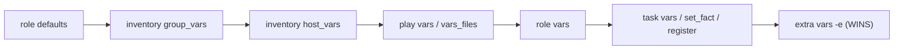

### 36.7 Recommended project layout
```text
ansible-project/
├── ansible.cfg
├── inventory/
│   ├── hosts.ini
│   ├── group_vars/
│   │   └── webservers.yml
│   └── host_vars/
│       └── web1.yml
├── roles/
│   ├── httpd_setup/
│   └── firewalld_service/
├── playbooks/
│   └── site.yml
└── requirements.yml
```

### 36.8 Ansible vs other tools
| Feature | Ansible | Puppet | Chef | Terraform |
|---|---|---|---|---|
| Agent | ❌ Agentless | ✅ Agent | ✅ Agent | ❌ |
| Language | YAML | Puppet DSL | Ruby DSL | HCL |
| Model | Push | Pull | Pull | Declarative provisioning |
| Main focus | Config mgmt + orchestration | Config mgmt | Config mgmt | Infrastructure provisioning |

---

## 37. Revision Cheat Sheet

### Commands
```bash
# --- Setup ---
ssh-keygen && ssh-copy-id user@IP
dnf install epel-release && dnf install ansible
ansible --version
ansible-config init --disabled -t all > ansible.cfg

# --- Inventory ---
ansible-inventory --list | --graph
ansible all -m ping

# --- Playbooks ---
ansible-playbook play.yml --syntax-check
ansible-playbook play.yml [--check] [--diff] [-v]
ansible-playbook play.yml --list-tags | --tags t1 | --skip-tags t2
ansible-playbook play.yml -b -K                  # sudo + ask password

# --- Ad-hoc ---
ansible <hosts> -m <module> -a "k=v k2=v2" [-b -K]

# --- Facts ---
ansible host -m setup [-a "filter=ansible_os_family"]

# --- Roles / Galaxy ---
ansible-galaxy init role_name
ansible-galaxy role install author.role
ansible-doc <module>
```

### Modules quick reference
| Module | Key params | Example |
|---|---|---|
| `ping` | — | `ping:` |
| `debug` | `msg`, `var` | `debug: msg="hi"` |
| `yum`/`dnf`/`apt` | `name`, `state` (present/latest/absent) | `yum: name=nginx state=present` |
| `service` | `name`, `state` (started/stopped/restarted/reloaded), `enabled` | `service: name=nginx state=started enabled=true` |
| `copy` | `src`, `dest`, `owner`, `group`, `mode`, `backup` | |
| `file` | `path`, `state` (touch/directory/absent), `owner`, `group`, `mode` | |
| `shell` | command, `args: chdir` | `shell: ./test.sh > test.log` |
| `command` | command (no pipes/redirects) | `command: df -h` |
| `cron` | `name`, `minute`, `hour`, `day`, `month`, `weekday`, `user`, `job`, `state`, `disabled`, `env`, `insertbefore/after` | |
| `user` | `name`, `comment`, `home`, `shell`, `group`, `groups`, `append`, `password`, `update_password`, `state`, `remove` | |
| `group` | `name`, `state` | |
| `get_url` | `url`, `dest`, `owner`, `group`, `mode` | |
| `firewalld` | `service` / `port`, `permanent`, `state`, `immediate` | `port: 80/tcp` |
| `setup` | `filter` | facts |
| `template` ➕ | `src` (.j2), `dest` | |

### Playbook keywords
| Keyword | Level | Purpose |
|---|---|---|
| `name` | play/task | Description |
| `hosts` | play | Target hosts/groups |
| `become` | play/task | sudo |
| `vars` / `vars_files` | play | Variables |
| `tasks` | play | Task list |
| `handlers` | play | Notified tasks (run at end, once) |
| `roles` | play | Roles to apply |
| `notify` | task | Trigger handler |
| `when` | task | Condition |
| `loop` / `with_items` | task | Repeat with `{{ item }}` |
| `tags` | task | Selective execution |
| `ignore_errors` | task | Continue on failure |
| `register` ➕ | task | Save output in variable |
| `args: chdir` | task | Working directory |

### Golden rules ✨
1. **Indentation matters** — spaces only, run `--syntax-check`.
2. **Quote** any value that starts with `{{`, and octal modes (`"0644"`).
3. Task-level `name` = description; module `name` = real resource name.
4. `ok` = no change, `changed` = modified → **idempotency**.
5. Use **variables** to avoid repetition, **loops** to avoid duplicate tasks.
6. Use **handlers** for "only-if-changed" actions (restart/reload).
7. Use **tags** to run part of a playbook.
8. Use **`when`** + **facts** for multi-OS playbooks.
9. Use **roles** for structure & reuse; **Galaxy** to share/download roles.
10. Non-root user → **`become: true`** + **`-K`**.

---

## 38. Interview / Self-Test Questions

<details>
<summary><b>Q1. What is Ansible and why is it called agentless?</b></summary>

An open-source IT automation tool (Red Hat) for configuration management, deployment, and orchestration. It's agentless because nothing has to be installed on managed nodes — it connects via SSH and needs only Python there.
</details>

<details>
<summary><b>Q2. What are the three core components of Ansible?</b></summary>

Inventory (which hosts), Playbook (what tasks, YAML), Module (unit of work that performs a task).
</details>

<details>
<summary><b>Q3. What is idempotency? How do you see it in output?</b></summary>

Running a playbook multiple times yields the same final state without making unnecessary changes. Output shows `ok` (no change) vs `changed` (modified).
</details>

<details>
<summary><b>Q4. Difference between ad-hoc commands and playbooks?</b></summary>

Ad-hoc: one-off CLI commands (`ansible all -m ping`). Playbooks: reusable YAML files with many tasks (`ansible-playbook site.yml`).
</details>

<details>
<summary><b>Q5. Difference between `command` and `shell` modules?</b></summary>

`command` runs without a shell (no pipes, redirects, env vars); `shell` runs through `/bin/sh` and supports them.
</details>

<details>
<summary><b>Q6. What are handlers and when do they run?</b></summary>

Tasks triggered by `notify` only when the notifying task reports `changed`. They run once, at the end of the play.
</details>

<details>
<summary><b>Q7. How do you run only specific tasks of a playbook?</b></summary>

Use tags: `--tags tagname` or `--skip-tags tagname` (also `--start-at-task`).
</details>

<details>
<summary><b>Q8. How do you write one playbook for both RHEL and Ubuntu?</b></summary>

Use `when` with facts: `when: ansible_os_family == "RedHat"` (yum/httpd) and `when: ansible_os_family == "Debian"` (apt/apache2) — or use the generic `package` module with variables.
</details>

<details>
<summary><b>Q9. How do you set a user's password securely?</b></summary>

`password: "{{ 'secret' | password_hash('sha512') }}"` and store the secret in Ansible Vault.
</details>

<details>
<summary><b>Q10. What is a role and what is its directory structure?</b></summary>

A structured, reusable bundle of tasks/vars/handlers/files/templates. Created with `ansible-galaxy init`. Dirs: `tasks, handlers, vars, defaults, files, templates, meta, tests`.
</details>

<details>
<summary><b>Q11. How do you run tasks requiring root as a normal user?</b></summary>

`become: true` in the play/task (or `-b`) and supply the sudo password with `--ask-become-pass` / `-K`.
</details>

<details>
<summary><b>Q12. What are facts? How do you view them?</b></summary>

System information gathered automatically from managed nodes (OS, IP, memory…). View with `ansible <host> -m setup`.
</details>

<details>
<summary><b>Q13. What is Ansible Galaxy? Ansible Tower?</b></summary>

Galaxy: public hub for sharing/downloading roles & collections. Tower (now AAP; upstream AWX): web UI/dashboard with RBAC, scheduling, reporting, and integrations for teams.
</details>

<details>
<summary><b>Q14. Your copied file overwrote important content. How do you prevent that?</b></summary>

Use `backup: true` in the `copy` module — it keeps a timestamped copy of the old file when the content changes.
</details>

<details>
<summary><b>Q15. A script run via Ansible created its output file in /root. Why and how to fix?</b></summary>

The default working directory is the remote user's home. Use `args: chdir: /desired/dir` or absolute paths.
</details>

---

> 📝 *Keep practicing: build a 2-VM lab, rewrite each playbook from memory, then convert them into roles.* 🚀
