# Full Stack AI DevOps Masterclass — Complete Revision Notes (Expanded Edition)

> Rebuilt in full detail from the ~11.5-hour video transcript (`full_devops_transcript.txt`). This edition preserves the **explanations, analogies, live-demo walkthroughs, and command-by-command reasoning** from the video — not just a summary — rewritten in clear technical English, with every command, YAML/Dockerfile snippet, comparison table, and diagram you need for deep revision.

---

## 📑 Table of Contents

- [Part 0 — Scope & How This Course Is Structured](#part-0--scope--how-this-course-is-structured)
- [Part 1 — The DevOps Mindset](#part-1--the-devops-mindset)
- [Part 2 — Docker: The Complete Deep Dive](#part-2--docker-the-complete-deep-dive)
- [Part 3 — Monolith vs Microservices](#part-3--monolith-vs-microservices)
- [Part 4 — Kubernetes: The Complete Deep Dive](#part-4--kubernetes-the-complete-deep-dive)
- [Part 5 — CI/CD Concepts](#part-5--cicd-concepts)
- [Part 6 — Jenkins vs GitHub Actions](#part-6--jenkins-vs-github-actions)
- [Part 7 — Hands-on: Building the GitHub Actions Pipeline](#part-7--hands-on-building-the-github-actions-pipeline)
- [Part 8 — Deploying to AWS EKS](#part-8--deploying-to-aws-eks)
- [Part 9 — Cloud Platforms: AWS vs Azure vs GCP](#part-9--cloud-platforms-aws-vs-azure-vs-gcp)
- [Part 10 — Master Command Cheat Sheets](#part-10--master-command-cheat-sheets)
- [Part 11 — Complete Glossary](#part-11--complete-glossary)
- [Part 12 — How to Use These Notes for Revision](#part-12--how-to-use-these-notes-for-revision)

---

## Part 0 — Scope & How This Course Is Structured

The instructor markets this as a **"Full Stack AI DevOps Masterclass with Microservices"** — a ~40-hour (and growing) Udemy flagship course, of which this transcript is one ~11.5-hour recording/upload. He explains the title piece by piece:

- **"Full Stack"** → the course teaches DevOps for **full-stack applications** (frontend + backend), not just backend services.
- **"AI"** → not a marketing buzzword (his words) — the course includes **AI-assisted DevOps strategies** to accelerate your workflow, in addition to the core DevOps content.
- **"DevOps Masterclass"** → aimed at **both** DevOps engineers and developers who want to understand DevOps — explicitly designed for **absolute beginners**, starting from "What is DevOps?" with zero assumed knowledge of Docker, Kubernetes, IaC, or cloud.
- **"Microservices"** → the hands-on project used throughout is a **microservices-based, production-style application** (with separate Node.js, Python, and Spring Boot/Java services), not a single monolith.

**Promised curriculum order (as stated in the intro/outro):**
DevOps mindset → Docker (containerize monolith *and* microservices) → Kubernetes (local, then cloud) → Infrastructure as Code with Terraform → AWS + Azure + GCP → CI/CD with Jenkins and GitHub Actions.

**What is actually taught in hands-on depth in *this* transcript file**, hour by hour:

| Time range | Topic actually covered in depth |
|---|---|
| 0:00 – 0:22 | Intro, resources (GitHub repo with `main`/`working` branches), what DevOps is, why it emerged |
| 0:22 – 4:20 | **Docker** — VMs vs containers, architecture, terminology, installation, `docker run`/`ps`/`stop`/`exec`/`pull`/`tag`/`build`/`push`, Dockerfile authoring, Docker Compose, Docker registries (very detailed, fully hands-on) |
| 4:20 – 7:00 | **Kubernetes** — the orchestration problem, architecture, local cluster setup, Pods/Deployments/ReplicaSets, Services (all 4 types), scaling, self-healing, ConfigMaps/Secrets, `kubectl` (detailed, hands-on) |
| 7:00 – 7:20 | **CI/CD theory** — what CI/CD is, pipeline anatomy, software artifacts |
| 7:20 – 11:31 | **GitHub Actions hands-on** — building real multi-job workflows (build → test → dockerize → push) for Node.js/Python/Spring Boot microservices, then **deploying to AWS EKS** |

> ⚠️ **Honest scope note:** Terraform, Azure AKS, and GCP GKE are referenced only in marketing/overview statements ("we also cover Terraform, AWS, Azure, GCP") — this transcript contains **no hands-on `terraform init/plan/apply` demo** and **no AKS/GKE walkthrough**. If your full course has separate video files for those modules, they are not part of this transcript and therefore not part of this document. Everything below is a faithful, technically corrected, and substantially expanded rewrite of what **is** actually taught here.

---

## Part 1 — The DevOps Mindset

### 1.1 Formal Definition
> "DevOps is a way of building and operating software where development and operations work together, with shared responsibility, to ship features faster, safer, and more reliably — with heavy use of automation."

The instructor is emphatic on one point, repeated multiple times: **DevOps is *not* a tool.** Docker, Kubernetes, CI/CD, Terraform — these are tools. DevOps itself is a **culture, a practice, and a workflow** that brings shared ownership across the software lifecycle: **plan → build → deploy → test → operate → improve.**

### 1.2 Before DevOps: Two Separate Teams

| Team | Responsibility | Typical response when something breaks |
|---|---|---|
| **Development Team** | Write code, add features, push changes to a shared version-control system (Git/GitHub/Bitbucket) | *"It works on my machine."* |
| **Operations Team** | Run servers, handle deployments, fix production outages (often at midnight) | *"Your code is unstable."* |

This structural split — code thrown "over the wall" from Dev to Ops — created five concrete, named problems:

| # | Problem | What it actually looked like |
|---|---|---|
| 1 | **Slow releases** | New features took a long time to reach production because Ops needed time to deploy manually; developers couldn't ship as frequently as they wanted. |
| 2 | **The blame game** | When something failed in prod, Ops blamed the developer's code; developers blamed Ops' deployment. No shared context, no shared accountability. |
| 3 | **Manual deployments = high risk** | Ops copied files to servers by hand and restarted servers manually. Example given: a missing `.env` file (environment variable file) caused a production outage because Ops deployed the wrong config manually. |
| 4 | **No feedback loop to developers** | Developers shipped features but had no visibility into error rates, latency, or real-world performance — they were purely in "build mode." |
| 5 | **Inconsistent environments** | A developer's machine (e.g., Python 3.10) didn't match staging/production (e.g., Python 3.8) — the developer's setup never truly simulated production. |

### 1.3 How DevOps Fixed This — 5 Concrete Shifts

DevOps made the flow from developer machine → production **automated, predictable, and monitored**, via five changes:

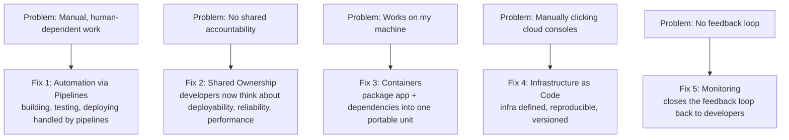

1. **Automation replaces manual work.** Instead of humans building/testing/deploying by hand, **pipelines** do this job. Example given: a retail company wanting to deploy backend services 5+ times a day can only do this because it's automated — no operations engineer has to manually execute each release.
2. **Shared ownership.** With automation in place, backend engineers get pulled into deployment concerns. Developers start thinking about deployability, reliability, error rates, and performance — not just "does it compile."
3. **Containers eliminate "works on my machine."** A container packages the application code + all its dependencies + everything it needs to run into one lightweight, portable unit that behaves identically anywhere. *(This is the direct bridge into the Docker module.)*
4. **Infrastructure as Code (IaC) makes infrastructure reproducible.** Instead of manually clicking through an AWS/Azure/GCP dashboard to create servers/networks (and forgetting steps), you define infrastructure **in code**. Running that code recreates the infrastructure exactly, every time — and destroying/recreating environments becomes trivial.
5. **Monitoring closes the feedback loop.** Developers — not just an "infra team" — now get visibility into how their code behaves in production.

### 1.4 Summary Mental Model
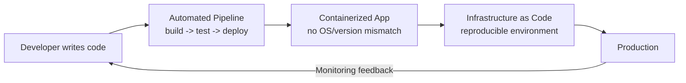

---

## Part 2 — Docker: The Complete Deep Dive

This is the single most detailed topic in the transcript (roughly 4 hours). The instructor teaches it through a narrative scenario before ever touching a command — reproduced here in full because it's the mental model everything else builds on.

### 2.1 The Problem, Told as a Story: Sarah and John

Two developers, **Sarah** and **John**, work on the same codebase in a shared development environment (a Git-based remote like GitHub/Bitbucket). Their application has dependencies with specific version numbers (as any Python, Java, or Node app would).

One day, **John updates the version of a library** and pushes the change to the shared repository. **Sarah pulls the change** — and her local environment suddenly breaks. Why? Because of a **version conflict / compatibility problem** between what's installed on Sarah's machine and what John's updated code now expects. The bug is also *hard to reproduce* precisely because it stems from environment differences, not logic errors.

**The core insight:** the exact same piece of code works on one developer's machine and fails on another's — purely because of environment drift.

**The Docker fix:** Sarah's team decides to **containerize the application**. Instead of a shared environment that only holds *source code*, they now share a **container** that holds the application code **plus** its dependencies **plus** the exact required environment configuration — everything the app needs to run, bundled together. Now, whatever John changes gets baked into the container image itself; when Sarah pulls the updated container, she gets the *exact* same runtime environment John used. If it works on John's machine, it is now structurally guaranteed to work on Sarah's, because they're no longer running "their own installed dependencies" — they're running the same packaged unit.

### 2.2 Formal Definition of Docker

> **Docker** is an open-source platform that automates the deployment, scaling, and management of applications using **containerization** — a lightweight virtualization technology that packages an application and its dependencies into a standard unit called a **container**.

A container can bundle:
- Application code
- The runtime environment the app needs
- All required libraries
- Necessary system tools

Containers are **portable** and run identically on any system that supports Docker — which is precisely what eliminates the "works on my machine" phrase.

### 2.3 Docker vs Virtual Machines — The Concept Beginners Most Confuse

This is presented as one of the most important distinctions to internalize.

**What is a Virtual Machine (VM)?**
A VM is like **a separate computer inside your computer** — a software emulation of a physical machine, created and managed by **virtualization software** (VMware, VirtualBox, Hyper-V). Each VM gets its own **virtual hardware**: its own CPU allocation, memory, storage, and network interfaces, and can run its own operating system (Windows, Linux, macOS) completely independently of the others and of the host.

*Example given:* On a machine with 16 GB RAM, you could create 2 VMs and allocate 5 GB RAM to each; each VM operates strictly within its allotted resources, in full isolation from the others — "it's like buying separate physical computers, except you don't have to."

**VM Architecture:**
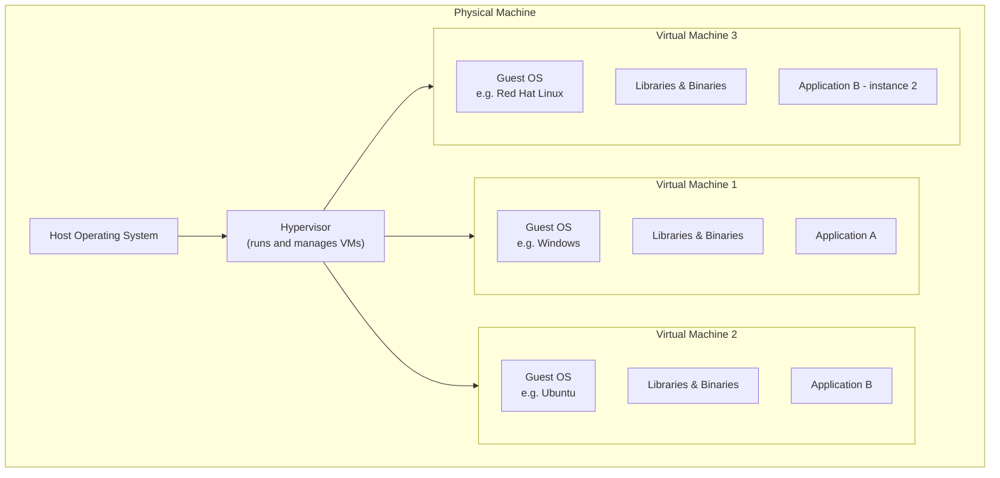
Key point: **each VM carries a full copy of a guest OS**, even though the application itself might only need 2–3 specific components from that OS, not the whole thing. That full OS copy is what makes VMs heavy.

**Docker's Architecture, by contrast:**
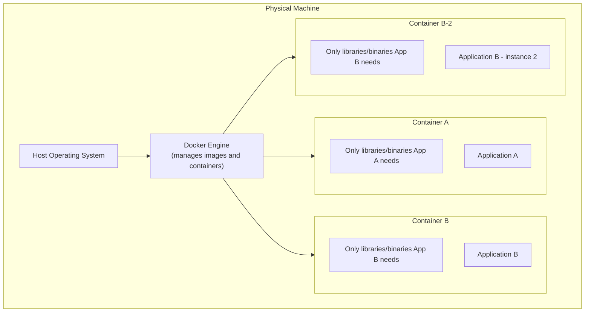
Docker containers **do not carry a full guest OS** — they share the host machine's OS **kernel** and only package the specific libraries/binaries the application actually needs. This is exactly why containers are dramatically lighter than VMs, start almost instantly, and let you run many more of them on the same hardware.

**Full Comparison Table (as taught):**

| Dimension | Virtual Machines | Docker Containers |
|---|---|---|
| Size | Large, resource-intensive | Lightweight |
| Startup time | Slow (full OS boot required) | Near-instant (no OS boot) |
| Resource utilization | High | Low / efficient |
| Isolation | Strong — full hardware-level isolation between VMs | Isolated, but containers **share the host OS kernel** |
| Portability | Portable, but needs OS compatibility | Highly portable, independent of host OS specifics |
| Scalability | Scaling = provisioning entire new VMs | Scaling = just spinning up more lightweight containers |
| Ecosystem | VM-specific tools & management frameworks | Docker ecosystem & tooling |
| Dev workflow | Slower setup/provisioning | Faster setup, better dependency management |
| Deployment efficiency | Heavier overhead due to VM size | Efficient — smaller container size |

**Why choose Docker over VMs (the four reasons given):**
1. **Efficiency** — lightweight, uses fewer resources.
2. **Portability** — runs across any machine supporting the Docker ecosystem.
3. **Speed** — containers start and stop much faster.
4. **Isolation** — still provides solid isolation between workloads without the overhead of separate OS instances.

### 2.4 Docker Terminology — The Full Mental Model

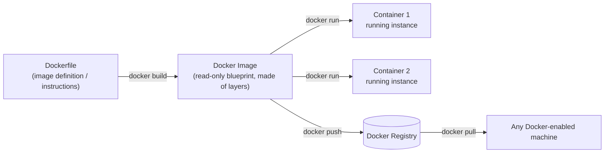

| Term | Explanation (as taught) |
|---|---|
| **Docker Image** | A **template/blueprint** that defines what a container should contain and how it should run — lightweight and **read-only**. |
| **Docker Container** | A **running instance** of an image — this is where your application actually executes. **One image can spin up many containers.** |
| **Dockerfile** | The **instructions file** — a text file containing the step-by-step instructions used to *build* a Docker image. It defines the image because "that definition has to be defined somewhere," and different applications (Node.js vs Spring Boot vs Python) need different instructions. |
| **Image Layer** | Every image is made of multiple stacked layers. Layers exist for three reasons: **(1)** rebuilds are faster because a layer can be **cached**, **(2)** this improves build performance, and **(3)** if multiple images share similar layers, Docker reuses them, **reducing storage space**. |
| **Docker Registry** | A **remote storage service for images** — conceptually identical to why you push source code to GitHub instead of keeping it only on your laptop: backup, team access, and availability. Moving an image from your local machine to a registry is called a **push**; bringing one down is a **pull**. |
| **Docker Tag** | A **version label** attached to an image, e.g. `myapp:dev`, `myapp:prod`, `myapp:v2`, `myapp:latest`. If you don't specify a tag, Docker defaults to `latest`. |
| **Docker Engine** | The **runtime that manages containers** — composed of three sub-components (Daemon, API, CLI), detailed next. |

### 2.5 Docker Architecture — Daemon, API, CLI, and Engine

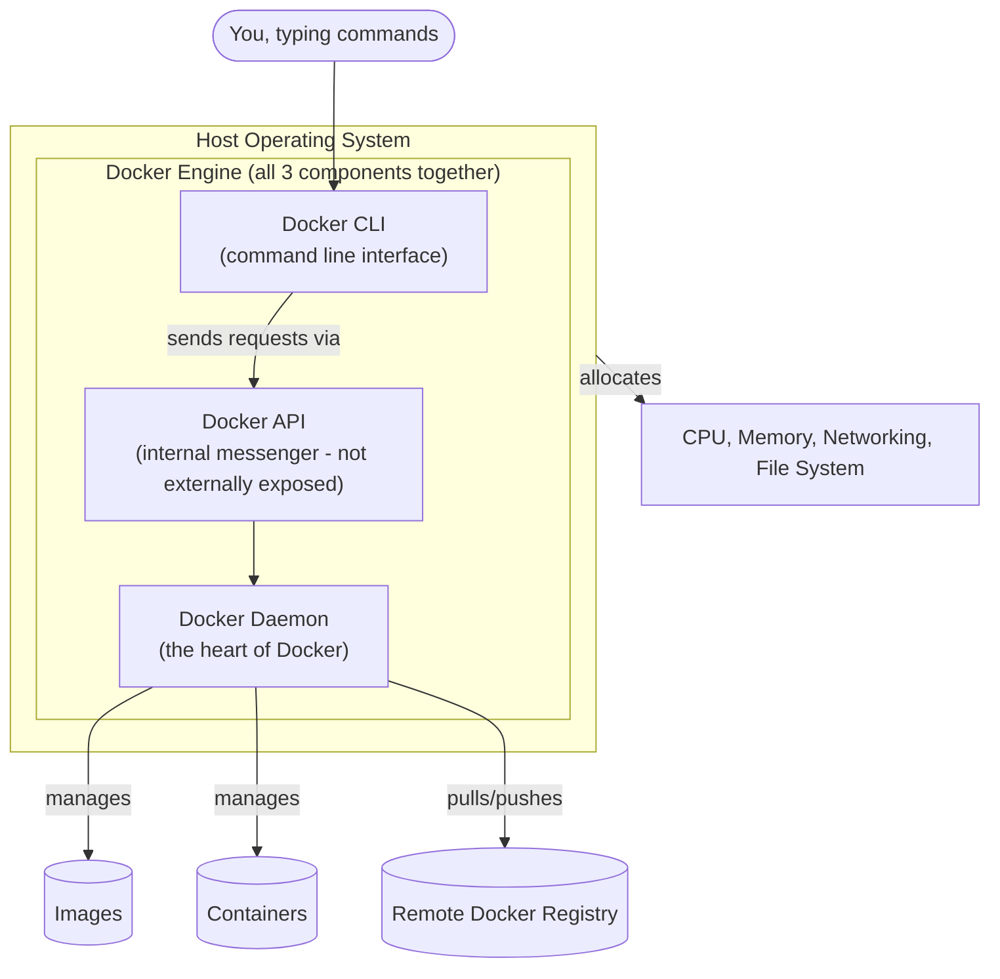

| Component | Role |
|---|---|
| **Docker Daemon (`dockerd`)** | The **heart of Docker** — actually does all the real work: managing images and containers, starting/stopping containers, building images, and pulling/pushing to/from the registry. |
| **Docker API** | Allows the CLI to send requests to the Daemon. It's exposed **internally only** (not externally accessible) — it acts as the messenger between CLI and Daemon. |
| **Docker CLI** | The **command-line interface** you actually type commands into. Your commands are intercepted by the CLI → passed to the API → communicated to the Daemon → the Daemon performs the action. |
| **Docker Engine** | The collective name for **CLI + API + Daemon** running together on the **Host OS**. The Host OS is what allocates CPU, memory, networking, and file-system resources to Docker. |

When running Docker **remotely on a cloud provider**, the same stack exists inside a virtual machine there: Machine → Host OS → Docker Engine → (Libraries/Binaries + your app, packaged into one or more running containers).

### 2.6 Installing Docker Desktop (Step-by-Step, All Platforms)

1. Go to **docker.com** → *Get Started* → *Docker Desktop* (the recommended, easiest path onto any machine).
2. **Choose your platform:**
   - **macOS:** Choose **Apple Silicon** or **Intel** build depending on your chip; minimum **4 GB RAM**; you get a `.dmg` file — open it and drag Docker into Applications.
   - **Windows:** Choose between **x86_64 (AMD64)** and **ARM64** builds. *How to check which one you have:* Settings → System → About → scroll to **Device specifications** → check "System type" (e.g., "x64-based processor" = get the AMD64/x64 build). Run the downloaded `.exe`; during install, keep **"Use WSL 2 instead of Hyper-V (recommended)"** checked; a desktop shortcut is optional.
   - **Linux:** Follow platform-specific instructions (Ubuntu, Debian, Fedora, Arch each have their own install command sequence documented on Docker's site).
3. Launch Docker Desktop for the first time → accept the **Subscription Service Agreement**.
4. **Create a free Docker account** (recommended, not mandatory to start) — you will need one later to `docker push` images to Docker Hub, since pushed images get registered against your username.
5. **Always keep Docker Desktop running** in the background whenever you intend to run Docker commands — if it's closed, all `docker` CLI commands will fail.

### 2.7 Verifying the Installation

```bash
docker --version          # prints installed Docker version + build number
docker info                # prints full Docker Engine information (client version, etc.)
docker compose version     # verifies Docker Compose is bundled and working
```
All three working confirms Docker Desktop has correctly installed **Docker Engine + Docker CLI + Docker Compose** together, on Windows, Mac, or Linux alike.

### 2.8 Your First Container — the `hello-world` Walkthrough

```bash
docker run hello-world
```

What happens, step by step (this exact sequence is printed by the image itself and explained live):
1. The **Docker Client** (CLI) contacts the **Docker Daemon**.
2. The Daemon looks for the `hello-world:latest` image **locally** — since a tag isn't specified, Docker defaults to the `latest` tag.
3. Not found locally → the Daemon **pulls** the image from **Docker Hub** (the default registry) — this is the "unable to find image locally" message.
4. The Daemon **creates a new container** from that image, which runs the executable that prints the "Hello from Docker!" message.
5. The Daemon **streams that output** back to the Client, which prints it to your terminal.

**Run it a second time**, and you'll see it skip the download step entirely — the image is now cached locally, so Docker goes straight to creating a container. Run it multiple times and you get **multiple containers** from the **same single image** — proving images are reusable blueprints and containers are disposable running instances of them.

In **Docker Desktop's GUI**, you can inspect this directly:
- **Images tab:** shows the image, its **Image ID**, size, creation date, and a green dot if a container is currently using it (grey/black dot = unused).
- **Containers tab:** shows each container's status (running / exited), its ID, the image it came from, and gives you Start/Stop/Logs actions directly from the UI.

### 2.9 Running a Real Web Server — the Nginx + Port Mapping Deep Dive

`nginx` is an open-source web server / reverse proxy that serves a web page — used here specifically because it lets you *see* something in a browser, which makes container concepts concrete.

**Attempt 1 (fails on purpose, to teach the concept):**
```bash
docker run nginx
```
This pulls and runs nginx, which starts serving its welcome page **on port 8080 inside the container**. But visiting `http://localhost:8080` in your browser **fails** — because that port only exists *inside* the container's own private network namespace; nothing on your host machine is listening there.

**Why it fails — the mental model:**
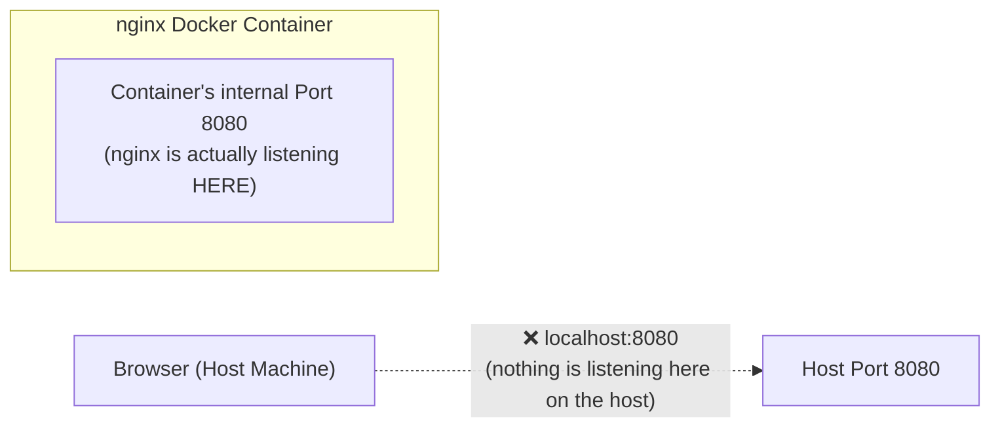

**Attempt 2 (fixed with port mapping):**
```bash
docker run -p 80:8080 nginx
```
Now visiting `http://localhost:80` (or just `localhost`) works — the nginx welcome page renders.

**The `-p` flag explained:** `-p <host_port>:<container_port>` maps a port on your **host machine** to a port **inside the container**. Any request that hits the host port is automatically forwarded into the container's internal port. Format: `-p hostPort:containerPort`. This is one of the most frequently used Docker flags — a Node.js app running on container port 3000, or a Spring Boot app on container port 8080, will both need this kind of mapping to be reachable from your machine.

### 2.10 Detached Mode & Naming Containers

By default, `docker run nginx` **occupies your terminal** — closing the terminal stops the container, and you see a continuous stream of logs.

```bash
docker run -p 80:8080 -d nginx
```
The `-d` (**detached**) flag runs the container in the background, freeing your terminal, and immediately returns the **container ID**. Logs are still viewable anytime via the Docker Desktop UI or `docker logs`.

```bash
docker run -d --name my-nginx -p 80:8080 nginx
```
The `--name` flag assigns a human-readable name instead of Docker's randomly generated one (e.g., "sleepy_lovelace"). **Container names must be unique** — trying to reuse a name that's still active throws an error; you'd need to stop/remove the existing one first or pick a new name.

> 💡 Some containers (like `hello-world`) are **designed to run once and exit automatically**. Others (like `nginx`, a web server) are **designed to run continuously** until you explicitly stop them.

### 2.11 Running Multiple Containers From the Same Image

```bash
docker run -d --name nginx-1 -p 80:8080 nginx
docker run -d --name nginx-2 -p 8081:8080 nginx
docker run -d --name nginx-3 -p 8082:8080 nginx
```
This proves you can spin up **many containers from a single image**, each independently mapped to a different host port (`localhost:80`, `localhost:8081`, `localhost:8082` are all simultaneously live, separate instances) — while `localhost:8083` (unmapped) correctly shows nothing.

### 2.12 Practice Images (used in the course's hands-on challenge)

The instructor hosts three demo images under his Docker Hub account for practice, one per backend language, each simply printing a "hello" message plus the container ID and any injected environment variables:

| Image | Language | Notes |
|---|---|---|
| `<username>/hello-node` | Node.js | Practice pulling, running, port-mapping |
| `<username>/hello-python` | Python | Runs on port 3000 inside the container by default |
| `<username>/hello-spring` | Java / Spring Boot | Runs on port 8080 inside the container by default |

Exercise pattern demonstrated for each: `docker pull <image>` → `docker run -d -p <host>:<container> --name <name> <image>` → visit the mapped `localhost` port → observe the JSON/text response including the container ID and any env vars (or "no env set" if none were passed).

### 2.13 Core Inspection & Lifecycle Commands (all demonstrated live)

| Command | What it does |
|---|---|
| `docker ps` | Lists **running** containers only |
| `docker ps -a` | Lists **all** containers (running + stopped/"exited") |
| `docker ps -a -q` | Lists only container **IDs** (`-q` = quiet) — useful for scripting bulk operations |
| `docker stop <name_or_id>` | Gracefully stops a running container (you can use either its name or its ID) |
| `docker images` | Lists all locally cached images |
| `docker images -q` | Lists only image IDs |
| `docker pull <image>:<tag>` | Downloads an image **without** running it |
| `docker exec -it <container> sh` | Opens an **interactive shell inside a running container** — crucial for debugging |
| `docker exec -it <container> printenv` | Lists environment variables **as seen from inside the container** |

**Why `docker exec` matters:** it lets you step *inside* a live container as if you'd SSH'd into a tiny standalone machine — useful for checking whether an environment variable was correctly injected, inspecting files, or debugging why an app isn't behaving as expected.

### 2.14 Writing Your Own Dockerfile & Building an Image

**The build workflow, exactly as demonstrated:**
```bash
# 1. Build an image from the Dockerfile in the current directory ('.' = build context)
docker build -t myapp:1.0 .

# 2. Confirm it now exists locally
docker images

# 3. Run it, mapping the correct container port
docker run -d -p 8080:8080 myapp:1.0
```

The `-t` flag **tags** the image at build time with a name and version (`name:tag`) so it's identifiable later. The trailing `.` tells Docker where the **build context** (Dockerfile + source files it needs) is located.

**Dockerfile examples for each language used in the course's microservices:**

**Node.js:**
```dockerfile
FROM node:18-alpine
WORKDIR /app
COPY package*.json ./
RUN npm install
COPY . .
EXPOSE 3000
CMD ["node", "index.js"]
```

**Python:**
```dockerfile
FROM python:3.11-slim
WORKDIR /app
COPY requirements.txt .
RUN pip install --no-cache-dir -r requirements.txt
COPY . .
EXPOSE 3000
CMD ["python", "app.py"]
```

**Java / Spring Boot (multi-stage — this is the app later deployed to AWS EKS via GitHub Actions):**
```dockerfile
# ---- Build stage ----
FROM maven:3.9-eclipse-temurin-17 AS build
WORKDIR /app
COPY pom.xml .
RUN mvn dependency:go-offline
COPY src ./src
RUN mvn clean package -DskipTests

# ---- Run stage ----
FROM eclipse-temurin:17-jre-alpine
WORKDIR /app
COPY --from=build /app/target/*.jar app.jar
EXPOSE 8080
ENTRYPOINT ["java", "-jar", "app.jar"]
```

**Why every application's Dockerfile is different:** different languages/frameworks have completely different build and run steps — you cannot run a Spring Boot application the same way you run a Python application. Each Dockerfile encodes exactly what that specific application needs.

### 2.15 Docker Tags — Deep Dive

> "A Docker tag is a version label attached to an image."

```bash
docker build -t myapp:dev .        # a development version
docker build -t myapp:prod .       # a production version
docker build -t myapp:v2 .         # version 2
docker build -t myapp:latest .     # the latest available build
```
If you don't provide a tag at all, Docker silently applies `:latest`. Tags are what let you **roll back** to a previous, known-good version of your image if a new release misbehaves in production.

**Tagging for a registry push (the mandatory naming convention):**
```bash
docker tag myapp:1.0 <dockerhub-username>/myapp:1.0
```
> A beginner FAQ addressed directly in the transcript: *"Do I need to prefix my Docker Hub username?"* — **Yes, this is mandatory.** If you omit `<username>/` before the image name, the push to the remote registry will fail. This convention is how Docker Hub knows which account's namespace the image belongs to.

### 2.16 Docker Registries — Deep Dive

**Why not just keep images on your local machine?** The same reason you push source code to GitHub instead of only keeping local Git history: **risk** (your machine could fail and you'd lose everything) and **collaboration** (a team, or the whole internet, needs to be able to pull the image).

**The registries surveyed on-screen:**

| Registry | Provider | Where to find it | Notes from the walkthrough |
|---|---|---|---|
| **Docker Hub** | Docker Inc. | `hub.docker.com` | The **default** registry — if you don't specify a registry when pushing/pulling, Docker assumes Docker Hub. Easiest to use, has millions of **official images** (verified, published by the actual maintainers — e.g., the official TensorFlow, PyTorch, Python, MySQL, Postgres images). Free tier is sufficient for almost everyone; paid tiers exist for extra features. **Recommended starting point for beginners** and the best choice for publishing open-source images publicly. |
| **Amazon ECR** (Elastic Container Registry) | AWS | AWS Console → search "ECR" | Preferred when your org is already AWS-native (EC2, EKS, etc.) — keeps everything inside the AWS ecosystem for simpler integration. |
| **Google Artifact Registry** | GCP | GCP Console → *Containers* | GCP's native registry (successor to the older "Google Container Registry"). Preferred for GCP-native orgs. |
| **Azure Container Registry (ACR)** | Microsoft Azure | Azure Portal → *Container* products | Supports both Docker and OCI (Open Container Initiative) image formats; preferred for Azure-native orgs. |

**Rule of thumb given in the course:** if your company/project lives inside one specific cloud ecosystem, use that cloud's native registry for easier IAM integration. If you're an individual developer or not tied to any one cloud, **default to Docker Hub**.

**Public vs Private Registries/Repositories:**
| Type | Who can access | When to use |
|---|---|---|
| **Public** | Anyone in the world can view, pull, and use the image | Open-source projects you want the world to use |
| **Private** | Restricted to you or your team | Company/production software you don't want exposed |

### 2.17 Docker Compose

Used to run **multi-container applications** (e.g., an app plus its database) with one command instead of many separate `docker run` invocations.

```yaml
version: "3.9"
services:
  app:
    build: .
    ports:
      - "8080:8080"
    environment:
      - DB_HOST=db
      - DB_PASSWORD=secret
    depends_on:
      - db

  db:
    image: postgres:15
    environment:
      - POSTGRES_PASSWORD=secret
    volumes:
      - db-data:/var/lib/postgresql/data

volumes:
  db-data:
```
```bash
docker compose version   # verify installation
docker compose up        # start every service defined in docker-compose.yml
docker compose up -d     # start in detached (background) mode
docker compose down      # stop and remove everything Compose created
```

### 2.18 Full Docker Command Reference (everything demonstrated)

```bash
# Installation verification
docker --version
docker info
docker compose version

# Running containers
docker run hello-world
docker run <image>
docker run -d <image>
docker run -it <image> sh
docker run -p <host_port>:<container_port> <image>
docker run -p <host_port>:<container_port> -d --name <name> <image>

# Inspecting
docker ps
docker ps -a
docker ps -a -q
docker images
docker images -q

# Lifecycle
docker stop <container>
docker exec -it <container> sh
docker exec -it <container> printenv

# Pull / Build / Tag / Push
docker pull <image>:<tag>
docker build -t <name>:<tag> .
docker tag <image>:<tag> <dockerhub-username>/<image>:<tag>
docker login
docker push <dockerhub-username>/<image>:<tag>

# Compose
docker compose up
docker compose up -d
docker compose down
```

---

## Part 3 — Monolith vs Microservices

| Aspect | Monolith | Microservices |
|---|---|---|
| Codebase | Single unified codebase | Multiple independent services, each with its own codebase |
| Deployment | Deploy the whole app at once | Deploy each service independently |
| Scaling | Scale the entire application together | Scale individual services based on their own load |
| Container mapping | Typically one container/image | One container/image **per microservice** |
| Failure isolation | A bug can take down the entire app | A failing service can be isolated without crashing the whole system |
| Language/framework choice | Usually one stack for everything | Different services can use different stacks (e.g., Node.js, Python, Spring Boot side by side) |

The course's practice application is explicitly microservices-based, which is *why* the containerization module builds **separate Dockerfiles/images per service** (Node, Python, Spring Boot) rather than one Dockerfile for the whole app, and why the Kubernetes/CI-CD modules later repeat the same deployment pattern once per service.

---

## Part 4 — Kubernetes: The Complete Deep Dive

### 4.1 Why Docker Alone Breaks in Production — The Container Orchestration Problem

**The setup:** picture a production system with a front-end service, a Node.js service, a Spring Boot service, and a Python service, all running as Docker containers.

**The uncomfortable questions the instructor poses:**
- What happens if a container **crashes at 2 a.m.**? Who restarts it?
- What if **traffic suddenly jumps 10x**? How do you get 5 more instances of a service, fast?
- What if **one container needs to run on a different physical machine (VM)** than another? Docker itself only manages a **single host** at a time.
- How do you **deploy a new version with zero downtime**?

Docker, by itself, **has no answer for any of these**. This class of problems is called the **container orchestration problem**.

**Definition of orchestration:** automatically managing many containers across multiple machines — including running, scaling, networking, and **healing** them (healing = automatically restarting a crashed container).

**The Kitchen Manager Analogy (used to explain orchestration intuitively):**

Imagine a restaurant kitchen with many chefs and a stream of incoming orders.
- If a chef quits or gets sick, **who reassigns their orders**?
- During rush hour, **who brings in more chefs**?
- **Who ensures each finished dish reaches the correct table**?

A **kitchen manager** is needed — someone who coordinates the workers automatically so that service continues smoothly even when individual chefs fail or demand spikes. That kitchen manager **is** the orchestrator.

| Restaurant analogy | Technology equivalent |
|---|---|
| Chefs | Containers |
| Orders / dishes | Requests / traffic |
| Kitchen manager | **Kubernetes (the orchestrator)** |

**The full list of problems container orchestration must solve (as enumerated in the video):**

| Problem | Explanation |
|---|---|
| **Crash recovery** | If a container crashes, who restarts it? Docker (even with Compose) does *not* auto-restart a crashed container. |
| **Scaling** | How do you run 10 copies of the same service instantly, e.g., during a Black Friday sale spike on an order service? |
| **Load balancing** | If there are 10 running instances of a service, how is incoming traffic evenly distributed across them? |
| **Service discovery** | If Service A and Service B need to talk to each other (and appear as one unit to the outside world), how do they find each other? |
| **Zero-downtime deployment** | Deploying a new version normally causes some downtime as the new version replaces the old — how do you avoid that? |
| **Multi-machine (multi-VM) coordination** | Docker operates on **one machine at a time** — how do you manage containers spread across many machines as a single system? |
| **Health checks** | How do you automatically detect a broken/unhealthy container? |

### 4.2 What Is Kubernetes?

> **Kubernetes (K8s)** is a **container orchestration platform** that manages containers for you **at scale** — automating deployment, scaling, healing, networking, and management of containerized applications.

Your applications are already containerized via Docker; Kubernetes is the layer that manages **many** containers, across **many** machines, reliably.

### 4.3 Docker vs Kubernetes — Head-to-Head

| | Docker | Kubernetes |
|---|---|---|
| Core job | **Runs** the container | **Manages** many containers for you |
| Scope | Single-host focused | Multi-node **cluster** focused |
| Scaling | Manual | **Autoscaling** |
| Failure recovery | Manual restart required | **Self-healing** — automatically restarts failed containers |
| Networking | Manual | **Built-in service discovery** |
| Analogy | The engine | **The autopilot** |

### 4.4 Setting Up Kubernetes Locally

Two popular local options are discussed (with Docker Desktop's built-in option used for the hands-on demos):

| Tool | Notes |
|---|---|
| **Docker Desktop's built-in Kubernetes** | Enable via *Docker Desktop → Settings → Kubernetes → "Enable Kubernetes"*. Lets you choose the underlying engine (`kubeadm` or `kind`). Installation takes a few minutes and requires an active internet connection (it pulls the Kubernetes control-plane images). This is the option used for the course's live demos. |
| **Minikube** | A very popular standalone tool for running a local (single- or multi-node) Kubernetes cluster; has its own official getting-started guide with resource requirements (roughly 2 CPUs, 2 GB free memory, 20 GB disk). |
| **`kubeadm`** | A lower-level tool also used to create/manage clusters (this is one of the two engine options Docker Desktop lets you pick from). |

> ⚠️ **Real gotcha demonstrated live and worth remembering:** `kubectl` **does not itself run a cluster** — it is *only* a client tool that talks to whichever cluster your current **context** points to. On the instructor's own machine, `kubectl get nodes` returned nothing/garbled output — not because Kubernetes had failed to install, but because his `kubectl` **context was still pointed at Minikube** (from earlier, unrelated experimentation) instead of the newly-enabled Docker Desktop cluster. Fix:
> ```bash
> kubectl config get-contexts        # see which context is currently active / available
> kubectl config use-context docker-desktop   # switch to the Docker Desktop cluster
> kubectl get nodes                  # now correctly shows the node
> ```
> **Lesson:** if `kubectl` commands return empty/odd results after installing Kubernetes, check your **context** before assuming the cluster itself is broken.

### 4.5 Core Concepts: Pods, Deployments, ReplicaSets


| Term | Definition, exactly as taught |
|---|---|
| **Pod** | "The actual running app" — a container wrapped in a Kubernetes layer. It's "like a house where your app lives and runs." **The smallest deployable unit in Kubernetes.** |
| **Deployment** | A component that runs your app **continuously**. If a pod crashes, Kubernetes restarts it automatically via the Deployment. It's also what lets you request more copies (replicas) of your app. |
| **ReplicaSet** | Created and managed automatically by a Deployment. Its job: if a pod crashes and is supposed to be available, the ReplicaSet **recreates it**, and it continuously ensures the **desired replica count** matches the actual running count. |
| **Node** | A single machine (VM or physical) in the cluster that actually runs pods. |
| **Cluster** | A set of nodes managed together as one logical unit ("multi-node cluster focus" is what distinguishes Kubernetes from plain Docker). |

### 4.6 Hands-On Demo: Deploying Nginx, Exposing It, and Watching Self-Healing

**Step 1 — Create a Deployment** (conceptually — a `deployment.yaml` named `web` running the `nginx` image is applied, creating a Pod under the hood):
```bash
kubectl get pods
# shows a pod for the 'web' deployment already running, e.g. web-7d9f...-x2k1p
```

**Step 2 — Expose it via a NodePort Service, so it's reachable from the browser:**
```bash
kubectl expose deployment web --type=NodePort --port=80
```
*(Note: capitalization of `NodePort` matters. `--port=80` is the port the Service listens on / forwards to, matching nginx's default port 80 inside the container.)*

Confirming:
```bash
kubectl get svc            # or: kubectl get svc web
```
Example output interpretation walked through live:
- `CLUSTER-IP` → the service's internal-only IP (safe to ignore for local access purposes)
- `PORT(S)` column shows something like `80:30241/TCP` → **80** is the app's internal container port, **30241** is the randomly-assigned external port opened on your machine (drawn from the 30000–32767 NodePort range)

**Step 3 — Access it in the browser:**
```
http://localhost:30241
```
This renders the nginx welcome page. **Full request path**, as diagrammed:
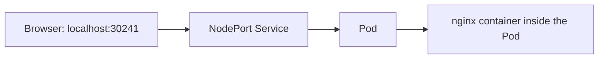

**Step 4 — Prove self-healing by killing a pod on purpose:**
```bash
kubectl get pods                 # note the pod name
kubectl delete pod <pod-name>    # deliberately delete it
kubectl get pods                 # a NEW pod has already been created automatically!
```
The old pod is gone, but a **brand-new pod** (new name, same Deployment) is already up. This is the ReplicaSet doing its job: the Deployment declared a desired state (e.g., 1+ replicas of this app), and Kubernetes continuously reconciles reality to match that desired state — with **zero manual intervention**.

**Step 5 — Prove autoscaling / manual scaling with a `-w` (watch) demo:**
```bash
kubectl get pods -w                     # watch mode — live updates as pods change
kubectl scale deployment web --replicas=5
```
Live output showed: 1 pod already running → **4 new pods created** → total of **5 pods** running. Exiting watch mode and running `kubectl get pods` plainly confirms 5 pods, and:
```bash
kubectl describe replicaset <replicaset-name>
```
...shows in its output: **Desired: 5, Current: 5, Ready: 5** — the concrete proof that Kubernetes is continuously reconciling the actual state to match the declared desired state, which is the entire value proposition over plain Docker.

**Step 6 — Debugging inside a running Pod:**
```bash
kubectl get pods
kubectl exec -it <pod-name> -- sh
# now inside the pod's shell:
printenv | grep DB_PASSWORD
```
This confirms whether an environment variable/secret was correctly injected into the running container — exactly analogous to `docker exec`, but at the Kubernetes/Pod level. The transcript notes this works identically for containers written in different languages (Python, Node.js) — each expects its own env vars (e.g., `PORT`, with sensible defaults like `3000` if not overridden), and the mechanism for passing them into the pod is language-agnostic.

### 4.7 Kubernetes Services — Deep Dive on All 4 Types

**Why Services exist at all:** a Pod is **invisible to the outside world** by default, and Pods are inherently unstable — they crash and restart, and there's no guarantee their IP address stays the same across restarts. A **Service** solves this by giving your application a **stable, permanent IP/identity** that other apps (and, depending on type, the outside world) can reliably reach — regardless of which underlying Pods come and go.

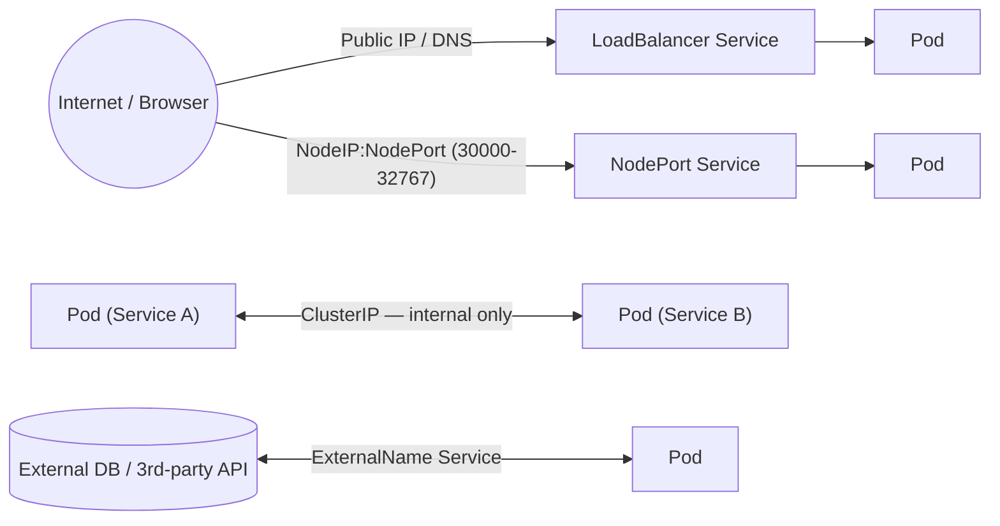

| Service Type | What it does | Accessible from browser? | Best used for |
|---|---|---|---|
| **ClusterIP** (default) | Exposes the app **only within the cluster** | ❌ No | Service-to-service / microservice-to-microservice communication where you specifically **don't** want external exposure |
| **NodePort** | Exposes the app on `<NodeIP>:<Port>`, port range **30000–32767** | ✅ Yes, via IP + port | **Local testing, demos, or learning Kubernetes** — generally *not* used as-is in real production |
| **LoadBalancer** | Provisions an actual **cloud load balancer**, giving a public IP or DNS name | ✅ Yes, via public internet | **Real production traffic with real users** — this is the type that "works best on cloud services like AWS, GCP, Azure" since it needs a cloud provider to actually create the load balancer |
| **ExternalName** | Maps the Service to an external DNS name | N/A (outbound mapping) | Connecting to an **external database or third-party API** from inside the cluster; described as advanced and rarely used |

**Summary, exactly as the instructor frames the decision table:**
- Need internal-only microservice-to-microservice communication? → **ClusterIP**
- Just testing/learning locally, want quick browser access? → **NodePort**
- Shipping to real users in production? → **LoadBalancer**
- Need to reach an external DB/API from inside the cluster? → **ExternalName**

**Service YAML example (LoadBalancer):**
```yaml
apiVersion: v1
kind: Service
metadata:
  name: myapp-service
spec:
  type: LoadBalancer
  selector:
    app: myapp
  ports:
    - protocol: TCP
      port: 80
      targetPort: 8080
```

### 4.8 ConfigMaps & Secrets

Two Kubernetes objects for injecting configuration into Pods, differing by **sensitivity**:

| | ConfigMap | Secret |
|---|---|---|
| Purpose | **Non-sensitive** configuration (ports, flags, non-secret values) | **Sensitive** configuration (passwords, API keys) |
| Object `kind` | `ConfigMap` | `Secret` |
| Type shown in demo | — | `Opaque` (a **generic secret type**) |
| Data encoding | Plain values | Should be **base64-encoded** in the manifest |

**Example files (`configmap.yaml` and `secret.yaml`, as walked through):**
```yaml
# configmap.yaml
apiVersion: v1
kind: ConfigMap
metadata:
  name: app-config
data:
  PORT: "8080"
  APP_MODE: "production"
```
```yaml
# secret.yaml
apiVersion: v1
kind: Secret
metadata:
  name: app-secret
type: Opaque
data:
  db-password: c2VjcmV0MTIz     # base64-encoded value
```
Referencing a Secret value inside a Deployment's pod spec:
```yaml
env:
  - name: DB_PASSWORD
    valueFrom:
      secretKeyRef:
        name: app-secret
        key: db-password
```

Verification (as demonstrated with `kubectl exec` above): exec into the running pod and `printenv | grep DB_PASSWORD` to confirm the value was correctly injected from the Secret.

### 4.9 `kubectl` Command Cheat Sheet (everything demonstrated + standard equivalents)

```bash
# Context management (important gotcha!)
kubectl config get-contexts
kubectl config use-context docker-desktop

# Cluster / node info
kubectl version --client
kubectl get nodes

# Pods
kubectl get pods
kubectl get pods -w                       # watch mode, live updates
kubectl describe pod <pod-name>
kubectl exec -it <pod-name> -- sh
kubectl exec -it <pod-name> -- printenv
kubectl delete pod <pod-name>             # deletion triggers auto-recreation if managed by a Deployment

# Deployments & scaling
kubectl get deployments
kubectl scale deployment <name> --replicas=5
kubectl set image deployment/<name> <container>=<image>:<tag>
kubectl rollout status deployment/<name>

# ReplicaSets
kubectl get replicaset
kubectl describe replicaset <name>        # shows Desired / Current / Ready counts

# Services
kubectl expose deployment <name> --type=NodePort --port=80
kubectl get svc
kubectl get svc <name>

# Applying manifests
kubectl apply -f deployment.yaml
kubectl apply -f service.yaml
kubectl apply -f configmap.yaml
kubectl apply -f secret.yaml
```

---

## Part 5 — CI/CD Concepts

### 5.1 The Manual Workflow Problem (Explicitly Diagrammed in the Course)

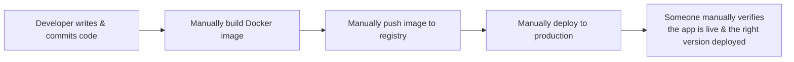
Every single arrow above represents a **manual, human-dependent** step — described explicitly as slow and risky.

### 5.2 Definitions

| Term | Meaning, exactly as taught |
|---|---|
| **CI — Continuous Integration** | Frequently merging code changes, with automatic building and testing. **CI ends the moment you have a packaged output** — a "software artifact." |
| **CD — Continuous Delivery/Deployment** | Automatically taking that artifact and deploying/releasing it. |
| **Software Artifact** | *"A ready-to-deploy packaged output of the build process."* In this course's context, that's the **Docker image** produced by the build step — once the app is packaged into a Docker image (or whatever your pipeline is configured for), it's "ready to deploy, ready to distribute." |
| **Pipeline** | Explicitly **not a tool** — a pipeline is "a combination of logic, steps, and flow." It consists of: **steps, order, and automation.** Jenkins and GitHub Actions are the *tools* used to run pipelines — the pipeline concept itself is tool-agnostic. |

### 5.3 Typical Pipeline Stages
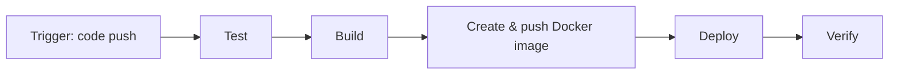

---

## Part 6 — Jenkins vs GitHub Actions

Both are **tools that execute pipelines** — the pipeline's logic itself belongs to neither tool specifically.

| | Jenkins | GitHub Actions |
|---|---|---|
| Type | Self-hosted, **open-source automation server** | Cloud-native CI/CD **built directly into GitHub** |
| Where it runs | You install and maintain your own Jenkins server | Runs on GitHub-hosted (or self-hosted) runners — no separate server needed |
| Configuration | Extensive plugin ecosystem; Groovy-based `Jenkinsfile` pipelines | YAML workflow files inside `.github/workflows/` |
| How it's described | "The leading open-source automation server" — runs a series of steps on code changes, supports complex workflows, easy installation/configuration, extensible via plugins, works across distributed setups | "Makes it easy to automate all software workflows" — helps you build, test, and deploy directly from GitHub; on every `git push`, it can run code reviews, branch management, and full CI/CD |
| Course usage | Introduced conceptually via a walkthrough of `jenkins.io` | Used for the **entire hands-on pipeline build** in this transcript |

---

## Part 7 — Hands-on: Building the GitHub Actions Pipeline

The course builds a real, working workflow for a **Spring Boot (Java/Maven)** microservice, live and iteratively (including fixing failed runs on-camera), then repeats an equivalent pattern for the Node.js and Python services. Below is the fully reconstructed, corrected workflow plus every concept explained along the way.

### 7.1 Core Concepts Introduced

- A **workflow** file lives at `.github/workflows/*.yml` and is triggered by events like `on: push`.
- A workflow contains one or more **jobs**. **Each job runs on a completely fresh runner** — described explicitly as *"a fresh machine that does not have anything, we need to set up things on it."* This is why steps like checking out code and installing the JDK are repeated in **every** job, not shared automatically between them.
- Jobs can be chained with `needs:` — e.g., the Docker build/push job only starts **after** the build-and-test job succeeds; the deploy job only starts after the Docker build/push job succeeds.
- **Reusable Actions** (e.g., `actions/checkout@v4`) are pre-built steps from the GitHub Actions marketplace, used instead of writing raw shell commands for common tasks like checking out code.
- **Secrets** (Docker Hub credentials, AWS credentials) live in the repository's GitHub Secrets settings and are referenced via `${{ secrets.NAME }}` — never hard-coded into the YAML.
- **Debugging is iterative and normal** — the instructor's own live run failed at one point ("docker build push is failed") and was fixed and re-triggered on camera. Reading the GitHub Actions run logs is the standard way to diagnose failures.

### 7.2 Building the Workflow, Step by Step (as demonstrated)

**Job 1 — Build & Test:**
1. `Check out code` → uses `actions/checkout@v4` (need the source before anything else can happen).
2. `Set up JDK` → because building/testing a Java jar requires Java on the fresh runner.
3. `Build and test with Maven` → runs the Maven test command.
4. `Upload test reports` → publishes whatever test reports were generated as build artifacts.

**Job 2 — Docker Build & Push** (depends on Job 1 via `needs: build-test`):
1. `Check out code` again — fresh runner, no shared state with Job 1.
2. `Set up JDK` again — same reason.
3. `Build a jar for Docker` — a fresh production jar (this time skipping tests, since testing already happened in Job 1).
4. `Login to Docker Hub` — authenticate using stored secrets.
5. `Build and push Docker image` — builds the image from the Dockerfile and pushes it to the registry.

**Job 3 — Deploy to AWS EKS** (depends on Job 2):
1. `Check out code`.
2. `Configure AWS credentials` — using stored AWS secrets.
3. `aws eks update-kubeconfig` — points `kubectl` at the target EKS cluster.
4. `kubectl set image` / rollout — swaps the running Deployment's container image to the freshly pushed one and confirms the rollout completed.

### 7.3 Full Reconstructed Workflow YAML

```yaml
name: CI/CD Pipeline

on:
  push:
    branches: [main]

jobs:
  # ---------- JOB 1: Build & Test ----------
  build-test:
    runs-on: ubuntu-latest
    steps:
      - name: Check out code
        uses: actions/checkout@v4

      - name: Set up JDK
        uses: actions/setup-java@v4
        with:
          java-version: '17'
          distribution: 'temurin'

      - name: Build and test with Maven
        run: mvn clean test

      - name: Upload test reports
        uses: actions/upload-artifact@v4
        with:
          name: test-reports
          path: target/surefire-reports/

  # ---------- JOB 2: Docker Build & Push ----------
  docker-build-push:
    runs-on: ubuntu-latest
    needs: build-test          # only runs if build-test succeeds
    steps:
      - name: Check out code
        uses: actions/checkout@v4

      - name: Set up JDK
        uses: actions/setup-java@v4
        with:
          java-version: '17'
          distribution: 'temurin'

      - name: Build jar for Docker
        run: mvn clean package -DskipTests

      - name: Login to Docker Hub
        uses: docker/login-action@v3
        with:
          username: ${{ secrets.DOCKERHUB_USERNAME }}
          password: ${{ secrets.DOCKERHUB_TOKEN }}

      - name: Build and push Docker image
        uses: docker/build-push-action@v5
        with:
          context: .
          push: true
          tags: ${{ secrets.DOCKERHUB_USERNAME }}/myapp:${{ github.sha }}

  # ---------- JOB 3: Deploy to AWS EKS ----------
  deploy-aws-eks:
    runs-on: ubuntu-latest
    needs: docker-build-push   # only runs after image is built & pushed
    steps:
      - name: Check out code
        uses: actions/checkout@v4

      - name: Configure AWS credentials
        uses: aws-actions/configure-aws-credentials@v4
        with:
          aws-access-key-id: ${{ secrets.AWS_ACCESS_KEY_ID }}
          aws-secret-access-key: ${{ secrets.AWS_SECRET_ACCESS_KEY }}
          aws-region: us-east-1

      - name: Update kubeconfig for EKS cluster
        run: aws eks update-kubeconfig --name my-eks-cluster --region us-east-1

      - name: Deploy to Kubernetes
        run: |
          kubectl set image deployment/myapp-deployment \
            myapp=${{ secrets.DOCKERHUB_USERNAME }}/myapp:${{ github.sha }}
          kubectl rollout status deployment/myapp-deployment
```

### 7.4 Multi-Job Dependency Diagram

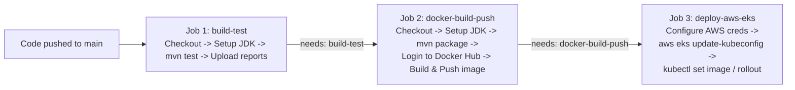

### 7.5 Repeating the Pattern Across Microservices

The same three-job pattern (`build-test` → `docker-build-push` → `deploy-aws-eks`) was **duplicated and adapted** for the Node.js and Python microservices, each with its own workflow file, its own Dockerfile, and its own deployment target — demonstrating the core microservices CI/CD principle: **one repeatable pipeline pattern, applied independently per service**, so each service can be built, tested, and deployed on its own release cadence without needing to touch the others.

---

## Part 8 — Deploying to AWS EKS

**EKS (Elastic Kubernetes Service)** = AWS's managed Kubernetes offering. AWS operates and maintains the **control plane**; you manage the worker nodes and workloads that run on top of it.

### 8.1 Key Commands (used in the deployment jobs and cluster lifecycle)

```bash
# Create an EKS cluster (via eksctl, the standard CLI tool for EKS)
eksctl create cluster --name my-eks-cluster --region us-east-1 --nodes 3

# Point kubectl at the EKS cluster (referred to loosely in speech as
# "cube control" / "cube cuddle" — both refer to kubectl / this command)
aws eks update-kubeconfig --name my-eks-cluster --region us-east-1

# Verify connectivity
kubectl get nodes

# Tear the cluster down completely (control plane + node groups)
eksctl delete cluster --name my-eks-cluster --region us-east-1
```

### 8.2 End-to-End Flow: Code Push → Live on EKS

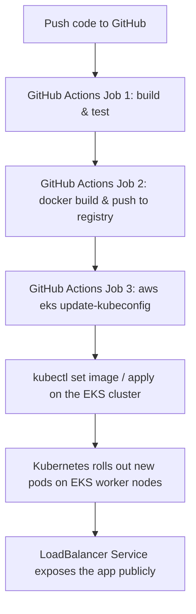

### 8.3 Notes From the Live Deployment Demos
- The same `deploy-aws-eks` job pattern was repeated for **three separate microservices** in the transcript ("hello Spring Boot app," "hello node app," and a Python app), each successfully reaching "deploying to AWS EKS" as the final pipeline stage — reinforcing that this is a **repeatable template**, not a one-off script.
- Job dependencies matter: a deploy job showed as **"not triggered"** at one point in the demo precisely because its upstream `needs:` job hadn't completed successfully yet — a good real-world reminder to check the dependency chain first when a job appears stuck or skipped.
- Cluster teardown was also demonstrated conceptually with `eksctl delete`, explicitly deleting the **control plane and node groups** together, to avoid leaving AWS resources running (and being billed for) after you're done experimenting.

---

## Part 9 — Cloud Platforms: AWS vs Azure vs GCP

The course's philosophy on this (stated explicitly): know the fundamentals of **all three** major providers, and go deep/expert in **one or two** — because switching companies or projects frequently means switching cloud providers, and interviewers/teams expect at least baseline fluency across the ecosystem.

| Capability | AWS | Azure | GCP |
|---|---|---|---|
| Managed Kubernetes | **EKS** (Elastic Kubernetes Service) | **AKS** (Azure Kubernetes Service) | **GKE** (Google Kubernetes Engine) |
| Container Registry | **ECR** | **ACR** (Azure Container Registry) | **Artifact Registry** |
| CLI tool | `aws` CLI + `eksctl` | `az` CLI | `gcloud` CLI |
| Infra-as-Code provider (Terraform) | `aws` provider | `azurerm` provider | `google` provider |

> ⚠️ As flagged in Part 0: only **AWS (EKS + ECR)** were used hands-on in this transcript. Azure and GCP appear only in comparison context — most notably when explaining that Kubernetes' `LoadBalancer` Service type "works best on cloud services like AWS, GCP, Azure," since provisioning a real load balancer requires an actual cloud provider underneath.

---

## Part 10 — Master Command Cheat Sheets

### Docker
```bash
# Verify install
docker --version
docker info
docker compose version

# Run / manage containers
docker run hello-world
docker run <image>
docker run -d <image>
docker run -it <image> sh
docker run -p <host_port>:<container_port> <image>
docker run -d --name <name> -p <host_port>:<container_port> <image>
docker ps
docker ps -a
docker ps -a -q
docker stop <container>
docker exec -it <container> sh
docker exec -it <container> printenv

# Images
docker images
docker images -q
docker pull <image>:<tag>
docker build -t <name>:<tag> .
docker tag <image>:<tag> <dockerhub-username>/<image>:<tag>
docker login
docker push <dockerhub-username>/<image>:<tag>

# Compose
docker compose up
docker compose up -d
docker compose down
```

### Kubernetes (`kubectl`)
```bash
# Context
kubectl config get-contexts
kubectl config use-context docker-desktop

# Nodes / Pods
kubectl get nodes
kubectl get pods
kubectl get pods -w
kubectl describe pod <name>
kubectl exec -it <pod> -- sh
kubectl exec -it <pod> -- printenv
kubectl delete pod <name>

# Deployments / scaling
kubectl get deployments
kubectl scale deployment <name> --replicas=5
kubectl set image deployment/<name> <container>=<image>:<tag>
kubectl rollout status deployment/<name>

# ReplicaSets
kubectl get replicaset
kubectl describe replicaset <name>

# Services
kubectl expose deployment <name> --type=NodePort --port=80
kubectl get svc
kubectl get svc <name>

# Manifests
kubectl apply -f deployment.yaml
kubectl apply -f service.yaml
kubectl apply -f configmap.yaml
kubectl apply -f secret.yaml
```

### AWS EKS
```bash
eksctl create cluster --name <cluster> --region <region> --nodes <n>
aws eks update-kubeconfig --name <cluster> --region <region>
kubectl get nodes
eksctl delete cluster --name <cluster> --region <region>
```

---

## Part 11 — Complete Glossary

| Term | Definition |
|---|---|
| **DevOps** | A culture/practice unifying Development and Operations to automate and streamline software delivery — not a tool |
| **CI (Continuous Integration)** | Automatically building & testing code on every change, ending in a software artifact |
| **CD (Continuous Delivery/Deployment)** | Automatically deploying/releasing the built artifact |
| **Software Artifact** | A ready-to-deploy packaged build output (e.g., a Docker image or `.jar` file) |
| **Pipeline** | The ordered, automated combination of logic, steps, and flow taking code from commit to deployment — not a tool itself |
| **Infrastructure as Code (IaC)** | Defining and provisioning infrastructure via machine-readable code instead of manual console clicks |
| **Docker** | Open-source platform automating deployment/scaling/management of apps via containerization |
| **Containerization** | Lightweight virtualization technology packaging an app + dependencies into a standard "container" unit |
| **Docker Image** | A read-only, layered blueprint/template defining a container's contents |
| **Docker Container** | A running instance of a Docker image |
| **Dockerfile** | The instructions file used to build a Docker image |
| **Image Layer** | A cached, reusable slice of an image that speeds up rebuilds and saves storage |
| **Docker Tag** | A version label attached to an image (`name:tag`), e.g. `myapp:v2` |
| **Docker Registry** | A remote storage/distribution service for images (Docker Hub, ECR, ACR, Artifact Registry) |
| **Docker Engine** | The collective runtime: Docker Daemon + Docker API + Docker CLI |
| **Docker Daemon** | The "heart" of Docker — does the actual work of managing images/containers |
| **Docker API** | Internal messenger between the CLI and the Daemon |
| **Docker CLI** | The command-line tool you type Docker commands into |
| **Docker Compose** | Tool to define & run multi-container applications via one YAML file |
| **Virtual Machine (VM)** | A software-emulated "separate computer inside your computer," with its own full guest OS, managed by virtualization software |
| **Hypervisor** | The software layer that creates/manages VMs (e.g., Hyper-V) |
| **Kubernetes (K8s)** | A container orchestration platform that manages containers at scale — automated deployment, scaling, healing, networking |
| **Container Orchestration** | Automatically managing many containers across many machines: running, scaling, networking, healing |
| **Pod** | The smallest deployable unit in Kubernetes — a container wrapped in a Kubernetes layer |
| **Node** | A machine (VM/physical) that runs Kubernetes pods |
| **Cluster** | A set of nodes managed together by Kubernetes |
| **Deployment** | A Kubernetes object that runs your app continuously and manages Pods/ReplicaSets to match a desired state |
| **ReplicaSet** | Ensures the desired number of pod replicas are always running; recreates crashed pods |
| **Service** | Gives pods a stable network identity; types: ClusterIP, NodePort, LoadBalancer, ExternalName |
| **ClusterIP** | Service type exposing an app only inside the cluster — for internal microservice-to-microservice traffic |
| **NodePort** | Service type exposing an app via `<NodeIP>:<Port>` (30000–32767) — good for local testing/learning |
| **LoadBalancer** | Service type provisioning a real cloud load balancer with a public IP/DNS — for production traffic |
| **ExternalName** | Service type mapping to an external DNS name — for reaching outside DBs/APIs from inside the cluster |
| **ConfigMap** | Kubernetes object storing non-sensitive configuration |
| **Secret** | Kubernetes object storing sensitive configuration (e.g., type `Opaque`, base64-encoded) |
| **kubectl** | CLI tool to interact with a Kubernetes cluster's API server — does not itself run/host a cluster |
| **Context (kubectl)** | Which cluster/credentials `kubectl` is currently pointed at — a common source of "empty output" confusion |
| **Jenkins** | Open-source, self-hosted CI/CD automation server |
| **GitHub Actions** | GitHub's native CI/CD platform, defined via YAML workflows in `.github/workflows/` |
| **Runner** | The fresh, temporary virtual machine that executes a CI/CD job — no shared state between jobs by default |
| **`needs:`** | GitHub Actions keyword creating a dependency so one job only runs after another succeeds |
| **GitHub Secrets** | Encrypted credentials referenced in workflows via `${{ secrets.NAME }}`, never hard-coded |
| **EKS / AKS / GKE** | AWS / Azure / GCP's respective managed Kubernetes services |
| **ECR / ACR / Artifact Registry** | AWS / Azure / GCP's respective native container registries |
| **`eksctl`** | The standard CLI tool for creating/deleting AWS EKS clusters |
| **Monolith** | A single, unified application codebase deployed as one unit |
| **Microservices** | An architecture of multiple independently deployable, independently scalable services |
| **Port Mapping** | Docker's `-p hostPort:containerPort` mechanism forwarding a host port into a container's internal port |
| **Detached Mode (`-d`)** | Running a Docker container in the background, freeing the terminal |
| **Terraform** | Infrastructure-as-Code tool for provisioning cloud infrastructure via code *(mentioned as course scope, not hands-on in this transcript)* |

---

## Part 12 — How to Use These Notes for Revision

1. **Docker (Part 2):** Re-run every command in Sections 2.6–2.17 against a throwaway app of your own. Don't skip the `nginx` port-mapping demo — it's the concept most people think they understand but actually don't until they've broken it once (try running `nginx` *without* `-p` first and observe the failure, exactly as the course does).
2. **Kubernetes (Part 4):** Reproduce the full Section 4.6 walkthrough end-to-end locally: deploy → expose via NodePort → access in browser → delete a pod and watch it self-heal → scale to 5 replicas and watch it happen live with `-w`. This single sequence covers 80% of the "why Kubernetes" intuition.
3. **ConfigMaps/Secrets (4.8):** Write your own `configmap.yaml` and `secret.yaml`, apply them, and use `kubectl exec ... -- printenv` to prove the values landed inside the pod — don't just read the YAML, verify it.
4. **CI/CD (Parts 5–8):** Recreate the exact three-job GitHub Actions workflow in Section 7.3 against your own free GitHub + Docker Hub accounts before attempting the AWS EKS portion (which incurs real AWS costs) — get Jobs 1 and 2 fully green first.
5. Use **Part 10** as a quick-reference cheat sheet during hands-on practice, and **Part 11** to self-test your recall of every term cold, out of context.
