# Full Stack AI DevOps Masterclass — Complete Revision Notes (Expanded Edition)

> Comprehensive revision notes covering Docker, Kubernetes, Microservices, CI/CD with GitHub Actions, and AWS EKS deployment. Includes all commands, YAML/Dockerfile snippets, comparison tables, diagrams, source code, and detailed explanations needed for deep revision.

---

## 📑 Table of Contents

- [Part 0 — Scope & How This Course Is Structured](#part-0--scope--how-this-course-is-structured)
- [Part 1 — The DevOps Mindset](#part-1--the-devops-mindset)
- [Part 2 — Docker: The Complete Deep Dive](#part-2--docker-the-complete-deep-dive)
  - [2.24 VS Code Setup & Docker Extension](#224-vs-code-setup--docker-extension)
  - [2.25 Course GitHub Repository Structure](#225-course-github-repository-structure)
  - [2.26 Containerizing a Python App](#226-containerizing-a-python-app--full-walkthrough)
  - [2.27 Containerizing a Node.js App](#227-containerizing-a-nodejs-app--full-walkthrough)
  - [2.28 Containerizing a Spring Boot App](#228-containerizing-a-spring-boot-app--full-walkthrough)
  - [2.29 .dockerignore](#229-dockerignore--excluding-files-from-the-build-context)
  - [2.30 docker run -it Interactive Mode](#230-docker-run--it--interactive-terminal-mode)
- [Part 3 — Monolith vs Microservices](#part-3--monolith-vs-microservices)
  - [3.1 The Tax Calculator Microservices Project](#31-the-tax-calculator-microservices-project)
- [Part 4 — Kubernetes: The Complete Deep Dive](#part-4--kubernetes-the-complete-deep-dive)
  - [4.2.1 History: Borg → Kubernetes](#421-history-of-kubernetes--from-googles-borg-to-open-source)
  - [4.2.2 Architecture: Control Plane & Worker Nodes](#422-kubernetes-architecture--control-plane--worker-nodes)
  - [4.10 Labels, Selectors, and How Services Find Pods](#410-labels-selectors-and-how-services-find-pods)
  - [4.11 Debugging Pods](#411-debugging-pods--essential-commands)
  - [4.12 Writing Kubernetes YAML Manifests](#412-writing-kubernetes-yaml-manifests--from-command-line-to-files)
  - [4.13 Deploying Microservices (Tax Calculator)](#413-deploying-microservices-to-kubernetes--tax-calculator-hands-on)
- [Part 5 — CI/CD Concepts](#part-5--cicd-concepts)
- [Part 6 — Jenkins vs GitHub Actions](#part-6--jenkins-vs-github-actions)
- [Part 7 — Hands-on: Building the GitHub Actions Pipeline](#part-7--hands-on-building-the-github-actions-pipeline)
- [Part 8 — Deploying to AWS EKS](#part-8--deploying-to-aws-eks)
- [Part 9 — Cloud Platforms: AWS vs Azure vs GCP](#part-9--cloud-platforms-aws-vs-azure-vs-gcp)
- [Part 10 — Master Command Cheat Sheets](#part-10--master-command-cheat-sheets)
- [Part 11 — Complete Glossary](#part-11--complete-glossary)
- [Part 12 — How to Use These Notes for Revision](#part-12--how-to-use-these-notes-for-revision)

---

## Part 0 — Scope & How This Course Is Structured

This is a **"Full Stack AI DevOps Masterclass with Microservices"** — a ~40-hour Udemy course. The title breaks down as:

- **"Full Stack"** → the course teaches DevOps for **full-stack applications** (frontend + backend), not just backend services.
- **"AI"** → not a marketing buzzword (his words) — the course includes **AI-assisted DevOps strategies** to accelerate your workflow, in addition to the core DevOps content.
- **"DevOps Masterclass"** → aimed at **both** DevOps engineers and developers who want to understand DevOps — designed for **absolute beginners**, starting from "What is DevOps?" with zero assumed knowledge of Docker, Kubernetes, IaC, or cloud.
- **"Microservices"** → the hands-on project used throughout is a **microservices-based, production-style application** (with separate Node.js, Python, and Spring Boot/Java services), not a single monolith.

**Curriculum order:**
DevOps mindset → Docker (containerize monolith *and* microservices) → Kubernetes (local, then cloud) → Infrastructure as Code with Terraform → AWS + Azure + GCP → CI/CD with Jenkins and GitHub Actions.

**What is covered in hands-on depth**, hour by hour:

| Time range | Topic actually covered in depth |
|---|---|
| 0:00 – 0:22 | Intro, resources (GitHub repo with `main`/`working` branches), what DevOps is, why it emerged |
| 0:22 – 4:20 | **Docker** — VMs vs containers, architecture, terminology, installation, `docker run`/`ps`/`stop`/`exec`/`pull`/`tag`/`build`/`push`, Dockerfile authoring, Docker Compose, Docker registries (very detailed, fully hands-on) |
| 4:20 – 7:00 | **Kubernetes** — the orchestration problem, architecture, local cluster setup, Pods/Deployments/ReplicaSets, Services (all 4 types), scaling, self-healing, ConfigMaps/Secrets, `kubectl` (detailed, hands-on) |
| 7:00 – 7:20 | **CI/CD theory** — what CI/CD is, pipeline anatomy, software artifacts |
| 7:20 – 11:31 | **GitHub Actions hands-on** — building real multi-job workflows (build → test → dockerize → push) for Node.js/Python/Spring Boot microservices, then **deploying to AWS EKS** |

> ⚠️ **Honest scope note:** Terraform, Azure AKS, and GCP GKE are referenced only in marketing/overview statements ("we also cover Terraform, AWS, Azure, GCP") — this transcript contains **no hands-on `terraform init/plan/apply` demo** and **no AKS/GKE walkthrough**. If your full course has separate video files for those modules, they are not part of this transcript and therefore not part of this document. Everything below is a faithful, technically corrected, and substantially expanded rewrite of what **is** actually taught here.

---

## Part 1 — The DevOps Mindset

### 1.1 Formal Definition
> "DevOps is a way of building and operating software where development and operations work together, with shared responsibility, to ship features faster, safer, and more reliably — with heavy use of automation."

**DevOps is *not* a tool.** Docker, Kubernetes, CI/CD, Terraform — these are tools. DevOps itself is a **culture, a practice, and a workflow** that brings shared ownership across the software lifecycle: **plan → build → deploy → test → operate → improve.**

### 1.2 Before DevOps: Two Separate Teams

| Team | Responsibility | Typical response when something breaks |
|---|---|---|
| **Development Team** | Write code, add features, push changes to a shared version-control system (Git/GitHub/Bitbucket) | *"It works on my machine."* |
| **Operations Team** | Run servers, handle deployments, fix production outages (often at midnight) | *"Your code is unstable."* |

This structural split — code thrown "over the wall" from Dev to Ops — created five concrete, named problems:

| # | Problem | What it actually looked like |
|---|---|---|
| 1 | **Slow releases** | New features took a long time to reach production because Ops needed time to deploy manually; developers couldn't ship as frequently as they wanted. |
| 2 | **The blame game** | When something failed in prod, Ops blamed the developer's code; developers blamed Ops' deployment. No shared context, no shared accountability. |
| 3 | **Manual deployments = high risk** | Ops copied files to servers by hand and restarted servers manually. Example given: a missing `.env` file (environment variable file) caused a production outage because Ops deployed the wrong config manually. |
| 4 | **No feedback loop to developers** | Developers shipped features but had no visibility into error rates, latency, or real-world performance — they were purely in "build mode." |
| 5 | **Inconsistent environments** | A developer's machine (e.g., Python 3.10) didn't match staging/production (e.g., Python 3.8) — the developer's setup never truly simulated production. |

### 1.3 How DevOps Fixed This — 5 Concrete Shifts

DevOps made the flow from developer machine → production **automated, predictable, and monitored**, via five changes:

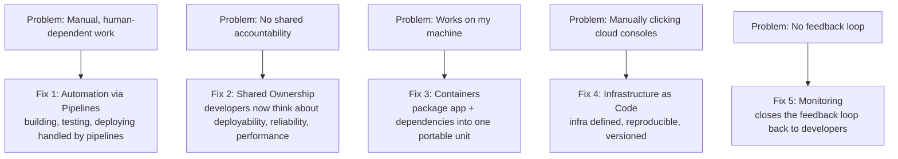

1. **Automation replaces manual work.** Instead of humans building/testing/deploying by hand, **pipelines** do this job. Example given: a retail company wanting to deploy backend services 5+ times a day can only do this because it's automated — no operations engineer has to manually execute each release.
2. **Shared ownership.** With automation in place, backend engineers get pulled into deployment concerns. Developers start thinking about deployability, reliability, error rates, and performance — not just "does it compile."
3. **Containers eliminate "works on my machine."** A container packages the application code + all its dependencies + everything it needs to run into one lightweight, portable unit that behaves identically anywhere. *(This is the direct bridge into the Docker module.)*
4. **Infrastructure as Code (IaC) makes infrastructure reproducible.** Instead of manually clicking through an AWS/Azure/GCP dashboard to create servers/networks (and forgetting steps), you define infrastructure **in code**. Running that code recreates the infrastructure exactly, every time — and destroying/recreating environments becomes trivial.
5. **Monitoring closes the feedback loop.** Developers — not just an "infra team" — now get visibility into how their code behaves in production.

### 1.4 Summary Mental Model
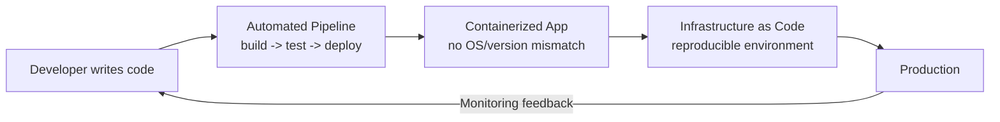

---

## Part 2 — Docker: The Complete Deep Dive

This is the most detailed topic (roughly 4 hours). It starts with a narrative scenario before ever touching a command — included here in full because it's the mental model everything else builds on.

### 2.1 The Problem, Told as a Story: Sarah and John

Two developers, **Sarah** and **John**, work on the same codebase in a shared development environment (a Git-based remote like GitHub/Bitbucket). Their application has dependencies with specific version numbers (as any Python, Java, or Node app would).

One day, **John updates the version of a library** and pushes the change to the shared repository. **Sarah pulls the change** — and her local environment suddenly breaks. Why? Because of a **version conflict / compatibility problem** between what's installed on Sarah's machine and what John's updated code now expects. The bug is also *hard to reproduce* precisely because it stems from environment differences, not logic errors.

**The core insight:** the exact same piece of code works on one developer's machine and fails on another's — purely because of environment drift.

**The Docker fix:** Sarah's team decides to **containerize the application**. Instead of a shared environment that only holds *source code*, they now share a **container** that holds the application code **plus** its dependencies **plus** the exact required environment configuration — everything the app needs to run, bundled together. Now, whatever John changes gets baked into the container image itself; when Sarah pulls the updated container, she gets the *exact* same runtime environment John used. If it works on John's machine, it is now structurally guaranteed to work on Sarah's, because they're no longer running "their own installed dependencies" — they're running the same packaged unit.

### 2.2 Formal Definition of Docker

> **Docker** is an open-source platform that automates the deployment, scaling, and management of applications using **containerization** — a lightweight virtualization technology that packages an application and its dependencies into a standard unit called a **container**.

A container can bundle:
- Application code
- The runtime environment the app needs
- All required libraries
- Necessary system tools

Containers are **portable** and run identically on any system that supports Docker — which is precisely what eliminates the "works on my machine" phrase.

### 2.3 Docker vs Virtual Machines — The Concept Beginners Most Confuse

One of the most important distinctions to internalize.

**What is a Virtual Machine (VM)?**
A VM is like **a separate computer inside your computer** — a software emulation of a physical machine, created and managed by **virtualization software** (VMware, VirtualBox, Hyper-V). Each VM gets its own **virtual hardware**: its own CPU allocation, memory, storage, and network interfaces, and can run its own operating system (Windows, Linux, macOS) completely independently of the others and of the host.

*Example:* On a machine with 16 GB RAM, you could create 2 VMs and allocate 5 GB RAM to each; each VM operates strictly within its allotted resources, in full isolation from the others — it's like buying separate physical computers, except you don't have to.

**VM Architecture:**
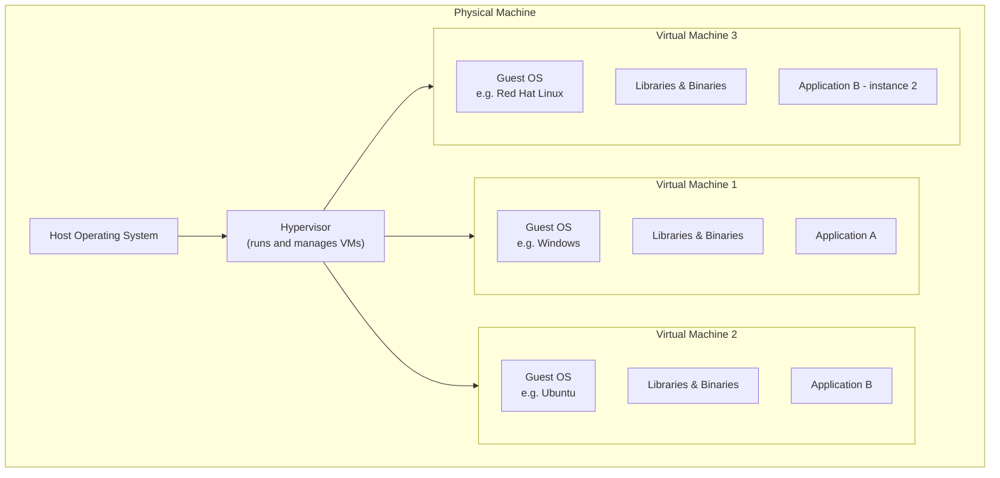
Key point: **each VM carries a full copy of a guest OS**, even though the application itself might only need 2–3 specific components from that OS, not the whole thing. That full OS copy is what makes VMs heavy.

**Docker's Architecture, by contrast:**
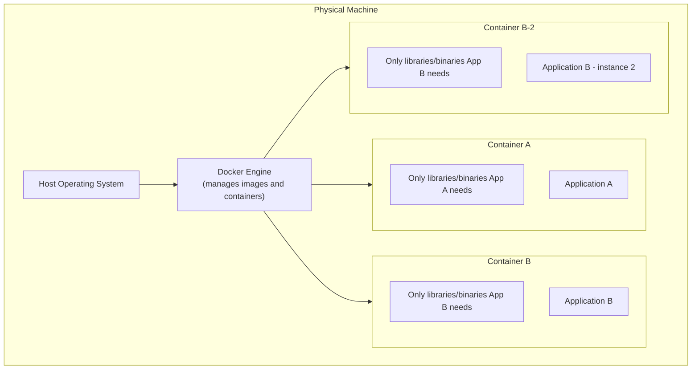
Docker containers **do not carry a full guest OS** — they share the host machine's OS **kernel** and only package the specific libraries/binaries the application actually needs. This is exactly why containers are dramatically lighter than VMs, start almost instantly, and let you run many more of them on the same hardware.

**Full Comparison Table:**

| Dimension | Virtual Machines | Docker Containers |
|---|---|---|
| Size | Large, resource-intensive | Lightweight |
| Startup time | Slow (full OS boot required) | Near-instant (no OS boot) |
| Resource utilization | High | Low / efficient |
| Isolation | Strong — full hardware-level isolation between VMs | Isolated, but containers **share the host OS kernel** |
| Portability | Portable, but needs OS compatibility | Highly portable, independent of host OS specifics |
| Scalability | Scaling = provisioning entire new VMs | Scaling = just spinning up more lightweight containers |
| Ecosystem | VM-specific tools & management frameworks | Docker ecosystem & tooling |
| Dev workflow | Slower setup/provisioning | Faster setup, better dependency management |
| Deployment efficiency | Heavier overhead due to VM size | Efficient — smaller container size |

**Why choose Docker over VMs (the four reasons given):**
1. **Efficiency** — lightweight, uses fewer resources.
2. **Portability** — runs across any machine supporting the Docker ecosystem.
3. **Speed** — containers start and stop much faster.
4. **Isolation** — still provides solid isolation between workloads without the overhead of separate OS instances.

### 2.4 Docker Terminology — The Full Mental Model

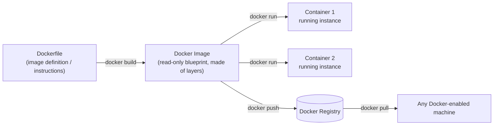

| Term | Explanation |
|---|---|
| **Docker Image** | A **template/blueprint** that defines what a container should contain and how it should run — lightweight and **read-only**. |
| **Docker Container** | A **running instance** of an image — this is where your application actually executes. **One image can spin up many containers.** |
| **Dockerfile** | The **instructions file** — a text file containing the step-by-step instructions used to *build* a Docker image. It defines the image because "that definition has to be defined somewhere," and different applications (Node.js vs Spring Boot vs Python) need different instructions. |
| **Image Layer** | Every image is made of multiple stacked layers. Layers exist for three reasons: **(1)** rebuilds are faster because a layer can be **cached**, **(2)** this improves build performance, and **(3)** if multiple images share similar layers, Docker reuses them, **reducing storage space**. |
| **Docker Registry** | A **remote storage service for images** — conceptually identical to why you push source code to GitHub instead of keeping it only on your laptop: backup, team access, and availability. Moving an image from your local machine to a registry is called a **push**; bringing one down is a **pull**. |
| **Docker Tag** | A **version label** attached to an image, e.g. `myapp:dev`, `myapp:prod`, `myapp:v2`, `myapp:latest`. If you don't specify a tag, Docker defaults to `latest`. |
| **Docker Engine** | The **runtime that manages containers** — composed of three sub-components (Daemon, API, CLI), detailed next. |

### 2.5 Docker Architecture — Daemon, API, CLI, and Engine


| Component | Role |
|---|---|
| **Docker Daemon (`dockerd`)** | The **heart of Docker** — actually does all the real work: managing images and containers, starting/stopping containers, building images, and pulling/pushing to/from the registry. |
| **Docker API** | Allows the CLI to send requests to the Daemon. It's exposed **internally only** (not externally accessible) — it acts as the messenger between CLI and Daemon. |
| **Docker CLI** | The **command-line interface** you actually type commands into. Your commands are intercepted by the CLI → passed to the API → communicated to the Daemon → the Daemon performs the action. |
| **Docker Engine** | The collective name for **CLI + API + Daemon** running together on the **Host OS**. The Host OS is what allocates CPU, memory, networking, and file-system resources to Docker. |

When running Docker **remotely on a cloud provider**, the same stack exists inside a virtual machine there: Machine → Host OS → Docker Engine → (Libraries/Binaries + your app, packaged into one or more running containers).

### 2.6 Installing Docker Desktop (Step-by-Step, All Platforms)

1. Go to **docker.com** → *Get Started* → *Docker Desktop* (the recommended, easiest path onto any machine).
2. **Choose your platform:**
   - **macOS:** Choose **Apple Silicon** or **Intel** build depending on your chip; minimum **4 GB RAM**; you get a `.dmg` file — open it and drag Docker into Applications.
   - **Windows:** Choose between **x86_64 (AMD64)** and **ARM64** builds. *How to check which one you have:* Settings → System → About → scroll to **Device specifications** → check "System type" (e.g., "x64-based processor" = get the AMD64/x64 build). Run the downloaded `.exe`; during install, keep **"Use WSL 2 instead of Hyper-V (recommended)"** checked; a desktop shortcut is optional.
   - **Linux:** Follow platform-specific instructions (Ubuntu, Debian, Fedora, Arch each have their own install command sequence documented on Docker's site).
3. Launch Docker Desktop for the first time → accept the **Subscription Service Agreement**.
4. **Create a free Docker account** (recommended, not mandatory to start) — you will need one later to `docker push` images to Docker Hub, since pushed images get registered against your username.
5. **Always keep Docker Desktop running** in the background whenever you intend to run Docker commands — if it's closed, all `docker` CLI commands will fail.

### 2.7 Verifying the Installation

```bash
docker --version          # prints installed Docker version + build number
docker info                # prints full Docker Engine information (client version, etc.)
docker compose version     # verifies Docker Compose is bundled and working
```
All three working confirms Docker Desktop has correctly installed **Docker Engine + Docker CLI + Docker Compose** together, on Windows, Mac, or Linux alike.

### 2.8 Your First Container — the `hello-world` Walkthrough

```bash
docker run hello-world
```

What happens, step by step (this exact sequence is printed by the image itself and explained live):
1. The **Docker Client** (CLI) contacts the **Docker Daemon**.
2. The Daemon looks for the `hello-world:latest` image **locally** — since a tag isn't specified, Docker defaults to the `latest` tag.
3. Not found locally → the Daemon **pulls** the image from **Docker Hub** (the default registry) — this is the "unable to find image locally" message.
4. The Daemon **creates a new container** from that image, which runs the executable that prints the "Hello from Docker!" message.
5. The Daemon **streams that output** back to the Client, which prints it to your terminal.

**Run it a second time**, and you'll see it skip the download step entirely — the image is now cached locally, so Docker goes straight to creating a container. Run it multiple times and you get **multiple containers** from the **same single image** — proving images are reusable blueprints and containers are disposable running instances of them.

In **Docker Desktop's GUI**, you can inspect this directly:
- **Images tab:** shows the image, its **Image ID**, size, creation date, and a green dot if a container is currently using it (grey/black dot = unused).
- **Containers tab:** shows each container's status (running / exited), its ID, the image it came from, and gives you Start/Stop/Logs actions directly from the UI.

### 2.9 Running a Real Web Server — the Nginx + Port Mapping Deep Dive

`nginx` is an open-source web server / reverse proxy that serves a web page — used here specifically because it lets you *see* something in a browser, which makes container concepts concrete.

**Attempt 1 (fails on purpose, to teach the concept):**
```bash
docker run nginx
```
This pulls and runs nginx, which starts serving its welcome page **on port 8080 inside the container**. But visiting `http://localhost:8080` in your browser **fails** — because that port only exists *inside* the container's own private network namespace; nothing on your host machine is listening there.

**Why it fails — the mental model:**
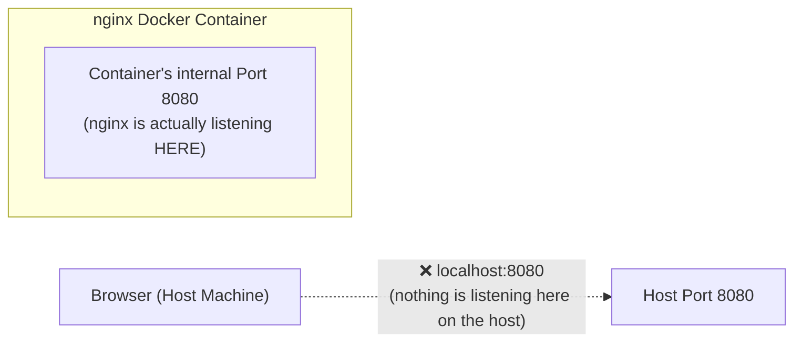

**Attempt 2 (fixed with port mapping):**
```bash
docker run -p 80:8080 nginx
```
Now visiting `http://localhost:80` (or just `localhost`) works — the nginx welcome page renders.

**The `-p` flag explained:** `-p <host_port>:<container_port>` maps a port on your **host machine** to a port **inside the container**. Any request that hits the host port is automatically forwarded into the container's internal port. Format: `-p hostPort:containerPort`. This is one of the most frequently used Docker flags — a Node.js app running on container port 3000, or a Spring Boot app on container port 8080, will both need this kind of mapping to be reachable from your machine.

### 2.10 Detached Mode & Naming Containers

By default, `docker run nginx` **occupies your terminal** — closing the terminal stops the container, and you see a continuous stream of logs.

```bash
docker run -p 80:8080 -d nginx
```
The `-d` (**detached**) flag runs the container in the background, freeing your terminal, and immediately returns the **container ID**. Logs are still viewable anytime via the Docker Desktop UI or `docker logs`.

```bash
docker run -d --name my-nginx -p 80:8080 nginx
```
The `--name` flag assigns a human-readable name instead of Docker's randomly generated one (e.g., "sleepy_lovelace"). **Container names must be unique** — trying to reuse a name that's still active throws an error; you'd need to stop/remove the existing one first or pick a new name.

> 💡 Some containers (like `hello-world`) are **designed to run once and exit automatically**. Others (like `nginx`, a web server) are **designed to run continuously** until you explicitly stop them.

### 2.11 Container Lifecycle Stages — Create, Start, Stop, Restart, Remove

A container doesn't just "run" — it moves through **five distinct lifecycle stages**:

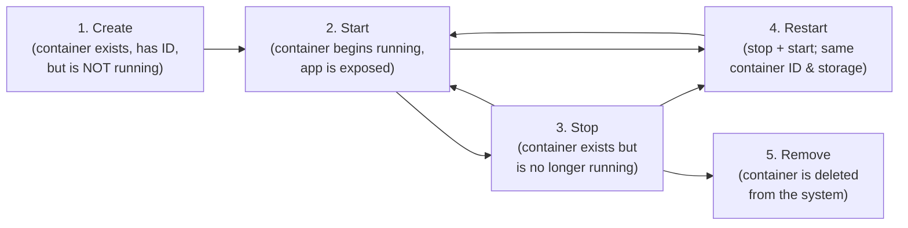

| Stage | What happens | Key detail |
|---|---|---|
| **Create** | Container gets created with a dedicated container ID, but it is **not running yet** — it is only configured to start | The container exists, the ID is assigned, but the application inside is not executing |
| **Start** | The container begins running — whatever is inside the container is exposed based on how you configured it | The application is now live and serving requests |
| **Stop** | The container stops running but **is not deleted** — the container ID is still assigned and the container can be started again | The container still exists on disk; it simply isn't executing |
| **Restart** | The container is stopped and then started again — the **container ID remains the same** and any storage the container uses is preserved | Useful when you need to refresh the container without destroying it |
| **Remove** | The container is **deleted from the system entirely** — gone | Different from stop: stop preserves the container; remove destroys it |

**Hands-on commands for each lifecycle stage:**
```bash
# 1. CREATE — container is created but NOT running
docker create --name app-1 -p 3000:3000 <image>
# Returns a container ID; container is visible in Docker Desktop but not running

# 2. START — start an already-created (or previously stopped) container
docker start app-1
# The container is now running; verify with docker ps

# 3. STOP — stop a running container (container still exists)
docker stop app-1
# docker ps shows nothing; docker ps -a still shows app-1 with status "Exited"

# 4. RESTART — stop + start in one command (same container ID & storage)
docker restart app-1
# Container ID remains the same; useful for applying config changes

# 5. REMOVE — delete the container from the system entirely
docker stop app-1          # must stop first, or use -f
docker rm app-1            # container is now gone
# OR: force-remove a running container without stopping first
docker rm -f app-1
```

**`docker run` vs `docker start` — the distinction most beginners miss:**

| Command | What it does |
|---|---|
| `docker run` | **Creates a new container from an image AND starts it** — it is the combination of `docker create` + `docker start` in a single command |
| `docker start` | **Only starts (or restarts) a previously created or stopped container** — it does NOT create a new container |

> 💡 **Why would you use `docker create` separately instead of just `docker run`?** For advanced workflows or CI/CD pipelines where you need to create and configure a container before running it — e.g., create the container, do something with it (inspect, inject config), and *then* start it.

### 2.12 Container IDs — Full vs Short, and How Docker Allows Shortcuts

Every container is assigned a **SHA-256 hash** as its unique identifier. The full container ID is very long (64 characters), but Docker displays and accepts **shortened versions** for convenience:

- When you run `docker run`, the **full container ID** is printed (64 chars)
- When you run `docker ps`, Docker shows a **shortened version** (typically 12 characters)
- In commands like `docker logs`, `docker stop`, `docker exec`, you can use **any unique prefix** — even just the first 3 characters, as long as they uniquely identify one container
- You can also use the **container name** instead of the ID in all commands

```bash
# All of these are equivalent if "e55" uniquely identifies your container:
docker logs e55abc123def4567890abcdef1234567890abcdef1234567890abcdef12345678   # full ID
docker logs e55abc123def   # short ID (as shown by docker ps)
docker logs e55             # first 3 characters (if unique)
docker logs my-container    # container name
```

> ⚠️ If multiple containers share the same prefix (e.g., two containers starting with "e55"), Docker will return an error — you'll need to use more characters to disambiguate.

### 2.13 Running Multiple Containers From the Same Image

```bash
docker run -d --name nginx-1 -p 80:8080 nginx
docker run -d --name nginx-2 -p 8081:8080 nginx
docker run -d --name nginx-3 -p 8082:8080 nginx
```
This proves you can spin up **many containers from a single image**, each independently mapped to a different host port (`localhost:80`, `localhost:8081`, `localhost:8082` are all simultaneously live, separate instances) — while `localhost:8083` (unmapped) correctly shows nothing.

### 2.12 Practice Images

Three demo images are available on Docker Hub for practice, one per backend language, each printing a "hello" message plus the container ID and any injected environment variables:

| Image | Language | Notes |
|---|---|---|
| `<username>/hello-node` | Node.js | Practice pulling, running, port-mapping |
| `<username>/hello-python` | Python | Runs on port 3000 inside the container by default |
| `<username>/hello-spring` | Java / Spring Boot | Runs on port 8080 inside the container by default |

Exercise pattern: `docker pull <image>` → `docker run -d -p <host>:<container> --name <name> <image>` → visit the mapped `localhost` port → observe the JSON/text response including the container ID and any env vars (or "no env set" if none were passed).

### 2.15 Docker Logs — Viewing, Following, and Filtering Container Output

The `docker logs` command lets you view what's happening inside a container **without** getting inside it — crucial for debugging.

```bash
# Basic log viewing (prints logs generated up to this point, then exits)
docker logs <container_id_or_name>

# Follow logs LIVE (like tail -f) — logs stream in real time
docker logs -f <container_id_or_name>

# Show only the last N lines
docker logs --tail 10 <container_id_or_name>

# Show timestamps alongside each log line
docker logs -t <container_id_or_name>

# Show logs generated in the last N minutes
docker logs --since 20m <container_id_or_name>
```

| Flag | What it does |
|---|---|
| (none) | Prints all logs generated so far, then exits — does **not** follow live |
| `-f` | **Follow** — streams logs in real time as they're generated; the terminal stays attached (press Ctrl+C to stop following without stopping the container, provided the container runs in detached mode) |
| `--tail <N>` | Shows only the last N log lines |
| `-t` | Adds **timestamps** to each log line |
| `--since <duration>` | Shows logs generated within the last duration (e.g., `10m`, `1h`, `30s`) |

> 💡 Without `-f`, `docker logs` is a one-shot snapshot — if new logs are generated after you run the command, you won't see them unless you run the command again or use `-f`.

### 2.16 Debugging Containers — `docker logs` vs `docker exec`

These are **two complementary debugging skills** that every developer and DevOps engineer must master:

| Tool | When to use | What it helps diagnose |
|---|---|---|
| `docker logs` | When you want to see what happened inside the container **without entering it** | Application crashes, error messages, stack traces, warnings, startup failures |
| `docker exec -it <container> sh` | When you need to **get inside** the container and inspect/run commands interactively | Wrong environment variables, missing configuration files, missing dependencies, permission issues, wrong working directory, app output not visible in logs |

**Practical debugging examples with `docker exec`:**
```bash
# Check if a specific environment variable is set correctly
docker exec -it <container> sh
printenv | grep DB_PASSWORD

# Check installed language version (e.g., is it the right Python/Java?)
python --version
java -version

# Check if a specific file exists
ls -la /app/config.yml

# Exit the container shell
exit
```

### 2.17 Core Inspection & Lifecycle Commands

| Command | What it does |
|---|---|
| `docker ps` | Lists **running** containers only |
| `docker ps -a` | Lists **all** containers (running + stopped/"exited") |
| `docker ps -a -q` | Lists only container **IDs** (`-q` = quiet) — useful for scripting bulk operations |
| `docker stop <name_or_id>` | Gracefully stops a running container (you can use either its name or its ID) |
| `docker start <name_or_id>` | Starts a previously created or stopped container |
| `docker restart <name_or_id>` | Stops and restarts a container (same ID and storage preserved) |
| `docker rm <name_or_id>` | Removes (deletes) a stopped container; use `-f` to force-remove a running container |
| `docker images` | Lists all locally cached images |
| `docker images -q` | Lists only image IDs |
| `docker rmi <image_id_or_name>` | Removes an image; fails if the image is used by a container (use `-f` to force) |
| `docker pull <image>:<tag>` | Downloads an image **without** running it |
| `docker logs <container>` | View container logs (add `-f` to follow live, `--tail N` for last N lines) |
| `docker exec -it <container> sh` | Opens an **interactive shell inside a running container** — crucial for debugging |
| `docker exec -it <container> printenv` | Lists environment variables **as seen from inside the container** |

**Why `docker exec` matters:** it lets you step *inside* a live container as if you'd SSH'd into a tiny standalone machine — useful for checking whether an environment variable was correctly injected, inspecting files, or debugging why an app isn't behaving as expected.

### 2.18 Cleanup Commands — Pruning Containers, Images, and Everything

Over time, stopped containers and unused images accumulate and consume disk space. Docker provides dedicated cleanup commands:

```bash
# Remove all STOPPED containers (prompts for confirmation)
docker container prune

# Remove all unused IMAGES (images not associated with any container)
docker image prune

# Nuclear option: remove ALL stopped containers, unused networks,
# unused images, and all build cache in one command
docker system prune -a
```

**Bulk removal commands (combining commands):**
```bash
# Remove ALL containers (running + stopped) — force flag required for running ones
docker rm -f $(docker ps -aq)

# Remove ALL images — force flag required if images are in use
docker rmi -f $(docker images -q)
```

| Command | What it removes |
|---|---|
| `docker container prune` | All **stopped** containers |
| `docker image prune` | All **unused** images (not associated with any container) |
| `docker system prune -a` | All stopped containers + unused networks + unused images + all build cache |
| `docker rm -f $(docker ps -aq)` | **All** containers (running + stopped), using the IDs from `docker ps -aq` |
| `docker rmi -f $(docker images -q)` | **All** images, using the IDs from `docker images -q` |

> ⚠️ You cannot remove an image if a container (even a stopped one) is using it — you must remove the container first, or use the `-f` (force) flag.

### 2.19 Writing Your Own Dockerfile & Building an Image

**The build workflow:**
```bash
# 1. Build an image from the Dockerfile in the current directory ('.' = build context)
docker build -t myapp:1.0 .

# 2. Confirm it now exists locally
docker images

# 3. Run it, mapping the correct container port
docker run -d -p 8080:8080 myapp:1.0
```

The `-t` flag **tags** the image at build time with a name and version (`name:tag`) so it's identifiable later. The trailing `.` tells Docker where the **build context** (Dockerfile + source files it needs) is located.

#### Dockerfile Instructions — Detailed Breakdown

Each Dockerfile instruction explained with examples for Java, Python, and Node.js:

| Instruction | What it does | When it runs | Examples |
|---|---|---|---|
| **`FROM`** | Sets the **base image** (the runtime environment the container starts with) — always the **first line** of any Dockerfile | At build time | `FROM node:20`, `FROM python:3.10-slim`, `FROM eclipse-temurin:21-jdk` |
| **`WORKDIR`** | Creates a folder inside the container and sets it as the **working directory** — all subsequent instructions execute inside this folder | At build time | `WORKDIR /app` |
| **`COPY`** | Copies files from your **local machine** (build context) **into the container** | At build time | `COPY . .` (everything), `COPY package*.json ./`, `COPY target/*.jar app.jar` |
| **`RUN`** | Executes commands **during the image build** — typically used to install dependencies | At build time | `RUN npm install`, `RUN pip install -r requirements.txt`, `RUN mvn clean package` |
| **`EXPOSE`** | Documents the port the application listens on inside the container — does **NOT** actually publish the port (that's done with `-p` at runtime) | Documentation only | `EXPOSE 3000`, `EXPOSE 8080` |
| **`CMD`** | Defines the **default startup command** that runs when the container starts | At container start | `CMD ["node", "app.js"]`, `CMD ["python", "main.py"]`, `CMD ["java", "-jar", "app.jar"]` |
| **`ENTRYPOINT`** | Similar to CMD but defines a command that **cannot be overridden** by arguments passed to `docker run` | At container start | `ENTRYPOINT ["java", "-jar", "app.jar"]` |

**Key insight about layers and caching:** Each instruction in a Dockerfile creates one **layer** in the image. Layers are cached — if a layer hasn't changed since the last build, Docker reuses it instead of rebuilding. If an early layer changes, **everything after it must be rebuilt**. This is why Dockerfiles typically copy dependency files (e.g., `package.json`) and install dependencies *before* copying source code — so that changing your app code doesn't trigger a full dependency reinstall.

**Dockerfile examples for each language:**

**Node.js:**
```dockerfile
FROM node:18-alpine
WORKDIR /app
COPY package*.json ./
RUN npm install
COPY . .
EXPOSE 3000
CMD ["node", "index.js"]
```

**Python:**
```dockerfile
FROM python:3.11-slim
WORKDIR /app
COPY requirements.txt .
RUN pip install --no-cache-dir -r requirements.txt
COPY . .
EXPOSE 3000
CMD ["python", "app.py"]
```

**Java / Spring Boot (multi-stage — this is the app later deployed to AWS EKS via GitHub Actions):**
```dockerfile
# ---- Build stage ----
FROM maven:3.9-eclipse-temurin-17 AS build
WORKDIR /app
COPY pom.xml .
RUN mvn dependency:go-offline
COPY src ./src
RUN mvn clean package -DskipTests

# ---- Run stage ----
FROM eclipse-temurin:17-jre-alpine
WORKDIR /app
COPY --from=build /app/target/*.jar app.jar
EXPOSE 8080
ENTRYPOINT ["java", "-jar", "app.jar"]
```

**Why every application's Dockerfile is different:** different languages/frameworks have completely different build and run steps — you cannot run a Spring Boot application the same way you run a Python application. Each Dockerfile encodes exactly what that specific application needs.

### 2.20 Docker Tags — Deep Dive

> "A Docker tag is a version label attached to an image."

```bash
docker build -t myapp:dev .        # a development version
docker build -t myapp:prod .       # a production version
docker build -t myapp:v2 .         # version 2
docker build -t myapp:latest .     # the latest available build
```
If you don't provide a tag at all, Docker silently applies `:latest`. Tags are what let you **roll back** to a previous, known-good version of your image if a new release misbehaves in production.

> ⚠️ **Critical production warning:** `latest` does **not** mean "the newest version" — it means "the image that was most recently *tagged* as `latest`." **Never rely on `latest` in production.** Always use explicit semantic version tags (e.g., `v1.0.0`, `v2.1.3`) for predictable deployment outcomes. `latest` is only safe for local development and learning.

**Tagging for a registry push (the mandatory naming convention):**
```bash
docker tag myapp:1.0 <dockerhub-username>/myapp:1.0
```
> A beginner FAQ: *"Do I need to prefix my Docker Hub username?"* — **Yes, this is mandatory.** If you omit `<username>/` before the image name, the push to the remote registry will fail. This convention is how Docker Hub knows which account's namespace the image belongs to.

### 2.21 Docker Registries — Deep Dive

**Why not just keep images on your local machine?** The same reason you push source code to GitHub instead of only keeping local Git history: **risk** (your machine could fail and you'd lose everything) and **collaboration** (a team, or the whole internet, needs to be able to pull the image).

**Major container registries:**
|---|---|---|---|
| **Docker Hub** | Docker Inc. | `hub.docker.com` | The **default** registry — if you don't specify a registry when pushing/pulling, Docker assumes Docker Hub. Easiest to use, has millions of **official images** (verified, published by the actual maintainers — e.g., the official TensorFlow, PyTorch, Python, MySQL, Postgres images). Free tier is sufficient for almost everyone; paid tiers exist for extra features. **Recommended starting point for beginners** and the best choice for publishing open-source images publicly. |
| **Amazon ECR** (Elastic Container Registry) | AWS | AWS Console → search "ECR" | Preferred when your org is already AWS-native (EC2, EKS, etc.) — keeps everything inside the AWS ecosystem for simpler integration. |
| **Google Artifact Registry** | GCP | GCP Console → *Containers* | GCP's native registry (successor to the older "Google Container Registry"). Preferred for GCP-native orgs. |
| **Azure Container Registry (ACR)** | Microsoft Azure | Azure Portal → *Container* products | Supports both Docker and OCI (Open Container Initiative) image formats; preferred for Azure-native orgs. |

### 2.24 VS Code Setup & Docker Extension

**Visual Studio Code** is the recommended IDE — it's free, works with all programming languages (Python, JavaScript/Node.js, Java/Spring Boot), and has excellent Docker support.

**Setup steps:**
1. Download VS Code from [code.visualstudio.com](https://code.visualstudio.com) (Windows/Mac/Linux)
2. Open your project folder: **File → Open Folder** → navigate to the cloned repo
3. Install the **Docker extension** (officially called **"Container Tools"** by Microsoft):
   - Go to the Extensions panel (Ctrl+Shift+X)
   - Search for "Docker" or "Container Tools"
   - Install (48+ million downloads, very popular)
   - After installation: Dockerfile files get a whale icon, you get syntax highlighting, auto-suggestions for instructions (`FROM`, `COPY`, `RUN`, `CMD`, etc.), and you can right-click a Dockerfile to build the image directly

> 💡 **IntelliJ users:** In IntelliJ IDEA, go to **Settings → Plugins → Marketplace**, search "Docker", and install the Docker plugin. It provides similar features.

### 2.25 Course GitHub Repository Structure

The course uses a public GitHub repository with all source code. After cloning:

```bash
git clone <repository-url>
cd devops-masterclass
```

**Repository folder structure:**
```
devops-masterclass/
├── docker/
│   ├── app-1-hello/              # Simple "Hello World" apps (one per language)
│   │   ├── node/                 # Node.js hello app
│   │   │   ├── app.js
│   │   │   └── package.json
│   │   ├── python/               # Python hello app
│   │   │   ├── main.py
│   │   │   └── requirements.txt
│   │   └── spring-boot/          # Spring Boot hello app
│   │       └── hello-spring/     # Maven project (pom.xml, src/, etc.)
│   └── app-2-tax-calculator/     # Microservices project (2 services × 3 languages)
│       ├── node/
│       │   ├── service-a/        # Price calculation service
│       │   └── service-b/        # Tax lookup service
│       ├── python/
│       │   ├── service-a/
│       │   └── service-b/
│       └── spring/
│           ├── service-a/
│           └── service-b/
└── k8s/                          # Kubernetes YAML manifests (added later)
    ├── app-1-hello/
    │   └── app.yaml
    └── app-2-tax-calculator/
        ├── service-a/
        │   └── app.yaml
        └── service-b/
            └── app.yaml
```

> 💡 **app-1-hello** = simple monolith apps for learning containerization. **app-2-tax-calculator** = the microservices project used to learn inter-service communication, Kubernetes deployment, and CI/CD.

### 2.26 Containerizing a Python App — Full Walkthrough

**Step 1: Understand the source code**

`main.py` — a Flask-based REST API (< 20 lines):
```python
from flask import Flask, jsonify
import os
import socket

app = Flask(__name__)

# Get environment variable and hostname (container ID)
env = os.environ.get('MY_ENV', 'no env set')
hostname = socket.gethostname()

@app.route('/')
def hello():
    return jsonify({
        'message': 'Hello from Python Flask app!',
        'env': env,
        'container': hostname
    })

if __name__ == '__main__':
    app.run(host='0.0.0.0', port=3000)
```

`requirements.txt` — lists the dependencies:
```
flask
```

**Key points about the source code:**
- `os.environ.get('MY_ENV', 'no env set')` — reads an environment variable; shows "no env set" if you don't pass one with `-e`
- `socket.gethostname()` — returns the **container ID** when running inside Docker (proves which container handled the request)
- The app runs on port 3000 inside the container

**Step 2: Write the Dockerfile**

```dockerfile
FROM python:3.10-slim
WORKDIR /app
COPY requirements.txt .
RUN pip install --no-cache-dir -r requirements.txt
COPY . .
EXPOSE 3000
CMD ["python", "main.py"]
```

| Instruction | Why |
|---|---|
| `FROM python:3.10-slim` | Base image with Python 3.10 pre-installed; `slim` = smaller image size, sufficient for simple apps |
| `WORKDIR /app` | Creates `/app` inside the container and sets it as the working directory |
| `COPY requirements.txt .` | Copies *only* the dependency file first (for layer caching — dependencies change less often than source code) |
| `RUN pip install --no-cache-dir -r requirements.txt` | Installs dependencies *during the build* (not at runtime); `--no-cache-dir` avoids caching pip downloads to reduce image size |
| `COPY . .` | Copies the rest of the source code (main.py, etc.) into the container |
| `EXPOSE 3000` | Documents the intended port (doesn't actually publish it) |
| `CMD ["python", "main.py"]` | Runs when the container starts |

**Step 3: Build the image**
```bash
cd docker/app-1-hello/python
docker build -t <your-dockerhub-username>/hello-python .
```

**Build output (what each step means):**
1. "Loaded build definition from Dockerfile" — Docker found and read the Dockerfile
2. "Step 1/5: FROM python:3.10-slim" — pulling the base image
3. "Step 2/5: WORKDIR /app" — setting working directory
4. "Step 3/5: COPY requirements.txt ." — copying dependency file
5. "Step 4/5: RUN pip install..." — installing Flask inside the image
6. "Step 5/5: COPY . ." — copying all source code
7. "Exporting to image" — finalizing all layers into the image

```bash
docker images    # verify the image appears
```

**Step 4: Run the container**
```bash
docker run -d --name py-app -p 3000:3000 <your-dockerhub-username>/hello-python
```

Visit `http://localhost:3000` — you'll see:
```json
{"message": "Hello from Python Flask app!", "env": "no env set", "container": "e55abc123def"}
```

- **"no env set"** = because we didn't pass `-e MY_ENV=something`
- **container ID** = matches the container ID from `docker ps`

**Step 5: Push to Docker Hub**
```bash
docker login                        # authenticate (opens browser if first time)
docker push <your-dockerhub-username>/hello-python
```

After pushing, verify on Docker Hub: your image appears under your account with the `latest` tag.

### 2.27 Containerizing a Node.js App — Full Walkthrough

**Step 1: Understand the source code**

`app.js` — an Express.js REST API:
```javascript
const express = require('express');
const os = require('os');

const app = express();

const PORT = process.env.PORT || 3000;
const env = process.env.MY_ENV || 'no env set';
const hostname = os.hostname();

app.get('/', (req, res) => {
    res.json({
        message: 'Hello from simple Node.js app!',
        env: env,
        container: hostname
    });
});

app.listen(PORT, () => {
    console.log(`Server running on port ${PORT}`);
});
```

`package.json`:
```json
{
  "name": "hello-node",
  "version": "1.0.0",
  "description": "Simple Node.js app",
  "main": "app.js",
  "dependencies": {
    "express": "^4.18.2"
  }
}
```

**Step 2: Write the Dockerfile**
```dockerfile
FROM node:24-slim
WORKDIR /app
COPY package*.json ./
RUN npm install --production
COPY . .
EXPOSE 3000
CMD ["node", "app.js"]
```

| Instruction | Why |
|---|---|
| `FROM node:24-slim` | Node.js 24 LTS with slim base; `slim` = smaller image; 24 is the latest LTS |
| `COPY package*.json ./` | Copies `package.json` (and `package-lock.json` if it exists) first for layer caching |
| `RUN npm install --production` | Installs only production dependencies, skips devDependencies (smaller image) |
| `COPY . .` | Copies the rest of the source code |
| `CMD ["node", "app.js"]` | Start command passed as JSON array (exec form) |

> 💡 **Why copy `package.json` first, then `COPY . .` separately?** Layer caching: if you only change `app.js` (not your dependencies), Docker reuses the cached `npm install` layer and only rebuilds the `COPY . .` layer — much faster rebuilds.

**Step 3: Build, run, and push**
```bash
cd docker/app-1-hello/node

# Build
docker build -t <your-dockerhub-username>/hello-node .

# Run
docker run -d --name hello-node -p 3000:3000 <your-dockerhub-username>/hello-node

# Visit http://localhost:3000

# Push to Docker Hub
docker login
docker push <your-dockerhub-username>/hello-node
```

The build output follows the same step-by-step layer pattern as the Python build.

### 2.28 Containerizing a Spring Boot App — Full Walkthrough

> This walkthrough uses **IntelliJ IDEA** (since Java developers typically prefer IntelliJ), but everything can be done identically in VS Code.

---

**Step 1: Open the project in IntelliJ**

The project lives at `docker/app-1-hello/spring-boot/hello-spring/`. To open in IntelliJ:

1. IntelliJ → **Open** → navigate to the `hello-spring` folder → select `pom.xml`
2. Choose **"Open as Project"** → click **"Trust Project"** (IntelliJ security prompt)
3. IntelliJ detects it's a Maven project and shows "Build scripts found. Load Maven project?" → click **Yes**
4. The project is now recognized as a Maven project — you'll see the Maven panel on the right side

> 💡 In **VS Code**: File → Open Folder → select the same `hello-spring` directory. It works identically.

---

**Step 2: Install the Docker plugin (for IntelliJ)**

Before creating the Dockerfile, ensure the Docker plugin is installed:

1. Go to **Settings → Plugins → Marketplace**
2. Search for **"Docker"** → install the Docker plugin
3. This gives you: Dockerfile syntax highlighting, auto-suggest for instructions, a Docker icon on Dockerfile files, and the ability to create a Dockerfile directly from the right-click menu

> In **VS Code**: install the **"Container Tools"** extension (covered in Section 2.24). It provides the same features — the whale icon, auto-suggest, etc.

---

**Step 3: Create the Dockerfile (instruction by instruction)**

In IntelliJ: right-click → **New → Dockerfile** (this option appears because of the Docker plugin). If you don't see it, just create a **New → File** and name it `Dockerfile`.

```dockerfile
FROM eclipse-temurin:21-jdk
WORKDIR /app
COPY target/*.jar app.jar
EXPOSE 8080
CMD ["java", "-jar", "app.jar"]
```

**Instruction-by-instruction explanation:**

| # | Instruction | Explanation |
|---|---|---|
| 1 | `FROM eclipse-temurin:21-jdk` | Pulls the base image. Eclipse Temurin is the official OpenJDK distribution — search "Eclipse Temurin" on Docker Hub to see all available tags (`21-jdk`, `21-jdk-alpine`, etc.). We need a base image that has JDK installed. |
| 2 | `WORKDIR /app` | Sets the working directory as `/app` within the container. This directory will be created if it doesn't exist, and all subsequent operations happen inside it. |
| 3 | `COPY target/*.jar app.jar` | Copies the JAR file from the local `target/` folder. `target/*.jar` is the source (whichever JAR file exists in the target folder). `app.jar` is the destination name inside the container. |
| 4 | `EXPOSE 8080` | Exposes port 8080 because Spring Boot uses this port by default. |
| 5 | `CMD ["java", "-jar", "app.jar"]` | The startup command for the container. In array form: `java`, then `-jar` flag, then `app.jar` — the name of the JAR file we copied. |

**Summary:** Get the base image → set working directory → copy the JAR file → expose the port → run the command to start the JAR file.

---

**Step 4: The `target/` folder problem — building the JAR file**

> ⚠️ **Critical gotcha:** After writing the Dockerfile, the `target/` folder **doesn't exist yet**. If you try to `docker build` immediately, it **will fail** because there's no JAR file to copy.

**What is the `target/` folder?** In Spring Boot / Java projects, the `target/` folder is the **build output directory**. It's where compiled `.jar` files are created when you build the project. It doesn't exist until you run the Maven build.

**How to create the JAR file (two methods demonstrated):**

**Method 1 — Via command line (recommended):**

```bash
# Navigate to the project directory
cd docker/app-1-hello/spring-boot/hello-spring
```

The **Maven Wrapper** (`mvnw`) is a script bundled with Spring Boot projects, so you don't need Maven installed globally.

**On Mac/Linux:**
```bash
./mvnw clean package -DskipTests
```

**On Windows (common error and fix):**
```powershell
# First attempt (may fail):
mvnw.cmd clean package -DskipTests
# ERROR — command not found

# Fix — use dot-backslash:
.\mvnw.cmd clean package -DskipTests
# SUCCESS!
```

> 💡 **What the command does:** `clean` removes any previous build output. `package` compiles the code and packages it into a JAR file. `-DskipTests` skips running tests (faster build, useful when you just need the JAR for Docker).

**Method 2 — Via IntelliJ:** You can also go to the main application file and click **Run**, or use **Build → Rebuild Project**. This also produces the `target/` folder.

**After building:** The `target/` folder appears, and inside it you'll find the JAR file (e.g., `hello-spring-0.0.1-SNAPSHOT.jar`). This is the file that gets copied into the Docker image.

---

**Step 5: Walk through the source code**

**`pom.xml`** — a simple Maven project:
```xml
<properties>
    <java.version>21</java.version>
</properties>
<dependencies>
    <dependency>
        <groupId>org.springframework.boot</groupId>
        <artifactId>spring-boot-starter-web</artifactId>
    </dependency>
</dependencies>
```
Uses Java 21 with Spring Boot Web starter.

**`HelloController.java`** — the only controller:
```java
@RestController
public class HelloController {

    @Value("${MY_ENV:no env set}")
    private String env;

    @GetMapping("/")
    public Map<String, String> hello() {
        return Map.of(
            "message", "Hello from Spring Boot!",
            "env", env,
            "container", InetAddress.getLocalHost().getHostName()
        );
    }
}
```
A simple REST controller that returns the message, environment variable value, and the container hostname. Annotated with `@RestController` and `@GetMapping`.

---

**Step 6: Build the Docker image**

Switch to the terminal and navigate to the project directory:

```bash
cd docker/app-1-hello/spring-boot/hello-spring
```

Before building, you need a **Docker Hub account**. The image must be tagged with your Docker Hub username so it can be pushed later.

**Build command explained piece by piece:**
```bash
docker build -t <username>/<image-name>:<tag> .
```

| Part | Meaning |
|---|---|
| `docker build` | Command to build a Docker image |
| `-t` | Tag flag — name the image |
| `<username>/` | Your Docker Hub username (e.g., `decode007/`) — **mandatory** if you want to push later |
| `<image-name>` | Name of your image (e.g., `hello-spring`) |
| `:<tag>` | Version tag (e.g., `:v1`). If omitted, defaults to `:latest` |
| `.` | The **build context** — the current directory. This tells docker build which directory has the source code, the Dockerfile, and everything needed to build the image. |

**Actual command run:**
```bash
docker build -t decode007/hello-spring .
```
(No tag specified, so it defaults to `latest`.)

**Build output (what each step means):**

The build took ~6.2 seconds and shows:
1. **Loaded the Dockerfile** — Docker found and read the instructions
2. **Pulled `eclipse-temurin:21-jdk`** — downloaded the base image from Docker Hub
3. **Loaded `.dockerignore`** — `.dockerignore` is a file like `.gitignore`. It tells Docker to ignore certain files you don't want included in the build (sensitive files, unnecessary files). This helps reduce image size.
4. **Step 1/3: FROM eclipse-temurin** — pulling the base image layer
5. **Step 2/3: WORKDIR /app** — setting working directory
6. **Step 3/3: COPY target/*.jar app.jar** — copying the JAR file into the image
7. **Exporting layers** — packaging everything and saving the image locally

> 💡 **EXPOSE and CMD are not separate build steps** — they only take effect when the container is *started*, not during the build. So they don't appear as separate steps in the build output.

> 💡 **One instruction = one layer** — each Dockerfile instruction creates a cached layer. If you later modify the CMD instruction, only that layer and everything after it will be rebuilt. All previous layers are cached.

**Verify the image:**
```bash
docker images
```
You'll see the `decode007/hello-spring` image with its size and creation time. You can also see it in **Docker Desktop → Images** tab, where clicking on it shows all 20+ layers.

---

**Step 7: Run the container**

```bash
docker run -d --name hello-spring -p 8080:8080 decode007/hello-spring
```

> ⚠️ **Common mistake:** Typing the wrong image name (e.g., `hello-world` instead of `hello-spring`) gives an "unable to find image" error. Always double-check your image name!

| Flag | Meaning |
|---|---|
| `-d` | Detached mode (run in background) |
| `--name hello-spring` | Name the container `hello-spring` |
| `-p 8080:8080` | Map port 8080 on your machine to port 8080 in the container |
| `decode007/hello-spring` | The image to create the container from |

**Access in browser:** Open `http://localhost:8080` — you'll see:
```json
{"message": "Hello from Spring Boot!", "env": "no env set", "container": "2ae5..."}
```

The container ID shown (e.g., `2ae5`) matches what you see in `docker ps`.

**Check the logs:**
```bash
docker logs hello-spring
# Shows the full Spring Boot startup log
```

---

**Step 8: Push to Docker Hub**

**First, you must login:**
```bash
docker login
```
If you're not already authenticated, this opens a browser window where you enter your Docker Hub username and password. Once authenticated, you're redirected back to the terminal. You need to give your terminal access to your Docker Hub account before pushing.

**Then push:**
```bash
docker push decode007/hello-spring
```

The push happens **layer by layer** — you can see each layer being uploaded. After completion:

1. Go to **Docker Hub** in your browser → refresh → you'll see `hello-spring` appear in your repositories
2. Click on it → you'll see the **`latest`** tag (because we didn't specify a tag, it defaults to `latest`)
3. Click on `latest` → you can see all the image layers — the same ones visible in Docker Desktop
4. The repository visibility shows as **Public** — anyone in the world can pull and use this image

> 💡 **To push with a specific version tag:** Add it during `docker build`:
> ```bash
> docker build -t decode007/hello-spring:v1 .
> docker push decode007/hello-spring:v1
> ```

---

**Step 9: FAQ — "Do I need the username in the image name?"**

> **Common beginner question:** "Do you need to mention the image name as `username/image-name`? Why can't I just use `image-name`?"
>
> **Answer:** This is a **mandatory convention**. You **must** have your Docker Hub username appended before the image name in the format `username/image-name` if you want to push to Docker Hub. If you don't include the username, the push **will fail**.

### 2.29 `.dockerignore` — Excluding Files from the Build Context

Like `.gitignore` for Git, Docker supports a `.dockerignore` file that tells Docker which files to **exclude** from the build context:

```
# .dockerignore
node_modules
.git
.env
*.log
target/
__pycache__
```

**Why it matters:**
- **Reduces image size** — prevents unnecessary files from being copied into the container
- **Speeds up builds** — Docker sends the build context to the daemon; fewer files = faster transfer
- **Security** — prevents sensitive files (`.env`, credentials) from accidentally ending up in the image

Docker loads `.dockerignore` automatically if it exists in the build context directory.

### 2.30 `docker run -it` — Interactive Terminal Mode

```bash
docker run -it <image> sh
```

The `-it` flag runs the container in **interactive terminal mode** — you get a shell prompt inside the container. Useful for:
- Testing/debugging a new image before writing a Dockerfile
- Exploring the filesystem of a base image
- Running ad-hoc commands inside a container

```bash
# Example: explore what's inside the Python base image
docker run -it python:3.10-slim sh
# Now you're inside the container:
python --version   # Python 3.10.x
pip list           # see pre-installed packages
ls /               # explore filesystem
exit               # leave the container
```

> ⚠️ Running without `-d` (detached mode) ties your terminal to the container. If you press Ctrl+C, it **stops the container**. Use `-d` for long-running services, `-it` only for interactive exploration.

---

## Part 3 — Monolith vs Microservices

| Aspect | Monolith | Microservices |
|---|---|---|
| Codebase | Single unified codebase | Multiple independent services, each with its own codebase |
| Deployment | Deploy the whole app at once | Deploy each service independently |
| Scaling | Scale the entire application together | Scale individual services based on their own load |
| Container mapping | Typically one container/image | One container/image **per microservice** |
| Failure isolation | A bug can take down the entire app | A failing service can be isolated without crashing the whole system |
| Language/framework choice | Usually one stack for everything | Different services can use different stacks (e.g., Node.js, Python, Spring Boot side by side) |

The course's practice application is explicitly microservices-based, which is *why* the containerization module builds **separate Dockerfiles/images per service** (Node, Python, Spring Boot) rather than one Dockerfile for the whole app, and why the Kubernetes/CI-CD modules later repeat the same deployment pattern once per service.

### 3.1 The Tax Calculator Microservices Project

The course's hands-on microservices project is a **Tax Calculator** with two backend services:

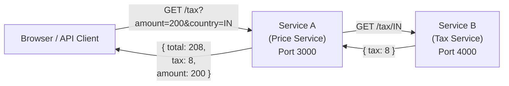

| Service | Responsibility | Default Port | How it's accessed |
|---|---|---|---|
| **Service A** (Price Service) | Accepts `amount` and `country` from the user, calls Service B to get the tax rate, calculates the final price, returns result | 3000 | Exposed to users (NodePort / LoadBalancer) |
| **Service B** (Tax Service) | Returns the tax percentage for a given country code (IN=8%, US=10%, UK=20%, etc.) | 4000 | Internal only (ClusterIP) — only Service A calls it |

**Inter-service communication:**
- Service A needs the URL of Service B to call it
- In Docker: you'd use `http://localhost:4000` or container names
- In Kubernetes: you use the **Kubernetes service name** → `http://service-b:4000` (Kubernetes built-in DNS resolves service names automatically)

**Environment variables used:**
| Variable | Used By | Purpose |
|---|---|---|
| `TAX_SERVICE_URL` | Service A | URL to reach Service B (e.g., `http://service-b:4000`) |
| `MY_ENV` | Both | A custom label to identify the environment (optional) |
| `PORT` | Both | Override the default port (optional, defaults to 3000/4000) |

**The project exists in 3 language variants** (Node.js, Python, Spring Boot) — each is containerized and deployed to Kubernetes. The architecture is identical regardless of language.

---

## Part 4 — Kubernetes: The Complete Deep Dive

### 4.1 Why Docker Alone Breaks in Production — The Container Orchestration Problem

**The setup:** picture a production system with a front-end service, a Node.js service, a Spring Boot service, and a Python service, all running as Docker containers.

**Key questions to consider:**
- What happens if a container **crashes at 2 a.m.**? Who restarts it?
- What if **traffic suddenly jumps 10x**? How do you get 5 more instances of a service, fast?
- What if **one container needs to run on a different physical machine (VM)** than another? Docker itself only manages a **single host** at a time.
- How do you **deploy a new version with zero downtime**?

Docker, by itself, **has no answer for any of these**. This class of problems is called the **container orchestration problem**.

**Definition of orchestration:** automatically managing many containers across multiple machines — including running, scaling, networking, and **healing** them (healing = automatically restarting a crashed container).

**The Kitchen Manager Analogy (used to explain orchestration intuitively):**

Imagine a restaurant kitchen with many chefs and a stream of incoming orders.
- If a chef quits or gets sick, **who reassigns their orders**?
- During rush hour, **who brings in more chefs**?
- **Who ensures each finished dish reaches the correct table**?

A **kitchen manager** is needed — someone who coordinates the workers automatically so that service continues smoothly even when individual chefs fail or demand spikes. That kitchen manager **is** the orchestrator.

| Restaurant analogy | Technology equivalent |
|---|---|
| Chefs | Containers |
| Orders / dishes | Requests / traffic |
| Kitchen manager | **Kubernetes (the orchestrator)** |

**The full list of problems container orchestration must solve:**

| Problem | Explanation |
|---|---|
| **Crash recovery** | If a container crashes, who restarts it? Docker (even with Compose) does *not* auto-restart a crashed container. |
| **Scaling** | How do you run 10 copies of the same service instantly, e.g., during a Black Friday sale spike on an order service? |
| **Load balancing** | If there are 10 running instances of a service, how is incoming traffic evenly distributed across them? |
| **Service discovery** | If Service A and Service B need to talk to each other (and appear as one unit to the outside world), how do they find each other? |
| **Zero-downtime deployment** | Deploying a new version normally causes some downtime as the new version replaces the old — how do you avoid that? |
| **Multi-machine (multi-VM) coordination** | Docker operates on **one machine at a time** — how do you manage containers spread across many machines as a single system? |
| **Health checks** | How do you automatically detect a broken/unhealthy container? |

### 4.2 What Is Kubernetes?

> **Kubernetes (K8s)** is a **container orchestration platform** that manages containers for you **at scale** — automating deployment, scaling, healing, networking, and management of containerized applications.

Your applications are already containerized via Docker; Kubernetes is the layer that manages **many** containers, across **many** machines, reliably.

**Why "K8s"?** Kubernetes is long to say/type, so engineers shortened it: **K** + **8 letters** (ubernete) + **s** = **K8s**.

### 4.2.1 History of Kubernetes — From Google's Borg to Open Source

| Timeline | Event |
|---|---|
| **Early 2000s** | Google faces massive scale challenges — running millions of apps (Search, Gmail, YouTube) across thousands of machines. Manual server management is impossible. |
| **~2003** | Google builds an internal system called **Borg** — automatically runs apps on multiple machines, restarts crashed apps, scales up/down, and distributes traffic. Borg worked so well Google ran *everything* on it. |
| **2013-2014** | Docker popularizes containers — developers can now package apps cleanly, but Docker alone can't manage containers at scale (the same old problem returns). |
| **2014** | Google takes ideas from Borg, rewrites the system from scratch, and **open-sources** it as **Kubernetes**. |
| **2015** | Google donates Kubernetes to the **CNCF** (Cloud Native Computing Foundation) to ensure it stays vendor-neutral and not controlled by any single company. |
| **Today** | Kubernetes is the **industry standard** for container orchestration. All major cloud providers support it: AWS (EKS), GCP (GKE), Azure (AKS). |

> 💡 **Key takeaway:** Kubernetes = Borg ideas + containers + open source. It was born from a **real problem** Google faced at enormous scale.

### 4.2.2 Kubernetes Architecture — Control Plane & Worker Nodes

Kubernetes operates in a **cluster model** = Control Plane + Worker Nodes.

```
Kubernetes Cluster
├── Control Plane (the brain — decides what should happen)
│   ├── API Server      — entry gate; all commands go through here
│   ├── Scheduler       — decides which node should run a particular pod
│   ├── Controller Mgr  — continuously checks: "are 3 replicas running? If not, fix it"
│   └── etcd            — the cluster's memory/database; stores desired vs actual state
└── Worker Nodes (the muscles — actually run your apps)
    ├── kubelet         — talks to control plane, starts/stops containers, reports health
    ├── kube-proxy      — maintains network rules, enables pod-to-service communication
    ├── Container Runtime — actually runs the containers (e.g., containerd)
    └── Pods            — contain your running containers
```

**What happens when you run `kubectl apply -f app.yaml`:**
1. **API Server** receives the request
2. **Desired state** is saved in **etcd** (e.g., "3 replicas of nginx")
3. **Scheduler** picks which worker node has enough CPU/memory to run the pod
4. **kubelet** on the selected node creates the pod
5. **Container Runtime** runs the container inside the pod
6. **Controller Manager** continuously watches — if a pod crashes, it recreates it

> 💡 **Don't memorize** — understand the flow. Control plane = brain (decides). Worker nodes = muscles (execute). Pods = cells (do the actual work).

### 4.3 Docker vs Kubernetes — Head-to-Head

| | Docker | Kubernetes |
|---|---|---|
| Core job | **Runs** the container | **Manages** many containers for you |
| Scope | Single-host focused | Multi-node **cluster** focused |
| Scaling | Manual | **Autoscaling** |
| Failure recovery | Manual restart required | **Self-healing** — automatically restarts failed containers |
| Networking | Manual | **Built-in service discovery** |
| Analogy | The engine | **The autopilot** |

### 4.4 Setting Up Kubernetes Locally

Two popular local options (Docker Desktop's built-in option is used for the hands-on demos):

| Tool | Notes |
|---|---|
| **Docker Desktop's built-in Kubernetes** | Enable via *Docker Desktop → Settings → Kubernetes → "Enable Kubernetes"*. Lets you choose the underlying engine (`kubeadm` or `kind`). Installation takes a few minutes and requires an active internet connection (it pulls the Kubernetes control-plane images). This is the option used for the course's live demos. |
| **Minikube** | A very popular standalone tool for running a local (single- or multi-node) Kubernetes cluster; has its own official getting-started guide with resource requirements (roughly 2 CPUs, 2 GB free memory, 20 GB disk). |
| **`kubeadm`** | A lower-level tool also used to create/manage clusters (this is one of the two engine options Docker Desktop lets you pick from). |

> ⚠️ **Important gotcha:** `kubectl` **does not itself run a cluster** — it is *only* a client tool that talks to whichever cluster your current **context** points to. If `kubectl get nodes` returns nothing or garbled output, it may be because your `kubectl` **context is pointed at the wrong cluster** (e.g., Minikube instead of Docker Desktop). Fix:
> ```bash
> kubectl config get-contexts        # see which context is currently active / available
> kubectl config use-context docker-desktop   # switch to the Docker Desktop cluster
> kubectl get nodes                  # now correctly shows the node
> ```
> **Lesson:** if `kubectl` commands return empty/odd results after installing Kubernetes, check your **context** before assuming the cluster is broken.

### 4.5 Core Concepts: Pods, Deployments, ReplicaSets

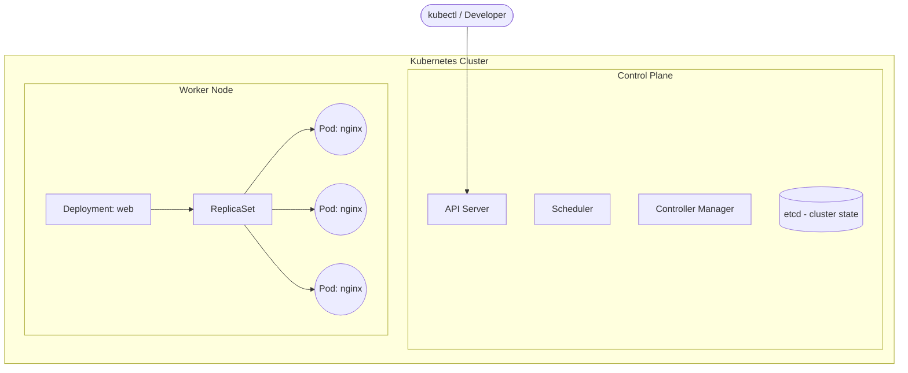

| Term | Definition |
|---|---|
| **Pod** | "The actual running app" — a container wrapped in a Kubernetes layer. It's "like a house where your app lives and runs." **The smallest deployable unit in Kubernetes.** |
| **Deployment** | A component that runs your app **continuously**. If a pod crashes, Kubernetes restarts it automatically via the Deployment. It's also what lets you request more copies (replicas) of your app. |
| **ReplicaSet** | Created and managed automatically by a Deployment. Its job: if a pod crashes and is supposed to be available, the ReplicaSet **recreates it**, and it continuously ensures the **desired replica count** matches the actual running count. |
| **Node** | A single machine (VM or physical) in the cluster that actually runs pods. |
| **Cluster** | A set of nodes managed together as one logical unit ("multi-node cluster focus" is what distinguishes Kubernetes from plain Docker). |

### 4.6 Hands-On Demo: Deploying Nginx, Exposing It, and Watching Self-Healing

**Step 1 — Create a Deployment** (conceptually — a `deployment.yaml` named `web` running the `nginx` image is applied, creating a Pod under the hood):
```bash
kubectl get pods
# shows a pod for the 'web' deployment already running, e.g. web-7d9f...-x2k1p
```

**Step 2 — Expose it via a NodePort Service, so it's reachable from the browser:**
```bash
kubectl expose deployment web --type=NodePort --port=80
```
*(Note: capitalization of `NodePort` matters. `--port=80` is the port the Service listens on / forwards to, matching nginx's default port 80 inside the container.)*

Confirming:
```bash
kubectl get svc            # or: kubectl get svc web
```
Output interpretation:
- `CLUSTER-IP` → the service's internal-only IP (safe to ignore for local access purposes)
- `PORT(S)` column shows something like `80:30241/TCP` → **80** is the app's internal container port, **30241** is the randomly-assigned external port opened on your machine (drawn from the 30000–32767 NodePort range)

**Step 3 — Access it in the browser:**
```
http://localhost:30241
```
This renders the nginx welcome page. **Full request path**, as diagrammed:
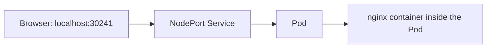

**Step 4 — Prove self-healing by killing a pod on purpose:**
```bash
kubectl get pods                 # note the pod name
kubectl delete pod <pod-name>    # deliberately delete it
kubectl get pods                 # a NEW pod has already been created automatically!
```
The old pod is gone, but a **brand-new pod** (new name, same Deployment) is already up. This is the ReplicaSet doing its job: the Deployment declared a desired state (e.g., 1+ replicas of this app), and Kubernetes continuously reconciles reality to match that desired state — with **zero manual intervention**.

**Step 5 — Prove autoscaling / manual scaling with a `-w` (watch) demo:**
```bash
kubectl get pods -w                     # watch mode — live updates as pods change
kubectl scale deployment web --replicas=5
```
Live output showed: 1 pod already running → **4 new pods created** → total of **5 pods** running. Exiting watch mode and running `kubectl get pods` plainly confirms 5 pods, and:
```bash
kubectl describe replicaset <replicaset-name>
```
...shows in its output: **Desired: 5, Current: 5, Ready: 5** — the concrete proof that Kubernetes is continuously reconciling the actual state to match the declared desired state, which is the entire value proposition over plain Docker.

**Step 6 — Debugging inside a running Pod:**
```bash
kubectl get pods
kubectl exec -it <pod-name> -- sh
# now inside the pod's shell:
printenv | grep DB_PASSWORD
```
This confirms whether an environment variable/secret was correctly injected into the running container — exactly analogous to `docker exec`, but at the Kubernetes/Pod level. The transcript notes this works identically for containers written in different languages (Python, Node.js) — each expects its own env vars (e.g., `PORT`, with sensible defaults like `3000` if not overridden), and the mechanism for passing them into the pod is language-agnostic.

### 4.7 Kubernetes Services — Deep Dive on All 4 Types

**Why Services exist at all:** a Pod is **invisible to the outside world** by default, and Pods are inherently unstable — they crash and restart, and there's no guarantee their IP address stays the same across restarts. A **Service** solves this by giving your application a **stable, permanent IP/identity** that other apps (and, depending on type, the outside world) can reliably reach — regardless of which underlying Pods come and go.

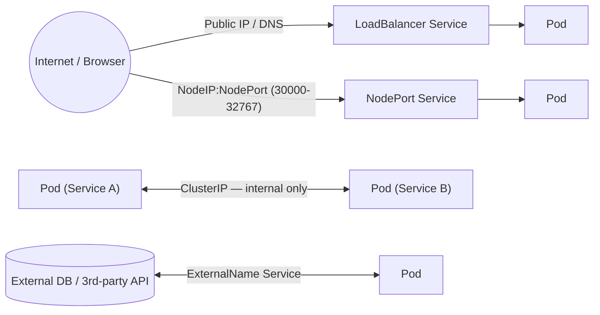

| Service Type | What it does | Accessible from browser? | Best used for |
|---|---|---|---|
| **ClusterIP** (default) | Exposes the app **only within the cluster** | ❌ No | Service-to-service / microservice-to-microservice communication where you specifically **don't** want external exposure |
| **NodePort** | Exposes the app on `<NodeIP>:<Port>`, port range **30000–32767** | ✅ Yes, via IP + port | **Local testing, demos, or learning Kubernetes** — generally *not* used as-is in real production |
| **LoadBalancer** | Provisions an actual **cloud load balancer**, giving a public IP or DNS name | ✅ Yes, via public internet | **Real production traffic with real users** — this is the type that "works best on cloud services like AWS, GCP, Azure" since it needs a cloud provider to actually create the load balancer |
| **ExternalName** | Maps the Service to an external DNS name | N/A (outbound mapping) | Connecting to an **external database or third-party API** from inside the cluster; described as advanced and rarely used |

**Decision table:**
- Need internal-only microservice-to-microservice communication? → **ClusterIP**
- Just testing/learning locally, want quick browser access? → **NodePort**
- Shipping to real users in production? → **LoadBalancer**
- Need to reach an external DB/API from inside the cluster? → **ExternalName**

**Service YAML example (LoadBalancer):**
```yaml
apiVersion: v1
kind: Service
metadata:
  name: myapp-service
spec:
  type: LoadBalancer
  selector:
    app: myapp
  ports:
    - protocol: TCP
      port: 80
      targetPort: 8080
```

### 4.8 ConfigMaps & Secrets

Two Kubernetes objects for injecting configuration into Pods, differing by **sensitivity**:

| | ConfigMap | Secret |
|---|---|---|
| Purpose | **Non-sensitive** configuration (ports, flags, non-secret values) | **Sensitive** configuration (passwords, API keys) |
| Object `kind` | `ConfigMap` | `Secret` |
| Type shown in demo | — | `Opaque` (a **generic secret type**) |
| Data encoding | Plain values | Should be **base64-encoded** in the manifest |

**Example files (`configmap.yaml` and `secret.yaml`):**
```yaml
# configmap.yaml
apiVersion: v1
kind: ConfigMap
metadata:
  name: app-config
data:
  PORT: "8080"
  APP_MODE: "production"
```
```yaml
# secret.yaml
apiVersion: v1
kind: Secret
metadata:
  name: app-secret
type: Opaque
data:
  db-password: c2VjcmV0MTIz     # base64-encoded value
```
Referencing a Secret value inside a Deployment's pod spec:
```yaml
env:
  - name: DB_PASSWORD
    valueFrom:
      secretKeyRef:
        name: app-secret
        key: db-password
```

**Verification:** exec into the running pod and `printenv | grep DB_PASSWORD` to confirm the value was correctly injected from the Secret.

### 4.9 `kubectl` Command Cheat Sheet

```bash
# Context management (important gotcha!)
kubectl config get-contexts
kubectl config use-context docker-desktop

# Cluster / node info
kubectl version --client
kubectl get nodes

# Pods
kubectl get pods
kubectl get pods -w                       # watch mode, live updates
kubectl get pods --show-labels            # show labels assigned to pods
kubectl describe pod <pod-name>
kubectl logs <pod-name>                   # view pod logs
kubectl exec -it <pod-name> -- sh         # shell into a pod
kubectl exec -it <pod-name> -- printenv   # view env vars inside pod
kubectl delete pod <pod-name>             # deletion triggers auto-recreation if managed by a Deployment

# Labels
kubectl label pod <pod-name> app-           # remove label "app" from a pod
kubectl label pod <pod-name> app=web        # add/update label

# Deployments & scaling
kubectl get deployments
kubectl get deployments <name> -o yaml    # export deployment config as YAML
kubectl scale deployment <name> --replicas=5
kubectl set image deployment/<name> <container>=<image>:<tag>
kubectl rollout status deployment/<name>

# ReplicaSets
kubectl get replicaset
kubectl describe replicaset <name>        # shows Desired / Current / Ready counts

# Services
kubectl expose deployment <name> --type=NodePort --port=80
kubectl get svc
kubectl get svc <name>
kubectl get svc <name> -o yaml            # export service config as YAML

# Applying & deleting manifests
kubectl apply -f deployment.yaml
kubectl apply -f service.yaml
kubectl apply -f configmap.yaml
kubectl apply -f secret.yaml
kubectl apply -f <folder-name>/           # apply ALL manifests in a folder
kubectl delete -f <folder-name>/          # delete ALL resources defined in a folder
kubectl delete all --all                  # delete all pods, services, deployments
```

### 4.10 Labels, Selectors, and How Services Find Pods

**Labels** are key-value tags attached to pods to identify them:
```yaml
metadata:
  labels:
    app: web     # label: app=web
```

**Selectors** are how Services know which pods to route traffic to:
```yaml
# Inside a Service definition:
spec:
  selector:
    app: web     # "route traffic to all pods with label app=web"
```

**Traffic flow:**
```
Browser → Service (selector: app=web) → Pod with label app=web
```

**Live demo — removing a label and watching self-healing:**
```bash
# View labels on pods
kubectl get pods --show-labels

# Remove the "app" label from a pod
kubectl label pod <pod-name> app-
# Result: "unlabeled" — Kubernetes immediately creates a NEW pod
#         with the correct label (to match the declared replica count)
# The unlabeled pod still runs but receives NO traffic (service ignores it)
```

This demonstrates Kubernetes' **declarative model**: it constantly works to match the **desired state** (e.g., "1 replica with label app=web") with the **actual state**.

### 4.11 Debugging Pods — Essential Commands

```bash
# View logs of a pod
kubectl logs <pod-name>

# Shell into a running pod (interactive mode)
kubectl exec -it <pod-name> -- sh
ls                    # see filesystem
cat /etc/nginx/nginx.conf   # read config files
pwd                   # check working directory
exit                  # leave the pod shell

# Full pod details (image, IP, events, status)
kubectl describe pod <pod-name>
```

The `describe` output includes: image name/version, pod IP, node it's running on, start time, container status, port mappings, mounted volumes, and **events** (pulled image, started container, etc.).

### 4.12 Writing Kubernetes YAML Manifests — From Command Line to Files

**Getting YAML from existing resources:**
```bash
# Export a running deployment's config as YAML
kubectl get deployments web -o yaml

# Export a running service's config as YAML
kubectl get svc web -o yaml
```

You can save this to a `.yaml` file and use it as a starting point for your own manifests.

**A complete Deployment + Service YAML (`app.yaml`):**
```yaml
# --- Deployment ---
apiVersion: apps/v1
kind: Deployment
metadata:
  name: app-1-hello
spec:
  replicas: 1
  selector:
    matchLabels:
      app: app-1-hello
  template:
    metadata:
      labels:
        app: app-1-hello
    spec:
      containers:
        - name: app-1-hello
          image: decode007/hello-node:latest
          ports:
            - containerPort: 3000
          env:
            - name: MY_ENV
              valueFrom:
                configMapKeyRef:
                  name: app-config
                  key: MY_ENV
---
# --- Service ---
apiVersion: v1
kind: Service
metadata:
  name: app-1-hello
spec:
  type: NodePort
  selector:
    app: app-1-hello
  ports:
    - port: 3000
      targetPort: 3000
      nodePort: 31000
```

**Applying and deleting:**
```bash
kubectl apply -f app.yaml     # creates both Deployment and Service
kubectl delete -f app.yaml    # removes both
```

### 4.13 Deploying Microservices to Kubernetes — Tax Calculator Hands-On

This is the full walkthrough of deploying the **Tax Calculator** (Service A + Service B) to a local Kubernetes cluster.

**Folder structure:**
```
k8s/app-2-tax-calculator/
├── service-a/
│   └── app.yaml      # Deployment + Service (NodePort, port 32000)
└── service-b/
    └── app.yaml      # Deployment + Service (ClusterIP, port 4000)
```

**Service B — `service-b/app.yaml` (internal tax service):**
```yaml
apiVersion: apps/v1
kind: Deployment
metadata:
  name: service-b
spec:
  replicas: 1
  selector:
    matchLabels:
      app: service-b
  template:
    metadata:
      labels:
        app: service-b
    spec:
      containers:
        - name: service-b
          image: embarkx/tax-service-b:latest
          ports:
            - containerPort: 4000
---
apiVersion: v1
kind: Service
metadata:
  name: service-b
spec:
  type: ClusterIP              # ← INTERNAL ONLY — not accessible from browser
  selector:
    app: service-b
  ports:
    - port: 4000
      targetPort: 4000
```

> ⚠️ **Why ClusterIP (not NodePort)?** Service B is only needed for **inter-service communication** within the cluster. It should NOT be accessible from outside. Only Service A (the user-facing API) gets NodePort.

**Service A — `service-a/app.yaml` (user-facing price service):**
```yaml
apiVersion: apps/v1
kind: Deployment
metadata:
  name: service-a
spec:
  replicas: 1
  selector:
    matchLabels:
      app: service-a
  template:
    metadata:
      labels:
        app: service-a
    spec:
      containers:
        - name: service-a
          image: embarkx/tax-service-a:latest
          ports:
            - containerPort: 3000
          env:
            - name: TAX_SERVICE_URL
              value: "http://service-b:4000"    # ← Uses K8s service name!
---
apiVersion: v1
kind: Service
metadata:
  name: service-a
spec:
  type: NodePort                # ← Accessible from browser
  selector:
    app: service-a
  ports:
    - port: 3000
      targetPort: 3000
      nodePort: 32000           # ← Access at localhost:32000
```

> 💡 **The magic line:** `value: "http://service-b:4000"` — Service A calls Service B using the **Kubernetes service name** (`service-b`). Kubernetes' built-in DNS automatically resolves `service-b` to the ClusterIP of Service B's service. This is how inter-service communication works in K8s.

**Deploy both services:**
```bash
cd k8s/app-2-tax-calculator

# Deploy Service B first (it's the dependency)
kubectl apply -f service-b/
# Output: service/service-b created, deployment.apps/service-b created

# Deploy Service A
kubectl apply -f service-a/
# Output: service/service-a created, deployment.apps/service-a created

# Check pods
kubectl get pods
# NAME                         READY   STATUS    RESTARTS   AGE
# service-a-7d9f...-x2k1p      1/1     Running   0          10s
# service-b-5c8b...-q3j7r      1/1     Running   0          15s
```

**Test the API:**
```bash
# Access Service A (user-facing) at localhost:32000
curl "http://localhost:32000/tax?amount=200&country=IN"
# Response:
# {
#   "service_a_container": "fdz-ch...",
#   "service_b_container": "wh2nb...",
#   "amount": 200,
#   "tax": 8,
#   "total": 208
# }
```

**Can you access Service B directly?** NO — it's ClusterIP, so `curl http://localhost:4000` will **fail**. It's only reachable from within the Kubernetes cluster.

**Scale Service A:**
```bash
# Edit service-a/app.yaml → change replicas: 1 to replicas: 2
kubectl apply -f service-a/
kubectl get pods
# Now shows 2 pods for service-a!

# Scale back down
# Change replicas: 2 back to replicas: 1
kubectl apply -f service-a/
# The extra pod terminates
```

**Clean up everything:**
```bash
kubectl delete -f service-a/
kubectl delete -f service-b/
# Both deployments and services are removed
kubectl get pods
# No resources found
```

> 💡 **You can also separate Deployment and Service into different files:** Instead of one `app.yaml` with both, you can have `deployment.yaml` and `service.yaml` inside each service folder. Both approaches work.

---

## Part 5 — CI/CD Concepts

### 5.1 The Manual Workflow Problem

**Before CI/CD, the entire software delivery process was manual:**

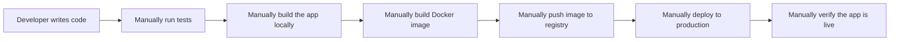

**Step-by-step breakdown:**
1. Developer writes code and pushes a new feature/bug fix
2. Developer **manually runs tests** on their local machine
3. Developer **manually builds the application** (e.g., `mvn clean package` for Java, `npm run build` for Node.js)
4. Developer **manually builds a Docker image** with the new code
5. Developer **manually pushes** the Docker image to a remote Docker registry (Docker Hub, ECR, etc.)
6. Developer or ops team **manually deploys** the new image to the Kubernetes cluster or server
7. Someone **manually verifies** the app is running correctly

**Every single step is:**
- **Slow** — takes time for a human to do each step
- **Error-prone** — humans make mistakes (wrong tag, forgot to push, deployed to wrong environment)
- **Not repeatable** — different developers might follow slightly different steps
- **Not auditable** — no record of what was done when

Every single arrow above represents a **manual, human-dependent** step — described explicitly as slow and risky.

### 5.2 Definitions

| Term | Meaning |
|---|---|
| **CI — Continuous Integration** | Frequently merging code changes, with automatic building and testing. **CI ends the moment you have a packaged output** — a "software artifact." |
| **CD — Continuous Delivery/Deployment** | Automatically taking that artifact and deploying/releasing it. |
| **Software Artifact** | *"A ready-to-deploy packaged output of the build process."* In this course's context, that's the **Docker image** produced by the build step — once the app is packaged into a Docker image (or whatever your pipeline is configured for), it's "ready to deploy, ready to distribute." |
| **Pipeline** | Explicitly **not a tool** — a pipeline is "a combination of logic, steps, and flow." It consists of: **steps, order, and automation.** Jenkins and GitHub Actions are the *tools* used to run pipelines — the pipeline concept itself is tool-agnostic. |

### 5.3 Typical Pipeline Stages
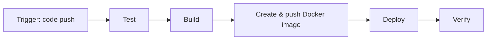

---

## Part 6 — Jenkins vs GitHub Actions

Both are **tools that execute pipelines** — the pipeline's logic itself belongs to neither tool specifically.

| | Jenkins | GitHub Actions |
|---|---|---|
| Type | Self-hosted, **open-source automation server** | Cloud-native CI/CD **built directly into GitHub** |
| Where it runs | You install and maintain your own Jenkins server | Runs on GitHub-hosted (or self-hosted) runners — no separate server needed |
| Configuration | Extensive plugin ecosystem; Groovy-based `Jenkinsfile` pipelines | YAML workflow files inside `.github/workflows/` |
| How it's described | "The leading open-source automation server" — runs a series of steps on code changes, supports complex workflows, easy installation/configuration, extensible via plugins, works across distributed setups | "Makes it easy to automate all software workflows" — helps you build, test, and deploy directly from GitHub; on every `git push`, it can run code reviews, branch management, and full CI/CD |
| Course usage | Introduced conceptually via a walkthrough of `jenkins.io` | Used for the **entire hands-on pipeline build** in this transcript |

---

## Part 7 — Hands-on: Building the GitHub Actions Pipeline

The course builds a real, working workflow for a **Spring Boot (Java/Maven)** microservice, live and iteratively (including fixing failed runs on-camera), then repeats an equivalent pattern for the Node.js and Python services. Below is the fully reconstructed, corrected workflow plus every concept explained along the way.

### 7.1 Core Concepts Introduced

- A **workflow** file lives at `.github/workflows/*.yml` and is triggered by events like `on: push`.
- A workflow contains one or more **jobs**. **Each job runs on a completely fresh runner** — described explicitly as *"a fresh machine that does not have anything, we need to set up things on it."* This is why steps like checking out code and installing the JDK are repeated in **every** job, not shared automatically between them.
- Jobs can be chained with `needs:` — e.g., the Docker build/push job only starts **after** the build-and-test job succeeds; the deploy job only starts after the Docker build/push job succeeds.
- **Reusable Actions** (e.g., `actions/checkout@v4`) are pre-built steps from the GitHub Actions marketplace, used instead of writing raw shell commands for common tasks like checking out code.
- **Secrets** (Docker Hub credentials, AWS credentials) live in the repository's GitHub Secrets settings and are referenced via `${{ secrets.NAME }}` — never hard-coded into the YAML.
- **Debugging is iterative and normal** — a live run may fail (e.g., "docker build push is failed") and need to be fixed and re-triggered. Reading the GitHub Actions run logs is the standard way to diagnose failures.

### 7.2 Building the Workflow, Step by Step

**Job 1 — Build & Test:**
1. `Check out code` → uses `actions/checkout@v4` (need the source before anything else can happen).
2. `Set up JDK` → because building/testing a Java jar requires Java on the fresh runner.
3. `Build and test with Maven` → runs the Maven test command.
4. `Upload test reports` → publishes whatever test reports were generated as build artifacts.

**Job 2 — Docker Build & Push** (depends on Job 1 via `needs: build-test`):
1. `Check out code` again — fresh runner, no shared state with Job 1.
2. `Set up JDK` again — same reason.
3. `Build a jar for Docker` — a fresh production jar (this time skipping tests, since testing already happened in Job 1).
4. `Login to Docker Hub` — authenticate using stored secrets.
5. `Build and push Docker image` — builds the image from the Dockerfile and pushes it to the registry.

**Job 3 — Deploy to AWS EKS** (depends on Job 2):
1. `Check out code`.
2. `Configure AWS credentials` — using stored AWS secrets.
3. `aws eks update-kubeconfig` — points `kubectl` at the target EKS cluster.
4. `kubectl set image` / rollout — swaps the running Deployment's container image to the freshly pushed one and confirms the rollout completed.

### 7.3 Full Reconstructed Workflow YAML

```yaml
name: CI/CD Pipeline

on:
  push:
    branches: [main]

jobs:
  # ---------- JOB 1: Build & Test ----------
  build-test:
    runs-on: ubuntu-latest
    steps:
      - name: Check out code
        uses: actions/checkout@v4

      - name: Set up JDK
        uses: actions/setup-java@v4
        with:
          java-version: '17'
          distribution: 'temurin'

      - name: Build and test with Maven
        run: mvn clean test

      - name: Upload test reports
        uses: actions/upload-artifact@v4
        with:
          name: test-reports
          path: target/surefire-reports/

  # ---------- JOB 2: Docker Build & Push ----------
  docker-build-push:
    runs-on: ubuntu-latest
    needs: build-test          # only runs if build-test succeeds
    steps:
      - name: Check out code
        uses: actions/checkout@v4

      - name: Set up JDK
        uses: actions/setup-java@v4
        with:
          java-version: '17'
          distribution: 'temurin'

      - name: Build jar for Docker
        run: mvn clean package -DskipTests

      - name: Login to Docker Hub
        uses: docker/login-action@v3
        with:
          username: ${{ secrets.DOCKERHUB_USERNAME }}
          password: ${{ secrets.DOCKERHUB_TOKEN }}

      - name: Build and push Docker image
        uses: docker/build-push-action@v5
        with:
          context: .
          push: true
          tags: ${{ secrets.DOCKERHUB_USERNAME }}/myapp:${{ github.sha }}

  # ---------- JOB 3: Deploy to AWS EKS ----------
  deploy-aws-eks:
    runs-on: ubuntu-latest
    needs: docker-build-push   # only runs after image is built & pushed
    steps:
      - name: Check out code
        uses: actions/checkout@v4

      - name: Configure AWS credentials
        uses: aws-actions/configure-aws-credentials@v4
        with:
          aws-access-key-id: ${{ secrets.AWS_ACCESS_KEY_ID }}
          aws-secret-access-key: ${{ secrets.AWS_SECRET_ACCESS_KEY }}
          aws-region: us-east-1

      - name: Update kubeconfig for EKS cluster
        run: aws eks update-kubeconfig --name my-eks-cluster --region us-east-1

      - name: Deploy to Kubernetes
        run: |
          kubectl set image deployment/myapp-deployment \
            myapp=${{ secrets.DOCKERHUB_USERNAME }}/myapp:${{ github.sha }}
          kubectl rollout status deployment/myapp-deployment
```

### 7.4 Multi-Job Dependency Diagram

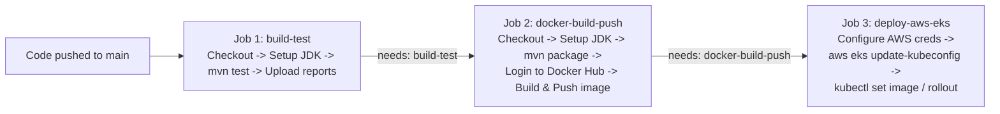

### 7.5 Repeating the Pattern Across Microservices

The same three-job pattern (`build-test` → `docker-build-push` → `deploy-aws-eks`) was **duplicated and adapted** for the Node.js and Python microservices, each with its own workflow file, its own Dockerfile, and its own deployment target — demonstrating the core microservices CI/CD principle: **one repeatable pipeline pattern, applied independently per service**, so each service can be built, tested, and deployed on its own release cadence without needing to touch the others.

---

## Part 8 — Deploying to AWS EKS

**EKS (Elastic Kubernetes Service)** = AWS's managed Kubernetes offering. AWS operates and maintains the **control plane**; you manage the worker nodes and workloads that run on top of it.

### 8.1 Key Commands (used in the deployment jobs and cluster lifecycle)

```bash
# Create an EKS cluster (via eksctl, the standard CLI tool for EKS)
eksctl create cluster --name my-eks-cluster --region us-east-1 --nodes 3

# Point kubectl at the EKS cluster (referred to loosely in speech as
# "cube control" / "cube cuddle" — both refer to kubectl / this command)
aws eks update-kubeconfig --name my-eks-cluster --region us-east-1

# Verify connectivity
kubectl get nodes

# Tear the cluster down completely (control plane + node groups)
eksctl delete cluster --name my-eks-cluster --region us-east-1
```

### 8.2 End-to-End Flow: Code Push → Live on EKS

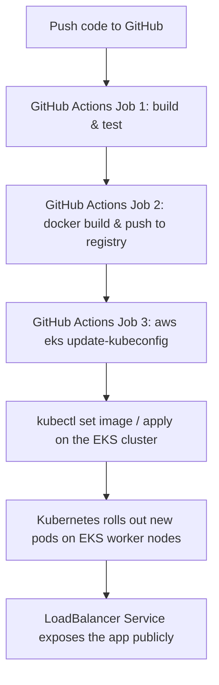

### 8.3 Notes From the Live Deployment Demos
- The same `deploy-aws-eks` job pattern is repeated for **three separate microservices** (Spring Boot, Node.js, and Python), each successfully reaching "deploying to AWS EKS" as the final pipeline stage — reinforcing that this is a **repeatable template**, not a one-off script.
- Job dependencies matter: a deploy job showed as **"not triggered"** at one point in the demo precisely because its upstream `needs:` job hadn't completed successfully yet — a good real-world reminder to check the dependency chain first when a job appears stuck or skipped.
- Cluster teardown was also demonstrated conceptually with `eksctl delete`, explicitly deleting the **control plane and node groups** together, to avoid leaving AWS resources running (and being billed for) after you're done experimenting.

---

## Part 9 — Cloud Platforms: AWS vs Azure vs GCP

The course's philosophy on this (stated explicitly): know the fundamentals of **all three** major providers, and go deep/expert in **one or two** — because switching companies or projects frequently means switching cloud providers, and interviewers/teams expect at least baseline fluency across the ecosystem.

| Capability | AWS | Azure | GCP |
|---|---|---|---|
| Managed Kubernetes | **EKS** (Elastic Kubernetes Service) | **AKS** (Azure Kubernetes Service) | **GKE** (Google Kubernetes Engine) |
| Container Registry | **ECR** | **ACR** (Azure Container Registry) | **Artifact Registry** |
| CLI tool | `aws` CLI + `eksctl` | `az` CLI | `gcloud` CLI |
| Infra-as-Code provider (Terraform) | `aws` provider | `azurerm` provider | `google` provider |

> ⚠️ As flagged in Part 0: only **AWS (EKS + ECR)** were used hands-on in this transcript. Azure and GCP appear only in comparison context — most notably when explaining that Kubernetes' `LoadBalancer` Service type "works best on cloud services like AWS, GCP, Azure," since provisioning a real load balancer requires an actual cloud provider underneath.

---

## Part 10 — Master Command Cheat Sheets

### Docker
```bash
# Verify install
docker --version
docker info
docker compose version

# Run containers
docker run hello-world
docker run <image>
docker run -d <image>
docker run -it <image> sh
docker run -p <host_port>:<container_port> <image>
docker run -d --name <name> -p <host_port>:<container_port> <image>

# Container lifecycle
docker create --name <name> -p <host_port>:<container_port> <image>
docker start <container>
docker stop <container>
docker restart <container>
docker rm <container>                    # remove stopped container
docker rm -f <container>                 # force-remove running container

# Inspect containers
docker ps
docker ps -a
docker ps -a -q

# Logs & debugging
docker logs <container>
docker logs -f <container>               # follow live
docker logs --tail 10 <container>        # last N lines
docker logs -t <container>               # with timestamps
docker logs --since 20m <container>      # since duration
docker exec -it <container> sh
docker exec -it <container> printenv

# Images
docker images
docker images -q
docker pull <image>:<tag>
docker build -t <name>:<tag> .
docker tag <image>:<tag> <dockerhub-username>/<image>:<tag>
docker login
docker push <dockerhub-username>/<image>:<tag>
docker rmi <image>                       # remove image
docker rmi -f <image>                    # force-remove image

# Cleanup
docker container prune                   # remove all stopped containers
docker image prune                       # remove unused images
docker system prune -a                   # remove everything unused
docker rm -f $(docker ps -aq)            # force-remove all containers
docker rmi -f $(docker images -q)        # force-remove all images

# Compose
docker compose up
docker compose up -d
docker compose down
```

### Kubernetes (`kubectl`)
```bash
# Context
kubectl config get-contexts
kubectl config use-context docker-desktop

# Nodes / Pods
kubectl get nodes
kubectl get pods
kubectl get pods -w
kubectl describe pod <name>
kubectl exec -it <pod> -- sh
kubectl exec -it <pod> -- printenv
kubectl delete pod <name>

# Labels
kubectl get pods --show-labels
kubectl label pod <name> app-               # remove label
kubectl label pod <name> app=web            # add/update label

# Deployments / scaling
kubectl get deployments
kubectl get deployments <name> -o yaml      # export as YAML
kubectl scale deployment <name> --replicas=5
kubectl set image deployment/<name> <container>=<image>:<tag>
kubectl rollout status deployment/<name>

# ReplicaSets
kubectl get replicaset
kubectl describe replicaset <name>

# Services
kubectl expose deployment <name> --type=NodePort --port=80
kubectl get svc
kubectl get svc <name>
kubectl get svc <name> -o yaml

# Manifests
kubectl apply -f deployment.yaml
kubectl apply -f service.yaml
kubectl apply -f configmap.yaml
kubectl apply -f secret.yaml
kubectl apply -f <folder>/                  # apply all manifests in folder
kubectl delete -f <folder>/                 # delete all from folder
kubectl delete all --all                    # delete everything
```

### AWS EKS
```bash
eksctl create cluster --name <cluster> --region <region> --nodes <n>
aws eks update-kubeconfig --name <cluster> --region <region>
kubectl get nodes
eksctl delete cluster --name <cluster> --region <region>
```

---

## Part 11 — Complete Glossary

| Term | Definition |
|---|---|
| **DevOps** | A culture/practice unifying Development and Operations to automate and streamline software delivery — not a tool |
| **CI (Continuous Integration)** | Automatically building & testing code on every change, ending in a software artifact |
| **CD (Continuous Delivery/Deployment)** | Automatically deploying/releasing the built artifact |
| **Software Artifact** | A ready-to-deploy packaged build output (e.g., a Docker image or `.jar` file) |
| **Pipeline** | The ordered, automated combination of logic, steps, and flow taking code from commit to deployment — not a tool itself |
| **Infrastructure as Code (IaC)** | Defining and provisioning infrastructure via machine-readable code instead of manual console clicks |
| **Docker** | Open-source platform automating deployment/scaling/management of apps via containerization |
| **Containerization** | Lightweight virtualization technology packaging an app + dependencies into a standard "container" unit |
| **Docker Image** | A read-only, layered blueprint/template defining a container's contents |
| **Docker Container** | A running instance of a Docker image |
| **Dockerfile** | The instructions file used to build a Docker image |
| **Image Layer** | A cached, reusable slice of an image that speeds up rebuilds and saves storage |
| **Docker Tag** | A version label attached to an image (`name:tag`), e.g. `myapp:v2` |
| **Docker Registry** | A remote storage/distribution service for images (Docker Hub, ECR, ACR, Artifact Registry) |
| **Docker Engine** | The collective runtime: Docker Daemon + Docker API + Docker CLI |
| **Docker Daemon** | The "heart" of Docker — does the actual work of managing images/containers |
| **Docker API** | Internal messenger between the CLI and the Daemon |
| **Docker CLI** | The command-line tool you type Docker commands into |
| **Docker Compose** | Tool to define & run multi-container applications via one YAML file |
| **Virtual Machine (VM)** | A software-emulated "separate computer inside your computer," with its own full guest OS, managed by virtualization software |
| **Hypervisor** | The software layer that creates/manages VMs (e.g., Hyper-V) |
| **Kubernetes (K8s)** | A container orchestration platform that manages containers at scale — automated deployment, scaling, healing, networking |
| **Container Orchestration** | Automatically managing many containers across many machines: running, scaling, networking, healing |
| **Pod** | The smallest deployable unit in Kubernetes — a container wrapped in a Kubernetes layer |
| **Node** | A machine (VM/physical) that runs Kubernetes pods |
| **Cluster** | A set of nodes managed together by Kubernetes |
| **Deployment** | A Kubernetes object that runs your app continuously and manages Pods/ReplicaSets to match a desired state |
| **ReplicaSet** | Ensures the desired number of pod replicas are always running; recreates crashed pods |
| **Service** | Gives pods a stable network identity; types: ClusterIP, NodePort, LoadBalancer, ExternalName |
| **ClusterIP** | Service type exposing an app only inside the cluster — for internal microservice-to-microservice traffic |
| **NodePort** | Service type exposing an app via `<NodeIP>:<Port>` (30000–32767) — good for local testing/learning |
| **LoadBalancer** | Service type provisioning a real cloud load balancer with a public IP/DNS — for production traffic |
| **ExternalName** | Service type mapping to an external DNS name — for reaching outside DBs/APIs from inside the cluster |
| **ConfigMap** | Kubernetes object storing non-sensitive configuration |
| **Secret** | Kubernetes object storing sensitive configuration (e.g., type `Opaque`, base64-encoded) |
| **kubectl** | CLI tool to interact with a Kubernetes cluster's API server — does not itself run/host a cluster |
| **Context (kubectl)** | Which cluster/credentials `kubectl` is currently pointed at — a common source of "empty output" confusion |
| **Jenkins** | Open-source, self-hosted CI/CD automation server |
| **GitHub Actions** | GitHub's native CI/CD platform, defined via YAML workflows in `.github/workflows/` |
| **Runner** | The fresh, temporary virtual machine that executes a CI/CD job — no shared state between jobs by default |
| **`needs:`** | GitHub Actions keyword creating a dependency so one job only runs after another succeeds |
| **GitHub Secrets** | Encrypted credentials referenced in workflows via `${{ secrets.NAME }}`, never hard-coded |
| **EKS / AKS / GKE** | AWS / Azure / GCP's respective managed Kubernetes services |
| **ECR / ACR / Artifact Registry** | AWS / Azure / GCP's respective native container registries |
| **`eksctl`** | The standard CLI tool for creating/deleting AWS EKS clusters |
| **Monolith** | A single, unified application codebase deployed as one unit |
| **Microservices** | An architecture of multiple independently deployable, independently scalable services |
| **Port Mapping** | Docker's `-p hostPort:containerPort` mechanism forwarding a host port into a container's internal port |
| **Detached Mode (`-d`)** | Running a Docker container in the background, freeing the terminal |
| **Container Lifecycle** | The five stages a Docker container moves through: Create → Start → Stop → Restart → Remove |
| **`docker create`** | Creates a container with an assigned ID but does NOT start it — used in advanced workflows where you need to configure before running |
| **`docker start`** | Starts an already-created or previously-stopped container — unlike `docker run`, does NOT create a new container |
| **`docker restart`** | Stops and restarts a container, preserving the same container ID and storage |
| **`docker rm`** | Removes (deletes) a container from the system; requires the container to be stopped first, or use `-f` to force |
| **`docker rmi`** | Removes a Docker image; fails if the image is used by any container, or use `-f` to force |
| **Container ID** | A SHA-256 hash uniquely identifying a container; Docker allows using shortened prefixes (even 3 characters) if unique |
| **`docker logs`** | Command to view container output logs; supports `-f` (follow live), `--tail N` (last N lines), `-t` (timestamps), `--since` (time filter) |
| **`docker container prune`** | Removes all stopped containers to reclaim disk space |
| **`docker image prune`** | Removes all unused images not associated with any container |
| **`docker system prune -a`** | Nuclear cleanup: removes all stopped containers, unused networks, unused images, and build cache |
| **Dockerfile Instructions** | The commands used inside a Dockerfile: `FROM` (base image), `WORKDIR` (working directory), `COPY` (files into container), `RUN` (build-time commands), `EXPOSE` (document port), `CMD` (startup command), `ENTRYPOINT` (non-overridable startup command) |
| **`.dockerignore`** | A file (like `.gitignore`) that tells Docker which files to exclude from the build context — reduces image size, speeds up builds, prevents sensitive files from leaking |
| **Borg** | Google's internal predecessor to Kubernetes (early 2000s) — automatically managed millions of apps across thousands of machines; Kubernetes was born from Borg's ideas |
| **CNCF** | Cloud Native Computing Foundation — the vendor-neutral organization that governs Kubernetes since Google donated it in 2015 |
| **Eclipse Temurin** | The standard OpenJDK distribution used as a Docker base image for Java/Spring Boot apps (e.g., `eclipse-temurin:21-jdk`) |
| **Maven Wrapper (`mvnw`)** | A script included with Spring Boot projects that runs Maven without requiring a global Maven installation; `./mvnw` (Mac/Linux), `.\mvnw.cmd` (Windows) |
| **Labels** | Key-value tags attached to Kubernetes pods (e.g., `app: web`) used to identify and group them |
| **Selectors** | Kubernetes mechanism for Services to find pods — matches labels (e.g., `selector: app: web` routes traffic to all pods with that label) |
| **Flask** | A lightweight Python web framework used in the Python microservice demos |
| **Express.js** | A Node.js web framework used in the Node.js microservice demos |
| **Inter-service Communication** | How microservices talk to each other within a Kubernetes cluster — using service names (e.g., `http://service-b:4000`) resolved by K8s built-in DNS |
| **Build Context** | The directory Docker uses when building an image — specified by the `.` at the end of `docker build -t name .` |
| **Layer Caching** | Docker's optimization where unchanged Dockerfile instructions reuse cached layers from previous builds — order of instructions matters for cache efficiency |
| **Terraform** | Infrastructure-as-Code tool for provisioning cloud infrastructure via code *(mentioned as course scope, not hands-on in this transcript)* |

---

## Part 12 — How to Use These Notes for Revision

1. **Docker Basics (Part 2, Sections 2.1–2.23):** Re-run every command in Sections 2.6–2.23 against a throwaway app of your own. Don't skip the `nginx` port-mapping demo — it's the concept most people think they understand but actually don't until they've broken it once (try running `nginx` *without* `-p` first and observe the failure). Practice the full container lifecycle (Section 2.11): `docker create` → `docker start` → `docker stop` → `docker restart` → `docker rm`.
2. **Containerize Real Apps (Sections 2.26–2.28):** Reproduce the full Python, Node.js, and Spring Boot containerization walkthroughs. Write each Dockerfile from scratch, build each image, run each container, and verify the JSON API response in your browser. This is the #1 skill for DevOps.
3. **Kubernetes (Part 4):** Reproduce the full Section 4.6 walkthrough end-to-end locally: deploy → expose via NodePort → access in browser → delete a pod and watch it self-heal → scale to 5 replicas and watch it happen live with `-w`. This single sequence covers 80% of the "why Kubernetes" intuition.
4. **Microservices on K8s (Section 4.13):** Deploy the Tax Calculator (Service A + Service B) using the YAML manifests provided. Verify inter-service communication works (Service A calls Service B via ClusterIP). Try accessing Service B directly from your browser — it should fail (proving ClusterIP works). Scale Service A to 2 replicas and back.
5. **ConfigMaps/Secrets (4.8):** Write your own `configmap.yaml` and `secret.yaml`, apply them, and use `kubectl exec ... -- printenv` to prove the values landed inside the pod — don't just read the YAML, verify it.
6. **CI/CD (Parts 5–8):** Recreate the exact three-job GitHub Actions workflow in Section 7.3 against your own free GitHub + Docker Hub accounts before attempting the AWS EKS portion (which incurs real AWS costs) — get Jobs 1 and 2 fully green first.
7. **Debugging (Sections 2.15–2.16, 4.11):** Practice `docker logs` (with `-f`, `--tail`, `--since`) and `docker exec -it <container> sh` on a running container. For Kubernetes, practice `kubectl logs`, `kubectl exec`, and `kubectl describe pod`. These are the core debugging skills every DevOps engineer and developer needs.
8. Use **Part 10** as a quick-reference cheat sheet during hands-on practice, and **Part 11** to self-test your recall of every term cold, out of context.
