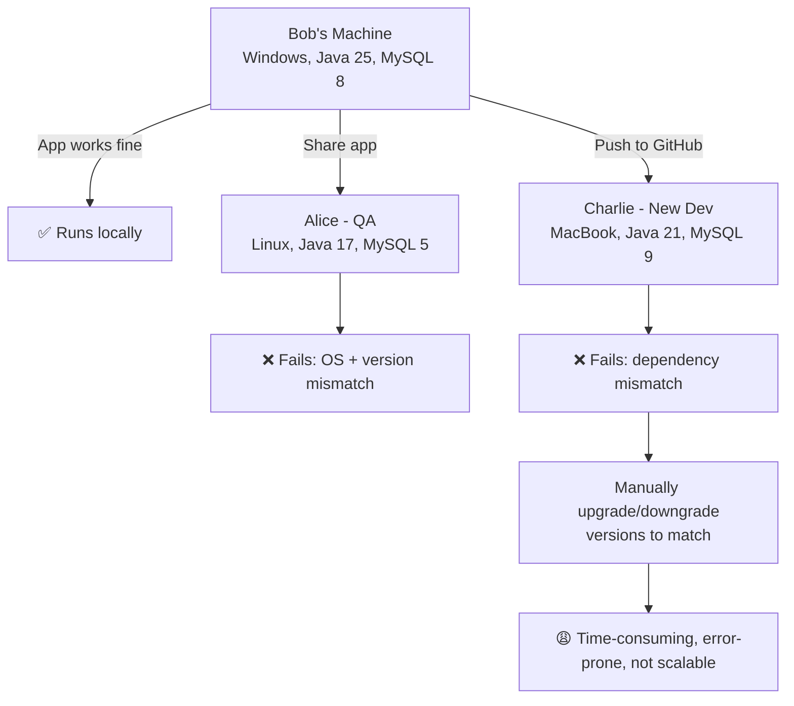
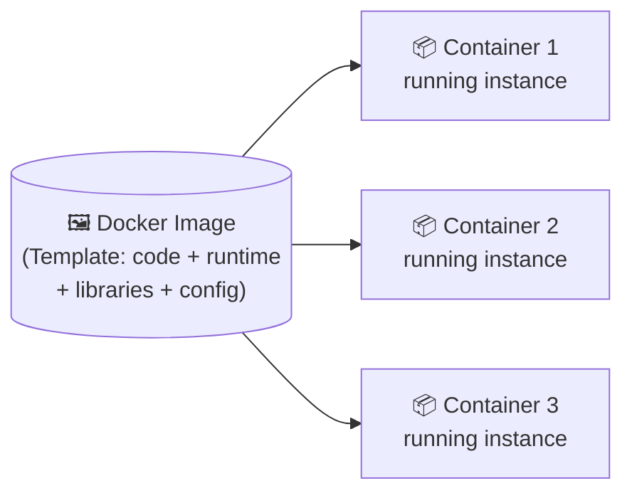
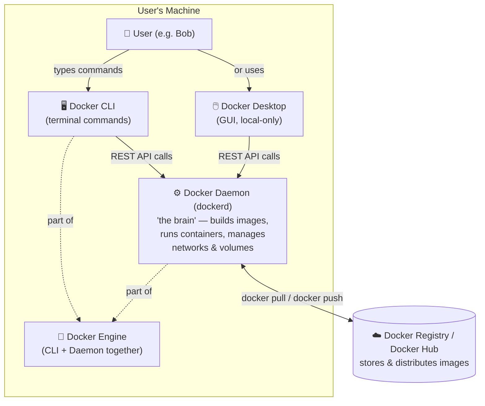
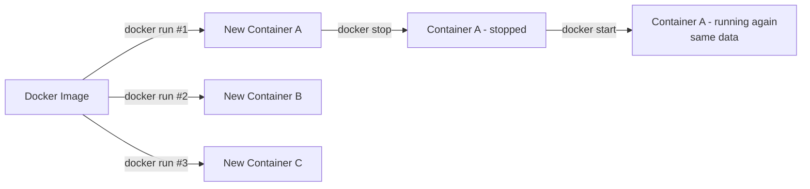
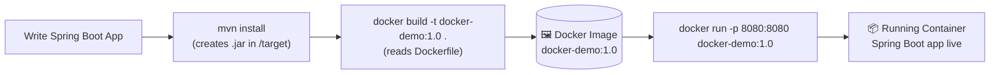
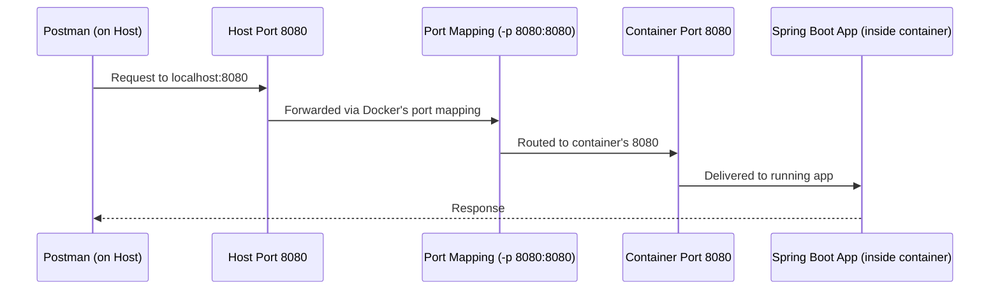
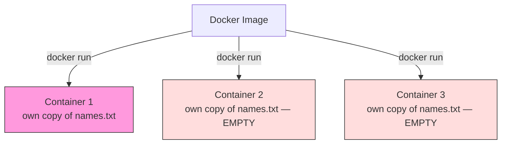
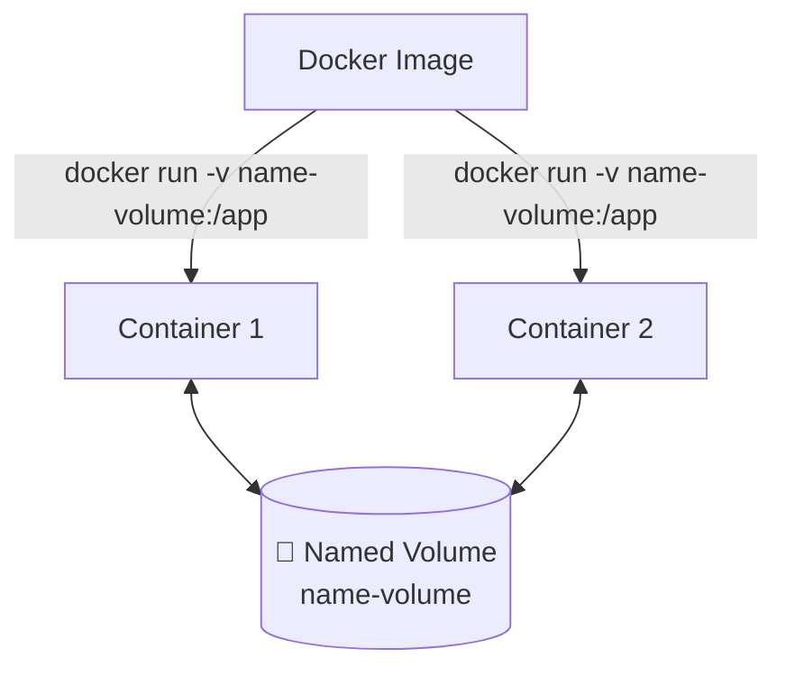
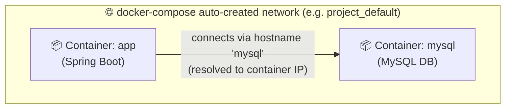
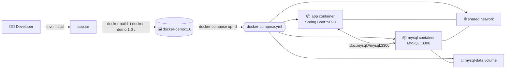

# 🐳 Docker – Complete Learning Guide

> A detailed revision README built from a one-shot Docker course transcript, restructured with diagrams, explanations, and real code examples for deep learning.

---

## 📑 Table of Contents

1. [Why Does Docker Exist? (The Problem)](#1-why-does-docker-exist-the-problem)
2. [What is Docker?](#2-what-is-docker)
3. [Docker Architecture](#3-docker-architecture)
4. [Key Terminology](#4-key-terminology)
5. [Installing Docker](#5-installing-docker)
6. [Core Docker Commands (Images & Containers)](#6-core-docker-commands-images--containers)
7. [Dockerfile – Containerizing a Spring Boot App](#7-dockerfile--containerizing-a-spring-boot-app)
8. [Port Mapping](#8-port-mapping)
9. [Environment Variables / Config](#9-environment-variables--config)
10. [Docker Volumes (Data Persistence)](#10-docker-volumes-data-persistence)
11. [Docker Compose](#11-docker-compose)
12. [Docker Networking](#12-docker-networking)
13. [Full Example: Spring Boot + MySQL with Compose](#13-full-example-spring-boot--mysql-with-compose)
14. [Complete Command Cheat Sheet](#14-complete-command-cheat-sheet)
15. [Best Practices (Bonus, from Docker's official guidance)](#15-best-practices-bonus)
16. [Summary / Revision Checklist](#16-summary--revision-checklist)
17. [References](#17-references)

---

## 1. Why Does Docker Exist? (The Problem)

Before learning **what** Docker is, it's important to understand **why** it was created — the pain point it solves.

### The Story: Bob, Alice, and Charlie

**Bob** (a developer) has a **Windows machine** with:
- Java 25
- MySQL 8
- A Spring Boot application he built and tested — it works perfectly on his machine.

He hands the application to **Alice** (QA) to test. Alice's environment is different:
- **Linux OS**
- Java 17
- MySQL 5

When Alice deploys Bob's app, it **fails** — because of OS and dependency version mismatches. This is the classic complaint:

> "It works on my machine!" 🤷

Then **Charlie**, a new developer, joins the team with a **MacBook**:
- Java 21
- MySQL 9

Charlie pulls the code from GitHub and it **fails again** for the same reason — different runtime/version/OS combination.

To fix it, Charlie has to manually upgrade/downgrade Java and MySQL versions to match what the app expects — wasted time, frustration, and a fragile workaround.



### The Traditional (Bad) Fix

Historically, teams solved this by writing **heavy documentation** — installation guides, README setup steps, environment checklists. But this approach:
- Requires huge manual effort from every team member
- Is error-prone (steps get missed or misread)
- Doesn't scale as team size grows
- Breaks the moment OS/tool versions drift

### Root Causes

| Problem | Description |
|---|---|
| **Environment mismatch** | Different OS across dev/QA/prod |
| **Version mismatch** | Different Java/DB/library versions |
| **Deployment problems** | App behaves differently in different environments |
| **Dependency problems** | Missing or conflicting libraries |

**Docker solves all of this** by packaging the application **together with its entire runtime environment** so it behaves identically everywhere.

---

## 2. What is Docker?

> **Docker** is a tool that lets you package an application **and its entire environment** (code, runtime, libraries, OS packages, configuration) into a **single portable unit**.

That "unit" contains everything the app needs to run — so it works the same way on any machine, regardless of what's installed on the host.

### Analogy 1: Building Architecture (Blueprint)

A builder creates one **architecture/blueprint**. Using that single blueprint, they can construct **many identical buildings**, anywhere.

### Analogy 2: Java Class and Object

A **class** is a template. From one class, you can create **many objects**. Similarly:

| Docker Concept | Analogy |
|---|---|
| **Docker Image** | The *class* / the *blueprint* — a read-only template defining app code, runtime, dependencies, and configuration |
| **Docker Container** | The *object* / the *building* — a running instance created from the image |



**Key takeaway:** One image → many independent, identical containers, on any machine that has Docker installed. Bob no longer shares his *application*; he shares a Docker **image**. Charlie just runs it in a **container** — no manual setup needed at all.

---

## 3. Docker Architecture

Docker has a client–daemon architecture. Here are the pieces and how they connect:



### Explanation of each piece

| Component | Role |
|---|---|
| **Docker CLI** | The command-line tool you type `docker ...` commands into. Works everywhere (local machine, AWS, any cloud server). |
| **Docker Desktop** | A GUI wrapper around Docker, available **only on local machines** (Mac/Windows/Linux desktop). **Not available on cloud servers like AWS** — so it's recommended to get comfortable with the CLI. |
| **Docker Daemon (`dockerd`)** | The core background process — the "brain" of Docker. It actually executes every command (build image, run container, manage networks/volumes). Without the daemon running, no Docker command will work. |
| **Docker Engine** | The combination of Docker CLI + Docker Daemon running together. |
| **Docker Registry / Docker Hub** | A remote storage service for images. When you run `docker pull` (or `docker run` with an image not present locally), Docker Daemon checks locally first, and if not found, fetches it from the registry (Docker Hub by default). |

> 💡 The CLI and Daemon communicate over a **REST API**, and the Daemon does the actual heavy lifting.

---

## 4. Key Terminology

| Term | Meaning |
|---|---|
| **Image** | A read-only template/blueprint containing app code, runtime, dependencies, and config. |
| **Container** | A running (or stopped) instance of an image — isolated, lightweight, portable. |
| **Dockerfile** | A text file with step-by-step instructions to build a Docker image. |
| **Docker Engine** | Docker CLI + Docker Daemon. |
| **Docker Daemon** | Background service (`dockerd`) that executes all Docker operations. |
| **Docker Registry / Hub** | A place to store and share images (e.g. hub.docker.com). |
| **Docker Compose** | A tool/YAML format to define and run multi-container applications with a single command. |
| **Volume** | Persistent storage mechanism, independent of any container's lifecycle. |
| **Network** | Virtual network allowing containers to discover and communicate with each other. |

---

## 5. Installing Docker

1. Go to **docker.com** and download **Docker Desktop** for your OS (Mac Intel/Apple Silicon, Windows, or Linux).
2. Install it — this bundles the **Docker CLI**, **Docker Daemon**, and **Docker Desktop GUI** together.
3. Open Docker Desktop (this starts the Docker Daemon in the background).
4. Verify installation from a terminal:

```bash
# Check Docker CLI is installed
docker --version

# Check Docker is actually running (daemon reachable)
docker ps
```

If you see `Cannot connect to the Docker daemon...`, it means Docker Desktop (and thus `dockerd`) isn't running yet — start Docker Desktop first.

> ⚠️ On production/cloud servers (AWS EC2, etc.) there's no Docker Desktop GUI — you only get the Docker Engine (CLI + Daemon), so it's important to be comfortable with CLI commands.

---

## 6. Core Docker Commands (Images & Containers)

```bash
# Pull an image from Docker Hub without running it
docker pull nginx

# Run an image — pulls automatically if not present locally,
# creates a NEW container, and runs it in the foreground
docker run nginx

# Run in detached (background) mode
docker run -d nginx

# Run interactively (e.g. to explore an OS image like Ubuntu)
docker run -it ubuntu

# List currently RUNNING containers
docker ps

# List ALL containers (including stopped/exited ones)
docker ps -a

# Stop a running container
docker stop <container_id>

# Start an existing (stopped) container again — reuses same container
docker start <container_id>

# Remove all stopped containers
docker container prune

# List all local images
docker images

# See all available Docker commands
docker --help
```

### `docker run` vs `docker start`

This distinction trips up beginners — remember it clearly:

| Command | Behaviour |
|---|---|
| `docker run <image>` | Creates a **brand-new container** from the image every time |
| `docker start <container_id>` | Restarts an **already-existing** (stopped) container — same container, same data |



Each `docker run` spins up a **fresh** container with its own isolated filesystem — this is exactly why container data doesn't persist across `run`s (see [Volumes](#10-docker-volumes-data-persistence)).

---

## 7. Dockerfile – Containerizing a Spring Boot App

A **Dockerfile** is a plain text file containing step-by-step instructions that tell Docker how to build an image — think of it as a **recipe**.

### Minimum instructions needed

| # | Instruction | Purpose |
|---|---|---|
| 1 | `FROM` | Base/parent image to build on top of (every image extends another image — you rarely start from scratch) |
| 2 | `WORKDIR` | Sets the working directory inside the container |
| 3 | `COPY` | Copies files (e.g. your built `.jar`) from your machine into the image |
| 4 | `EXPOSE` | Documents which port the container listens on |
| 5 | `ENTRYPOINT` / `CMD` | The startup command — how the app is launched inside the container |

### Example Dockerfile (Spring Boot app)

```dockerfile
# 1. Base image — an image that already has Java installed
FROM eclipse-temurin:17-jdk

# 2. Working directory inside the container
WORKDIR /app

# 3. Copy the built jar file from your Maven "target" folder into the image
COPY target/docker-demo-1.0.jar app.jar

# 4. Document the port this app listens on
EXPOSE 8080

# 5. Command to start the application when the container runs
ENTRYPOINT ["java", "-jar", "app.jar"]
```

> 📝 Note: the original transcript used `FROM openjdk`, but that image has since been deprecated/removed from Docker Hub. Use **`eclipse-temurin`** (the official OpenJDK successor image) instead — this is the currently maintained equivalent.

### Build & Run Flow



### Build & Run Commands

```bash
# Build image from the Dockerfile in the current directory ('.')
# -t = tag/name the image
docker build -t docker-demo:1.0 .

# Verify it exists
docker images

# Run the image → creates and starts a container
docker run -d -p 8080:8080 docker-demo:1.0

# Get an interactive shell INSIDE a running container
docker exec -it <container_id> bash
# then inside the container:
ls
cat name.txt
exit
```

`docker exec -it <container_id> bash` is extremely useful for debugging — it drops you into a live shell inside the running container.

---

## 8. Port Mapping

This is one of the most confusing parts for beginners — but it's simple once visualized.

**The problem:** Your app inside the container listens on port `8080` **inside the container's own network namespace**. Your host machine's port `8080` is a completely separate, unrelated port. If Postman on your host sends a request to `localhost:8080`, it has *no idea* the container even exists — unless you explicitly map the ports together.



### Syntax

```bash
docker run -d -p <HOST_PORT>:<CONTAINER_PORT> docker-demo:1.0

# Example: host 8080 -> container 8080
docker run -d -p 8080:8080 docker-demo:1.0

# Example: host 8080 -> container 9090 (different ports each side)
docker run -d -p 8080:9090 docker-demo:1.0
```

> Left side of the colon = **host** port (your machine). Right side = **container** port (inside Docker).

---

## 9. Environment Variables / Config

Instead of hardcoding values (like the server port) inside `application.yml`, you can parameterize them so they can be overridden at runtime:

```yaml
# application.yml
server:
  port: ${SERVER_PORT:8080}   # use SERVER_PORT env var if set, else default to 8080
```

Pass the environment variable using the `-e` flag when running the container:

```bash
docker run -d -p 8080:9090 -e SERVER_PORT=9090 docker-demo:1.0
```

Here, the app inside the container will now run on port `9090` (as set via env var), and the host's `8080` is mapped to the container's `9090`.

This is powerful because the **same image** can be configured differently for dev, QA, and prod — without rebuilding it.

---

## 10. Docker Volumes (Data Persistence)

### The Problem

Every time you run `docker run`, Docker creates a **new container** with a **fresh, empty filesystem**. Any data written inside a container (like a `names.txt` file) is **lost** the moment that specific container is discarded/recreated — because a new container doesn't share the old container's file data.



### The Solution: Volumes

A **Docker Volume** is storage that lives **outside** any single container's lifecycle. Multiple containers (or new containers replacing old ones) can attach to the **same volume** and share the same persistent data.



### Named Volumes — Commands

```bash
# Run a container and mount a named volume to a directory inside the container
docker run -d -p 8080:8080 -v name-volume:/app docker-demo:1.0

# List all volumes
docker volume ls

# Inspect volume details
docker volume inspect name-volume

# Remove a volume (container using it must be stopped/removed first)
docker container prune
docker volume rm name-volume
```

### Bind Mounts (Local Folder as Volume)

Instead of an abstract Docker-managed volume, you can map a container's directory directly to a **real folder on your host machine** — changes sync both ways, live:

```bash
docker run -d -p 8080:8080 -v /Users/me/project/app/names.txt:/app/names.txt docker-demo:1.0
```

| Type | Description | Use case |
|---|---|---|
| **Named Volume** | Docker-managed storage (location abstracted away) | Databases, general persistent app data |
| **Bind Mount** | Direct link to a specific host folder/file | Local development, live file syncing, config files |

---

## 11. Docker Compose

### The Problem

As you add more flags — `-d`, `-p`, `-e`, `-v` — your `docker run` command becomes long, repetitive, and error-prone to type every single time.

### The Solution

> **Docker Compose** lets you define and run multi-container applications using a single **YAML file** instead of long CLI commands.

### Example `docker-compose.yml` (single service)

```yaml
version: "1.0"
services:
  app:
    image: docker-demo:1.0
    ports:
      - "9090:9090"
    environment:
      SERVER_PORT: 9090
    volumes:
      - name-volume:/app

volumes:
  name-volume:
```

> ⚠️ Common mistake (from the transcript): YAML requires a **colon (`:`)**, not `=`, for key-value pairs under `environment` and `volumes`.

### Compose Commands

```bash
# Build the image first (Compose does NOT build automatically unless configured to)
docker build -t docker-demo:1.0 .

# Start all services defined in docker-compose.yml (foreground)
docker compose up

# Start in detached/background mode
docker compose up -d

# Stop and remove containers + networks (volumes are KEPT by default)
docker compose down
```

> 💾 Note: `docker compose down` removes containers and the auto-created network, but **named volumes persist** — so your data survives even after `down`, and reappears the next time you `up`.

---

## 12. Docker Networking

### The Problem

If your Spring Boot app runs in one container and your MySQL database runs in another container, how do they talk to each other? They're isolated by default.

### The Solution

> A **Docker network** lets containers discover and communicate with each other **by container/service name**, as if they were on the same LAN.

When you define multiple services inside one `docker-compose.yml`, Compose **automatically creates a network** and attaches every service to it — no manual setup needed.



Inside the app's config, instead of `localhost`, you use the **service/container name** as the hostname:

```yaml
# application.yml (inside the app container)
spring:
  datasource:
    url: jdbc:mysql://mysql:3306/docker_demo_db   # 'mysql' = the service name in compose
```

### Networking Commands

```bash
# List all Docker networks
docker network ls

# Inspect a specific network
docker network inspect <network_name>
```

---

## 13. Full Example: Spring Boot + MySQL with Compose

This ties together **Dockerfile + Compose + Volumes + Networking + Env config** into one real, working multi-container application.



### `docker-compose.yml`

```yaml
version: "1.0"
services:
  app:
    image: docker-demo:3.0
    ports:
      - "9090:9090"
    environment:
      SERVER_PORT: 9090
      DB_HOST: mysql          # matches the mysql service name below
    depends_on:
      - mysql

  mysql:
    image: mysql:8
    container_name: mysql
    restart: always
    ports:
      - "3306:3306"
    volumes:
      - mysql-data:/var/lib/mysql
    environment:
      MYSQL_ROOT_PASSWORD: root
      MYSQL_DATABASE: docker_demo_db

volumes:
  mysql-data:
```

### `application.yml` (inside the Spring Boot project)

```yaml
spring:
  datasource:
    url: jdbc:mysql://${DB_HOST:localhost}:3306/docker_demo_db
    username: root
    password: root
  jpa:
    hibernate:
      ddl-auto: update
```

### Commands to Run It

```bash
# 1) Build the jar
mvn install

# 2) Build the Docker image
docker build -t docker-demo:3.0 .

# 3) Bring up BOTH containers (app + mysql), networked together
docker compose up -d

# 4) Test the API
curl -X POST http://localhost:9090/users -H "Content-Type: application/json" -d '{"name":"Chan"}'
curl http://localhost:9090/users
```

**Key insight from the transcript:** the connection config (`DB_HOST`) must go under the **`app`** service's environment — not under `mysql` — since it's the *app* that needs to know how to reach the database, not the other way around. A very common beginner mistake.

### Reusable Project Workflow (one-time image build, then always just 2 commands)

```bash
# Anyone who clones this repo only needs to run:
docker build -t docker-demo .
docker compose up -d
```

No manual Java/MySQL installation, no version conflicts, no "works on my machine" — that's the entire point of Docker.

---

## 14. Complete Command Cheat Sheet

| Category | Command | Description |
|---|---|---|
| **Info** | `docker --version` | Check Docker CLI version |
| | `docker ps` | List running containers |
| | `docker ps -a` | List all containers (incl. stopped) |
| | `docker images` | List local images |
| | `docker --help` | Show all available commands |
| **Images** | `docker pull <image>` | Download image from registry |
| | `docker build -t <name>:<tag> .` | Build image from Dockerfile |
| | `docker push <image>` | Upload image to registry |
| **Containers** | `docker run <image>` | Create + start a new container |
| | `docker run -d <image>` | Run in detached (background) mode |
| | `docker run -it <image>` | Run interactively with a terminal |
| | `docker run -p host:container <image>` | Map ports |
| | `docker run -e KEY=value <image>` | Pass environment variable |
| | `docker run -v vol:/path <image>` | Attach a volume |
| | `docker start <id>` | Restart an existing stopped container |
| | `docker stop <id>` | Stop a running container |
| | `docker exec -it <id> bash` | Open shell inside running container |
| | `docker container prune` | Remove all stopped containers |
| **Volumes** | `docker volume ls` | List volumes |
| | `docker volume inspect <name>` | View volume details |
| | `docker volume rm <name>` | Delete a volume |
| **Networks** | `docker network ls` | List networks |
| | `docker network inspect <name>` | View network details |
| **Compose** | `docker compose up` | Start services (foreground) |
| | `docker compose up -d` | Start services (background) |
| | `docker compose down` | Stop & remove containers/network |

---

## 15. Best Practices (Bonus)

The transcript covers the fundamentals; here are additional, widely-recommended practices worth knowing for real production use:

### `.dockerignore` file
Just like `.gitignore`, exclude files you don't want copied into the build context (keeps builds fast and images small):

```
.git
target/
*.log
node_modules/
.env
```

### Multi-stage builds
Build tools (like Maven) don't need to exist in your final runtime image — only the compiled artifact does. Multi-stage builds compile in one stage and copy just the final output into a slim runtime stage:

```dockerfile
# ---- Stage 1: Build ----
FROM maven:3.9-eclipse-temurin-17 AS build
WORKDIR /app
COPY . .
RUN mvn clean package -DskipTests

# ---- Stage 2: Runtime (much smaller) ----
FROM eclipse-temurin:17-jre
WORKDIR /app
COPY --from=build /app/target/*.jar app.jar
EXPOSE 8080
ENTRYPOINT ["java", "-jar", "app.jar"]
```

This can shrink final image size dramatically since compilers and build caches never make it into the shipped image.

### Other recommended habits
- Prefer smaller base images (`-slim`, `-alpine`) where compatible.
- Order Dockerfile instructions so rarely-changing steps (like dependency installs) come **before** frequently-changing steps (like copying source code) — this maximizes Docker's layer caching.
- Avoid running containers as the `root` user in production images.
- Pin specific image versions/tags rather than relying on `latest`, for reproducible builds.

---

## 16. Summary / Revision Checklist

Use this as a quick self-check while revising:

- [ ] I can explain **why** Docker exists (the "works on my machine" problem)
- [ ] I understand the difference between an **image** and a **container**
- [ ] I can describe the roles of **Docker CLI, Daemon, Engine, Desktop, Registry**
- [ ] I can install Docker and verify it with `docker --version` / `docker ps`
- [ ] I can write a basic **Dockerfile** (FROM, WORKDIR, COPY, EXPOSE, ENTRYPOINT)
- [ ] I can **build** (`docker build`) and **run** (`docker run`) an image
- [ ] I understand **port mapping** (`-p host:container`)
- [ ] I can pass **environment variables** (`-e`)
- [ ] I understand why containers lose data on recreation, and how **volumes** fix it
- [ ] I know the difference between **named volumes** and **bind mounts**
- [ ] I can write and run a **docker-compose.yml** file
- [ ] I understand how **Docker networking** lets containers talk to each other by name
- [ ] I can containerize a full **app + database** stack end-to-end

---

## 17. References

- Original video transcript: "Docker One-Shot" (Code Snippet) — used as the primary structure for this guide
- [Docker Official Documentation](https://docs.docker.com/)
- [Docker Hub](https://hub.docker.com/)
- [Docker Compose File Reference](https://docs.docker.com/compose/compose-file/)
- Dockerfile best practices & multi-stage build guidance — general 2026 community references on layer caching, `.dockerignore`, and slim runtime images

---

*Prepared for personal revision — organized from a full video transcript into a structured, diagram-supported study guide.*
