# 📘 Dynatrace Complete Guide — From Scratch to Advanced
*A detailed revision README compiled from a full-length Dynatrace training video transcript, structured, explained, and supplemented with additional context for deep learning.*

---

## 📑 Table of Contents

1. [Introduction & Course Roadmap](#1-introduction--course-roadmap)
2. [Dynatrace Architecture Overview](#2-dynatrace-architecture-overview)
3. [OneAgent Installation on Linux (AWS EC2)](#3-oneagent-installation-on-linux-aws-ec2)
4. [Host Performance Monitoring](#4-host-performance-monitoring)
5. [Renaming a Host](#5-renaming-a-host)
6. [Tagging in Dynatrace (Manual & Automatic)](#6-tagging-in-dynatrace-manual--automatic)
7. [Process Group & Process Monitoring](#7-process-group--process-monitoring)
8. [Process Availability Monitoring (Custom Rule)](#8-process-availability-monitoring-custom-rule)
9. [Maintenance Windows](#9-maintenance-windows)
10. [Custom Alerts — Metric Events](#10-custom-alerts--metric-events)
11. [Real User Monitoring (RUM)](#11-real-user-monitoring-rum)
12. [Synthetic Monitoring](#12-synthetic-monitoring)
13. [ActiveGate Installation](#13-activegate-installation)
14. [Dynatrace Pattern Language (DPL)](#14-dynatrace-pattern-language-dpl)
15. [Dynatrace Query Language (DQL)](#15-dynatrace-query-language-dql)
16. [Dashboards](#16-dashboards)
17. [Notebooks](#17-notebooks)
18. [Segments](#18-segments)
19. [Dynatrace API](#19-dynatrace-api)
20. [Quick Reference Cheat-Sheets](#20-quick-reference-cheat-sheets)
21. [Further Learning Resources](#21-further-learning-resources)

---

## 1. Introduction & Course Roadmap

The training covers Dynatrace end-to-end, in this order:

| # | Topic | Purpose |
|---|-------|---------|
| 1 | OneAgent installation (Linux) | Get monitoring data flowing |
| 2 | Host performance monitoring | View CPU, memory, disk, network |
| 3 | Rename host | Make host names readable |
| 4 | Process monitoring | Understand process groups |
| 5 | Service monitoring | Auto-detected service topology |
| 6 | Maintenance windows | Suppress alerts during planned work (e.g., patching) |
| 7 | Tags (manual & automatic) | Organize/label entities |
| 8 | Custom alerts (metric events) | Monitor beyond Dynatrace defaults |
| 9 | Real User Monitoring (RUM) | Agent-based & agentless |
| 10 | Synthetic monitoring | Proactive checks (HTTP/browser/network) |
| 11 | ActiveGate installation | Secure gateway for private-location monitoring |
| 12 | Dynatrace Pattern Language (DPL) | Extract structured data from unstructured logs |
| 13 | DQL (Dynatrace Query Language) | SQL-like querying of logs/metrics/events |
| 14 | Dashboards | Visualize data |
| 15 | Notebooks | DQL-based analysis workspace |
| 16 | Segments | Reusable data-scoping filters |
| 17 | Dynatrace API | Automate everything "as code" |

### High-Level Learning Flow

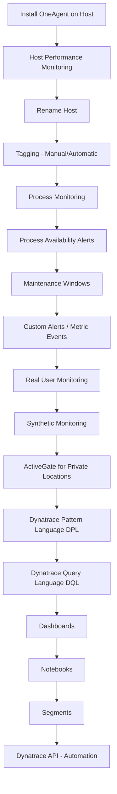

---

## 2. Dynatrace Architecture Overview

Before diving into steps, it helps to understand *how the pieces fit together*.

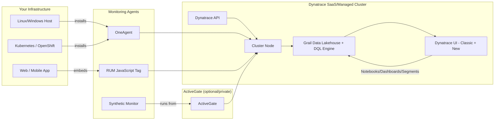

**Key concepts:**
- **OneAgent** — a single agent installed per host that auto-discovers processes, services, and technologies (full-stack monitoring).
- **ActiveGate** — a secure proxy/gateway used for environments without direct internet access, for synthetic monitoring from **private locations**, and for routing OneAgent traffic through a central point.
- **Grail** — Dynatrace's underlying data lakehouse that stores logs, metrics, traces, and events, queried using **DQL**.
- **Classic UI vs. New/Modern UI** — Dynatrace is transitioning from the "classic" web UI (apps like *Host classic*, *Synthetic classic*, *Settings classic*) to a new unified **Apps**-based UI (*Infrastructure & Operations*, *Application Observability*, *Notebooks*). Both show the same underlying data, just presented differently.

---

## 3. OneAgent Installation on Linux (AWS EC2)

### 3.1 Monitoring Modes

Dynatrace OneAgent offers **three monitoring modes** at install time:

| Mode | What it Monitors | Use Case |
|------|-------------------|----------|
| **Full-Stack** | End-to-end: OS + processes + services + applications | Most common — complete observability |
| **Infrastructure-only** | OS-level only (CPU, memory, disk) | When you only need host health, not app-level tracing |
| **Discovery** | Very basic reachability/health check | Lightweight inventory/discovery |

### 3.2 Step-by-Step Installation Flow

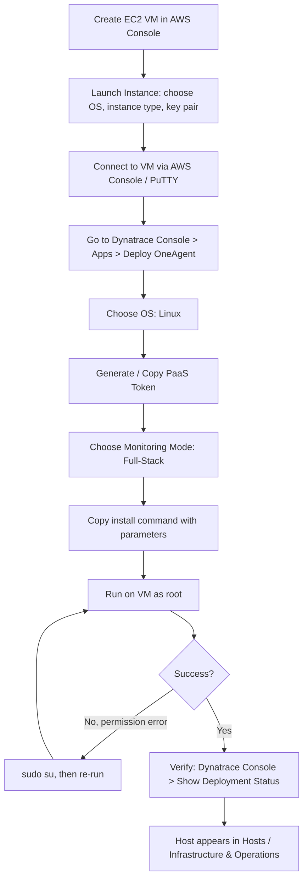

### 3.3 Practical Steps (as demonstrated)

1. **Provision a VM**
   - AWS Console → EC2 → *Launch Instance*
   - Name it (e.g., `Linux-001`)
   - Choose OS (e.g., Amazon Linux)
   - Choose Instance Type (Free Tier for practice/learning)
   - Create/select a **Key Pair** (e.g., `DT-training`) — required to SSH/login later. **Save the key file safely**; you'll need it every time you connect.
   - Click **Launch Instance**

2. **Get the install command from Dynatrace**
   - Dynatrace Console → **Apps** → search **"Deploy OneAgent"**
   - Select OS: **Linux**
   - **Create Token** (a PaaS/installer token used to authenticate the download) — copy and store it
   - Choose **Monitoring Mode** = *Full Stack*
   - Copy the generated install command (a `curl`/`wget`-and-`sh` sequence)

3. **Connect to the VM**
   - AWS Console → EC2 → Instances → select instance → **Connect**

4. **Download → Verify → Install** (three distinct steps)

```bash
# STEP 1 — Download the OneAgent installer (command copied from Dynatrace console)
wget -O Dynatrace-OneAgent-Linux.sh \
  "https://<your-environment-id>.live.dynatrace.com/api/v1/deployment/installer/agent/unix/default/latest?arch=x86&flavor=default" \
  --header="Authorization: Api-Token <YOUR_PAAS_TOKEN>"

# STEP 2 — Verify the installer's digital signature (integrity/security check)
wget -N -O Dynatrace-OneAgent-Linux.sh.sha256 \
  "https://<your-environment-id>.live.dynatrace.com/api/v1/deployment/installer/agent/unix/default/latest/metainfo?arch=x86&flavor=default" \
  --header="Authorization: Api-Token <YOUR_PAAS_TOKEN>"
sha256sum -c Dynatrace-OneAgent-Linux.sh.sha256

# STEP 3 — Install (MUST be run as root)
sudo su
/bin/sh Dynatrace-OneAgent-Linux.sh \
  --set-monitoring-mode=fullstack \
  --set-app-log-content-access=true
```

> ⚠️ **Important gotcha demonstrated in the video:** Running the installer *without root privileges* fails with an explicit error:
> `Dynatrace OneAgent installer requires root privilege`
> Fix: run `sudo su` first (become root), then re-run the installer command.

5. **Custom install parameters** — you can pass flags such as:
   - `--set-monitoring-mode=fullstack|infra-only|discovery`
   - `--set-app-log-content-access=true` (enables **log monitoring/log content capture**)
   - Many other flags exist for proxy settings, host groups, network zones, etc. (see Dynatrace docs).

6. **Verify installation**
   - On the VM, wait for the install to complete (extraction, verification, path checks happen automatically).
   - In Dynatrace Console → click **Show Deployment Status** → confirms *"Dynatrace OneAgent has successfully connected to Dynatrace cluster node"*.
   - Cross-check the **private IP address** shown in Dynatrace against the AWS EC2 console to confirm it's the same VM.

### 3.4 Supported Platforms
Dynatrace OneAgent supports: **Windows, Linux, AIX, Solaris, Kubernetes, OpenShift**, and more (containers, cloud-native, VMs).

---

## 4. Host Performance Monitoring

Once OneAgent is installed and connected, Dynatrace begins collecting host-level telemetry within a few minutes.

### 4.1 Where to Find It
- **Classic UI:** Apps → **Hosts** (a.k.a. *Host classic*)
- **New/Modern UI:** Apps → **Infrastructure & Operations** (same underlying data, new layout)

### 4.2 Data Available per Host

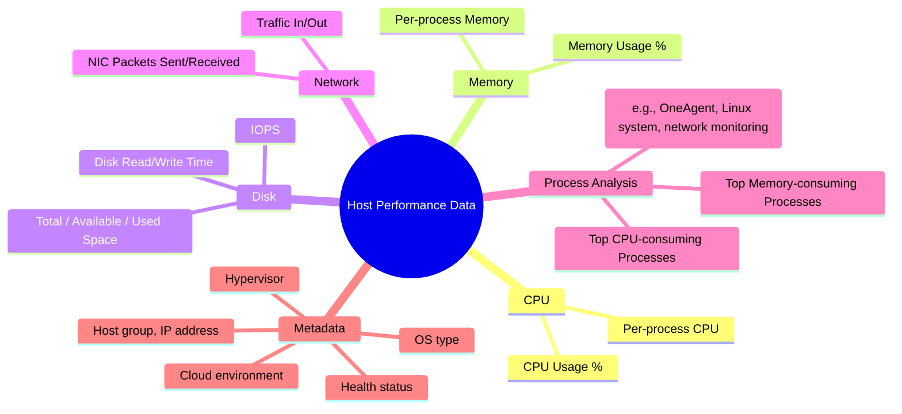

### 4.3 Practical Use — Troubleshooting High CPU
A common real-world scenario demonstrated: *"CPU usage is very high on this VM — how do I find the cause?"*

**Steps:**
1. Open the specific Host.
2. Go to **Process Analysis** section.
3. Sort/view by CPU or Memory usage — Dynatrace lists every detected process with exact resource consumption (e.g., `Dynatrace OneAgent extension — 0.017%`).
4. Drill into a specific **technology** (e.g., network monitoring, log analytics) to see its individual CPU/memory footprint.
5. Cross-reference with **Disk Analysis** and **Network Analysis** tabs for a full root-cause picture.

### 4.4 Time-Range Filtering
Both classic and new UI allow flexible time windows:
- Quick presets: last 5 min, 30 min, 2 hrs, etc.
- Custom relative time (e.g., typing `-5` for "last 5 minutes")
- Custom calendar date ranges

---

## 5. Renaming a Host

By default, Dynatrace auto-detects a host name (often an internal/technical name or IP). For clarity in large environments, you should rename it.

### 5.1 Steps
1. Open the Host you want to rename.
2. Click the **three-dot (⋮) menu** → **Settings**.
3. Under **General**, find the **rename** field.
4. Enter your custom name (e.g., matching your CMDB/inventory name, like `Linux-001`).
5. Save — the new name now appears everywhere the host is referenced.

### 5.2 Reverting
- Same path: **⋮ → Settings → General → "Reset name to detected"** — restores Dynatrace's auto-detected name.

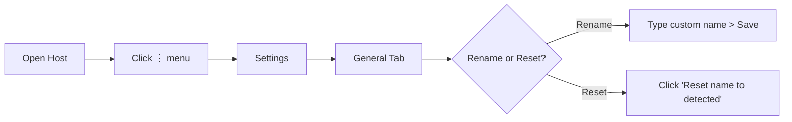

---

## 6. Tagging in Dynatrace (Manual & Automatic)

**Definition:** A **tag** is a label (key or key=value pair) attached to a monitored entity — host, process, service, application, or synthetic monitor. Tags drive filtering, dashboards, problem management, management zones, and maintenance windows.

### 6.1 Two Tagging Methods

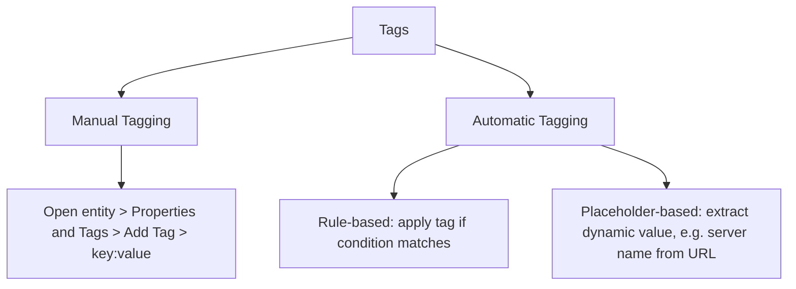

### 6.2 Manual Tagging (small environments)
**Steps:**
1. Open the entity (e.g., a Host).
2. Go to **Properties and Tags**.
3. Click **Add Tag**.
4. Enter `key = environment`, `value = prod` (example).
5. Click **Add Tag** — done.

> Manual tags are practical only for a handful of entities; for large fleets, use automatic tagging.

### 6.3 Automatic Tagging — Rule-Based
Used to bulk-apply tags across many entities based on conditions.

**Path:** `Settings (classic) → Tags → Automatically applied tags → Create tag`

**Example — tag all process groups matching a name with `team=payments`:**
1. Provide tag **name** (e.g., `team`) and **value** (e.g., `payments team`).
2. **Rule applies to:** choose entity type (e.g., *Process groups*, *Services*, *Hosts*).
3. **Rule type:** *Monitored entity* (or *Entity selector*, depending on use case).
4. Click **Add condition** → e.g., *"Detected process group name contains Amazon SSM Agent"*.
5. **Save changes.**

> 🔑 **Key learning point:** If a *process group* has a tag, its child *processes* automatically inherit visibility of that tag relationship (since processes belong to process groups).

### 6.4 Automatic Tagging — Placeholder-Based (Dynamic Extraction)
This is the more advanced and powerful technique, demonstrated using **synthetic HTTP monitors** whose URLs embed a server name (e.g., `KLE5150` inside a monitored URL).

**Problem it solves:** You have hundreds of synthetic monitors, each with a different server name embedded in the URL. Manually tagging each is impractical, and a static key=value tag can't capture a *different* value per entity.

**Steps:**
1. `Settings classic → Tags → Automatically applied tags → Create tag`
2. Give the tag a name, e.g., `server name`.
3. Click **Add new rule**.
4. **Rule type must be "Monitored entity"** (⚠️ *placeholders do NOT work with "Entity selector"* — this throws an explicit error if selected incorrectly).
5. Choose what the rule applies to (e.g., *HTTP monitors / synthetic monitors*).
6. Add a **condition**, e.g., *"HTTP monitor name contains ..."* to scope which monitors get the tag.
7. In the placeholder field, define **which portion of the URL/text to extract** as the tag value.
8. **Save changes** — Dynatrace now generates a dynamic, per-entity tag value (e.g., `server name = KLE5150`) automatically.

> 💡 This is functionally similar to using a regex/capture-group to pull a substring out of a larger string and use it as a dynamic tag value.

### 6.5 Where Tags Are Used
- Filtering dashboards & problem views
- Scoping **Maintenance Windows** (only suppress alerts for tagged entities)
- Defining **Management Zones**
- Segment/data scoping

---

## 7. Process Group & Process Monitoring

### 7.1 What is a Process Group?
> **Process Group** = a logical grouping of *identical processes* running on one or more servers (e.g., all instances of an `nginx` or `java` process across a fleet are grouped together).

### 7.2 Navigating to Process Data
```
Host → Host Performance tab → Process Analysis → click a process → "View Process Group"
```

- Inside a process's **Properties and Tags**, you can inspect/verify tags (useful after setting up automatic tagging, as shown in Section 6.3).
- Detected **technologies** (e.g., "Dynatrace Go," "Linux," "Network Monitoring") each show individual CPU/memory consumption.

### 7.3 Concept Diagram

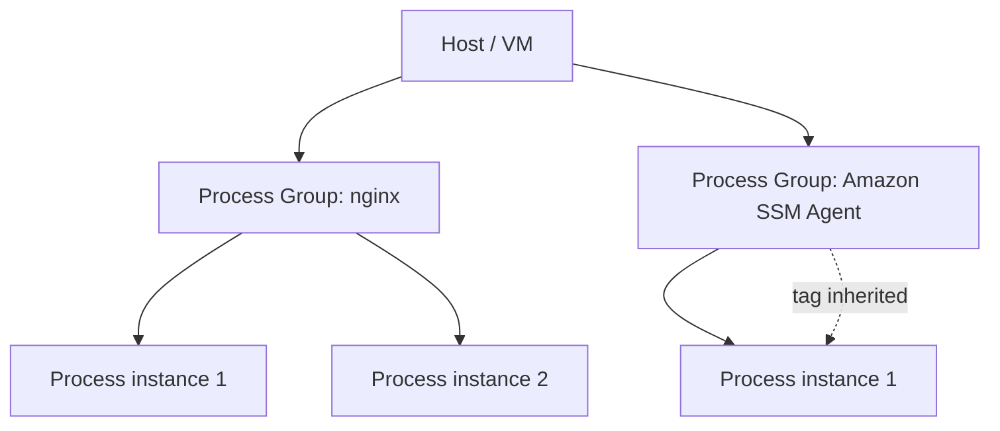

---

## 8. Process Availability Monitoring (Custom Rule)

**Real-world motivation:** *"An Apache web server needs 4 worker processes. If only 1 is running, requests get dropped, the server slows down, or the process may even crash."* Dynatrace can count running processes matching a rule and alert if the count falls below expectations.

### 8.1 Steps
**Path:** `Settings classic → Process and containers → Process availability → Add monitoring rule`

1. **Name the rule** (e.g., `bash process monitoring`).
2. **Select operating system(s)** the rule applies to (e.g., unselect Windows/AIX if targeting only Linux).
3. Set **"Minimum number of matching processes"** — the threshold. If actual running-process count < this value → alert triggers.
4. Click **Add detection rule**:
   - **Rule scope:** `Process`
   - **Process property:** choose from `command line`, `executable`, `executable path`, `user` (executable is most common)
   - **Condition:** e.g., `$contains(bash)`
5. **Save changes.**

### 8.2 Verifying Behavior (demonstrated experiment)
```bash
# Count currently running processes matching a name, on the Linux host
ps -eaf | grep bash | wc -l
```
- The instructor intentionally set the rule's "minimum count" **higher** than the actual running count (e.g., required 3, but only 2 running) to **force a problem alert**, then verified it appeared under **Problems**.
- Lowering the required threshold back to match reality (e.g., 2) causes Dynatrace to **auto-resolve** the problem within a short time.

### 8.3 Flow Diagram

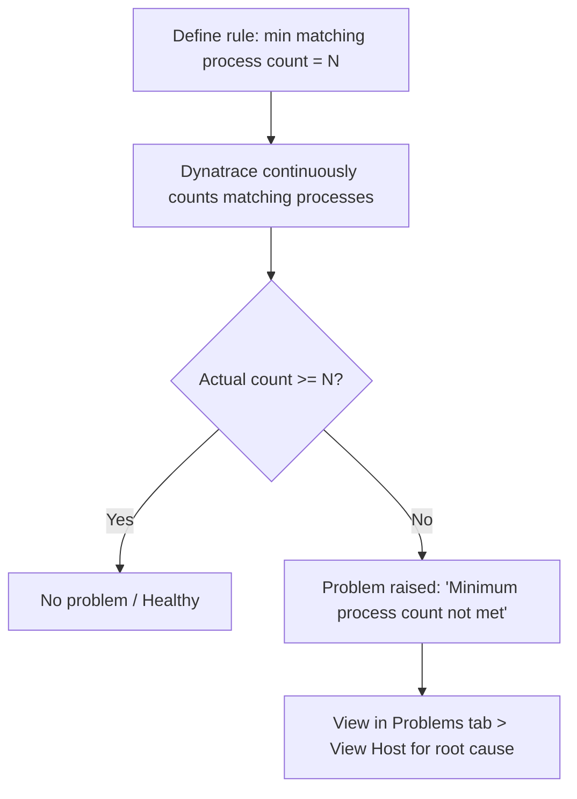

---

## 9. Maintenance Windows

**Purpose:** Suppress false alerts/tickets during **known, planned activities** (e.g., monthly patching) — without disabling monitoring entirely (data can still be collected, just not alerted on).

### 9.1 Path
```
Settings → Maintenance Window → Monitoring, alerting and availability → Add maintenance window
```

### 9.2 Configuration Options

| Setting | Options | Notes |
|---|---|---|
| **Maintenance mode type** | Planned / Unplanned | Choose *Planned* for scheduled patching |
| **Problem handling** | 1) Detect problems & alert<br>2) Detect problems, don't alert<br>3) Disable problem detection entirely | Option 3 is most common for patch windows — avoids noisy tickets (e.g., via ServiceNow integration) |
| **Synthetic execution** | Disable synthetic monitor execution (optional checkbox) | Prevents synthetic checks running during downtime |
| **Schedule / Recurrence** | Once / Daily / Weekly / Monthly | Choose based on the activity's cadence |
| **Start time / End time** | Must satisfy `start < end` | Dynatrace validates this and errors otherwise |
| **Timezone** | e.g., Central European Time | Important for globally distributed teams |
| **Scope (filter)** | Host / Host group / Entity tags / Management zones | **Critical** — without a filter, the maintenance window applies to *everything* in the environment |

### 9.3 Why Scoping Matters
> *"If you click Save without adding a filter, the maintenance mode applies to the ENTIRE environment — not what you want if you're patching only a subset of servers this week."*

To scope precisely:
- **Host** filter → applies to one specific server
- **Host Group** filter → applies to a pre-defined group of servers (useful for patch waves, e.g., "20 servers this week")
- **Entity Tags** filter → applies based on tags (ties back to Section 6)

### 9.4 Flow Diagram

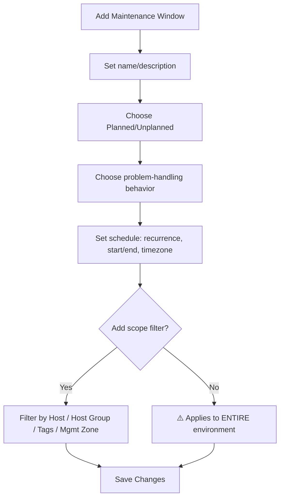

### 9.5 Management
- Existing windows are listed under the same path; expired ones can be bulk-deleted via **"Delete expired maintenance windows."**
- Individual windows can be deleted via a per-row action.

---

## 10. Custom Alerts — Metric Events

Dynatrace ships **preconfigured (default) anomaly detection** for common scenarios (web application crash rate, database service issues, disk/host thresholds, etc.). When you need to monitor something **not covered by defaults**, you create a **Metric Event**.

### 10.1 Path
```
Settings classic → Anomaly detection → Metric events → Add metric event
```

### 10.2 Steps
1. **Name** the event (e.g., `CPU usage monitoring`).
2. **Query definition → Type:**
   - **Metric key** (simpler, predefined)
   - **Metric selector** (advanced, flexible — the focus of the demo)
3. Search/select a metric (e.g., type `CPU` → choose `builtin:host.cpu.usage`).
4. **Getting the exact selector syntax** — two options:
   - Type it manually if you know it, or
   - Use **Apps → Data Explorer (classic)** to visually build a query, then copy the generated selector text.
5. In Data Explorer: select metric → optionally **Split by** (e.g., host) → **Filter by** (e.g., host name) → toggle **Advanced Mode** to reveal the raw selector string.
6. Remove any unwanted clauses (e.g., a default `limit` that would cap results — not desired if you want *all* matching hosts).
7. Copy the finalized selector and paste it into the Metric Event's **Metric selector** field.
8. Configure thresholds, alerting conditions, etc., and save.

### 10.3 Example Metric Selector Concept
```
builtin:host.cpu.usage
:splitBy("dt.entity.host")
:filter(eq("dt.entity.host","HOST-XXXXXXXXXXXXXXXX"))
```
*(Exact syntax is generated by Data Explorer's "Advanced Mode" — always verify against your environment.)*

### 10.4 Flow Diagram

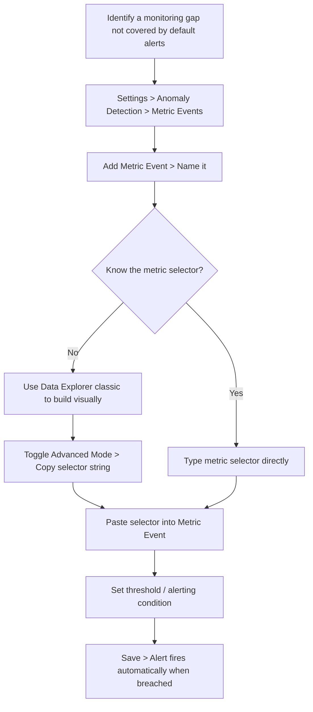

---

## 11. Real User Monitoring (RUM)

RUM captures how **actual end users** experience your web/mobile application — page load times, errors, browser types, geography, and whether traffic is human or bot.

Dynatrace supports **two RUM approaches**:

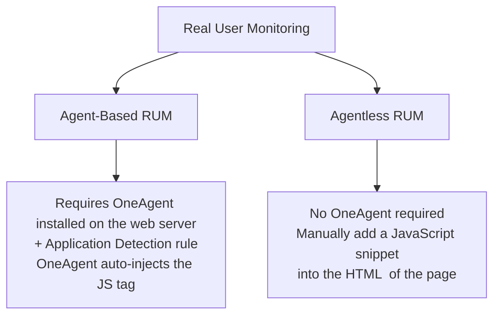

### 11.1 Agent-Based RUM

**Prerequisite:** OneAgent already installed on the server hosting the web application.

**Path:** `Settings → Web and mobile monitoring → Application detection → Add item`

**Steps (as demonstrated, using a sample "easyTravel" app):**
1. Install/deploy your test web app (the video uses Dynatrace's sample **easyTravel** application).
2. In **Application Detection**, click **Add item**.
3. Choose a match rule — e.g., **"URL contains"** instead of default "Domain match".
4. Enter the matching value, e.g., `http://localhost:8079`.
5. Click **Create application**, name it (e.g., `easyTravel`).
6. **Save changes.**
7. Browse the actual application (click through pages, search, login, etc.) — Dynatrace begins capturing real user sessions automatically (no manual code changes needed since OneAgent auto-instruments).
8. View results: `Application and Observability → Frontend` (or the app's dedicated RUM overview).

**Data captured includes:**
- **Load action** — page load time (e.g., `12.9 seconds` in the demo — flagged as high due to test-machine resource contention)
- **XHR action** — AJAX/dynamic interaction timing (clicks, drags)
- **Browser breakdown** (Edge, Chrome, Firefox…)
- **User type** — real user vs. bot (%) 
- **Geographic location** of users
- **Errors**
- **Apdex rating** — 0 to 1 scale; closer to 1 = better perceived performance. (See Section 11.3.)

### 11.2 Agentless RUM

**Use case:** monitor a web page/app **without installing OneAgent** on the hosting server — just inject a small JavaScript snippet.

**Path:** `Apps → Agentless Real User Monitoring`

**Steps:**
1. Create/configure the agentless RUM app — Dynatrace generates a **JavaScript tag**.
2. Copy the JS snippet and insert it into your HTML page(s), placed **as near to `<head>` as possible** (Dynatrace's official recommendation, for accurate/early capture of page-load timing).
3. Once deployed, click **View web application / View application** in Dynatrace to see live data.
4. All the same categories of data are captured: browser, real users vs. bots, geolocation, load action timing, errors, Apdex.

```html
<!-- Conceptual example: agentless RUM JS snippet placement -->
<html>
  <head>
    <script type="text/javascript" src="https://<your-tenant>.dynatrace.com/rum-collector.js"></script>
    <!-- rest of head content -->
  </head>
  <body>
    ...
  </body>
</html>
```
*(The actual snippet is generated and copied directly from your Dynatrace tenant — don't hand-type it.)*

### 11.3 Understanding Apdex Rating
**Apdex (Application Performance Index)** is a normalized score from **0 to 1**:
- Closer to **1** → users are satisfied with performance
- Lower values map to named tiers (e.g., "Tolerating," "Frustrated," "Unacceptable") based on response-time thresholds

### 11.4 Comparison Table

| Aspect | Agent-Based RUM | Agentless RUM |
|---|---|---|
| Requires OneAgent | ✅ Yes | ❌ No |
| Setup effort | Configure Application Detection rule | Paste JS snippet in HTML `<head>` |
| Best for | Apps already monitored by OneAgent (full-stack) | Static sites, 3rd-party-hosted pages, quick RUM-only needs |
| Data captured | Load action, XHR, browser, geo, Apdex, errors | Same categories |

---

## 12. Synthetic Monitoring

**Definition:** Proactive, scripted checks that simulate user or network activity from defined **locations** (public Dynatrace locations, or your own **private locations** via ActiveGate) — even when there is *no real user traffic*.

### 12.1 Synthetic Monitor Types

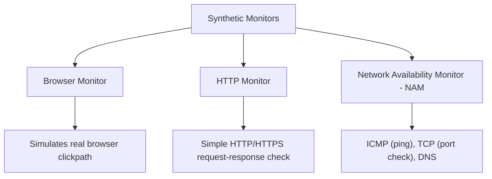

> ⚠️ Note from the video: **Browser** and **HTTP** monitors are available in *both* classic and new/modern synthetic UI. **Network Availability Monitoring (NAM)** is available **only in the new/modern UI** — you must go to **Apps → Synthetic** (not *Synthetic classic*).

### 12.2 Creating an HTTP Monitor (example: monitor google.com)

**Path:** `Apps → Synthetic → New monitor → HTTP`

**Steps:**
1. Provide monitor name.
2. Choose the **request** details — URL, method, headers.
3. Choose **frequency** (e.g., every 1 minute).
4. Choose **location(s)** — public or private (e.g., "Mumbai testing" private location).
5. Configure **outage handling** — "Generate a problem and alert when the monitor is unavailable at all configured locations."
6. Configure **performance thresholds** (e.g., alert if response time > X ms).
7. Add **tags** if needed (e.g., `environment=production`).
8. Click **Create HTTP monitor**.

**Result data available:**
- **Availability %** (e.g., 100%)
- **Average response time** (e.g., 77 ms)
- Color-coded status: availability / local outage / no data
- **Response code checks** — anything **≥ 400** triggers a problem
- **On-demand execution** — a "Trigger now" button to run an immediate ad-hoc check
- **Analyze execution details** — deep dive into request headers, timing breakdown, response data

### 12.3 Creating a Network Availability Monitor (NAM) — ICMP/TCP/DNS

**Use case:** Some checks aren't HTTP-based — e.g., *"Is the server up?"* (ICMP/ping) or *"Is port 22 open?"* (TCP).

**Path:** `Apps → Synthetic (new UI only) → New monitor → Network Availability`

**Steps:**
1. Name the monitor (e.g., `ping monitoring`).
2. Select protocol: **DNS / ICMP / TCP**.
   - ICMP → server up/down check
   - TCP → port availability check
3. Provide the target **IP address(es)** (comma-separated for multiple).
4. Configure packet settings: number of packets (1–10), data length, timeout (1 or 2 seconds).
5. Set **outage constraints**: e.g., *success rate ≥ 80%* = healthy; below that = a problem.
6. Set a performance threshold (e.g., alert if response time > 100/200 ms).
7. Choose **frequency** and **private location**.
8. Configure outage handling, then **Save**.

**Real-world gotcha demonstrated:** Pinging an AWS EC2 instance initially failed (`Request timed out`) because the **Security Group** didn't allow ICMP traffic. Fix:
```
AWS Console → EC2 → Instance → Security → Security Groups
→ Edit inbound rules → Add rule → Type: All ICMP - IPv4 → Source: Anywhere → Save
```
After this change, a manual `ping <public-ip>` from the terminal succeeded, confirming the synthetic monitor would also work.

```bash
# Manual verification before configuring the synthetic monitor
ping <ec2-public-ip>
```

### 12.4 Synthetic Monitoring Flow

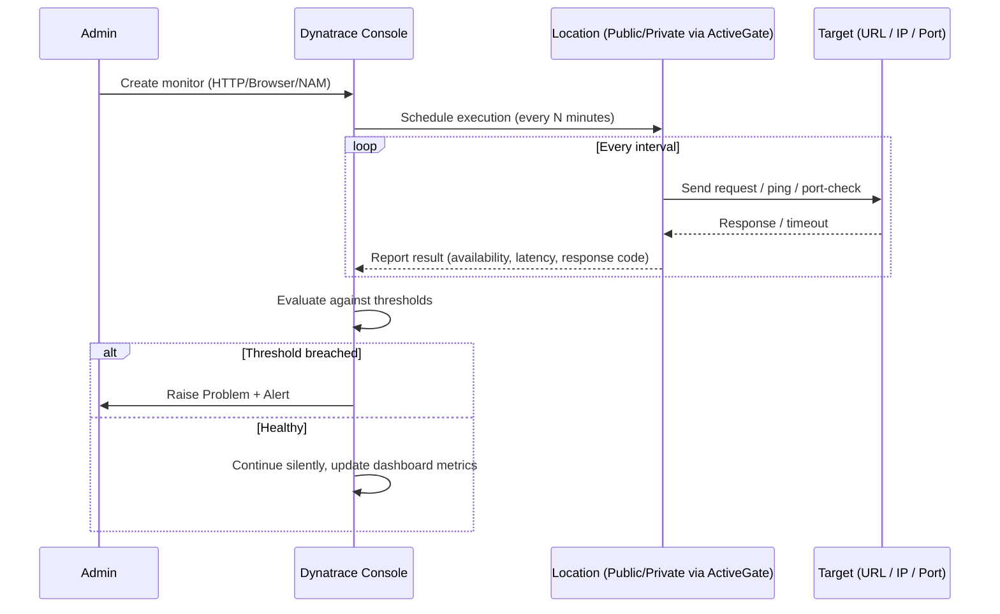

---

## 13. ActiveGate Installation

**Why needed:** To run **synthetic monitors from a private location** (e.g., inside your own corporate network, where public Dynatrace synthetic nodes cannot reach), or to route OneAgent communication through a controlled gateway.

### 13.1 Steps
**Path:** `Apps → Deploy ActiveGate`

1. In Dynatrace Console, search **"Deploy ActiveGate."**
2. Choose the OS/platform.
3. Download and run the ActiveGate installer on a dedicated VM (similar download → verify → install flow as OneAgent).
4. After install, go to **Settings → Deployment status** to confirm the ActiveGate is connected.
5. If it shows **"No ActiveGate assigned"**, explicitly assign it under the relevant configuration section (e.g., synthetic private location setup).
6. Once assigned, this ActiveGate becomes available as a **private location** when creating synthetic monitors (see Section 12).

### 13.2 Concept Diagram
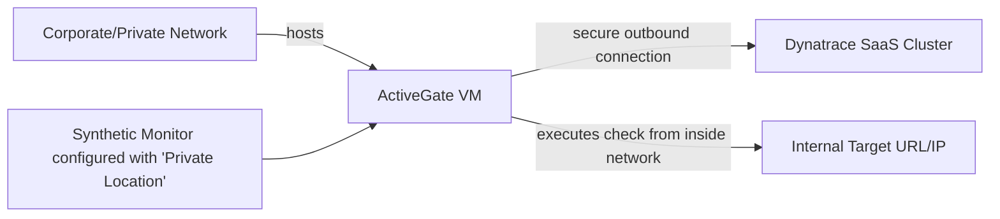

---

## 14. Dynatrace Pattern Language (DPL)

**Purpose:** DPL is used to **parse and extract structured fields out of unstructured log lines** — similar in spirit to regex, but with a higher-level, more readable syntax and built-in pattern components.

### 14.1 Where Used
- Inside **log processing/pipeline rules**, and interactively inside **Notebooks** when using the `parse` DQL command with DPL patterns.
- Commonly reached via: a log record → **Extract fields** option → opens the DPL editor.

### 14.2 Core Building Blocks Demonstrated

| DPL Element | Meaning |
|---|---|
| `LD` | **Line Data** — matches/captures a generic run of characters up to a delimiter |
| `'text'` | A literal string to match |
| `[...]` | **OR condition inside brackets** — match any one of multiple listed characters/tokens (e.g., match either `.` or `/`) |
| Naming a segment | You can assign a name to a captured segment (e.g., name it `server name`) so it becomes a labeled output field |

### 14.3 Worked Example (from the transcript)
**Goal:** From a URL string, extract just the **server name** portion.

Conceptually, the pattern built step-by-step was:

```
LD 'cool' '/' LD:server_name [.|/] LD:info
```

Explanation of the logic:
1. `LD` — consume everything up to a marker.
2. Match literal text (e.g., `'cool'`) then `/`.
3. `LD` again, this time **named** `server name` — capture the actual server name text.
4. Because some URLs end the server name with a `.` and others with a `/`, an **OR condition** `[ . / ]` handles both cases robustly.
5. A final `LD` (named, e.g., `info`) captures whatever text remains.
6. Click **Insert pattern** → Dynatrace immediately shows the parsed result as **separate columns** (e.g., `server_name` and `info`), instead of one long unstructured string.

### 14.4 Why This Matters
Once a field like `server_name` is reliably extracted:
- It can be used to **filter, group, or aggregate** in DQL.
- It can be added as a **dashboard variable** (see Section 16.3) so users can pick a specific server from a dropdown and dynamically filter the whole dashboard.

### 14.5 DPL Flow Diagram
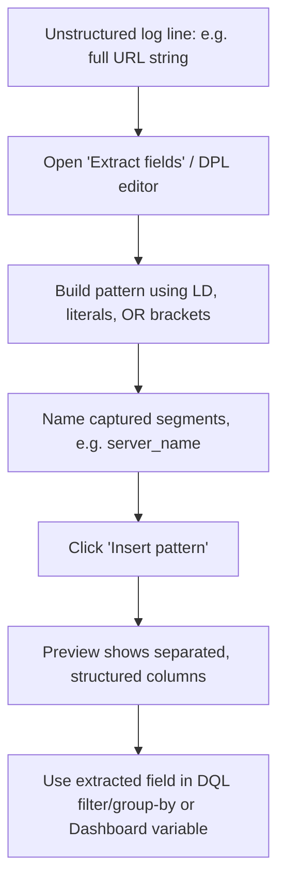

---

## 15. Dynatrace Query Language (DQL)

DQL is Dynatrace's query language for interrogating data in **Grail** (logs, metrics, events, traces, business events) — conceptually similar to SQL / Splunk SPL / KQL, used inside **Notebooks**.

### 15.1 Getting Started
**Path:** `Apps → Notebooks → New notebook → "+" → DQL cell`

Every query typically starts with a data-loading command, then is refined via **piped (`|`)** stages — very similar to Unix pipelines or SPL.

```
<load-command>
| <transform-1>
| <transform-2>
| ...
```

### 15.2 Core Commands Reference

| Command | Purpose | Example |
|---|---|---|
| `fetch` | Load data from a dataset (logs, events, bizevents, spans, etc.) | `fetch logs` |
| `filter` | Keep only records matching a condition | `filter log.level == "ERROR"` |
| `filter ... or ...` | Multiple OR conditions | `filter log.level == "INFO" or log.level == "ERROR"` |
| `filterOut` | **Remove** (exclude) records matching a condition | `filterOut log.level == "INFO"` (excludes INFO) |
| `fields` | Keep only specified columns in output | `fields timestamp, content, log.level, host.name` |
| `fieldsAdd` | Add a new computed/derived field | `fieldsAdd status = if(response >= 400, "fail", else: "ok")` |
| `summarize` | Aggregate data (used with functions like `count`, `countDistinct`, `collectDistinct`, `countIf`) | `summarize count()` |
| `count()` | Count total matching records | `summarize count()` |
| `countDistinct(field)` | Count **unique** values of a field | `summarize total_count = countDistinct(host.name)` |
| `collectDistinct(field)` | List the **actual unique values** (not just the count) | `summarize collectDistinct(host.name)` |
| `countIf(condition)` | Conditional count — only count records matching a sub-condition | `summarize countIf(entity.name == "London")` |
| `sort` | Order results | `sort entity.name desc` |
| `makeTimeseries` | Aggregate values into time-bucketed series (for time-based charts) | `makeTimeseries count(), by:{log.level}, interval:15m` |
| `endsWith` | String match — record ends with a given value | `filter endsWith(content, "deactivated successfully")` |
| `limit` | Cap number of returned rows | `limit 20` |
| `if / else` | Conditional logic inside `fieldsAdd` expressions | `fieldsAdd result = if(condition, "all good", else: "check needed")` |

### 15.3 Worked Examples (from the transcript, cleaned up)

**1) Basic fetch — load all logs (last 2 hours by default, adjustable via time picker)**
```
fetch logs
```

**2) Filter — only ERROR level logs**
```
fetch logs
| filter log.level == "error"
```

**3) Filter — only INFO level logs**
```
fetch logs
| filter log.level == "info"
```

**4) Filter — multiple conditions (OR)**
```
fetch logs
| filter log.level == "info" or log.level == "error"
```

**5) FilterOut — exclude specific levels ("everything except…")**
```
fetch logs
| filterOut log.level == "info"
```
Excluding multiple values:
```
fetch logs
| filterOut log.level == "info" or log.level == "error"
```

**6) Fields — trim to only needed columns**
```
fetch logs
| fields timestamp, content, log.level, host.name
```

**7) Chaining filter + fields**
```
fetch logs
| filter log.level == "info"
| fields timestamp, content, log.level, host.name
```

**8) Count total records**
```
fetch <dataset>
| summarize count()
```
Rename the output column:
```
fetch <dataset>
| summarize synthetic_names = count()
```

**9) Count distinct hosts**
```
fetch <dataset>
| summarize total_count = countDistinct(host.name)
```

**10) List distinct host names (actual values, not just the count)**
```
fetch <dataset>
| summarize collectDistinct(host.name)
```

**11) Conditional count — how many synthetic locations are "London"?**
```
fetch <dataset>
| summarize countIf(entity.name == "London")
```

**12) Sort results**
```
fetch <dataset>
| sort entity.name desc
```

**13) `endsWith` — find log lines ending in specific text**
```
fetch logs
| filter endsWith(content, "network interfaces")
```
```
fetch logs
| filter endsWith(content, "deactivated successfully")
| summarize count()
```

**14) `makeTimeseries` — bucket counts into 15-minute intervals, grouped by log level**
```
fetch logs
| filter log.level == "info"
| makeTimeseries count(), by:{log.level}, interval:15m
```

**15) `fieldsAdd` with `if / else` conditional logic**
```
fetch logs
| fieldsAdd result = if(<condition-matched>, "all good", else: "<alternate-result>")
```

**16) Using a dashboard variable inside DQL** (see Section 16.3 for variable setup)
```
fetch <dataset>
| filter server.name == $VAR
| fields server.name, entity.name
```
> Note: variable references always begin with `$` (e.g., `$VAR`).

### 15.4 Visualization Options in Notebooks
Once a DQL query returns results, you can render it as:
- Table (default)
- **Single value**
- **Pie chart / Donut chart**
- **Histogram**
- **Honeycomb**
…then optionally click **"Add to Dashboard"** to pin that visualization.

### 15.5 DQL Pipeline Concept

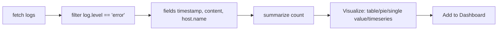

---

## 16. Dashboards

Dashboards visualize metrics, logs, and DQL query results in one consolidated, shareable view.

### 16.1 Creating a Dashboard
**Path:** `Apps → Dashboards → "+ Dashboard" → name it`

### 16.2 Adding Tiles
1. Click the **"+"** icon inside the dashboard.
2. Choose the tile source: **Metric**, **DQL/Query**, or others.
3. For a metric tile: `Select metric → expand category (e.g., Infrastructure → Disk) → choose metric (e.g., "Disk available percentage")`.
4. Use **Split by** (e.g., split by host name) to break a single metric into per-entity series instead of one aggregated line.
5. Run/preview, resize, and arrange tiles as needed.

### 16.3 Adding Dashboard Variables (dynamic filtering)
A very powerful feature: let dashboard viewers **pick a value from a dropdown**, and have the entire dashboard filter dynamically.

**Steps (as demonstrated, using a DPL-extracted `server_name` field):**
1. Run a DQL query that produces the values you want selectable (e.g., distinct extracted server names from Section 14).
2. Click the dashboard **"+" → Variables**.
3. Name the variable (e.g., `VAR`).
4. **Type:** choose from **DQL / code**, **List**, or **Free text**.
   - *List* type: manually paste the possible values (e.g., copied server names).
   - Enable **multi-select** if users should be able to pick more than one value at once.
5. Reference the variable inside a tile's DQL query using `$` + variable name:
   ```
   fetch <dataset>
   | filter server.name == $VAR
   | fields server.name, entity.name
   ```
6. Now, changing the dropdown selection on the dashboard live-updates the filtered tile(s).

### 16.4 Using Segments on a Dashboard
Dashboards can also apply a **Segment** (see Section 18) via a dropdown at the top, scoping *all* tiles to that segment's filter (e.g., "Production" vs. "Development") without editing each tile individually.

### 16.5 Dashboard Concept Diagram

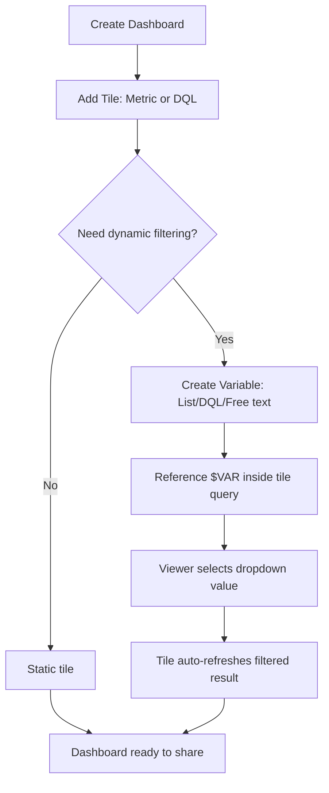

---

## 17. Notebooks

Notebooks are the **interactive workspace for writing and running DQL** — similar in concept to a Jupyter notebook, but purpose-built for Dynatrace's Grail data.

### 17.1 Creating a Notebook
```
Apps → Notebooks → "+ New notebook" → rename (e.g., "My First Notebook") → "+" → choose DQL cell type
```

### 17.2 Working Model
- Each cell holds one DQL query (which can itself be a multi-line piped pipeline).
- Click **Run** to execute; results render inline (table or chosen visualization).
- You can stack multiple cells to build a narrative analysis (e.g., cell 1 = raw fetch, cell 2 = filtered view, cell 3 = aggregated summary chart).
- Any cell's output can be pushed to a **Dashboard** via "Add to dashboard."

### 17.3 Why Notebooks Matter
- They are the **primary place to author and test DQL** before embedding it into dashboards, metric events, or automation.
- They support **DPL-based parsing** (Section 14) directly on raw log data via the "Extract fields" interactive workflow.

---

## 18. Segments

**Definition:** A **Segment** is a reusable, saved **data-scoping filter** — think of it as a named, shareable "WHERE clause" that can be applied across dashboards and notebooks without re-writing the filter logic every time.

### 18.1 Path
```
Apps → Settings → Environment segmentation → "+ Segment"
```

### 18.2 Creating Segments (demonstrated example: Prod vs Dev)
1. Click **+ Segment**, name it (e.g., `prod`).
2. Choose the **data type/condition**, e.g.:
   ```
   host.name == "<production-server-name>"
   ```
   or, for multiple hosts:
   ```
   host.name in ("<server-1>", "<server-2>", ...)
   ```
3. Click **Preview** to confirm which metrics/logs fall under this scope (e.g., CPU usage, memory, page-related availability, IO bytes read/write).
4. Click **Save**.
5. Repeat for a second segment, e.g., `dev`, scoped to a different host.

### 18.3 Using Segments
- On a **Dashboard**, a segment-selector dropdown appears once segments exist; choosing `prod` vs `dev` re-scopes all tiles to that segment's underlying filter — without editing individual tile queries.
- Segments can be referenced from **Notebooks** too.

### 18.4 Segment Concept Diagram
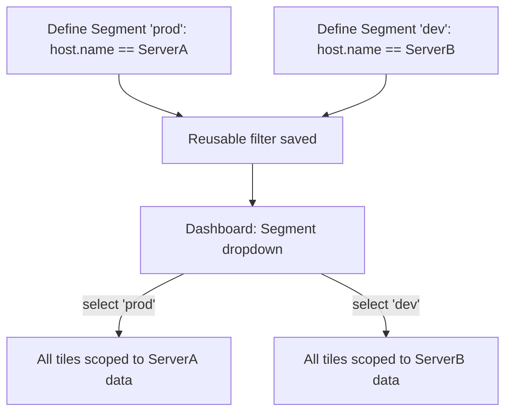

---

## 19. Dynatrace API

The Dynatrace API lets you configure **everything the GUI can do — programmatically** ("configuration as code" / "monitoring as code"), which is essential for automation, CI/CD-integrated monitoring setup, and bulk operations.

### 19.1 Generating an API Token
**Path:** `Settings/Access tokens (via user menu or Apps → Access Tokens)`

**Steps:**
1. Click **Generate new token**.
2. **Select scopes** carefully — grant only what's needed (principle of least privilege). Example scopes used in the demo (for synthetic monitor management):
   - `Read synthetic monitor execution`
   - `Write synthetic monitor execution`
   - `Read synthetic locations`
   - `Create and read synthetic monitors`
   - `Read synthetic locations and nodes`
3. Click **Generate token** → **copy and store securely** (shown only once).

### 19.2 Using the API Explorer (Swagger UI)
**Path:** `Apps → API → Environment API v1 (or v2)`

**Steps:**
1. Locate the relevant endpoint group (e.g., **Synthetic Monitors**).
2. Click the **authorize (🔑) icon**, paste the API token, click **Authorize**, then **Close**.
3. Expand the desired operation (e.g., `POST` — *Create a new synthetic monitor*).
4. Click **Try it out**.
5. Edit the JSON request body (the Swagger UI provides a template) — e.g.:
   - Rename the monitor
   - Set the **type**: `browser` or `http`
   - Set the **URL** to monitor (e.g., `https://www.google.com`)
   - Choose **location**: `geoLocation` (used for RUM) vs. **`syntheticLocation`** (used for synthetic monitors) — remove whichever isn't relevant
   - Remove unused sections (e.g., app-assignment block if not needed)
   - Add **tags** if desired (e.g., `prod`)
6. Click **Execute**.
7. Verify the new monitor now appears in the Synthetic UI, fully configured as scripted.

### 19.3 Example — Conceptual `curl` Equivalent

While the video uses the Swagger "Try it out" UI, the same call can be made directly via `curl`:

```bash
curl -X POST \
  "https://<your-environment-id>.live.dynatrace.com/api/v1/synthetic/monitors" \
  -H "Authorization: Api-Token <YOUR_API_TOKEN>" \
  -H "Content-Type: application/json" \
  -d '{
        "name": "Google browser monitor template",
        "frequencyMin": 5,
        "enabled": true,
        "type": "BROWSER",
        "locations": ["SYNTHETIC_LOCATION_ID"],
        "script": {
          "version": "1.0",
          "events": [
            {
              "type": "navigate",
              "url": "https://www.google.com",
              "description": "Loading of our actual URL that is www.google.com"
            }
          ]
        },
        "tags": ["prod"],
        "anomalyDetection": {
          "outageHandling": {
            "globalOutage": true,
            "globalOutagePolicy": {
              "consecutiveRuns": 1
            }
          }
        }
      }'
```
*(Field names/structure are simplified for teaching purposes — always confirm exact schema against the live Swagger spec / official REST API docs for your Dynatrace version, since v1 vs v2 payloads differ.)*

### 19.4 Getting Reference Data via API (e.g., list of synthetic location IDs)
Before creating a monitor via API, you often need IDs (e.g., which `syntheticLocation` ID corresponds to "New South Wales"). Dynatrace provides a **GET** endpoint to list all locations:

```bash
curl -X GET \
  "https://<your-environment-id>.live.dynatrace.com/api/v1/synthetic/locations" \
  -H "Authorization: Api-Token <YOUR_API_TOKEN>"
```
The response includes fields like `geoLocationId`, `entityId` (synthetic location ID), city, and country — copy the relevant ID into your monitor-creation payload.

### 19.5 API Automation Flow

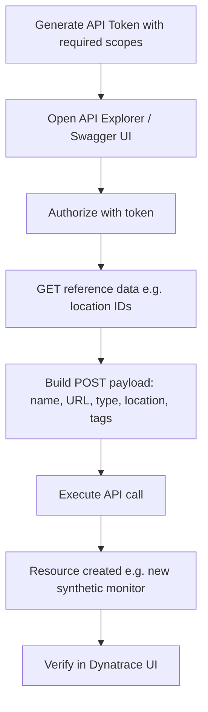

### 19.6 Why This Matters
- Enables **Infrastructure/Monitoring-as-Code**: store monitor definitions in version control (Git), apply via CI/CD pipelines.
- Enables **bulk operations** — e.g., create hundreds of synthetic monitors from a CSV/script instead of manual GUI clicks.
- Powers integrations with external tools (ServiceNow, Terraform providers, custom automation scripts).

---

## 20. Quick Reference Cheat-Sheets

### 20.1 OneAgent Install — 3-Command Pattern
```bash
# 1. Download
wget -O Dynatrace-OneAgent-Linux.sh "<installer-url>" --header="Authorization: Api-Token <TOKEN>"

# 2. Verify signature
sha256sum -c Dynatrace-OneAgent-Linux.sh.sha256

# 3. Install as root
sudo su
/bin/sh Dynatrace-OneAgent-Linux.sh --set-monitoring-mode=fullstack --set-app-log-content-access=true
```

### 20.2 Common Navigation Paths

| Feature | Classic Path | New/Modern Path |
|---|---|---|
| Host monitoring | Apps → Hosts | Apps → Infrastructure & Operations |
| Tags | Settings classic → Tags | (same underlying config) |
| Maintenance window | Settings → Maintenance Window | (same) |
| Metric events | Settings classic → Anomaly detection → Metric events | (same) |
| RUM (agent-based) | Settings → Web and mobile monitoring → Application detection | Application and Observability → Frontend |
| RUM (agentless) | Apps → Agentless Real User Monitoring | — |
| Synthetic (Browser/HTTP) | Apps → Synthetic classic | Apps → Synthetic |
| Synthetic (Network Availability / NAM) | ❌ Not available | ✅ Apps → Synthetic (new UI only) |
| ActiveGate | Apps → Deploy ActiveGate | — |
| DQL / Notebooks | Apps → Notebooks | — |
| Dashboards | Apps → Dashboards | — |
| Segments | Apps → Settings → Environment segmentation | — |
| API Explorer | Apps → API → Environment API v1/v2 | — |
| Access tokens | Settings → Access tokens | — |

### 20.3 DQL Command Quick Reference

```
fetch <dataset>              -- load data (logs, events, bizevents, spans...)
| filter <condition>         -- keep matching rows
| filterOut <condition>      -- remove matching rows (exclude)
| filter a or b               -- OR logic
| fields a, b, c              -- keep only these columns
| fieldsAdd x = <expr>        -- add computed column
| summarize count()           -- aggregate: total count
| summarize countDistinct(f)  -- aggregate: unique value count
| summarize collectDistinct(f)-- aggregate: list unique values
| summarize countIf(cond)     -- conditional count
| sort field asc|desc         -- order results
| limit N                     -- cap row count
| makeTimeseries count(), by:{field}, interval:15m  -- time-bucketed series
```

### 20.4 Tagging Decision Tree
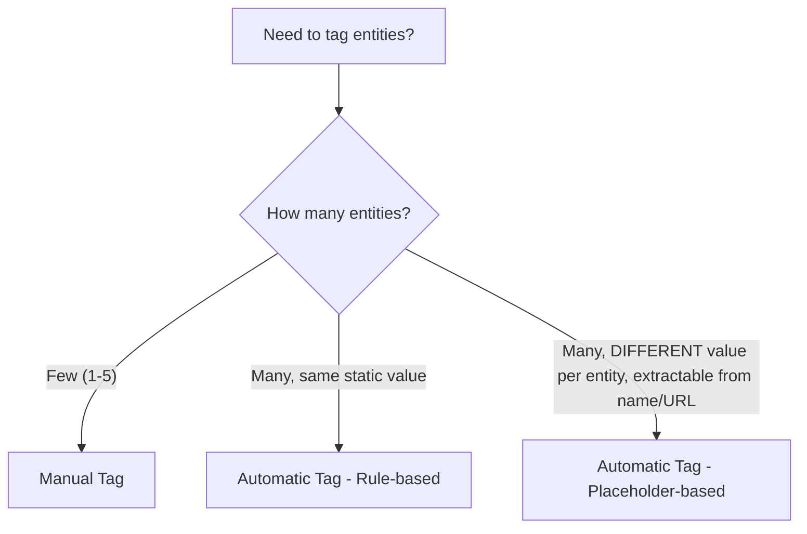

---

## 21. Further Learning Resources

To deepen understanding beyond this transcript, these official resources are recommended:

- **Dynatrace Documentation Hub** — canonical, always-current reference for OneAgent, DQL, DPL, Grail, and API schemas: `https://docs.dynatrace.com`
- **Dynatrace University** — free structured e-learning courses with certifications (Associate/Professional).
- **Dynatrace API Explorer (Swagger)** inside your own tenant — the most reliable way to see the *exact*, version-correct request/response schema (since v1/v2 payloads and available fields evolve over releases).
- **Dynatrace Community Forums** — for troubleshooting real-world edge cases (e.g., ActiveGate connectivity, agent install failures).
- **Apdex methodology background** — originally an open industry standard (Apdex Alliance) for quantifying user-perceived application performance, which Dynatrace and many other APM tools adopted.

> 📝 **Study tip:** The most effective way to internalize this material is to **replicate the demo yourself** on a free-tier AWS EC2 instance with a Dynatrace free trial/SaaS tenant — install OneAgent, break something on purpose (kill a process, block a port), and watch how Dynatrace detects and reports it. Hands-on repetition of Sections 3, 6, 8, 9, 12, and 15 will cement the concepts fastest.

---

### Concept Map — How Everything Connects

```mermaid
flowchart TB
    subgraph Data_Collection["Data Collection Layer"]
        OA[OneAgent] --> HostData[Host / Process / Service Data]
        RUMAgent[RUM - Agent-based / Agentless] --> UserData[Real User Sessions]
        SynMon[Synthetic Monitors] --> SynData[Availability / Performance Checks]
    end

    subgraph Organize["Organization Layer"]
        Tags[Tags - Manual/Automatic] 
        Segments[Segments]
        MgmtZones[Management Zones]
    end

    subgraph Query["Query & Parse Layer"]
        DPL[Dynatrace Pattern Language] --> StructuredFields[Structured Fields from Logs]
        DQL[DQL in Notebooks] 
    end

    subgraph Act["Action Layer"]
        MW[Maintenance Windows]
        Alerts[Custom Alerts / Metric Events]
        Dashboards[Dashboards]
    end

    subgraph Automation["Automation Layer"]
        API[Dynatrace API]
    end

    HostData --> Tags
    UserData --> Tags
    SynData --> Tags
    HostData --> DQL
    UserData --> DQL
    StructuredFields --> DQL
    DQL --> Dashboards
    Tags --> MW
    Tags --> Alerts
    Segments --> Dashboards
    DQL --> Alerts
    API --> OA
    API --> SynMon
    API --> Tags
    API --> Dashboards
```

---

*Compiled and structured from a full Dynatrace training transcript for personal revision. All steps reflect what was demonstrated in the source video; always cross-check exact UI labels and API schemas against your current Dynatrace tenant version, since Dynatrace regularly evolves its interface (classic → new UI migration) and API (v1 → v2).*
