# 📘 Ultimate System Design — Complete Revision Notes

> **Source:** `system_design.txt` & `System Design.docx`
> **Purpose:** Detailed revision notes covering every system design concept — theory, diagrams, code, flowcharts, and interview-ready explanations.

---

## Table of Contents

1. [Monolith vs Microservices Architecture](#1-monolith-vs-microservices-architecture)
2. [Migrating from Monolith to Microservices](#2-migrating-from-monolith-to-microservices)
3. [API Gateway](#3-api-gateway)
4. [Load Balancers](#4-load-balancers)
5. [Load Balancing Algorithms](#5-load-balancing-algorithms)
6. [Proxy Servers](#6-proxy-servers)
7. [Networking Protocols (TCP, UDP, HTTP, WebSockets, WebRTC)](#7-networking-protocols)
8. [Caching](#8-caching)
9. [Content Delivery Network (CDN)](#9-content-delivery-network-cdn)
10. [Rate Limiting & Algorithms](#10-rate-limiting--algorithms)
11. [Scaling: Zero to Million Users](#11-scaling-zero-to-million-users)
12. [Distributed Systems](#12-distributed-systems)
13. [Database Design & Choices](#13-database-design--choices)
14. [Database Sharding & Indexing](#14-database-sharding--indexing)
15. [Consistent Hashing](#15-consistent-hashing)
16. [Message Queues](#16-message-queues)
17. [SSL Certificates & Encryption](#17-ssl-certificates--encryption)
18. [Search Functionality (Elasticsearch)](#18-search-functionality-elasticsearch)
19. [Single Points of Failure & How to Avoid Them](#19-single-points-of-failure--how-to-avoid-them)
20. [CAP Theorem](#20-cap-theorem)
21. [Concurrency Control (Optimistic & Pessimistic Locking)](#21-concurrency-control)

---

## 1. Monolith vs Microservices Architecture

### 1.1 What is Monolith Architecture?

In a **monolith architecture**, all modules of an application are present in a **single codebase**. All modules are **built, tested, run, and deployed together**. A **shared database** is used by all modules.

```
┌─────────────────────────────────────────────┐
│              MONOLITH APPLICATION            │
│                                             │
│  ┌──────────┐ ┌──────────┐ ┌──────────┐    │
│  │   Auth   │ │  Course  │ │  Payment │    │
│  │  Module  │ │  Module  │ │  Module  │    │
│  └──────────┘ └──────────┘ └──────────┘    │
│  ┌──────────┐ ┌──────────┐ ┌──────────┐    │
│  │   Cart   │ │  Order   │ │  Profile │    │
│  │  Module  │ │  Module  │ │  Module  │    │
│  └──────────┘ └──────────┘ └──────────┘    │
│                                             │
│           index.js (Single Entry Point)     │
│                                             │
│         ┌───────────────────┐               │
│         │   Shared Database │               │
│         │  (MySQL/Postgres) │               │
│         └───────────────────┘               │
└─────────────────────────────────────────────┘
```

**Code Structure Example (Monolith - Node.js):**

```javascript
// index.js — Single entry point for the entire application
const express = require('express');
const app = express();

// All modules imported and registered in ONE file
const authRoutes = require('./controllers/auth');
const courseRoutes = require('./controllers/course');
const paymentRoutes = require('./controllers/payment');
const cartRoutes = require('./controllers/cart');
const orderRoutes = require('./controllers/order');
const profileRoutes = require('./controllers/profile');

app.use('/auth', authRoutes);
app.use('/course', courseRoutes);
app.use('/payment', paymentRoutes);
app.use('/cart', cartRoutes);
app.use('/order', orderRoutes);
app.use('/profile', profileRoutes);

// Single database connection
const db = require('./db/connection');
db.connect();

app.listen(4000, () => console.log('App running on port 4000'));
```

### 1.2 Problems with Monolith Architecture

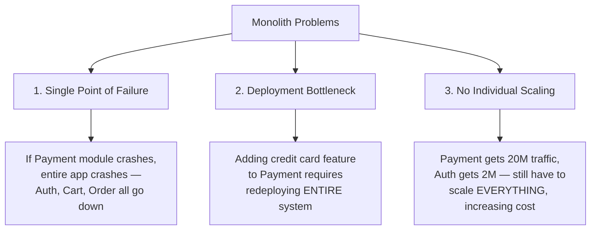

| Problem | Description |
|---------|-------------|
| **Single Point of Failure** | If any module crashes (e.g., Payment), the entire application goes down. Auth, Cart, Order — nothing works. |
| **Deployment Bottleneck** | Even a small change (like adding credit card support to Payment) requires redeploying the **entire** system. |
| **No Individual Scaling** | If Payment gets 20M users but Auth gets only 2M, you must scale the **entire system**, wasting resources and increasing cost. |

### 1.3 What is Microservices Architecture?

In **microservices architecture**, each module becomes an **independent service** (microservice). They are **loosely coupled** and can be built, tested, run, and deployed **independently**.

```
┌──────────────┐  ┌──────────────┐  ┌──────────────┐
│ Auth Service │  │Payment Svc   │  │ Cart Service │
│  index.js    │  │  index.js    │  │  index.js    │
│  Port: 4001  │  │  Port: 4002  │  │  Port: 4003  │
│  ┌────────┐  │  │  ┌────────┐  │  │  ┌────────┐  │
│  │  DB 1  │  │  │  │  DB 2  │  │  │  │  DB 3  │  │
│  │(Postgres)│ │  │(MySQL)   │  │  │(MongoDB) │  │
│  └────────┘  │  │  └────────┘  │  │  └────────┘  │
└──────────────┘  └──────────────┘  └──────────────┘

┌──────────────┐  ┌──────────────┐
│ Order Service│  │ User Service │
│  index.js    │  │  index.js    │
│  Port: 4004  │  │  Port: 4005  │
│  ┌────────┐  │  │  ┌────────┐  │
│  │  DB 4  │  │  │  DB 5    │  │
│  └────────┘  │  │  └────────┘  │
└──────────────┘  └──────────────┘
```

**Code Structure Example (Microservice - User Service):**

```javascript
// user-service/index.js — Independent entry point
const express = require('express');
const { PrismaClient } = require('@prisma/client');  // ORM
const prisma = new PrismaClient();  // Postgres database (own dedicated DB)
const app = express();

app.get('/api/v1/users/:id', async (req, res) => {
    const user = await prisma.user.findUnique({ where: { id: req.params.id } });
    res.json(user);
});

app.put('/api/v1/updateProfile', async (req, res) => {
    const updatedUser = await prisma.user.update({
        where: { id: req.body.userId },
        data: req.body
    });
    res.json(updatedUser);
});

app.listen(4002, () => console.log('User service running on port 4002'));
```

### 1.4 How Microservices Solve Monolith Problems

| Problem | Monolith | Microservices |
|---------|----------|---------------|
| **Single Point of Failure** | Payment crash → entire app crashes | Payment crash → only Payment is affected; Auth, Cart, Order continue working |
| **Deployment Bottleneck** | Redeploy entire app for any change | Redeploy only the affected microservice |
| **Individual Scaling** | Must scale entire app | Scale only the high-traffic service (e.g., Payment) independently |

### 1.5 Key Differences Summary

| Feature | Monolith | Microservices |
|---------|----------|---------------|
| Codebase | Single codebase | Separate codebase per service |
| Database | Shared database | Each service has its own DB |
| Entry Point | One `index.js` for all | Each service has its own `index.js` |
| Coupling | Tightly coupled | Loosely coupled |
| Deployment | Deploy everything together | Deploy independently |
| Scaling | Scale entire app | Scale individual services |
| Fault Impact | One failure crashes all | One failure is isolated |

### 1.6 Common Misconceptions

> **Misconception about Monolith:** "Everything runs on a single machine."
> 
> ❌ **Wrong!** Monolith CAN be scaled to multiple servers. The issue is that you can't scale *individual modules* — you must replicate the *entire* application.

> **Misconception about Microservices:** "Every service runs on its own tiny machine."
> 
> ❌ **Wrong!** All microservices CAN run on a single machine if traffic is low. You only need separate machines when you need to scale specific services.

---

## 2. Migrating from Monolith to Microservices

### 2.1 Important Precautions

1. **It's NOT a one-day activity** — Migration takes weeks/months.
2. **Don't migrate the entire system at once** — Go **module by module**.
3. **Don't redirect 100% traffic at once** — Use gradual rollout.

### 2.2 Step-by-Step Migration Process

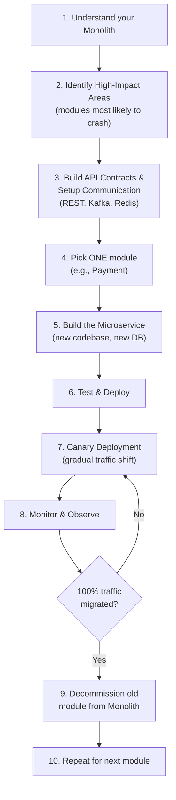

### 2.3 Canary Deployment (Traffic Redirection)

Traffic is redirected **gradually** using **canary deployment**:

```
Step 1:  0.1% users → New Microservice   (Observe for issues)
Step 2:  1%   users → New Microservice   (If fine, increase)
Step 3:  5%   users → New Microservice
Step 4:  10%  users → New Microservice
Step 5:  20%  users → New Microservice
Step 6:  50%  users → New Microservice
Step 7:  100% users → New Microservice   ← Module fully migrated!
```

> **Rule:** The existing monolith module is decommissioned **ONLY** after the entire traffic of that module is redirected to the new microservice.

### 2.4 Managing Data Consistency (Outbox Pattern)

During migration, both the monolith DB and the new microservice DB must stay **consistent**.

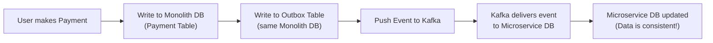

### 2.5 Managing Transactions (Saga Pattern)

When a transaction spans multiple microservices:
- Service A succeeds → Service B succeeds → Service C **fails**
- Rolling back across multiple services is a **big challenge**
- **Saga Design Pattern** is used to manage distributed transactions with compensating actions.

---

## 3. API Gateway

### 3.1 What is an API Gateway?

An API Gateway is a **single entry point** for the user to send requests to backend APIs. It acts as an **interface** between the client and microservices.

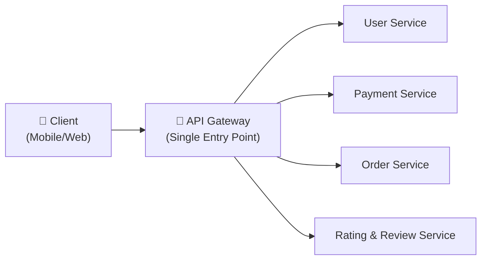

The client doesn't know about individual microservices. It simply sends a request to the API Gateway, which routes it to the correct backend microservice.

### 3.2 Features of API Gateway

#### a) API Composition (Device-Based Filtering)

The API Gateway can filter APIs based on the **device type**:

| Device | APIs Served |
|--------|------------|
| **Mobile** | Product Details, Invoice Details |
| **Computer/Laptop** | Product Details, Invoice Details, **Ratings & Reviews** |

This means the same page shows different sections on different devices.

#### b) Authentication & Authorization (OAuth 2.0 Flow)

Instead of each microservice having its own authentication, the API Gateway uses a **centralized OAuth server**.

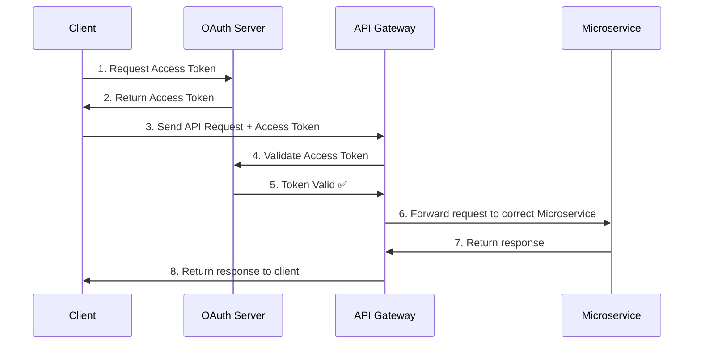

> If the token is **invalid**, the API Gateway **rejects** the request (no microservice is invoked).

#### c) Service Discovery

Service Discovery is a mechanism that keeps track of **all running service instances and their network locations** (IP/port) in a microservices system.

- Services **register themselves** with a registry (e.g., **Consul**, **Eureka**) when they start.
- The API Gateway queries the service discovery registry to find available instances.
- It selects one instance (often via load balancing) and forwards the request.

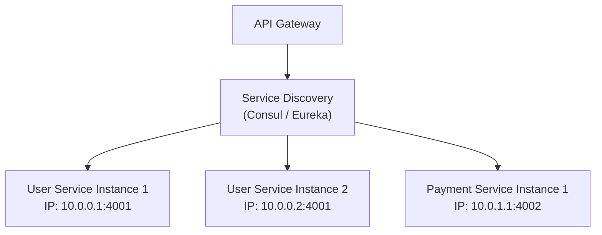

### 3.3 Complete API Gateway & Load Balancer Architecture

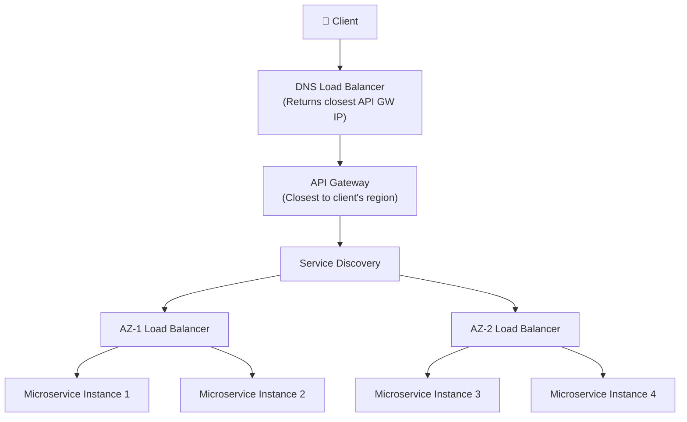

**Failover:**
- If **AZ-1** goes down → Service Discovery returns IP of **AZ-2's** load balancer.
- If an **entire region** goes down → DNS load balancer returns IP of **Region-2's** API Gateway.

---

## 4. Load Balancers

A **load balancer** distributes incoming traffic across multiple server instances to ensure no single server gets overwhelmed.

### 4.1 Types of Load Balancers

#### L4 Load Balancer (Transport Layer)

```
┌───────────────────────────────────────────────┐
│           L4 LOAD BALANCER                    │
│       (Transport Layer - OSI Layer 4)         │
│                                               │
│  Uses protocols: TCP, UDP                     │
│                                               │
│  Only cares about:                            │
│  ✅ Source IP address & port                  │
│  ✅ Destination IP address & port             │
│  ✅ Protocol (TCP or UDP)                     │
│                                               │
│  Does NOT understand:                         │
│  ❌ HTTP headers                              │
│  ❌ Cookies                                   │
│  ❌ Request path (e.g., /api/v1/users)        │
│  ❌ Request body                              │
│                                               │
│  Simply routes to an available instance       │
│  without understanding WHAT the request is.   │
└───────────────────────────────────────────────┘
```

#### L7 Load Balancer (Application Layer)

```
┌───────────────────────────────────────────────┐
│           L7 LOAD BALANCER                    │
│       (Application Layer - OSI Layer 7)       │
│                                               │
│  Understands: HTTP, HTTPS, WebSockets         │
│                                               │
│  CAN understand:                              │
│  ✅ HTTP headers                              │
│  ✅ Cookies                                   │
│  ✅ Request path (e.g., /api/v1/updateProfile)│
│  ✅ Request body                              │
│  ✅ WebSocket connections                     │
│                                               │
│  Routes to CORRECT microservice based on      │
│  the request content.                         │
│  Example:                                     │
│  /api/v1/updateProfile → User Service         │
│  /api/v1/createRoom    → Chat Service         │
└───────────────────────────────────────────────┘
```

| Feature | L4 Load Balancer | L7 Load Balancer |
|---------|-----------------|-----------------|
| OSI Layer | Transport Layer (4) | Application Layer (7) |
| Protocols | TCP, UDP | HTTP, HTTPS, WebSockets |
| Understanding | Only IP + Port + Protocol | Headers, Cookies, Path, Body |
| Routing Decision | Based on IP/Port availability | Based on request content |
| Speed | Faster (less processing) | Slightly slower (more analysis) |
| Use Case | Simple TCP routing | Content-based routing |

---

## 5. Load Balancing Algorithms

### 5.1 Static Algorithms

#### a) Round Robin

Routes requests **equally** to all servers in a circular fashion.

```
Servers: S1, S2

Request 1 → S1
Request 2 → S2
Request 3 → S1
Request 4 → S2
Request 5 → S1
Request 6 → S2
... and so on
```

> **Problem:** If servers have **unequal capacities**, powerful servers stay underutilized while weaker servers get overloaded.

#### b) Weighted Round Robin

Servers are assigned **weights** based on their capacities.

```
Server 1 (Powerful):  Weight = 3
Server 2 (Weak):      Weight = 1

Request 1 → S1
Request 2 → S1
Request 3 → S1
Request 4 → S2
Request 5 → S1
Request 6 → S1
Request 7 → S1
Request 8 → S2
... (3:1 ratio)
```

> **Problem:** Doesn't account for **request complexity**. If requests 1,2,3 take 10ms each but request 4 takes 10 seconds, the weaker server gets overwhelmed despite fewer requests.

#### c) IP Hash

Uses a hash function: `hash(client_IP) % n` → determines which server to route to.

```
hash(IP_user1) % 2 = 0 → Server 1
hash(IP_user2) % 2 = 1 → Server 2
hash(IP_user3) % 2 = 0 → Server 1
hash(IP_user4) % 2 = 1 → Server 2
```

> **Problem:** If a **proxy server** is placed before the LB, all requests appear to come from the same IP. The hash value is always the same → all requests go to ONE server.

### 5.2 Dynamic Algorithms

Dynamic algorithms distribute traffic in **real-time** based on server load and performance metrics.

#### a) Least Connections

New connection goes to the server with the **fewest active connections**.

```
Server 1: 2 active connections
Server 2: 1 active connection

New request → Server 2 (least connections)

After: Server 1 = 2, Server 2 = 2
```

> **Problem:** Doesn't ensure traffic is balanced. Users who send requests very frequently connected to a weak server → weak server overwhelmed; powerful server underutilized.

#### b) Weighted Least Connections

Servers are assigned weights. We calculate `connections / weight` ratio. Server with the **lowest ratio** gets the new connection.

```
Server 1: Weight = 5, Active Connections = 10 → Ratio = 10/5 = 2.0
Server 2: Weight = 3, Active Connections = 3  → Ratio = 3/3  = 1.0

New connection → Server 2 (lowest ratio: 1.0)
```

> **Disadvantage:** Does not consider the **complexity** of incoming requests — only connection count.

#### c) Least Response Time

Uses **TTFB** (Time To First Byte) — the total time between sending a request and receiving the first response.

```
Formula: Value = TTFB × Number of Connections

Server 1: TTFB = 5ms, Connections = 10 → Value = 50
Server 2: TTFB = 3ms, Connections = 8  → Value = 24

New connection → Server 2 (lowest value: 24)
```

As connections increase, the value increases and load shifts to another server automatically.

---

## 6. Proxy Servers

### 6.1 Forward Proxy Server

Sits between the **client and the internet**.

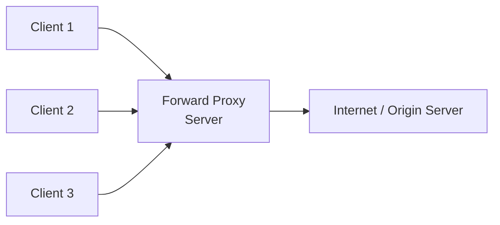

**Features:**

| Feature | Description |
|---------|-------------|
| **Anonymity** | Internet sees the proxy's IP, not the client's IP |
| **Access Control** | Enterprises block access to certain sites (e.g., ChatGPT in offices) |
| **Request Grouping** | 4 users request the same file → proxy groups requests, origin serves once, result cached |
| **Bypass Restrictions** | If your IP is restricted, access content via proxy's IP |
| **Caching** | Stores visited pages; subsequent visits are served from cache |

### 6.2 Reverse Proxy Server

Sits between the **internet and the application server**.

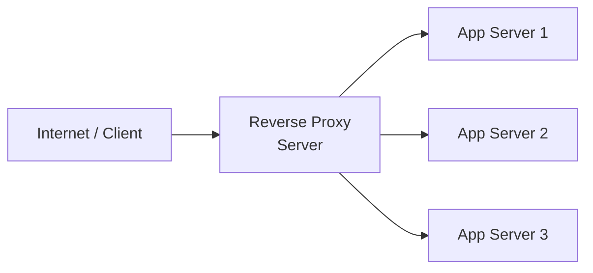

**Features:**

| Feature | Description |
|---------|-------------|
| **Server IP Anonymity** | Internet never knows the actual server IP (e.g., Facebook's real IP is hidden) |
| **Load Balancing** | Can distribute requests across multiple servers |
| **Caching** | Caches responses to reduce server load |
| **DDoS Protection** | Protects servers from Denial of Service attacks |

### 6.3 Comparison Table

| Feature | Forward Proxy | Reverse Proxy | VPN | Load Balancer |
|---------|--------------|---------------|-----|---------------|
| Position | Between client & internet | Between internet & server | Between client & internet | Between internet & servers |
| Hides | Client's IP | Server's IP | Client's IP | N/A |
| Encryption | No | No | ✅ Yes (encrypts data) | No |
| Load Balancing | Can do | Can do | No | ✅ Purpose-built |
| Use Case | Client privacy | Server protection | Full data encryption | High-traffic distribution |

> **Key Insight:** Load balancing is just **one feature** of a proxy server. A proxy can act like an LB, but an LB cannot act like a proxy. For very large applications, we keep proxy and LB **separate** (separation of concerns).

---

## 7. Networking Protocols

### 7.1 OSI Layer Overview

```
┌─────────────────────────────────────────────────┐
│        Application Layer                         │
│  Client-Server: HTTP, HTTPS, WebSockets, FTP    │
│  Peer-to-Peer:  WebRTC                          │
├─────────────────────────────────────────────────┤
│        Transport Layer                           │
│  TCP (reliable)    UDP (fast, unreliable)        │
├─────────────────────────────────────────────────┤
│        Network Layer                             │
│  IPv4, IPv6 (IP addressing & routing)           │
└─────────────────────────────────────────────────┘
```

### 7.2 TCP vs UDP

| Feature | TCP | UDP |
|---------|-----|-----|
| Connection | Connection-oriented (3-way handshake) | Connectionless |
| Reliability | ✅ Reliable — every packet is delivered | ❌ Unreliable — lost packets are NOT resent |
| Ordering | ✅ Maintains packet order (sequence numbers) | ❌ No ordering guaranteed |
| Speed | Slower (acknowledgements, retransmission) | ✅ Faster (no overhead) |
| Use Cases | Messaging (WhatsApp), File transfer, Web browsing | Video calls, Video streaming, Gaming |
| Acknowledgement | Server sends ACK for every packet | No ACK mechanism |

#### TCP Three-Way Handshake:

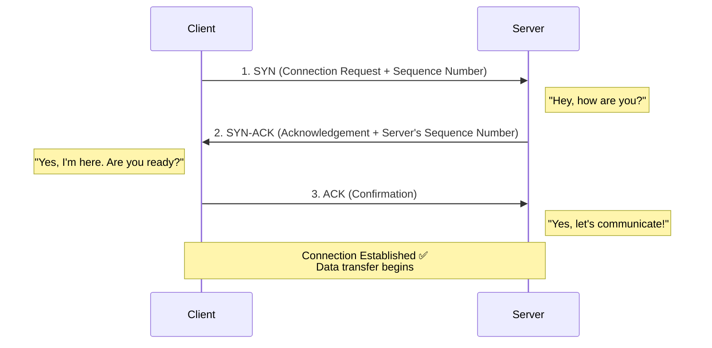

#### TCP Data Transfer with Retransmission:

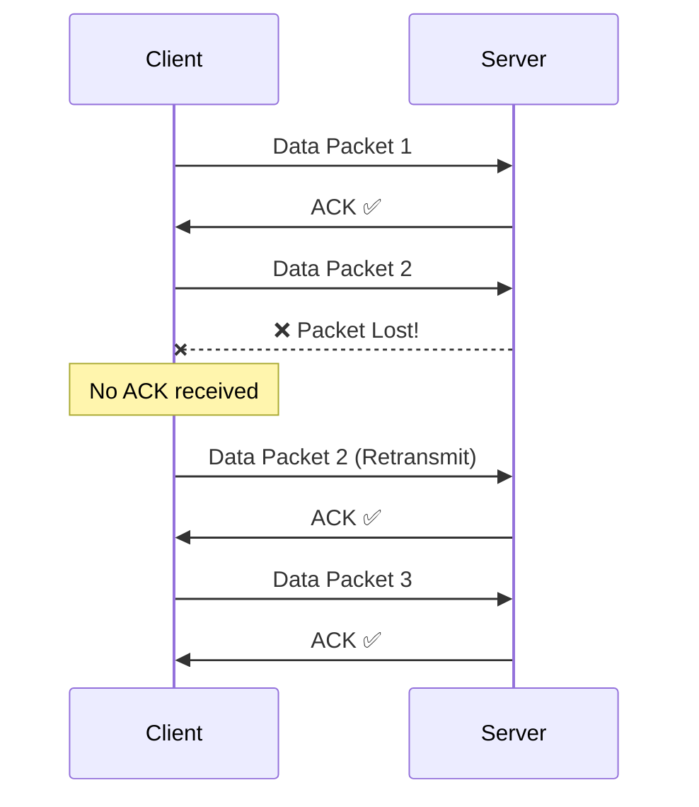

### 7.3 HTTP vs HTTPS vs WebSocket vs WebRTC

```
┌──────────────────────────────────────────────────────────┐
│                APPLICATION LAYER PROTOCOLS               │
├──────────────────┬───────────────────────────────────────┤
│  CLIENT-SERVER   │  Description                         │
├──────────────────┼───────────────────────────────────────┤
│  HTTP / HTTPS    │  Unidirectional: Client requests,    │
│                  │  Server responds. Connection closes.  │
│                  │  (Web browsing, REST APIs)            │
├──────────────────┼───────────────────────────────────────┤
│  WebSocket       │  Bidirectional: Both client AND       │
│                  │  server can send messages at any time.│
│                  │  Connection stays OPEN.               │
│                  │  (WhatsApp, Telegram, Chat apps)      │
├──────────────────┼───────────────────────────────────────┤
│  PEER-TO-PEER    │                                      │
├──────────────────┼───────────────────────────────────────┤
│  WebRTC          │  Direct peer-to-peer connection.      │
│                  │  No server needed for data transfer.  │
│                  │  (Video calls, Screen sharing)        │
└──────────────────┴───────────────────────────────────────┘
```

**WebSocket Communication Flow:**

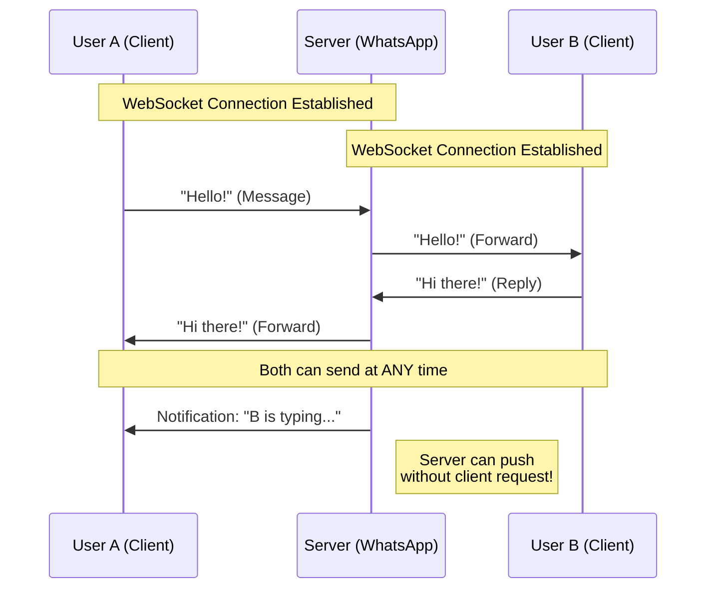

> **Key Difference:**  
> - **HTTP**: Server responds **only** when client requests (unidirectional).  
> - **WebSocket**: Server can **push** messages to client **without** client requesting (bidirectional).

---

## 8. Caching

### 8.1 Why Caching?

Database queries are **expensive** (slow). Caching stores frequently accessed data in fast memory to reduce latency.

```
WITHOUT Cache:
Client → App Server → Database (6ms) → App Server → Client
Total: ~12ms

WITH Cache:
Client → App Server → Cache (1ms) → App Server → Client
Total: ~6ms (50% faster!)
```

> If data is NOT in cache → App Server fetches from DB → stores in cache for future → serves client.

### 8.2 Types of Caching

| Type | Description | Pros | Cons |
|------|-------------|------|------|
| **Local Cache** | Each server has its own cache | Fast access | Data inconsistency (cache updated in one server but not others) |
| **Distributed Cache** (e.g., Redis) | Single shared cache for all servers | Data consistency (single source of truth) | Slightly slower (network hop) |

### 8.3 Cache Eviction Policies

| Policy | How It Works | Problem |
|--------|-------------|---------|
| **FIFO** (First In, First Out) | Oldest entry is removed first | Doesn't consider access frequency — may remove frequently used data |
| **LRU** (Least Recently Used) | Removes the data that was used **least recently** | Best for most use cases |
| **LFU** (Least Frequently Used) | Removes the data that was used **least often** | New data may get evicted before gaining frequency |

### 8.4 Cache Write Policies

#### Write-Through:

```mermaid
flowchart LR
    U["User Updates Data"] --> C["Cache"]
    C --> DB["Database"]
    C --> ACK["✅ Acknowledge Success"]
    Note over C,DB: "Cache writes to DB IMMEDIATELY<br/>Both always in sync"
```

- **Advantage:** Cache & DB are always consistent.
- **Disadvantage:** Slower writes (must write to DB before acknowledging).

#### Write-Back:

```mermaid
flowchart LR
    U["User Updates Data"] --> C["Cache"]
    C --> ACK["✅ Acknowledge Success<br/>(immediately)"]
    C -.->|"Later (background)"| DB["Database"]
    Note over C,DB: "Cache writes to DB LATER<br/>Fast but temporarily inconsistent"
```

- **Advantage:** Very fast writes.
- **Disadvantage:** Data is **inconsistent** for a while until cache flushes to DB.

### 8.5 Caching Solutions

| Solution | Use Case |
|----------|----------|
| **Redis** | Key-value data store for caching (in-memory, blazing fast) |
| **Amazon S3** | Blob storage for static data (images, audio, video) |
| **CDN** | Cache static data (HTML, CSS, JS, videos) at edge locations globally |

---

## 9. Content Delivery Network (CDN)

### 9.1 What is a CDN?

A CDN is a **network of servers placed in different locations** around the world. It stores copies of **static website content** (images, videos, pages). When you open a website, it loads from the **closest server to you**, not the original one.

```
┌──────────────────────────────────────────────────┐
│              MAIN ORIGIN SERVER                   │
│        (USA - S3 Storage + App Server)           │
└───────────────┬──────────────────────────────────┘
                │
    ┌───────────┼───────────────┬────────────────┐
    │           │               │                │
┌───▼───┐  ┌───▼───┐  ┌───────▼──┐  ┌───────────▼──┐
│CDN    │  │CDN    │  │CDN       │  │CDN           │
│India  │  │UK     │  │Japan     │  │Germany       │
│(Edge) │  │(Edge) │  │(Edge)    │  │(Edge)        │
└───────┘  └───────┘  └──────────┘  └──────────────┘

Indian users → CDN India (low latency ✅)
UK users → CDN UK (low latency ✅)
Japan users → CDN Japan (low latency ✅)
```

### 9.2 CDN Lookup Flow

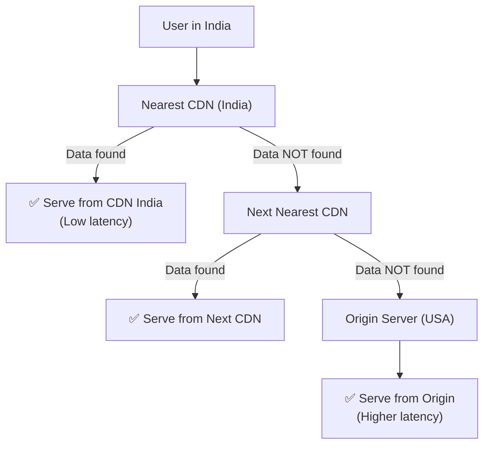

### 9.3 CDN Terminology

| Term | Meaning |
|------|---------|
| **Point of Presence (PoP)** | The location where a CDN is hosted (e.g., India, UK, Japan) |
| **Edge Server** | The CDN server at each PoP that serves cached content |
| **Origin Server** | The main server where all original data resides |

### 9.4 CDN Routing Techniques

1. **DNS-based Routing** — Each PoP has its own IP; DNS resolves to the closest one.
2. **Anycast Routing** — Multiple servers share the same IP; network routes to nearest.
3. **Geo-based Routing** — Routes based on user's geographic location.

---

## 10. Rate Limiting & Algorithms

### 10.1 What is Rate Limiting?

When a user **exploits server resources** by sending too many requests in a short time, genuine users can't get served. A **rate limiter** puts a cap on requests per user.

```
Example: 3 requests / user / minute

User sends Request 1 → ✅ Allowed
User sends Request 2 → ✅ Allowed
User sends Request 3 → ✅ Allowed
User sends Request 4 → ❌ 429 Too Many Requests
```

### 10.2 Rate Limiting Algorithms

#### a) Token Bucket Algorithm

Tokens are added to a bucket at a **fixed rate**. Each request consumes one token.

```
Bucket Capacity: 5 tokens
Refill Rate: 1 token/sec

Time 0:  5 tokens available
User sends 5 requests instantly → 5 tokens consumed → 0 left
Time 1:  1 token refilled → can send 1 request
Time 2:  1 token refilled → can send 1 request
...
After idle (5 sec): Bucket full again → can burst 5 requests
```

| Pros | Cons |
|------|------|
| Handles bursts smoothly | Slightly complex to implement |
| Flexible (separate burst size and rate) | Allows sudden spikes |
| Prevents overload | Requires maintaining state |

#### b) Leaky Bucket Algorithm

Requests fill a bucket. The bucket "leaks" at a **fixed rate** (server processing speed).

```
Bucket Capacity: 2000 requests
Leakage Rate: 100 requests/sec

Users keep sending requests → Bucket fills up
Bucket full → No more requests accepted
Every second, 100 requests "leak" out (get processed)
→ Space for 100 more requests
```

| Pros | Cons |
|------|------|
| Doesn't allow burst requests | Wait time increases when bucket is full |
| Smooth, consistent processing rate | Leakage rate must match server capacity |

#### c) Fixed Window Counter Algorithm

Only a certain number of requests allowed per fixed time window.

```
Window: 1 second
Limit: 3 requests

Second 1: [Req1, Req2, Req3] → All allowed
          [Req4] → ❌ Rejected
Second 2: Counter resets → [Req5, Req6, Req7] → All allowed
```

> **Problem (Boundary Issue):** If 2 requests come at 1.5-2.0s and 2 more at 2.0-2.5s, each window sees ≤3 requests. But in the 1.5-2.5s window, there are 4 requests — **limit exceeded!**

```
Time:    |---1s---|---2s---|---3s---|
Window:  [  W1   ][  W2   ][  W3   ]
Reqs:           ██ ██
              1.5   2.5
              ← This 1-sec span has 4 requests! →
```

#### d) Sliding Window Log Algorithm

Maintains a **request log** with timestamps. Window slides forward; older requests are removed.

```
Window: 1 second, Limit: 3

Log: [1.0, 1.3, 1.7]           → 3 requests in window → ✅
New request at 1.8:
Log: [1.0, 1.3, 1.7, 1.8]     → 4 requests → ❌ Rejected
At time 2.1:
Log: [1.3, 1.7, 1.8]           → Removed 1.0 (outside window)
                                → 3 requests → New request ✅
```

#### e) Sliding Window Counter Algorithm

Combines Fixed Window Counter and Sliding Window Log. The window slides **gradually**.

```
If window moved 10%:
  Take 10% from NEW interval + 90% from OLD interval
  Count total requests → Check if exceeding limit

More accurate than Fixed Window Counter
Less memory than Sliding Window Log
```

---

## 11. Scaling: Zero to Million Users

### 11.1 Vertical vs Horizontal Scaling

```
VERTICAL SCALING (Scale Up):
┌──────────┐      ┌──────────────┐
│  Server  │  →   │   Server     │
│  4GB RAM │      │   32GB RAM   │
│  2 CPU   │      │   16 CPU     │
└──────────┘      └──────────────┘
  (Upgrade the SAME machine)

HORIZONTAL SCALING (Scale Out):
┌──────────┐      ┌────────┐ ┌────────┐ ┌────────┐
│  Server  │  →   │Server 1│ │Server 2│ │Server 3│
│          │      │        │ │        │ │        │
└──────────┘      └────────┘ └────────┘ └────────┘
  (Add MORE machines)
```

| Feature | Vertical Scaling | Horizontal Scaling |
|---------|-----------------|-------------------|
| Method | Upgrade existing machine (more RAM, CPU) | Add more machines |
| Limit | Hardware has an upper limit | Virtually unlimited |
| Downtime | Usually requires downtime | No downtime (add servers dynamically) |
| Cost | Expensive (high-end hardware) | Cost-effective (commodity hardware) |
| Fault Tolerance | ❌ Single point of failure | ✅ Redundancy built-in |
| Complexity | Simple | Needs load balancer, distributed systems |

### 11.2 Scaling Journey: 0 → 1M Users

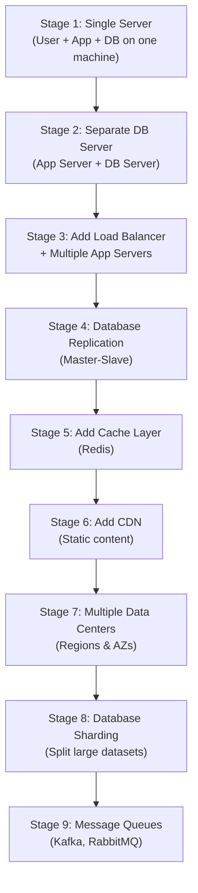

### 11.3 Database Replication (Master-Slave)

```
┌─────────────┐
│ Master Node │ ← All WRITE operations (INSERT, UPDATE, DELETE)
│  (Primary)  │
└──────┬──────┘
       │ Replication
  ┌────┴────┐
  │         │
┌─▼──┐  ┌──▼─┐
│Slave│  │Slave│ ← All READ operations (SELECT)
│  1  │  │  2  │
└─────┘  └─────┘
```

- **Master Node:** Handles all **write** operations.
- **Slave Nodes:** Handle all **read** operations (copies of master data).
- Reads are typically 80-90% of all DB operations, so distributing reads across slaves greatly improves performance.

---

## 12. Distributed Systems

### 12.1 What are Distributed Systems?

Multiple computers work together to perform a task, but to the user it appears as if a **single computer** is performing the task.

**Components of Distributed Systems:**
- Horizontal scaling
- Availability Zones (AZs)
- Load Balancers
- Multiple Regions
- Data Replication

### 12.2 Advantages

| Advantage | Description |
|-----------|-------------|
| **Scalability** | Add more servers as users grow |
| **Fault Tolerance** | If one server crashes, others take over |
| **Low Latency** | Host servers close to users geographically |
| **Agreement** | Servers agree on decisions in milliseconds (e.g., who gets the last iPhone in stock) |

### 12.3 Availability Zones & Regions

```
Region: India
├── AZ-1 (Mumbai)
│   ├── Data Center 1
│   │   ├── App Servers
│   │   └── DB Servers (Master + Slave)
│   └── Data Center 2
│       ├── App Servers
│       └── DB Servers
├── AZ-2 (Hyderabad)
│   ├── Data Center 1
│   └── Data Center 2
│
Region: USA
├── AZ-1 (Virginia)
│   ├── Data Center 1
│   └── Data Center 2
├── AZ-2 (Oregon)
    ├── Data Center 1
    └── Data Center 2
```

**Failover Chain:**
- DC-1 fails → DC-2 takes over
- AZ-1 fails → AZ-2 takes over
- India Region fails → USA Region takes over

---

## 13. Database Design & Choices

### 13.1 SQL vs NoSQL

| Factor | SQL (RDBMS) | NoSQL |
|--------|-------------|-------|
| **Data Structure** | Fixed schema, tables with rows & columns | Flexible, JSON-like documents, key-value pairs |
| **Query Pattern** | Complex joins, ACID properties | Simple lookups, key-value access |
| **Scale** | Works well at small-medium scale | Better for large scale |
| **Examples** | MySQL, PostgreSQL, Oracle | MongoDB, Cassandra, DynamoDB, Redis |
| **Use Case** | User data, Orders, Payments | Cart items, Session data, Real-time analytics |

### 13.2 Choosing the Right Database

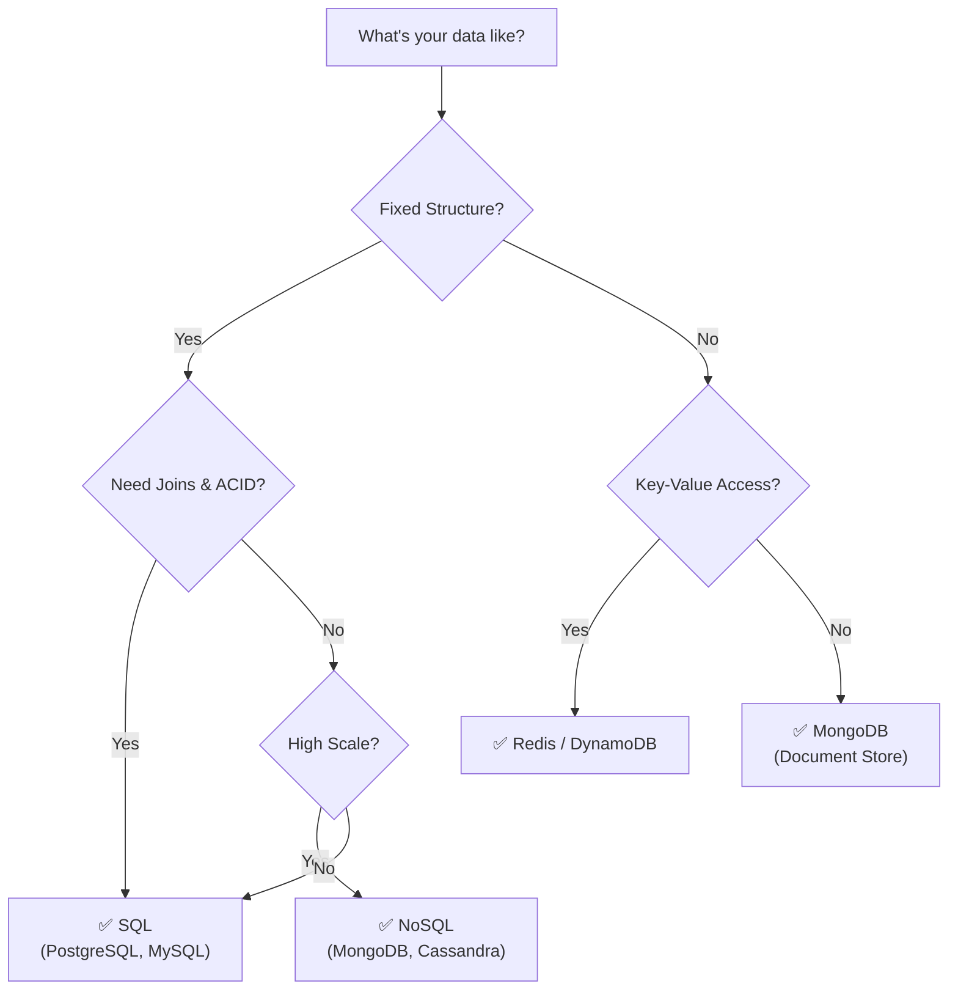

---

## 14. Database Sharding & Indexing

### 14.1 What is Sharding?

Splitting a **huge dataset** into smaller, manageable pieces called **shards**. Each shard is an **independent database**.

```
BEFORE SHARDING:
┌─────────────────────────┐
│    Users Table          │
│    1,000,000 rows       │
│    (Slow queries! 😰)   │
└─────────────────────────┘

AFTER SHARDING:
┌──────────┐  ┌──────────┐  ┌──────────┐  ┌──────────┐
│ Shard 1  │  │ Shard 2  │  │ Shard 3  │  │ Shard 4  │
│ A-F names│  │ G-L names│  │ M-R names│  │ S-Z names│
│ 250K rows│  │ 250K rows│  │ 250K rows│  │ 250K rows│
└──────────┘  └──────────┘  └──────────┘  └──────────┘
  (Fast queries! 🚀)
```

### 14.2 Types of Sharding Keys

| Shard Key | Description |
|-----------|-------------|
| **Name-based** | A-F → Shard 1, G-L → Shard 2, etc. |
| **Location-based** | India → Shard 1, USA → Shard 2 |
| **Age-based** | 18-25 → Shard 1, 26-35 → Shard 2 |
| **ID-based** | user_id % n → determines shard |

### 14.3 Indexing

Indexing creates a **lookup table** (like an index in a book) to speed up search queries without scanning every row.

```
WITHOUT Index: Sequential scan of 1M rows → Slow 🐢
WITH Index:    B-tree lookup → O(log n) → Fast 🚀
```

> **Trade-off:** Indexes speed up **reads** but slow down **writes** (index must be updated on every INSERT/UPDATE).

---

## 15. Consistent Hashing

### 15.1 The Problem with Simple Hashing

```
hash(user_key) % n = server_index

With 3 servers:  hash("user1") % 3 = 0 → Server 0
When adding Server 3:  hash("user1") % 4 = 2 → Server 2 ❌

Almost ALL users get remapped → MASSIVE cache misses!
```

### 15.2 How Consistent Hashing Works

Arrange servers and keys on a **virtual ring** (hash values 0 to Xn in circular manner).

```
          Server A (hash=10)
            ●
        /       \
  K1 (5)●       ● Server B (hash=80)
       |         |
  K2(180)●       ● K3 (hash=120)
        \       /
            ●
      Server C (hash=200)

Rule: Move CLOCKWISE from each key to find its server.

K1 (5)   → clockwise → Server A (10)  ✅
K3 (120) → clockwise → Server C (200) ✅
K2 (180) → clockwise → Server C (200) ✅
```

### 15.3 Adding a New Server

When a new server is added, **only a fraction of keys** need to be remapped (not all!).

```
Before: K1 → Server A
After adding Server D (hash=7):
        K1 (5) → clockwise → Server D (7)  ← Only K1 moved!
        All other keys remain unchanged.
```

> **Advantage over Simple Hashing:** Only `K/n` keys are remapped (K = total keys, n = servers), instead of ALL keys.

### 15.4 Virtual Nodes

**Problem:** Servers can accumulate on one side of the ring → unequal load distribution.

**Solution:** Create **virtual nodes** — each server gets multiple positions on the ring.

```
Server A → Virtual nodes: A0 (hash=10), A1 (hash=90), A2 (hash=170)
Server B → Virtual nodes: B0 (hash=40), B1 (hash=130), B2 (hash=210)

More virtual nodes = more evenly distributed load!
```

> A virtual node is simply a **pointer** to the server's actual address.

---

## 16. Message Queues

### 16.1 Why Message Queues?

**Problems with Synchronous Communication:**

| Problem | Description |
|---------|-------------|
| **Availability** | Inventory service must always be available for Order service |
| **Response Delay** | If Payment takes long, entire system waits |
| **Data Loss** | If Inventory crashes right after receiving message, data is lost |

### 16.2 How Message Queues Solve These Problems

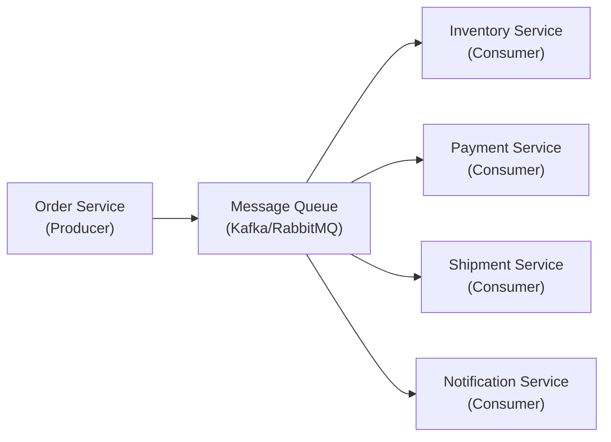

| Problem | Solution with MQ |
|---------|-----------------|
| **Availability** | Order Service adds request to MQ — doesn't need Inventory to be available |
| **Response Delay** | Order Service adds to MQ and continues working — no waiting |
| **Data Loss** | Data stored in MQ — even if a service crashes, data persists |

### 16.3 Message Queue Flow

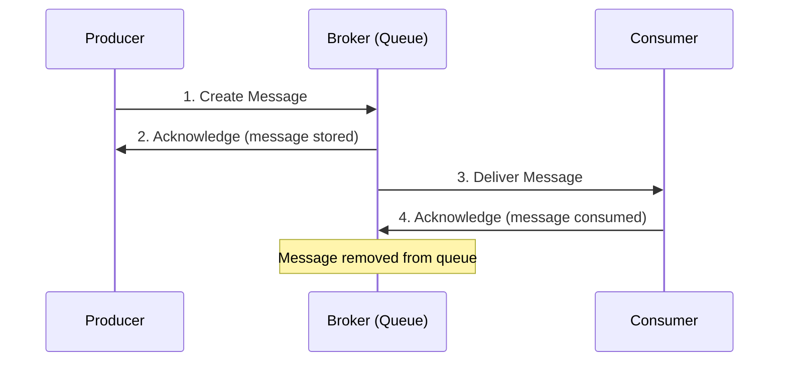

### 16.4 Types of Message Queues

| Type | Model | Example | Description |
|------|-------|---------|-------------|
| **Point-to-Point** | Producer → Consumer | RabbitMQ | Single producer, single consumer (or competing consumers for scaling) |
| **Pub-Sub** | Publisher → Multiple Subscribers | Kafka | Single publisher, multiple subscribers |
| **Priority Queue** | — | — | Messages with higher priority are processed first |
| **Dead Letter Queue** | — | — | Failed/errored messages are pushed here for later inspection |

### 16.5 Real-World Example (E-commerce Order Flow)

**Without Message Queue:**

```
10M requests → Order Service → Inventory (all 10M hit at once!)
                              → Payment (all 10M hit at once!)
                              → Shipment (all 10M hit at once!)

If Payment capacity = 1M → CRASH! 💥
```

**With Message Queue:**

```
10M requests → Order Service → Kafka (all 10M stored safely)

Payment reads 100 req/sec from Kafka → processes → reads next 100
Inventory reads at its own pace
Shipment reads at its own pace

No crashes! ✅ Each service works at its own capacity.
```

---

## 17. SSL Certificates & Encryption

### 17.1 The Problem

HTTP transfers data as **plain text** → any third party can intercept and read it.

### 17.2 Symmetric Encryption

Both parties use the **same key** to encrypt and decrypt data.

```
Client: Encrypt("Hello", Key123) → "xF#k9"
Server: Decrypt("xF#k9", Key123) → "Hello"
```

> **Problem:** We need to send the key AND data. If a hacker intercepts both → data compromised!

### 17.3 Asymmetric Encryption

Server has a **public key** (shared) and a **private key** (secret).

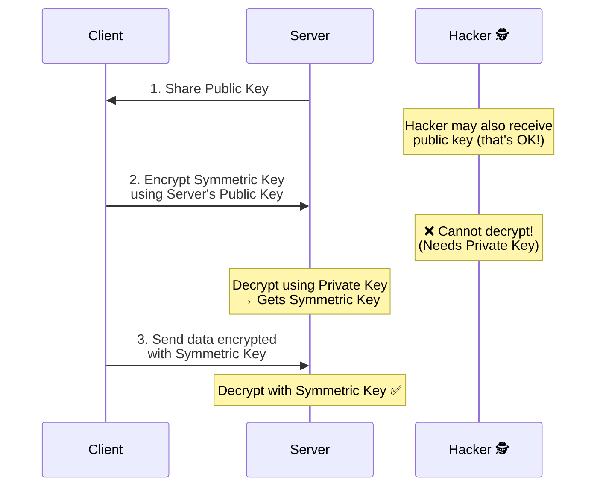

### 17.4 Man-in-the-Middle Attack

> **Problem:** A hacker acts as a **proxy** between client and server. Replaces server's public key with their own → Client sends symmetric key to hacker!

### 17.5 SSL Certificate (Solution)

```mermaid
sequenceDiagram
    participant CA as Certificate Authority<br/>(e.g., GoDaddy)
    participant S as Server
    participant C as Client
    participant H as Hacker 🕵️

    S->>CA: 1. Request SSL Certificate
    Note over CA: Takes own public key,<br/>encrypts server's public key,<br/>generates SIGNATURE
    CA->>S: 2. Returns Certificate<br/>(Domain + Server's Public Key + Signature)
    S->>C: 3. Sends Certificate
    Note over C: Takes GoDaddy's public key,<br/>generates signature,<br/>VERIFIES it matches certificate ✅
    Note over H: ❌ Cannot fake certificate!<br/>Hacker's public key won't<br/>generate matching signature
```

**SSL Certificate Contains:**
- Domain name
- Server's public key
- Signature (generated by Certificate Authority)

---

## 18. Search Functionality (Elasticsearch)

### 18.1 What is Elasticsearch?

- A **text search engine** based on **Apache Lucene** (high-performance search library in Java).
- Provides: **Fuzzy searching** (misspelled words), **autocomplete**, **full-text search**.
- Designed for **speed** — not for guaranteed data persistence (unlike databases).

```
Database:        Guarantees data won't be lost ✅
Elasticsearch:   Designed for speed 🚀 (no persistence guarantee)
```

### 18.2 Important Notes

- Elasticsearch **cannot** store item availability → must call **Inventory Service** separately.
- Write operations in Elasticsearch take a while to appear in search results (eventually consistent).

---

## 19. Single Points of Failure & How to Avoid Them

Every component can be a SPOF. Here's how to prevent each:

| Component | SPOF Prevention |
|-----------|----------------|
| **Load Balancer** | Use multiple load balancers |
| **Server** | Scale out — add multiple servers |
| **Database** | Master-slave architecture + data replication |
| **Cache Server** | Add multiple cache servers (Redis cluster) |
| **Data Center** | Add multiple data centers → create Availability Zone |
| **Availability Zone** | Add multiple AZs → create a Region |
| **Region** | Add multiple regions → distribute users globally |

```mermaid
graph TD
    A["Single Points of Failure"] --> LB["Load Balancer<br/>→ Add multiple LBs"]
    A --> S["Server<br/>→ Horizontal scaling"]
    A --> DB["Database<br/>→ Master-Slave replication"]
    A --> C["Cache<br/>→ Redis Cluster"]
    A --> DC["Data Center<br/>→ Multiple DCs per AZ"]
    A --> AZ["Availability Zone<br/>→ Multiple AZs per Region"]
    A --> R["Region<br/>→ Multiple Regions globally"]
```

---

## 20. CAP Theorem

### 20.1 What is CAP Theorem?

In a distributed system, you can only guarantee **two out of three** properties:

| Letter | Property | Meaning |
|--------|----------|---------|
| **C** | **Consistency** | Every read receives the most recent write |
| **A** | **Availability** | Every request receives a response (even if it's not the latest) |
| **P** | **Partition Tolerance** | System continues operating even if network partitions occur |

```
┌─────────────────────────────────┐
│         CAP THEOREM             │
│                                 │
│    You can ONLY pick 2 of 3:    │
│                                 │
│         C                       │
│        / \                      │
│       /   \                     │
│      /     \                    │
│     CP     CA                   │
│    /         \                  │
│   P ───AP─── A                  │
│                                 │
│  CP: Consistent + Partition     │
│      (e.g., MongoDB, HBase)     │
│  AP: Available + Partition      │
│      (e.g., Cassandra, DynamoDB)│
│  CA: Consistent + Available     │
│      (e.g., Traditional RDBMS)  │
│      (Not practical in          │
│       distributed systems)      │
└─────────────────────────────────┘
```

> **In distributed systems, P (Partition Tolerance) is a MUST** — network failures are inevitable. So the real choice is between **CP** and **AP**.

---

## 21. Concurrency Control

### 21.1 The Problem

Two users try to book the **same ticket/seat** at the **same time**. Only ONE should succeed.

```
User A: Book Seat 5A → ✅ Success
User B: Book Seat 5A → ❌ Rejected (already booked)
```

### 21.2 Optimistic Locking

Assumes conflicts are **rare**. Allows concurrent access and checks for conflicts **before committing**.

```sql
-- Step 1: Read with version number
SELECT * FROM seats WHERE id = 5 AND version = 1;

-- Step 2: Update only if version matches
UPDATE seats SET booked = true, version = 2 
WHERE id = 5 AND version = 1;

-- If another user already updated (version = 2), this fails → retry
```

**Use Case:** Low-contention scenarios, where most transactions don't conflict.

### 21.3 Pessimistic Locking

Assumes conflicts are **frequent**. **Locks** the resource before making changes.

```sql
-- Step 1: Lock the row
SELECT * FROM seats WHERE id = 5 FOR UPDATE;

-- Step 2: Only the locking transaction can modify
UPDATE seats SET booked = true WHERE id = 5;

-- Other transactions wait until lock is released
COMMIT;
```

**Use Case:** High-contention scenarios (e.g., ticket booking, limited stock purchases).

| Feature | Optimistic Locking | Pessimistic Locking |
|---------|-------------------|-------------------|
| Assumption | Conflicts are rare | Conflicts are frequent |
| Mechanism | Version check before commit | Lock row before read |
| Performance | Better for low contention | Better for high contention |
| Risk | Retry overhead if conflicts occur | Deadlocks possible |
| Use Case | General updates | Ticket booking, seat allocation |

---

## 📝 Quick Revision Cheat Sheet

```
┌────────────────────────────────────────────────────────────┐
│                  SYSTEM DESIGN CHEAT SHEET                 │
├────────────────────────────────────────────────────────────┤
│ Monolith → Microservices: Loosely coupled, independent     │
│ API Gateway: Single entry point, routing, auth, discovery  │
│ L4 LB: IP/Port based | L7 LB: HTTP content-based          │
│ Forward Proxy: Hide client | Reverse Proxy: Hide server    │
│ TCP: Reliable, ordered | UDP: Fast, unreliable             │
│ HTTP: Unidirectional | WebSocket: Bidirectional             │
│ Cache: LRU/LFU eviction | Write-Through vs Write-Back     │
│ CDN: Edge servers, PoP, static content caching             │
│ Rate Limit: Token Bucket, Leaky Bucket, Sliding Window     │
│ Scaling: Vertical (up) vs Horizontal (out)                 │
│ DB: SQL (structured) vs NoSQL (flexible, scalable)         │
│ Sharding: Split data across DBs | Indexing: Fast lookups   │
│ Consistent Hashing: Ring + Virtual Nodes                   │
│ Message Queue: Kafka (pub-sub), RabbitMQ (point-to-point)  │
│ SSL: Public/Private keys + CA signature verification       │
│ CAP: Pick 2 of 3 (C, A, P) — P is mandatory              │
│ Locking: Optimistic (version) vs Pessimistic (row lock)    │
│ SPOF: Redundancy at every layer (LB, server, DB, DC, AZ)  │
└────────────────────────────────────────────────────────────┘
```

---

> **Last updated:** September 2026  
> **Happy Revision! 🚀📚**
