# OneTrust GRC – IT & Security Risk Management (Detailed Notes)

> **Source:** OneTrust GRC webinar/demo transcript (`txt_file/oneTrust.txt`, ~46 min).
> **Speakers:** Charles Allen (Sales Manager, OneTrust GRC) – market trends & overview; Alexander (Alex) Funk (Solutions Engineer, OneTrust GRC) – live platform demo.
> **Focus module:** **IT & Security Risk Management** (also mentions Vendor Risk, Audit Management, Enterprise Policy Management modules).
> **Note:** The talk is a UI demo (no real code). Code/config blocks below are **illustrative** (my additions for learning: risk math, webhook integration, API calls, rule logic). Sections marked *(Supplementary)* are general GRC background not stated in the video.

---

## Table of Contents
1. [What is GRC? (Background)](#1-what-is-grc-background-supplementary)
2. [Market Challenges & Trends](#2-market-challenges--trends)
3. [Benefits of an Integrated GRC Approach](#3-benefits-of-an-integrated-grc-approach)
4. [About OneTrust](#4-about-onetrust)
5. [Platform Foundations (SSO, Org Chart, RBAC)](#5-platform-foundations-sso-org-chart-rbac)
6. [End-to-End IT Risk Lifecycle (Big Picture)](#6-end-to-end-it-risk-lifecycle-big-picture)
7. [Phase 1 – Connect Enterprise Data (Asset Inventory)](#7-phase-1--connect-enterprise-data-asset-inventory)
8. [Phase 2 – Governance: BIA, Controls Library, Athena AI](#8-phase-2--governance-bia-controls-library-athena-ai)
9. [Risk Methodology: Scoring & Heat Map](#9-risk-methodology-scoring--heat-map)
10. [Customisation: Custom Fields](#10-customisation-custom-fields)
11. [Phase 3 – Identify Risks (Sources)](#11-phase-3--identify-risks-sources)
12. [Risk Assessments (Templates, Builder, Triggers, Review)](#12-risk-assessments-templates-builder-triggers-review)
13. [Risk Register & Aggregation](#13-risk-register--aggregation)
14. [External Risk Triggers & Workflow Builder (Automation)](#14-external-risk-triggers--workflow-builder-automation)
15. [Phase 4 – Risk Lifecycle: Evaluate → Treat → Monitor](#15-phase-4--risk-lifecycle-evaluate--treat--monitor)
16. [Control Operationalisation & Attestation](#16-control-operationalisation--attestation)
17. [Phase 5 – Reporting & Dashboards](#17-phase-5--reporting--dashboards)
18. [Business Process View & Data-Flow Mapping](#18-business-process-view--data-flow-mapping)
19. [Integrations (Open API)](#19-integrations-open-api)
20. [Illustrative Code & Config Examples](#20-illustrative-code--config-examples)
21. [Interview Q&A](#21-interview-qa)
22. [Revision Cheat Sheet](#22-revision-cheat-sheet)

---

## 1. What is GRC? (Background) *(Supplementary)*

| Letter | Meaning | Examples |
|---|---|---|
| **G** – Governance | Policies, roles, accountability | Policy management, org structure |
| **R** – Risk | Identify, assess, treat, monitor risks | Risk register, assessments |
| **C** – Compliance | Meeting laws/standards | ISO 27001, NIST, GDPR, SOX |

**Three Lines of Defence model** (mentioned indirectly: "first line", "third line"):

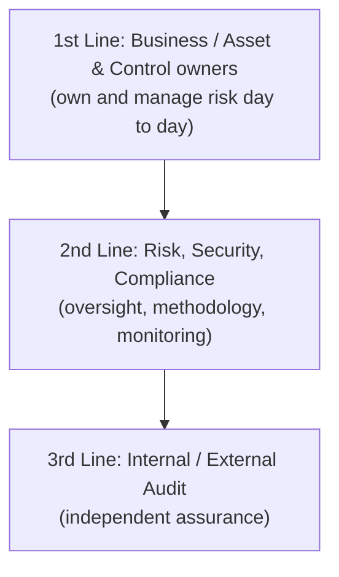

OneTrust's design goal: make the **first line** easy to engage (simple UI, assessments), give the **second line** central visibility, and give the **third line** ready evidence.

---

## 2. Market Challenges & Trends

Observed by Charles:
- Push toward an **integrated approach to risk management** (accelerated by the **pandemic**).
- Many orgs still manage GRC **manually**: **spreadsheets, SharePoint, email**.
- Others use a **mix** – partial tooling (risk, policy, or audit tools) + manual effort.
- Some invested in **large custom enterprise risk management / all-encompassing GRC suites**; problems:
  - Large scale, **expensive**.
  - **Slow** to implement.
  - **Hard to use** and poor for collaboration with the **first line** of the business.

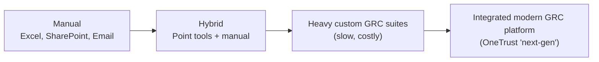

---

## 3. Benefits of an Integrated GRC Approach

| Benefit | Detail |
|---|---|
| **Configure & automate workflows** | Time savings; less input needed (e.g., sending assessments to many people) |
| **Simple, easy interface** | Boosts engagement and collaboration; first-line users respond to assessments efficiently |
| **Centralised information** | Better visibility of risk; maintains integrity & accuracy across the board |

---

## 4. About OneTrust

- One of the world's leading platforms for **privacy, security, GRC and data governance**.
- **7,500+ customers** worldwide (big and small).
- **1,500+ employees**; ~**40%** in product research & development.
- Global scalability – supports organisations with **multiple regional regulations** (US, Europe, others) and global processes.

### Module value propositions (IT & Security Risk Management)
1. **Inventory & risk profile** of assets and processes (up-to-date).
2. **Prioritise risk in real time** – automated mitigation driven by **AI risk triggers**.
3. **Comply with confidence** – **automated evidence collection** and monitoring.
4. **Collaborate with stakeholders** – simplify first-line engagement, track assessments/tasks.
5. **Reduce risk subjectivity** – standardised risk assessments.
6. **Report risk in context** – align risk to **objectives** and **business processes**.

---

## 5. Platform Foundations (SSO, Org Chart, RBAC)

- **Modular, SaaS-first** enterprise GRC. Modules: **IT Risk Management**, **Vendor Risk**, **Audit Management**, **Enterprise Policy Management**, etc.
- *"A system that grows with you and that you never grow out of"* – every GRC journey differs by **framework, jurisdiction, maturity**.
- **Identity provider integration (SSO)** – no new username/password.
- **Org chart / hierarchy** modelled in the tool – fits small, mid, large corporates, global enterprises.
- **Permissions & role-based access (RBAC)** applied along the org chart.

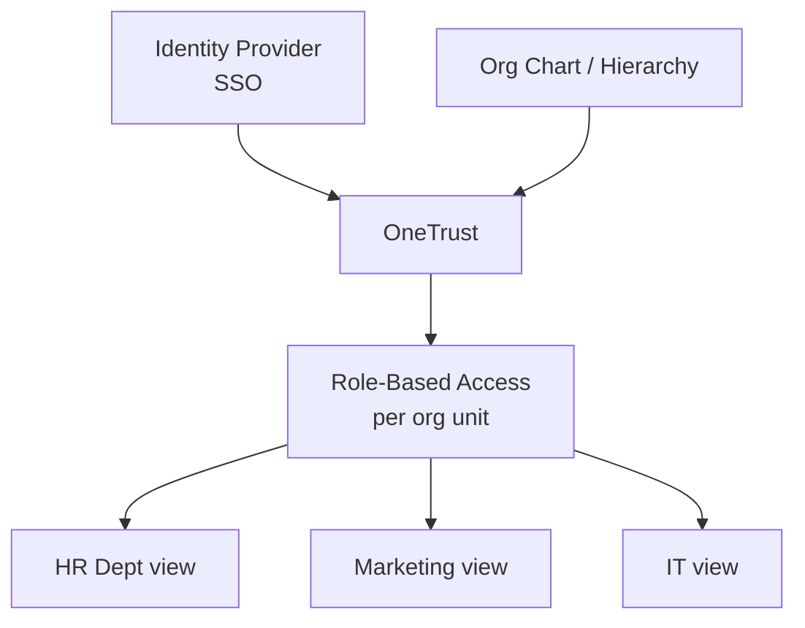

---

## 6. End-to-End IT Risk Lifecycle (Big Picture)

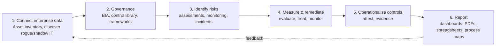

---

## 7. Phase 1 – Connect Enterprise Data (Asset Inventory)

### 7.1 The asset inventory
- Central **asset view** – all applications and IT resources relevant for governance.
- **Asset-agnostic**: applications, **physical** assets (data centres, access control, CCTV), **servers** (on-prem hosting), etc.
- Demo asset: **Adobe Analytics** (used by Marketing).

### 7.2 Master record = business + IT context
| Contributed by | Examples |
|---|---|
| **Business** | Why is this asset used? Purpose, owner |
| **IT** | Where hosted? Technical & organisational measures (TOMs) |
| **Integrations** | **Vulnerabilities** from scanner (e.g., **Tenable**) – unpatched vulns for days show up on the asset record |

> Key benefit: **business context + IT details on a single record**.

### 7.3 Views, filters, org context
- Switch **views** (applications only, physical perimeter, etc.), **filter** data.
- Tied to **org structure**: HR sees only HR assets (mimics what an HR IT-responsible person sees).
- **Delegation**: departments confirm completeness of their asset list → complete inventory → avoids **rogue / shadow applications**.

### 7.4 Ways to populate assets
- **Integrations** (e.g., **ServiceNow** – standard integration; read from other systems; write assessment info back to a **CMDB**).
- **Spreadsheet upload**.
- **Business self-service input**.
- OneTrust = **central governance point** where business + IT knowledge consolidate.

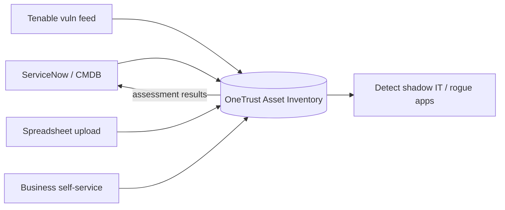

---

## 8. Phase 2 – Governance: BIA, Controls Library, Athena AI

### 8.1 Business Impact Analysis (BIA)
- Run on an asset to determine **Confidentiality, Integrity, Availability (CIA)** requirements.
- Questions: impact of downtime on **business, customers, regulators**; how **critical** is the asset?
- BIA result → determines **control baseline** (critical assets → very high baseline, possibly multiple frameworks).

### 8.2 Controls Library
- Built from major global standards:
  - **ISO 27000 series** (ISMS) – Europe.
  - **NIST standards** – US.
  - Many others by framework/jurisdiction.
- **Activate frameworks** → controls move "onto your personal shelf" in the library.
- Also called **global controls / baseline controls**.
- **Filter by framework**; add **custom/internal frameworks**.
- Mix & match controls later when remediating risk or building baselines on an application.

### 8.3 Athena (AI engine)
- Recommends **missed popular controls**.
- Finds **related controls reusable across frameworks** (map once, satisfy many).

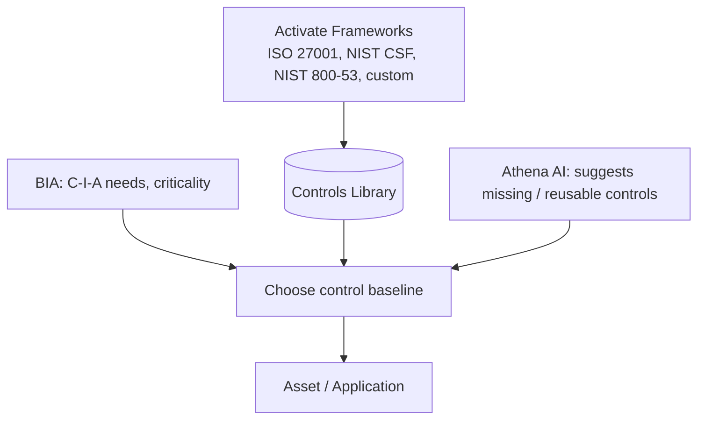

---

## 9. Risk Methodology: Scoring & Heat Map

**Risk-based approach:** measure exposure first → derive controls.

### 9.1 Granularity options
| Option | Description |
|---|---|
| **One-dimensional risk score** | Simple **4-point scale** |
| **Heat map** | **Likelihood × Impact**; **4×4, 5×5**, etc. |
| Configurable | Parameters, bands, **aggregations** |

### 9.2 Demo: tweaking the heat map
- Reduced **5×5 → 4×4**.
- Adjusted a **risk band** (e.g., introduce a risk of 3 in the blue/yellow band = low/medium).
- Saved → applies to **all future risk scoring** (consistent methodology).
- Re-assess quarterly/yearly → see **risk exposure change over time**.
- Message: **"x-gen GRC"** – configurable by **business/IT-savvy users**, not just technical admins.

### 9.3 Risk math (Supplementary)
```
Risk Score = Likelihood × Impact
Inherent Risk  = risk before controls
Residual Risk  = risk after controls
Target Risk    = desired level after treatment
```

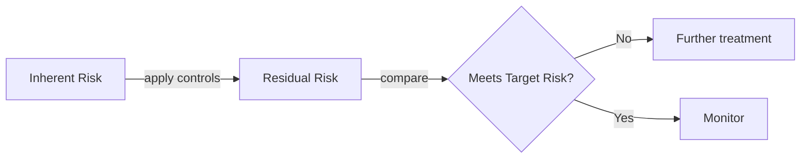

Example 5×5 matrix (Likelihood rows × Impact columns):

| L \ I | 1 | 2 | 3 | 4 | 5 |
|---|---|---|---|---|---|
| **5** | 5 | 10 | 15 | 20 | 25 |
| **4** | 4 | 8 | 12 | 16 | 20 |
| **3** | 3 | 6 | 9 | 12 | 15 |
| **2** | 2 | 4 | 6 | 8 | 10 |
| **1** | 1 | 2 | 3 | 4 | 5 |

---

## 10. Customisation: Custom Fields

- Don't lose existing **CMDB / asset master list** fields: create **additional fields** on objects.
- Field types: **text, single-select, multi-select**, others.
- Demo: add **"Governance Level"** (previously evaluated baseline) as single-select **High / Medium / Low**.
- Fields are created **before data load** → imported data populates them → **quick implementation, short project cycles, fast value**.

---

## 11. Phase 3 – Identify Risks (Sources)

| Source | Example |
|---|---|
| **Classical risk assessments** | NIST CSF questionnaire |
| **Technical monitoring** | Tenable integration creates risks |
| **Incidents** (day-to-day IT ops) | Spike in data breaches for an asset class → new risk |
| **Regulatory feeds / external notifications** | New regulation / advisory |
| **Self-reported risks** | Whistleblowing, employee reports |

> Key insight: **incidents drive risk assessment with facts**, reducing the **subjective judgment** of the assessor.

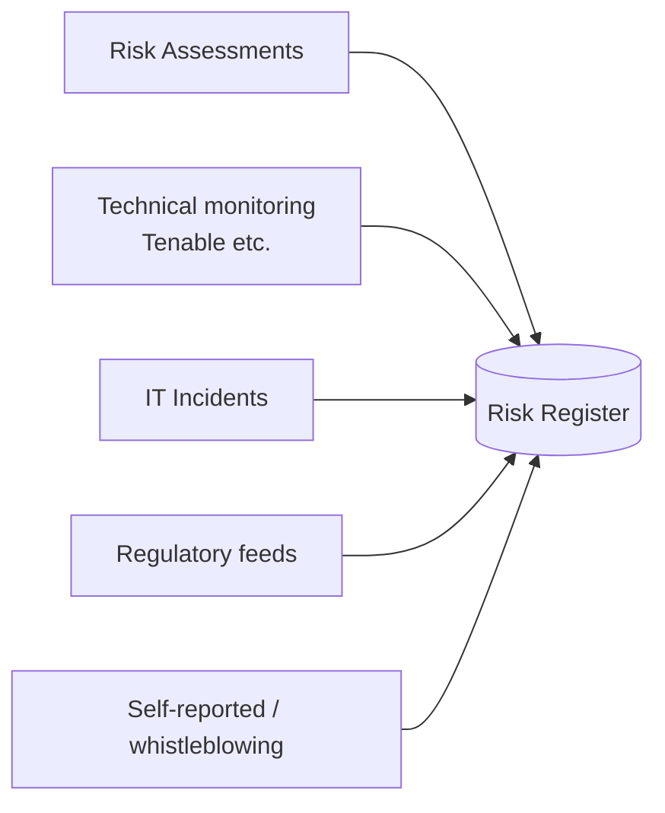

---

## 12. Risk Assessments (Templates, Builder, Triggers, Review)

### 12.1 Templates
- **~100 out-of-the-box templates**.
- Example: **NIST Cybersecurity Framework (CSF)** – popular because it's much **shorter than NIST 800-53** yet covers main areas.
- Question example: "Does the org inventory assets (physical devices & systems)?"
- Each control/question is **mapped to many standards** → **assess once, satisfy many regulations**.

### 12.2 Assessment Builder
- Drag-and-drop customise: add **sections** (e.g., baseline), **questions** (e.g., control assessment questions).
- **Answers → risks**: if condition(s) met → **inherent risk (e.g., Medium) auto-proposed** due to a gap in the management system.

### 12.3 User experience
- System owner receives the assessment; answers asset info (why used), **threat info** (typical threats), with well-described questions & meaningful options.
- After submission → **review state** → look at risk.

### 12.4 Automated assessment triggers (rule engine – no regex/formulas needed)
Examples from demo:
- If **asset discovery not completed in 60 days** **and** asset criticality is **High/Very High** → send additional assessment.
- **Medium assets** re-reviewed every **3 years**; **High-risk assets** every **year** → re-confirm baseline.

### 12.5 Review stage
- OneTrust **flags risks automatically** from answers (demo: **4 risks** flagged, e.g., *elevated risk of function compromise through error/usage* – users circumvent controls).
- Choose to **accept** flagged risks → go to evaluation/treatment/monitoring.
- **Collaboration options:**
  - Send back the **entire questionnaire** with comment (rework).
  - **Preferred:** send back **individual questions** as **Information Requests** (e.g., request evidence/certificate) → rest of questionnaire can still be evaluated (no time loss).

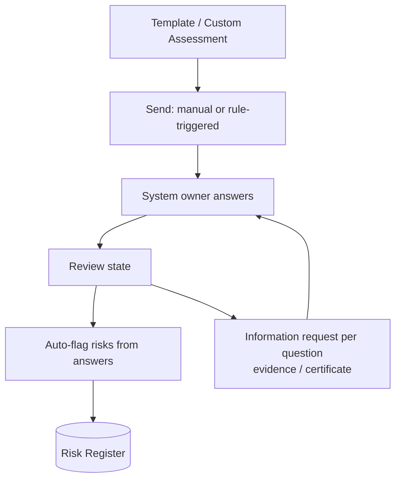

---

## 13. Risk Register & Aggregation

- Per-asset risk view (demo: **Microsoft OneNote**) in **three levels**:
  1. **Individual risks**
  2. **Aggregated categories**
  3. **Overall asset score**
- Demo score **High** because **security** came back high; note OneNote likely high **Confidentiality**, lower **Availability/Integrity**.
- Some customers align risks to the **C-I-A triad** → see which assets need high confidentiality (e.g., OneNote customer notes) vs high availability (payment-card processing).
- **Aggregation methods** configurable: **max, min, sum, average, count**.
- **Categories** customisable to those you track.

---

## 14. External Risk Triggers & Workflow Builder (Automation)

- IT systems (vulnerability scan, log processor, code scanner, DevOps cycle) can feed OneTrust.
- Powered by **Athena AI + Robotic Process Automation (RPA)** platform.
- Example: **Tenable high-severity scan completes → OneTrust adds the vulnerability to the library → creates risk → prompts risk/asset owner immediately.**
- **Workflow Builder** (internal + external workflows):
  - **Trigger:** frequency (schedule) or **webhook**.
  - **Action:** call **API endpoint** of any system.
  - **Result:** add to inventory, create risk, etc.
  - **No additional tooling** (no external **ETL**, no **Pentaho** on app server, no API broker).

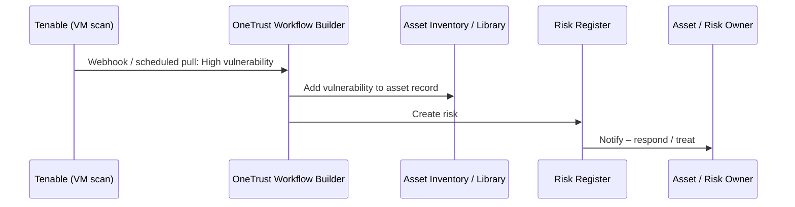

---

## 15. Phase 4 – Risk Lifecycle: Evaluate → Treat → Monitor

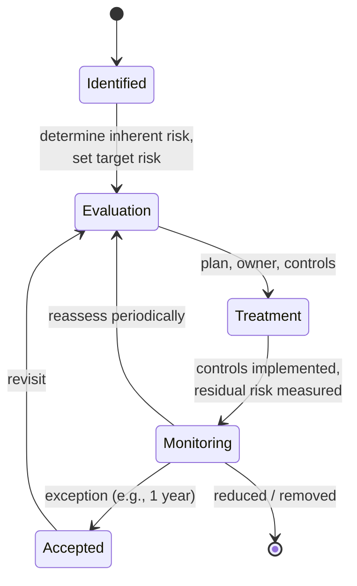

### Stages in the demo (OneNote risk record)
| Stage | Activities |
|---|---|
| **Evaluation** | Determine **inherent risk**; set **target risk** (e.g., Low in the medium term) |
| **Treatment** | Sketch **treatment plan**, **assign ownership/accountability**, add **controls** from library (mix & match) |
| **Control status** | Done / Not applicable (not needed in this reduction) / Pending; record **control owner** |
| **Monitoring** | Risk reduced → e.g., achieved target **Medium**; continuous monitoring |

**Treatment options (Supplementary – standard risk treatments):** **Mitigate / Accept / Transfer / Avoid**. The talk emphasises **accept (exception for next year, then revisit)** and **reduce/remove**.

---

## 16. Control Operationalisation & Attestation

- **Control record** is extensible: out-of-box = **name, status, framework reference, description**; customers add: **preventive/detective**, **IT general control vs process control vs transactional control**, etc.
- **Status tracking** (e.g., control implemented by owner; documentation gaps remain).
- **Localisation:** adapt a control for a specific **asset, jurisdiction, language** (customers translate key controls).
- **Recurring control self-assessment / certification / testing** (monthly/quarterly/yearly):
  - Controller completes a **questionnaire** on key operational aspects.
  - Certifies **design effectiveness** then **operating effectiveness**.
  - Attaches **evidence** (screenshots, documents).
- Value: proves to **ISMS, auditors, external regulators** (e.g., after a breach) that controls were effective; auditors (**3rd line**) **review rather than redo** work.

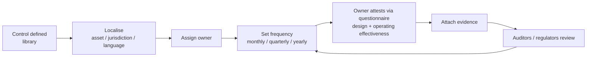

---

## 17. Phase 5 – Reporting & Dashboards

| Reporting tool | Details |
|---|---|
| **Interactive dashboards** | Out of box; unlimited variants per **stakeholder group**; oversight of assessments, risks, assets, issues; **drill-down** from chart to record |
| **User-configurable dashboards** | End/key users build without IT – "not more complicated than a chart in Excel"; choose data points, presentation, half/quarter-screen tiles, save with filter & name (demo: *relevant IT assets protecting physical perimeter* – access control, CCTV) |
| **Risk register views** | Perspectives: ISMS risks, vendor risks, asset risks, external risks; customisable variants |
| **PDF report** | E.g., **asset risk exposure** – risk levels, control implementation, tracking, recent maturity assessment, all on one report; template-based |
| **Scheduled report delivery** | Push to information/process/system owners who don't log in weekly |
| **Spreadsheet (Excel) report** | Benchmark multiple assets, summarise assessment data, **match & mix controls** (one control satisfying many requirements); offline follow-up analysis |

---

## 18. Business Process View & Data-Flow Mapping

- Extend from assets to **business processes / processing activities** (revenue-generating).
- Tie **assets, entities, vendors** into a process.
- OneTrust **auto-draws a data-flow diagram**: where info is **stored, processed, consumed** (demo: **Event & Trade Show process** processing customer information, stored in system "ITCentral", with a **vendor** working on it).
- Use: show the **business owner** (e.g., Marketing) the picture → they point out missing systems → **discover shadow IT**.
- Shows **residual risk** per process → communicates risk to **non-IT owners**.

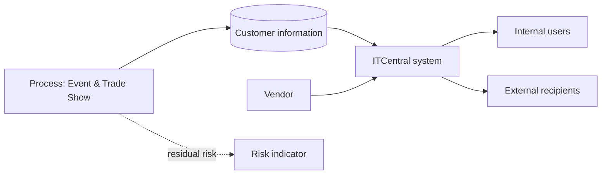

---

## 19. Integrations (Open API)

- OneTrust is built on an **open API framework** for intelligent monitoring/automation across your stack.
- Examples mentioned:
  - **SSO / Identity providers**.
  - **ITSM** – **ServiceNow** (standard integration; CMDB read/write back).
  - **Vulnerability scanning** – **Tenable**.
  - Log processors, **code scanners**, DevOps tools, others.
- Customers build integrations "we just don't even learn about" via the **Workflow Builder**.

---

## 20. Illustrative Code & Config Examples

> ⚠️ Conceptual examples to understand logic. Real OneTrust API endpoints/payloads differ – consult OneTrust developer docs.

### 20.1 Risk scoring (Likelihood × Impact) + band mapping
```python
BANDS = [(1, 4, "Low"), (5, 9, "Medium"), (10, 16, "High"), (17, 25, "Very High")]

def band(score):
    for lo, hi, label in BANDS:
        if lo <= score <= hi:
            return label

def risk(likelihood, impact):
    score = likelihood * impact          # 5x5 matrix
    return score, band(score)

print(risk(4, 4))   # (16, 'High')
```

### 20.2 Aggregation methods (max / min / sum / avg / count)
```python
risks = [12, 6, 20, 8]
agg = {
    "max": max(risks),
    "min": min(risks),
    "sum": sum(risks),
    "avg": sum(risks)/len(risks),
    "count": len(risks),
}
print(agg)   # overall asset score can use any of these methods
```

### 20.3 Inherent vs residual risk
```python
def residual(inherent, control_effectiveness):  # effectiveness 0..1
    return round(inherent * (1 - control_effectiveness), 2)

print(residual(16, 0.5))  # 8.0
```

### 20.4 Assessment trigger rules (as pseudo-YAML)
```yaml
rules:
  - name: Overdue discovery on critical assets
    when:
      - asset.discovery_completed_days_ago > 60
      - asset.criticality in ["Very High", "High"]
    then:
      send_assessment: "Asset Discovery Assessment"

  - name: Periodic re-review
    when:
      - asset.criticality == "Medium"
    schedule: every 3 years
    then: send_assessment: "Baseline Review"

  - name: Annual re-review high risk
    when:
      - asset.criticality == "High"
    schedule: every 1 year
    then: send_assessment: "Baseline Review"
```

### 20.5 Auto-propose risk from questionnaire answer
```yaml
question: "Is a physical device & systems inventory maintained?"
answer: "No"
rule:
  when: answer == "No"
  then:
    create_risk:
      title: "Incomplete asset inventory"
      inherent_risk: Medium
      category: Governance
```

### 20.6 Tenable-style webhook → risk (Flask mock, workflow-builder concept)
```python
from flask import Flask, request, jsonify
app = Flask(__name__)

@app.post("/webhook/vuln")
def vuln():
    data = request.json            # {"asset":"Adobe Analytics","severity":"High","cve":"CVE-XXXX"}
    if data["severity"] in ("High", "Critical"):
        # 1) attach vuln to asset record, 2) create risk, 3) notify owner
        print(f"Add vuln to asset {data['asset']}; create risk; notify owner")
    return jsonify(status="ok")
```

### 20.7 Calling a REST API from a workflow (curl pattern)
```bash
# Pull high vulnerabilities from a scanner API (illustrative)
curl -s -H "X-ApiKeys: accessKey=$AK;secretKey=$SK" \
     "https://scanner.example.com/vulns/export?severity=high" -o vulns.json

# Push a risk into a GRC tool (illustrative placeholder endpoint)
curl -X POST "https://<grc-host>/api/risks" \
     -H "Authorization: Bearer $TOKEN" \
     -H "Content-Type: application/json" \
     -d '{"name":"Unpatched High vuln","assetId":"A-1042","inherentRisk":"High"}'
```

### 20.8 Control attestation record (data model sketch)
```json
{
  "controlId": "ISO27001-A.8.8",
  "name": "Management of technical vulnerabilities",
  "framework": "ISO 27001:2022",
  "owner": "jlooney",
  "type": "Preventive",
  "frequency": "Monthly",
  "lastAttestation": {
    "designEffective": true,
    "operatingEffective": true,
    "evidence": ["scan_report_Q3.pdf", "patch_screenshot.png"]
  }
}
```

### 20.9 Cross-framework control mapping ("assess once, satisfy many")
```python
CONTROL_MAP = {
  "Asset inventory": {
      "NIST CSF": "ID.AM-1",
      "ISO 27001": "A.5.9",
      "NIST 800-53": "CM-8",
  }
}
print(CONTROL_MAP["Asset inventory"])
```

### 20.10 Review schedule logic
```python
from datetime import date, timedelta
REVIEW_DAYS = {"High": 365, "Medium": 3*365}

def next_review(last_review: date, criticality: str) -> date:
    return last_review + timedelta(days=REVIEW_DAYS[criticality])
```

---

## 21. Interview Q&A

**Q1. What is OneTrust GRC IT & Security Risk Management?**
A modular SaaS module to inventory assets, assess/score risk, apply controls, monitor, and report – consolidating business and IT context.

**Q2. How does it help reduce subjectivity in risk?**
Standard templates, configurable scoring/heat maps, auto-flagging of risks from answers, and fact-based inputs from incidents/scanners.

**Q3. What is Athena?**
OneTrust's AI engine – recommends missed/reusable controls and powers automation (with RPA) for risk triggers.

**Q4. How are shadow IT apps discovered?**
Delegating asset completeness to departments, integrations (ServiceNow etc.), and business reviewing auto-drawn process data flows.

**Q5. Difference between inherent and residual risk?**
Inherent = before controls; residual = after controls. Target risk = desired level.

**Q6. How is "assess once, comply many" achieved?**
Each control/question is mapped to multiple frameworks (ISO, NIST...), so one assessment evidences many requirements.

**Q7. What are Information Requests?**
Question-level collaboration (e.g., ask for evidence) so reviewers can continue evaluating the rest of the assessment.

**Q8. How are assessments automated?**
Rule-based triggers (e.g., no discovery in 60 days for High assets; yearly reviews for High, 3-yearly for Medium).

**Q9. What automation capabilities exist for integrations?**
Workflow Builder with triggers (frequency/webhook), API calls to external systems, no ETL needed.

**Q10. What reporting options exist?**
Interactive/custom dashboards, risk register views, PDF reports, Excel reports, scheduled delivery.

**Q11. How do controls become "operational"?**
Owners, localisation, recurring attestations on design & operating effectiveness, with evidence attachments.

**Q12. Why model business processes?**
To present risk in business terms, align to objectives, and uncover missing systems via data-flow maps.

---

## 22. Revision Cheat Sheet

### One-liner
> **OneTrust IT Risk = Inventory → Govern (BIA + Controls) → Assess → Register → Treat → Attest → Report**, automated via Athena + Workflow Builder.

### Memory hooks
- **"Grows with you, never grow out"** – modular SaaS.
- **Single record** = business context + IT details.
- **Assess once, satisfy many** – cross-framework mapping.
- **Facts over opinions** – incidents/scanners drive risk.
- **Info request** = question-level rework, no waiting.
- **3 levels of risk** – individual → category → overall.
- **Process map** – best way to talk risk with business.

### Key numbers
| Item | Value |
|---|---|
| Customers | 7,500+ |
| Employees | 1,500+ (≈40% R&D) |
| Assessment templates | ~100 |
| Heat map sizes | 4×4, 5×5 (configurable) |
| Simple score scale | 4-point |
| Example triggers | 60 days; High=1 year, Medium=3 years |
| Aggregations | max, min, sum, avg, count |

### Terms
| Term | Meaning |
|---|---|
| **BIA** | Business Impact Analysis (CIA requirements, criticality) |
| **CIA** | Confidentiality, Integrity, Availability |
| **ISMS** | Information Security Management System (ISO 27001) |
| **CMDB** | Configuration Management Database |
| **TOMs** | Technical & Organisational Measures |
| **RPA** | Robotic Process Automation |
| **Inherent / Residual / Target risk** | Before / after controls / desired |
| **Information Request** | Per-question follow-up in an assessment |
| **Shadow IT** | Unmanaged apps used by business |

### Flow to recall
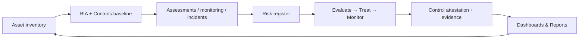

### Gotchas
- Demo is **IT & Security Risk module** only; Vendor Risk, Audit, Policy are separate modules.
- Transcript is auto-generated; some words garbled ("glc" = GRC, "itunes security risk" = IT & security risk, "CINA" = CIA).
- Scores/examples (OneNote, Adobe Analytics) are **mock data** from the demo.
- Code in this file is illustrative – not OneTrust product code.
