# 📊 Power BI — Complete Study Notes (Beginner → Final Project)

> **Source:** "Learn Power BI in under 3 hours" video transcript (your `powerbi.txt`), reorganised into topic-wise notes.
> **Legend:** 🎯 key idea · ⚠️ common mistake · 💡 *Extra* = added by me from standard Power BI/DAX/M knowledge (not said in the video) · 🧪 try-it-yourself
> **Datasets used in the video:** `Apocalypse Food Prep.xlsx` (purchases), the "Model" workbook (Store / Sales / Customer Information), and a real **Data Professionals Survey** (~630 respondents, CSV/Excel) for the final project.

---

## 📑 Table of Contents

0. [Big Picture & Roadmap](#0-big-picture--roadmap)
1. [Power BI Basics & Installation](#1-power-bi-basics--installation)
2. [The Interface (Views, Ribbon, Panes)](#2-the-interface-views-ribbon-panes)
3. [Getting Data (Load vs Transform)](#3-getting-data-load-vs-transform)
4. [Your First Visuals (Mini Project: Food Prep)](#4-your-first-visuals-mini-project-food-prep)
5. [Power Query — Cleaning & Transforming Data](#5-power-query--cleaning--transforming-data)
6. [Data Modeling — Relationships](#6-data-modeling--relationships)
7. [DAX — Measures & Calculated Columns](#7-dax--measures--calculated-columns)
8. [Drill Down & Hierarchies](#8-drill-down--hierarchies)
9. [Groups: Lists & Bins](#9-groups-lists--bins)
10. [Conditional Formatting](#10-conditional-formatting)
11. [Visualization Types (When to use what)](#11-visualization-types-when-to-use-what)
12. [Final Project — Data Professional Survey Dashboard](#12-final-project--data-professional-survey-dashboard)
13. [Dashboard Design, Themes & Polish](#13-dashboard-design-themes--polish)
14. [Revision Zone (Cheat-sheet, Errors, Flashcards, Practice)](#14-revision-zone)

---

## 0. Big Picture & Roadmap

🎯 **Power BI = a Microsoft data-visualisation + BI tool.** If your company uses Microsoft products you likely already have access. The whole workflow is always the same pipeline:

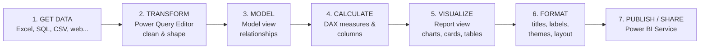

### Where each topic sits in the video (timestamps for quick re-watching)

| # | Topic | Approx. time |
|---|-------|--------------|
| 1 | Intro, install, Get Data, first charts | 00:00 – 00:12 |
| 2 | Power Query (pivot-table clean-up, unpivot) | 00:12 – 00:24 |
| 3 | Data Model & relationships | 00:24 – 00:31 |
| 4 | DAX (COUNT, SUM, SUMX, WEEKDAY, IF) | 00:31 – 00:46 |
| 5 | Drill down | 00:46 – 00:51 |
| 6 | Lists & Bins (grouping) | 00:51 – 01:00 |
| 7 | Conditional formatting | 01:00 – 01:09 |
| 8 | Visualization types tour | 01:09 – 01:22 |
| 9 | Final project (survey dashboard) | 01:22 – 02:05 |

---

## 1. Power BI Basics & Installation

### 1.1 Install Power BI Desktop (free)
1. Open the **Microsoft Store** → search **Power BI Desktop** → **Download / Get** (free).
2. Open it from the Windows search bar → type "Power BI".
3. (Other OS: Power BI Desktop is Windows-only; use the web service or a VM — 💡 *Extra*.)

### 1.2 Products in the family 💡 *Extra*

| Product | What it is | Used for |
|---|---|---|
| **Power BI Desktop** | Free Windows app | Build reports (this video) |
| **Power BI Service** | Online (app.powerbi.com) | Publish, share, schedule refresh, dashboards |
| **Power BI Mobile** | iOS/Android app | View reports on the go |

---

## 2. The Interface (Views, Ribbon, Panes)

### 2.1 The three views (left sidebar)

| View | Icon purpose | What you do here |
|---|---|---|
| **Report view** | 📊 | **Build visualizations** (drag fields, format visuals, arrange the dashboard) |
| **Table / Data view** | 🗂️ | **See the loaded data**, sort columns, create **new columns / measures** |
| **Model view** | 🔗 | **Connect multiple tables** with relationships (joins) |

### 2.2 Ribbon (Home tab) — sections

| Ribbon section | Contains |
|---|---|
| **Data** | Get data, Excel workbook, **Transform data** (opens Power Query) |
| **Queries** | Transform data / Refresh |
| **Insert** | New visual, **Text box** |
| **Calculations** | **New measure**, **Quick measure** |
| **Share** | **Publish** report/dashboard online |

### 2.3 Panes in Report view
- **Visualizations pane (far right)** ⭐ — where most dashboard-building happens. Contains the chart-type icons, the *field wells* (X-axis, Y-axis, Legend, Values…) and the **Format visual** tab.
- **Data / Fields pane** — tables and their columns (click ▼ to expand).
- **Filters pane** — filter a visual/page/report (e.g. Top N).

### 2.4 Format visual (paintbrush) — frequently used settings
| Setting | Where | Notes |
|---|---|---|
| **Title text** | Format visual → **General → Title** | Always rename long default titles |
| **Data labels** | Format visual → **Visual → Data labels** (toggle on) | Shows numbers on chart, no hover needed |
| **Display units** | Data labels → **Values → Display units** | `Auto` rounds (e.g. 1.2K) → set to **None** to see exact numbers |
| **Rename for this visual** | Right-click a field in the field well → *Rename for this visual* | Cleans legend/axis labels without changing the data |
| **Slices (colors)** | Format visual → Visual → Slices (pie/donut) | Manually assign colours |

---

## 3. Getting Data (Load vs Transform)

### 3.1 Data sources
Home → **Get data** shows many connectors (some need paid/upgraded accounts): databases (SQL Server, PostgreSQL…), **Excel**, CSV, Blob storage, **Google Analytics**, web, etc.

### 3.2 Loading an Excel file — step-by-step flow

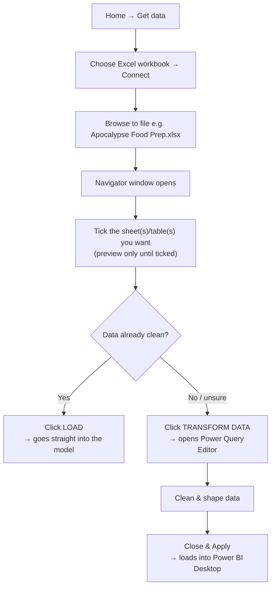

🎯 **Navigator rule:** you can *preview* a sheet by clicking its name, but you can **only Load/Transform after ticking the checkbox** next to the sheets you want.

⚠️ **Tip from the video:** you *can* clean data in Excel beforehand, but doing it in Power Query is repeatable (steps are recorded) and keeps the source untouched.

---

## 4. Your First Visuals (Mini Project: Food Prep)

**Scenario:** You're buying apocalypse food prep (rice, beans, bottled water, canned vegetables, milk) at **Walmart, Target, Costco** over Jan–Apr. Two business questions:
1. *Which store is cheapest overall?*
2. *Should I buy everything at one store, or buy specific products at specific stores?*

### 4.1 Quick data prep (in Power Query)
| Step | Action | Why |
|---|---|---|
| 1 | Rename column `Date` → `Date_Purchased` (then he changed his mind and renamed to `Purchased`) | Clearer name. Shows up under **Applied Steps** as *Renamed Columns* |
| 2 | **Delete the step** with the ❌ next to it | Demonstrates that steps are reversible |
| 3 | **Filter out `Milk`** from Product column | Milk won't last in an apocalypse → *Filtered Rows* step |
| 4 | **Close & Apply** | Loads into Desktop |

### 4.2 Visual #1 — "Where do I spend the least overall?" → **Stacked column chart**
- X-axis: **Store** · Y-axis: **Price** · Legend: **Store** (gives each store its own colour)
- **Result:** Costco **$210** < Target **$219** < Walmart **$225** → Costco cheapest overall.

### 4.3 Visual #2 — "Cheapest store per product?" → **Clustered column chart**
- X-axis: **Product** · Y-axis: **Price** · Legend: **Store**
- **Result/Insight:** Costco cheaper on big-ticket items (dried beans, bottled water). Canned veg difference is negligible (~50–60¢/can). **Rice is cheapest at Target.**
- **Decision:** buy everything at Costco *except rice* → Target.

### 4.4 Polishing
```text
Format visual → General → Title            → "Best store for product" / "Total by store"
Format visual → Visual → Data labels (On)  → numbers above bars
Data labels → Values → Display units       → None   (Auto was rounding numbers)
```

⚠️ **Stacked vs Clustered:** *Stacked* = parts of a total piled on top of each other (total comparison). *Clustered* = bars side-by-side (compare individual categories).

---

## 5. Power Query — Cleaning & Transforming Data

🎯 **Power Query Editor** = the window where you shape data *before* it is used in visuals. It records every action as a step (written in a language called **M**).

### 5.1 Anatomy of the editor

```
┌───────────────────────────────────────────────────────────────────────┐
│ RIBBON:  Home | Transform | Add Column | View | Help                  │
├──────────┬────────────────────────────────────────────┬───────────────┤
│ QUERIES  │          DATA PREVIEW GRID                 │ QUERY SETTINGS│
│ (tables) │   (click column header to select it)       │  • Name       │
│ ‣ Table1 │                                            │  • APPLIED    │
│ ‣ Table2 │                                            │    STEPS ⭐   │
└──────────┴────────────────────────────────────────────┴───────────────┘
```

| Area | Purpose |
|---|---|
| **Queries pane (left)** | All tables you pulled in — click to switch between them |
| **Ribbon → Home** | Remove columns, Keep rows, Remove rows, Split column, etc. |
| **Ribbon → Transform** | **Unpivot columns, Transpose, Use first row as headers**, data type, replace values |
| **Ribbon → Add Column** | **Custom column, Conditional column, Index column**, duplicate column |
| **Query Settings (right)** | Rename the query (e.g. "Pivot Table 2022") + **Applied Steps** |

### 5.2 Applied Steps ⭐ (very important)
- **Every transformation is recorded** in order. Click a step to see data *at that point*.
- Click **❌** next to a step to delete it (go back to an earlier state).
- Auto-created steps on load: **Source → Navigation → Promoted Headers → Changed Type**.
- Click the ⚙️ icon next to **Source** to **change the file path** if the file moves.
- ⚠️ Editing/deleting a step in the *middle* can break later steps (e.g. "Insert Step" prompt appears when you act on an earlier step).

### 5.3 Data types (icons in column header)

| Icon | Meaning |
|---|---|
| **ABC123** | *Any* — mixed/undefined type (Power BI wasn't sure) |
| **ABC** | Text only |
| **1.2** | Decimal number |
| **$ (Fixed decimal)** | Currency-style, fixed 2 decimals → **use for money** |
| **123** | Whole number |
| **📅** | Date |

🎯 For money columns: click the type icon → **Fixed decimal number** → *Replace current* (so 2.7 shows as 2.70). Apply it to **all** price columns for consistency.

### 5.4 Case study: cleaning a "pretty Excel" pivot-table sheet

**Situation:** A colleague gave you a formatted pivot-style sheet (*Purchase Overview*) with Costco/Target/Walmart sub-totals, a Grand Total column, blank rows at the top, and **dates spread across columns**. Looks great in Excel — **terrible for visuals**.

> 🎯 Rule: *Excel formatted for humans ≠ data formatted for analysis.* Power BI wants **tidy data**: one column per variable, one row per observation.

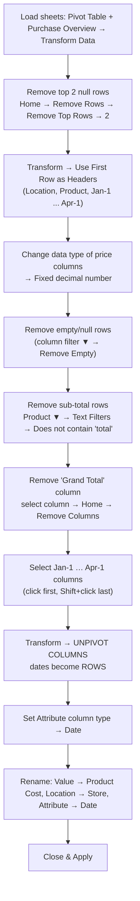

#### Step table (what / where / why)

| # | Action | Where to click | Why |
|---|---|---|---|
| 1 | Remove 2 top null rows | Home → Remove Rows → **Remove Top Rows** → `2` | Useless blank rows |
| 2 | Promote headers | Transform → **Use First Row as Headers** | Real headers were in row 1 |
| 3 | Fix numeric types | Type icon → **Fixed decimal number** (Replace current) | Prices need 2 decimals |
| 4 | Drop nulls | Column ▼ filter → **Remove Empty** | Removes blank/sub-total spacer rows |
| 5 | Drop sub-total rows | Product ▼ → Text Filters → **Does not contain** → `total` | Removes "Costco Total", "Target Total"… |
| 6 | Drop Grand Total column | Select header → Home → **Remove Columns** | Not needed (can be recomputed with DAX) |
| 7 | **Unpivot** | Select date columns → Transform → **Unpivot Columns** | Wide → long format (rows per date) |
| 8 | Date type | Attribute column → type → **Date** | Enables time charts |
| 9 | Rename | Double-click header | `Value`→`Product Cost`, `Location`→`Store` |
| 10 | Apply | Home → **Close & Apply** | Loads into Desktop |

#### Wide vs Long — what unpivot does

```text
BEFORE (wide)                               AFTER UNPIVOT (long / tidy)
Location | Product | 1-Jan | 1-Feb | 1-Mar   Store   | Product | Date  | Product Cost
Costco   | Rice    | 2.70  | 2.50  | 2.60    Costco  | Rice    | 1-Jan | 2.70
                                              Costco  | Rice    | 1-Feb | 2.50
                                              Costco  | Rice    | 1-Mar | 2.60
```

⚠️ **Trap shown in the video — text months vs real dates:** In the *Pivot Table 2022* sheet the headers were `January, February, March, April` (plain **text**). After unpivot, those values are **text**, so you **cannot convert them to Date**. → *Always inspect how the dates are stored in the source before pulling them in.* (Fix: in Excel use real dates, or build a date with a custom column — 💡 *Extra*.)

#### 💡 *Extra* — The same steps as M code (what Power Query writes for you)
View → **Advanced Editor** shows this. You don't have to type it, but reading it is a great learning aid:

```powerquery
let
    Source      = Excel.Workbook(File.Contents("C:\PowerBI Tutorials\Apocalypse Food Prep.xlsx"), null, true),
    Overview    = Source{[Item = "Purchase Overview", Kind = "Sheet"]}[Data],

    // 1. Remove top 2 rows (nulls)
    RemovedTop  = Table.Skip(Overview, 2),

    // 2. First row -> headers
    Promoted    = Table.PromoteHeaders(RemovedTop, [PromoteAllScalars = true]),

    // 4/5. Remove null rows and any sub-total rows
    NoNulls     = Table.SelectRows(Promoted, each [Product] <> null),
    NoTotals    = Table.SelectRows(NoNulls, each not Text.Contains([Product], "total", Comparer.OrdinalIgnoreCase)),

    // 6. Drop Grand Total column
    NoGrand     = Table.RemoveColumns(NoTotals, {"Grand Total"}),

    // 7. Unpivot everything except Location & Product  (date columns -> rows)
    Unpivoted   = Table.UnpivotOtherColumns(NoGrand, {"Location", "Product"}, "Date", "Value"),

    // 8/9. Types + renames
    Typed       = Table.TransformColumnTypes(Unpivoted, {{"Date", type date}, {"Value", Currency.Type}}),
    Renamed     = Table.RenameColumns(Typed, {{"Value", "Product Cost"}, {"Location", "Store"}})
in
    Renamed
```

> Note: the date-column headers must already be real dates (or be converted) for `type date` to work — see the text-month trap above.

### 5.5 Cheat-sheet: common Power Query operations

| Goal | Menu path | M function 💡 |
|---|---|---|
| Rename column | Double-click header | `Table.RenameColumns` |
| Remove column(s) | Select → Home → Remove Columns | `Table.RemoveColumns` |
| Remove top rows | Home → Remove Rows → Top Rows | `Table.Skip` |
| Filter rows | Header ▼ → filter | `Table.SelectRows` |
| Header from row 1 | Transform → Use First Row as Headers | `Table.PromoteHeaders` |
| Change type | Type icon in header | `Table.TransformColumnTypes` |
| Unpivot | Transform → Unpivot Columns | `Table.UnpivotOtherColumns` |
| Split column | Home → Split Column → By Delimiter / Digit to Non-Digit | `Table.SplitColumn` |
| Replace values | Right-click → Replace Values | `Table.ReplaceValue` |
| Duplicate column | Right-click → Duplicate Column | `Table.DuplicateColumn` |
| Custom column | Add Column → Custom Column | `Table.AddColumn` |
| Conditional column | Add Column → Conditional Column | `if … then … else` |
| Index column | Add Column → Index Column | `Table.AddIndexColumn` |
| Transpose | Transform → Transpose | `Table.Transpose` |


---

## 6. Data Modeling — Relationships

🎯 **Model view** = where you connect multiple tables (like SQL joins, but permanent and reusable). Power BI **auto-detects** relationships (usually well) — but you must know how to inspect, fix and build them manually.

### 6.1 The tables in the example (Apocalypse *store*)

| Table | Columns | Role |
|---|---|---|
| **Apocalypse Store** | `Product ID`, `Product Name`, `Price`, `Production Cost` | 🟦 *Dimension / lookup* — the 10 products we sell |
| **Apocalypse Sales** | `Customer`, `Customer ID`, `Product ID`, `Order ID`, `Unit Sold`, `Date Purchased` | 🟧 *Fact* — every sale (many rows) |
| **Customer Information** | `Customer ID`, address, city, state, zip, (age/gender in later data) | 🟦 *Dimension / lookup* — one row per client |

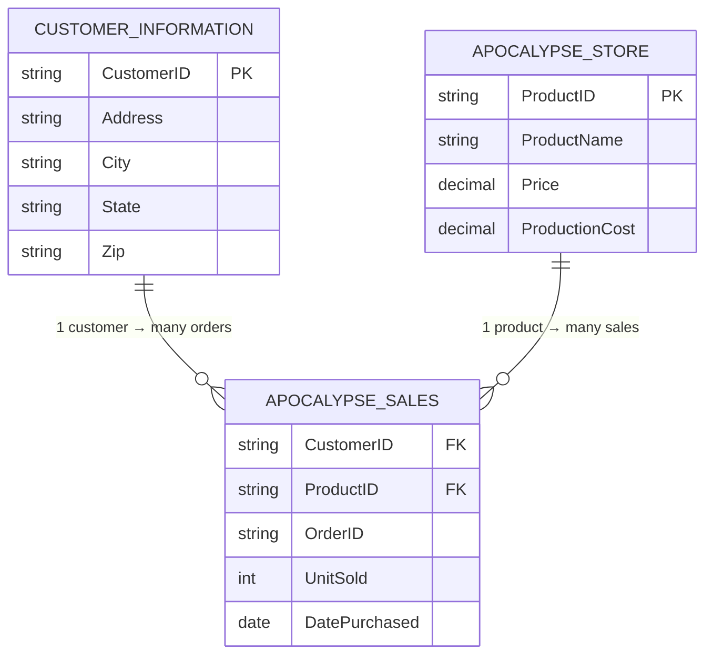

> 💡 *Extra:* this layout is a **star schema** — one central *fact* table surrounded by *dimension* tables. It's the recommended Power BI design.

### 6.2 Reading a relationship line (without even opening it)
- The **line** between two tables = a relationship.
- **`1` and `*`** at the ends = cardinality (one-to-many).
- **Arrow(s)** = cross-filter direction (one arrow = single, two arrows = both).
- **Hover** over the line → highlights the joined columns.
- **Double-click** the line → **Edit relationship** dialog.

### 6.3 Edit Relationship dialog — the four things to check

| Setting | Options | Meaning |
|---|---|---|
| **Columns joined** | Pick a column in each table | Video fixed it to join on **`Customer ID`** instead of the `Customer` (name) column that Power BI had auto-picked because of identical names |
| **Cardinality** | Many-to-one (`*:1`), One-to-many (`1:*`), One-to-one (`1:1`), Many-to-many (`*:*`) | Which side has unique values |
| **Cross filter direction** | **Single** or **Both** | How filters flow between the tables |
| **Make this relationship active** | on/off | Only **one active** relationship per pair of tables is used by default |

### 6.4 Cardinality in plain English
- **Sales → Customer Info = Many-to-one:** many sales rows can belong to *one* customer (a customer reorders), but each customer row appears **once**.
- Flip the table order (Customer Info → Sales) and Power BI shows **One-to-many** — same relationship, different viewpoint.
- The **"one" side** must have **unique** values in the join column.

### 6.5 Cross-filter direction — **Single vs Both** (the demo)

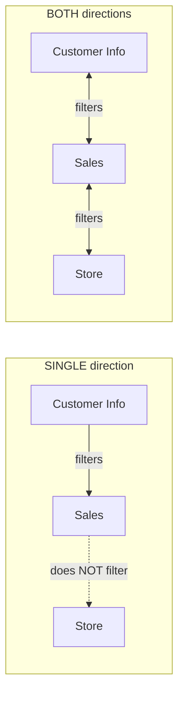

**The experiment in the video**
1. Table visual: `State` (from Customer Info).
2. Measure: `Count of Product ID = COUNT('Apocalypse Store'[Product ID])` (from Store).
3. **Single direction →** every state shows **10** (wrong! not every state bought all 10 products — the filter from *State* never reached the Store table).
4. **Both directions →** Minnesota **7**, Missouri **8**, New York **9**, Texas **10** ✅ accurate.

> 🎯 "Both" makes the connected tables behave **as if they were a single table.** "Single" doesn't.

⚠️ 💡 *Extra caution:* **Both** is powerful but can cause ambiguity/performance issues in big models. Prefer **Single** (dimension → fact) by default and use **Both** only when you need that behaviour.

### 6.6 Building relationships from scratch (drag & drop)
1. In **Model view**, delete the existing lines (right-click → Delete → Yes).
2. **Drag** `Customer ID` from **Customer Information** onto `Customer ID` in **Apocalypse Sales** → relationship auto-created (cardinality and single direction defaulted).
3. **Drag** `Product ID` from **Apocalypse Store** onto `Product ID` in **Apocalypse Sales**.
4. Double-click each line → set **Cross filter direction = Both** (for the demo) → OK.

> Alternative: Home → **Manage relationships** → New (💡 *Extra*).

---

## 7. DAX — Measures & Calculated Columns

🎯 **DAX (Data Analysis Expressions)** = the formula language of Power BI. If you know **Excel formulas**, DAX feels familiar (same Microsoft family; IntelliSense autocompletes as you type).

### 7.1 Measure vs Calculated Column ⭐

| | **Measure** | **Calculated Column** |
|---|---|---|
| Created via | Right-click table → **New measure** (or Home → Calculations → New measure) | Home/Table tools → **New column** |
| Calculated | **On the fly**, depends on visual's filters (aggregates) | **Row by row**, stored in the table |
| Result | Single value that changes by context (e.g. per customer) | A new column with a value in every row |
| Memory | Light (no stored data) | Increases model size |
| Use for | Totals, counts, averages, profit, ratios | Labels/categories (e.g. *Big/Small order*), day-of-week |

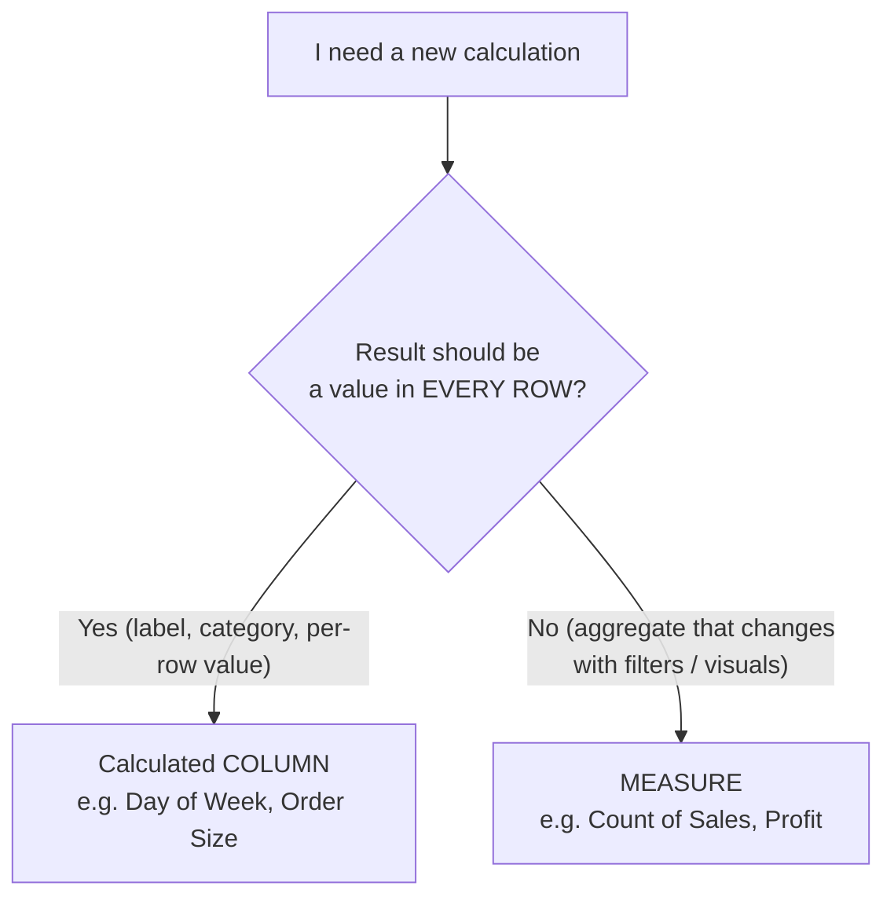

**How to write one:** type the name, `=`, then the formula. IntelliSense suggests functions/columns — press **Tab** to accept → close parenthesis → **Enter** or click ✔.

```DAX
Measure Name = FUNCTION( 'Table'[Column] )
```

### 7.2 Example 1 — COUNT (how many sales?)
Table: **Apocalypse Sales** → New measure:
```DAX
Count of Sales = COUNT('Apocalypse Sales'[Order ID])
```
Add to a table visual → **74 sales**. Put `Customer` above it → **Uncle Joe's Prep Shop = 22 orders** (the top customer by *order count*, not necessarily by revenue).

### 7.3 Example 2 — SUM (how many units sold?)
```DAX
Sum of Products Sold = SUM('Apocalypse Sales'[Unit Sold])
```
→ **3,000 units** total; biggest seller is the **multi-tool survival knife** (≈477 units); smallest ≈ solar battery flashlights (182).

### 7.4 Example 3 — Aggregator vs **Iterator** (SUM vs SUMX) ⭐⭐

| Aggregator | Iterator | Idea |
|---|---|---|
| `SUM` | `SUMX` | Add up a column **vs** evaluate an expression **row by row**, then add |
| `AVERAGE` | `AVERAGEX` | " |
| `COUNT` | `COUNTX` | " |
| `MIN` / `MAX` | `MINX` / `MAXX` | " |

> 🎯 Adding **X** turns an aggregator into an **iterator**: `SUMX(Table, Expression)` → "for each row in *Table*, calculate *Expression*, then sum the results."

**Goal:** profit = (price − production cost) × units sold.

**① As a measure with SUM (works for totals)** — as in the video:
```DAX
Profit =
    ( SUM('Apocalypse Store'[Price]) - SUM('Apocalypse Store'[Production Cost]) )
    * SUM('Apocalypse Sales'[Unit Sold])
```
Place with `Customer` in a table → shows each customer's profit contribution (Uncle Joe's Prep Shop highest).

**② Pasting the same formula into a *calculated column*** (`Profit_column`) → ❌ **every row shows the same grand total.** Why? `SUM` ignores the row; it totals the *whole column* in each row.

**③ Correct per-row version with SUMX:**
```DAX
Profit_column_SumX =
    SUMX(
        'Apocalypse Sales',
        ( 'Apocalypse Store'[Price] - 'Apocalypse Store'[Production Cost] )
        * 'Apocalypse Sales'[Unit Sold]
    )
```
→ Now each row shows its **own** profit (e.g. nylon rope ≈ \$52K).

> 💡 *Extra — pro tip:* if the price/cost columns live in a *different* table than the one you iterate, pull them across the relationship with `RELATED()`:
> ```DAX
> Profit (row) =
>     SUMX(
>         'Apocalypse Sales',
>         ( RELATED('Apocalypse Store'[Price]) - RELATED('Apocalypse Store'[Production Cost]) )
>         * 'Apocalypse Sales'[Unit Sold]
>     )
> ```

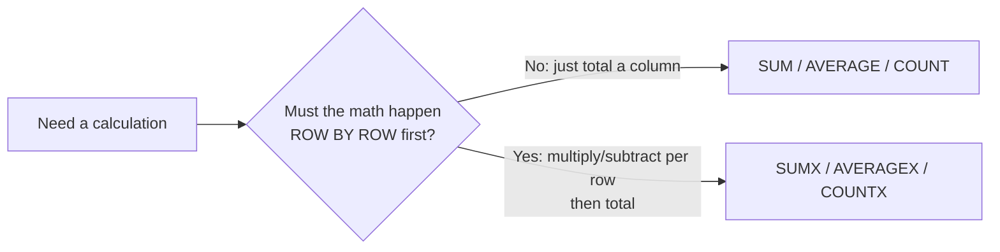

### 7.5 Example 4 — Date function: WEEKDAY (which day do people buy?)
Calculated column on **Apocalypse Sales**:
```DAX
Day of Week = WEEKDAY('Apocalypse Sales'[Date Purchased], 2)
```

| Return type | Meaning |
|---|---|
| `1` (default) | Sunday = 1 … Saturday = 7 |
| **`2`** ✅ (used) | **Monday = 1 … Sunday = 7** |
| `3` | Monday = 0 … Sunday = 6 |

- Other date functions seen in IntelliSense: `DAY`, `DATESYTD`, `NEXTDAY`, `PREVIOUSDAY`, `WEEKDAY`.
- **Why create it?** A date axis (Year > Quarter > Month > Day) can't show **weekday patterns**. With `Day of Week` on the X-axis and `Unit Sold` on Y: Monday highest, **mid-week (Wed/Thu) lowest**, weekend picks up — easy to spot.

### 7.6 Example 5 — IF (create a category)
Calculated column:
```DAX
Order Size = IF('Apocalypse Sales'[Unit Sold] > 25, "Big Order", "Small Order")
```
`IF( logical_test, value_if_true, value_if_false )` — same as Excel.

### 7.7 💡 *Extra* — a few more DAX functions worth knowing next

```DAX
-- Distinct customers (ignores duplicates)
Customers = DISTINCTCOUNT('Apocalypse Sales'[Customer ID])

-- Safe division (returns BLANK instead of error on /0)
Profit Margin % = DIVIDE( [Profit], SUMX('Apocalypse Sales', RELATED('Apocalypse Store'[Price]) * 'Apocalypse Sales'[Unit Sold]) )

-- Change filter context
Costco Units = CALCULATE( SUM('Apocalypse Sales'[Unit Sold]), 'Store'[Store] = "Costco" )

-- Multi-branch logic
Size Tier = SWITCH( TRUE(), [Unit Sold] > 100, "Large", [Unit Sold] > 25, "Medium", "Small" )
```
> **Context (key DAX theory):** *row context* = "the current row" (calculated columns, iterators). *Filter context* = "whatever the visual/slicers currently filter" (measures). `CALCULATE` modifies filter context.

---

## 8. Drill Down & Hierarchies

🎯 **Drill down** lets viewers go from a high-level view into more detail *inside the same visual* (e.g. Store → Product → Order). Essential when a boss says *"great chart — but what did we buy at Target?"*

### 8.1 How to set it up
Put a second field **under** the first in the same well (X-axis or Legend) — that creates a **hierarchy**. The drill buttons appear at the top of the visual.

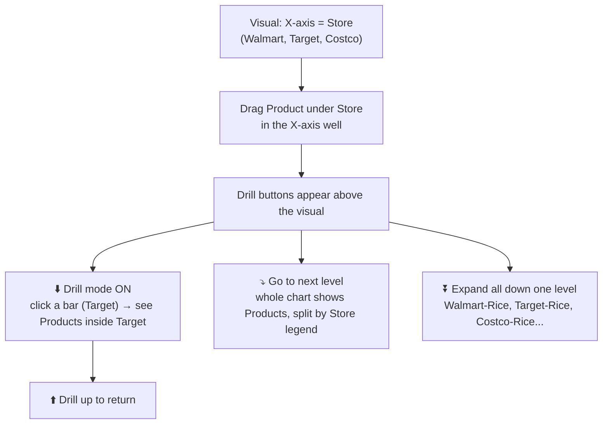

### 8.2 The drill buttons (left → right)

| Button | Name | What it does |
|---|---|---|
| ⬆️ | **Drill up** | Go back one level |
| ↓ (turns on) | **Click to turn on drill down** | Clicking a bar drills into *that* item only (e.g. only Target) — without it, clicking only **highlights/cross-filters** |
| ⇊ | **Go to the next level in the hierarchy** | Whole visual moves to next level (Product), still broken out by legend |
| ⤓ | **Expand all down one level** | Each combination becomes its own column (Walmart-Rice, Target-Dried Beans…) rather than stacked |

### 8.3 Real-world example (operations use-case)
`Customer` (Legend/axis) + `Unit Sold` → add **`Order ID`** under `Customer` → turn on drill mode → click a customer → see **every Order ID** for that customer, which a stakeholder can then look up in their system and resolve.

> 🎯 The author uses this "drill to IDs" pattern constantly. It depends on the data: not every pair of fields makes a *useful* hierarchy.

---

## 9. Groups: Lists & Bins

🎯 **Grouping** = a fast, no-code alternative to writing `IF` statements or calculated columns. Right-click a field → **New group** (or via the Data pane → right-click → New group).

| | **List** | **Bin** |
|---|---|---|
| Works on | Any field (text, number, date) | **Numeric & date** fields only |
| What it does | You **manually pick values** and group them under a name | Power BI **auto-buckets** values by size or count |
| Equivalent to | Many-way `IF` / `SWITCH` | Range buckets (0–9, 10–19…) |

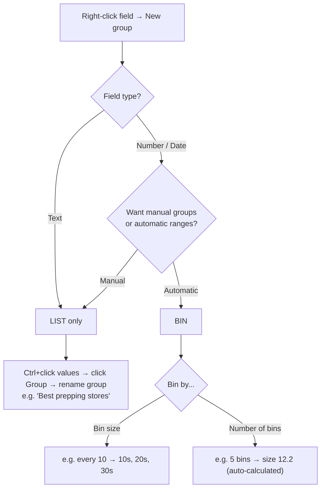

### 9.1 List example (text)
- Field: **Customer** → New group → type **List** → select *Alex the Analyst Apocalypse Preppers* → **Group** → rename **Best prepping stores**; Ctrl-click the other two customers → **Group** → rename **Worst prepping stores**.
- Creates a new field (`Customer (groups)` / the name you give). Unchecked/ungrouped items can go to "Other".
- **Insight:** the "Best" stores actually performed **worse** in units sold than the "Worst" (names were arbitrary – a good reminder to check your assumptions!).

### 9.2 List on numbers
`Order ID` → New group → choose **List** → group the first IDs as **First orders**, the last as **Latest orders** (like an `IF` between ranges).

### 9.3 Bin example — Age
- `Age` → New group → **Bin** → **Bin size = 10** → creates *Age (bins)*: 78 → 70s bin, 41 → 40s bin, 29 → 20s bin.
- Or choose **Number of bins** (5 bins → 12.2 size; 10 bins → 6.1).
- Visual: *Count of Buyer ID* by *Age bins* → shows the distribution. Add `Age` under `Age bins` → **drill down** to exact ages (found only one 18-year-old).

### 9.4 Bin example — Dates
- `Date Purchased` → New group → **Bin** → unit **Months**, size **1** → 3 bins (Jan/Feb/Mar 2022).
- Gives a ready *month* column **without** using the Year/Quarter/Month/Day date hierarchy.

---

## 10. Conditional Formatting

🎯 Add visual cues (colours, bars, icons) **inside tables/matrices** so numbers are quicker to read — just like Excel.

### 10.1 How to apply
In a **table** → in the **Visualizations pane field well** (or right-click the field in the table) → click the **▼** next to the field → **Conditional formatting** → choose type.

| Type | What it changes |
|---|---|
| **Background color** | Cell background (most used) |
| **Font color** | Number/text colour (same options as background) |
| **Data bars** | Bar inside the cell proportional to value |
| **Icons** | ● ▲ ✔ shape/colour icons |
| **Web URL** | Make a field a clickable link |

### 10.2 Format styles (for Background / Font colour)

| Style | How it works |
|---|---|
| **Gradient** | Lowest value = colour A, highest = colour B (smooth scale) |
| **Rules** | `If value ≥ X and < Y → colour` (like IF statements) |
| **Field value** | Colour taken from another field (author rarely uses; works with first/last for text) |

### 10.3 Key rules & gotchas ⚠️
1. The field must be in the **Columns/Values** well of the visual (not just the axis).
2. **Summarization matters.** If *Price* is shown as **Count**, a gradient would colour by *count* (all = 1 → all same colour!). Fix: Conditional formatting dialog → **Summarization → Minimum/Sum/Average** (any works if one value per row).
3. **Data bars appear only for aggregated numeric fields.** If a column is "Don't summarize" (e.g. Revenue), change it to **Sum** in the field well → then Data bars become available.
4. **Rules** can use *Number* or *Percent*. Remember to keep ranges non-overlapping (e.g. `≥0 and <266` gold, `≥266 and <500` peach).
5. **Icons default** to thirds: 0–33% 🔴, 33–67% 🟡, 67–100% 🟢 — editable.
6. 🚫 **Don't stack everything on one column** (gradient + data bars + rules + icons = unreadable). The video does this on purpose to show "too much."

### 10.4 Walk-through used in the video

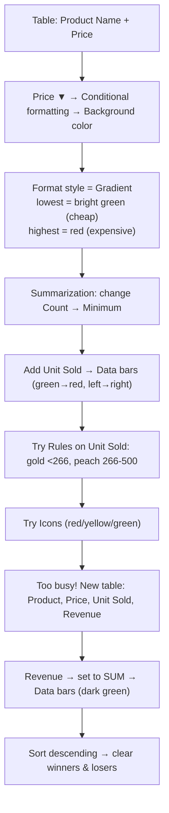

**Business insight from the revenue data bars:**
- 🏆 Top earners: **weatherproof jackets**, **multi-tool survival knives**, **nylon rope**.
- 🗑️ Weak: **duct tape, N95 masks, waterproof matches** → candidates to replace.


---

## 11. Visualization Types (When to use what)

**Prep (relationship check):** if you download the practice workbook, join the two tables first: `Product ID` (Store) → `Product ID` (Sales), **one-to-many**, single direction is fine.

### 11.1 Chart picker

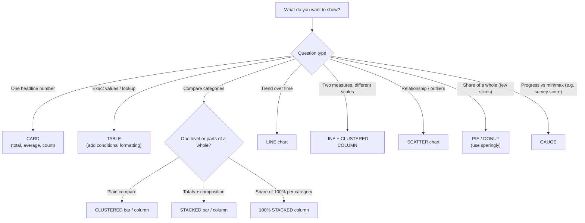

### 11.2 Visual-by-visual notes

| # | Visual | Fields used in video | Notes / Insight |
|---|---|---|---|
| 1 | **Stacked bar chart** | Y: `Product Name` · X: `Unit Sold` · Legend: `Product Name` | Power BI auto-places fields in axes; flip if wrong. Legend = one colour per product. Data labels: slider "higher = fewer labels". |
| 2 | **100% stacked column** | X: `Customer` · Y: `Unit Sold` · Legend: `Product Name` | Shows what **share** of each customer's purchases is each product (e.g. one shop = **40% duct tape**; another buys lots of **water purifiers**). Title → "Customer purchase breakdown". |
| 3 | **Line chart** | X: `Date Purchased` (drop Year & Quarter) · Y: `Unit Sold` · Legend: `Product Name` | Best for dates. Use **Filters → Top 3** (knife, rope, duct tape) to declutter. Can drill to day. |
| 4 | Stacked/Clustered **bar vs column** | — | Same chart, different **orientation** (horizontal vs vertical). |
| 5 | **Area / Stacked area** | — | Rarely used by the author. |
| 6 | **Line + clustered column** | X: `Product Name` · Column: `Price` · Line: `Production Cost` | Compare **two measures** — production cost always below price (profit!). Used often at work. |
| 7 | **Scatter chart** | X: `Price` · Y: `Production Cost` · Values: `Product Name` · Legend: `Product Name` | Finds **outliers, trends, patterns** (more useful with real data). |
| 8 | **Pie / Donut** | Legend: `State` · Values: `Total purchased` | Frequently requested but hard to compare similar-sized slices (5.63 vs 5.78 vs 7.72 impossible to eyeball) → prefer bar charts. Labels can go inside/outside. |
| 9 | **Card** | `Total purchased` (also Min, Count) | One number; usually placed along the **top** as KPIs. *Multi-row card* shows several. |
| 10 | **Table** | `Customer`, `Unit Sold` | Like a mini Excel table; typically at the side. |

**Charts the author *doesn't* use in his job** (so low priority): **maps/filled maps, gauges** (though used in the final project), **decomposition tree, waterfall, treemap** (used once in the project).

### 11.3 Workflow tips ⚠️
- **Click on blank canvas before creating a new visual.** If the current visual is still selected, clicking a chart icon will **convert** it instead of creating a new one. (Fix: `Ctrl+Z`.)
- Rename long titles: **Format visual → General → Title**.
- Don't think about perfect layout while building; **create visuals first, arrange later** ("play Tetris" at the end).
- Excess visuals ≠ good dashboard. The practice dashboard in the video was deliberately *not* portfolio-worthy.

---

## 12. Final Project — Data Professional Survey Dashboard

**Dataset:** real survey (~**630** responses) of data professionals (collected via LinkedIn/Twitter etc.), raw CSV/Excel — anonymous, with columns like: unique ID, email (not used), date/time taken, job title, current yearly salary (range), industry, favourite programming language, happiness ratings (0–10) for **salary, work-life balance, co-workers, management, upward mobility, learning new things**, difficulty breaking into data, what they look for in a new job, gender, country, age.

### 12.1 End-to-end pipeline

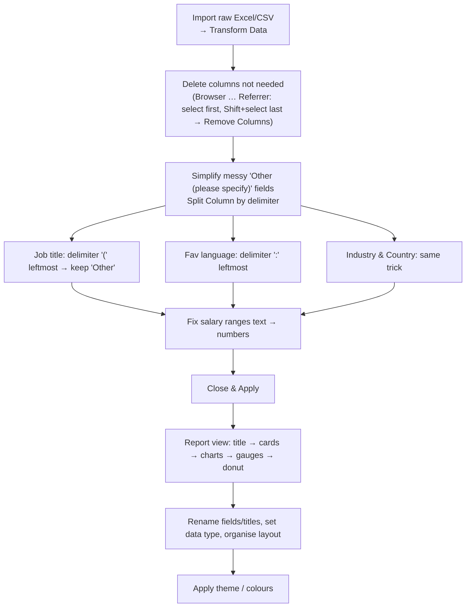

### 12.2 Cleaning the text columns ("Other" trick)

**Problem:** columns like *Which title fits you best?* contain pre-set options **plus** hundreds of free-text answers (`Other (please specify): software engineer`, `Software Engineer`, `software engineer`…). Normalising 50+ variants in Power Query is slow.

**Shortcut used (not perfect, but good enough for a beginner project):** keep only the **pre-set options** and collapse everything else into `Other`.

| Column | Split by | Mode | Result |
|---|---|---|---|
| Job title | Custom delimiter `(` | **Left-most** occurrence | Analyst, Architect, Engineer, Data Scientist, Database Developer, Other, Student/Looking/None |
| Favourite language | Colon `:` | Left-most | JavaScript, Java, C++, Python, R, … Other (SQL got buried in "Other" — author admits SQL ideally should be standardised) |
| Industry / Country | same idea | — | e.g. US, India, UK, Canada … or Other |

Then **delete the leftover second column** of each split.

```powerquery
// Job title: keep everything left of "("
= Table.SplitColumn(
      PreviousStep,
      "Which title best fits you?",
      Splitter.SplitTextByEachDelimiter({"("}, QuoteStyle.Csv, false),
      {"Job Title", "Job Title.2"}
  )
// ...then remove the .2 column
= Table.RemoveColumns(#"Split Column", {"Job Title.2"})
```
> 💡 In the UI: Home → **Split Column → By Delimiter → Custom** → type `(` → **Left-most delimiter** → OK.
> 🎯 Real-world alternative: do heavy standardisation in **Excel or SQL** (the author promises a follow-up project with deeper cleaning).

### 12.3 Turning salary *ranges* into a usable number

**Problem:** salary column is text like `106-125K` or `225K+`. We want a **numeric average salary**.

**Idea:** split into *low* and *high* numbers → `(low + high) / 2`. e.g. `106–125` ≈ **115.5K** (author gave ≈112K as an example of the approximation). Not exact, but makes it **numeric and usable**.

```mermaid
flowchart LR
    A["Salary text<br/>'106-125K'"] --> B["Duplicate column<br/>(keep original untouched)"]
    B --> C["Split Column → By Digit to Non-Digit"]
    C --> D["Columns: 106 | '-' | 125 | 'K'"]
    D --> E["Remove column that is only 'K'"]
    E --> F["Replace Values: 'K' → (nothing), '-' → (nothing)"]
    F --> G["Handle '225K+' : replace '+' with 225<br/>so (225+225)/2 = 225"]
    G --> H["Change columns to Whole number<br/>(else error: cannot apply + to text and text)"]
    H --> I["Add Column → Custom Column<br/>Average Salary = ([Low] + [High]) / 2"]
    I --> J["Remove helper columns"]
```

```powerquery
// After cleaning the helper columns and converting both to numbers:
= Table.AddColumn(PreviousStep, "Average Salary", each ([Salary Low] + [Salary High]) / 2, type number)
```
⚠️ **Error you'll hit:** `Expression.Error: We cannot apply operator + to types Text and Text.` → **change the type of both columns to Whole Number first** (the author had to redo the custom column after fixing types).

⚠️ After loading: **Average Salary may still be Text in the model** → select the column in Report/Data view → set **Data type = Decimal number**, then in the visual choose the **Average** aggregation (default may show Sum/Count).

### 12.4 Building the dashboard (order used)

| # | Visual | Fields | Notes |
|---|---|---|---|
| 0 | **Title (Text box)** | "Data Professional Survey Breakdown" | Centered, larger; background tint; avoid bold if it looks heavy |
| 1 | **Card** | `Unique ID` → **Count** (630) | *Rename for this visual* → "Count of survey takers" |
| 2 | **Card** | `Current Age` → **Average** (≈ 30) | → "Average age of survey taker" |
| 3 | **Stacked bar** (tried clustered first, looked too thin) | Y: `Job Title` · X: `Average Salary` (Average) · Legend: `Job Title` | Title "Average salary by job title". **Data scientist ≈ \$93K**, data engineer ≈ \$65K, architect ≈ \$63K, analyst ≈ \$55K. Most respondents were analysts → most reliable bar. |
| 4 | **Clustered column** | X: `Favorite Programming Language` · Y: `Count of Unique ID` (renamed "Count of voters") | **Python** by far #1; then Other, C++, JavaScript, Java. Optional: Job Title in legend to split votes. |
| 5 | **Treemap** (instead of filled map) | `Country` + count | Clickable! Click **United States** → data scientist avg ≈ **\$139K**, analyst ≈ **\$80K**; click **India** → data scientist ≈ **\$68K**, analyst ≈ **\$26K** (USD-denominated; cost of living differs). Works as a **cross-filter** for all other visuals. |
| 6 | **Gauge ×2** | Value: `Work-Life Balance` (**Average**), Min value: `Min`, Max value: `Max` fields | Without min/max the gauge looks wrong. **Work-life balance ≈ 5.74/10**; **salary happiness** is low. Titles: "Happiness with work-life balance / salary". |
| 7 | **Donut** (author usually avoids) | Legend: `Gender` · Values: `Average Salary` | Female ≈ **55K** vs Male ≈ **53K** (very close, females slightly higher). Rename title "Average salary by sex"; fix overly long decimals (Format → value decimals). Label placement outside works better than inside. |
| 8 | **Difficulty to break in** (100%-style/ donut) | `How difficult was it to break into data?` | Order categories & use a **semantic colour palette** (below). |

**Semantic colours for the difficulty chart** (Format → Slices):

| Answer | Colour |
|---|---|
| Very difficult | 🔴 Red |
| Difficult | 🟠 Orange |
| Neither easy nor difficult | 🟡 Yellow (neutral) |
| Easy | 🔵 Dark blue |
| Very easy | 🔷 Bright blue |

🧠 **Honest-mistake lesson:** the author keeps his failed attempts (e.g. inside-labels unreadable, huge decimals) — *iteration is normal*. Fix by changing label position, decimals, titles.

### 12.5 Key insights (what the data said)
- 630 respondents; average age ≈ 30.
- **Data scientists earn the most** on average, **analysts the least** among the roles listed (but analysts are the biggest group).
- **Python** is the favourite language.
- **US salaries ≫ India** in USD terms (context: cost of living).
- Work-life balance rated ~5.7/10; many unhappy with salary.
- Female vs male average salary almost equal.

---

## 13. Dashboard Design, Themes & Polish

### 13.1 Layout checklist
1. **Title** at top (centered).
2. **KPI cards** in a row just under it (high-level numbers first).
3. **Detail visuals** below (bars/columns/maps), **filters-by-click** visuals (treemap) on the side.
4. **Align & equalise sizes** (use Format → *Align/Distribute* — 💡 *Extra*). The author "plays Tetris" at the end.
5. Make titles short and meaningful; rename axis/legend fields (*Rename for this visual*).
6. Check number formats (decimals, display units) and data types.

### 13.2 Themes (View tab)
- **View → Themes**: choose from built-ins (the author liked *Frontier* and a "groovy"/natural-tones one; disliked very dark ones).
- **Customize current theme** → change colours (e.g. "colour 5" — the analyst colour), fonts, etc. Don't over-tweak; keep a muted, consistent palette.
- Background: change page background (Format page → Canvas background) so it isn't plain white (💡 *Extra* for exact path).

### 13.3 Design tips
- **Fewer charts, clearer message.** Every visual should answer a question.
- **Consistent colours** for the same category across charts.
- **Avoid pie/donut with many slices**; prefer bars.
- Use **cards** for headline KPIs; **tables** for exact numbers; **conditional formatting** for quick scanning.
- Always **sanity-check** numbers (e.g. Single vs Both cross-filter changed results from "10 products everywhere" to realistic counts).

---

## 14. Revision Zone

### 14.1 One-page cheat sheet

| Area | Remember |
|---|---|
| **Workflow** | Get data → Transform → Model → DAX → Visualize → Format → Publish |
| **Load vs Transform** | Tick sheets in Navigator first; *Transform* opens Power Query, *Load* skips cleaning |
| **Applied Steps** | Every change recorded; ❌ deletes a step; ⚙️ on Source changes file path |
| **Unpivot** | Turns wide columns (dates) into rows → needed for charts |
| **Fixed decimal** | Use for money (2 decimals) |
| **Cardinality** | Sales→Customer = many-to-one; the "one" side must be unique |
| **Cross-filter** | Single (default) vs Both (treat as one table, careful!) |
| **Measure vs Column** | Measure = dynamic aggregate; Column = per-row stored value |
| **SUM vs SUMX** | SUM totals a column; SUMX evaluates per row **then** sums |
| **WEEKDAY(date, 2)** | Monday = 1 … Sunday = 7 |
| **IF** | `IF(test, true_val, false_val)` |
| **Drill down** | Add 2nd field under 1st → hierarchy buttons appear |
| **List vs Bin** | List = manual groups (any field); Bin = auto ranges (numeric/date) |
| **Cond. formatting** | Needs aggregated field; set *Summarization*; data bars only on aggregates |
| **Don't convert visual** | Click blank canvas before adding a new chart |
| **Data labels** | Display units → **None** for exact numbers |

### 14.2 Common errors & fixes

| ⚠️ Problem | Cause | ✅ Fix |
|---|---|---|
| Every state shows 10 products | Cross-filter **Single** | Switch relationship to **Both** (or restructure model) |
| Profit column shows same value in every row | Used `SUM` (aggregator) in a calculated column | Use **`SUMX`** over the table (and `RELATED` for other-table columns) |
| Can't convert text months to dates | Source had month names as text | Fix in source or build proper dates via custom column |
| "Cannot apply operator + to Text and Text" | Columns are text | Change data types to Whole/Decimal **before** custom column |
| Gradient colours all identical | Field summarised as **Count** | Set Summarization to Sum/Min/Avg |
| Data bars option missing | Field not aggregated | Set field to **Sum** in the visual |
| New chart replaced old one | Old visual still selected | Click empty canvas first (undo with Ctrl+Z) |
| Numbers rounded (1.2K) | Display units = Auto | Display units = **None** |
| Average salary shows count/sum | Aggregation default | Choose **Average** on the field; ensure numeric data type |
| Relationship joined wrong columns | Auto-detect used same-named *name* columns | Edit relationship → pick **ID** columns |

### 14.3 Flashcards (self-test — cover the right side)

| Question | Answer |
|---|---|
| What is Power Query used for? | Cleaning/shaping data before loading (Transform Data). |
| What do Applied Steps do? | Record every transformation; can be edited/deleted. |
| Why unpivot dates? | To convert date columns into rows so visuals can use a Date field. |
| What does *Both* cross-filter do? | Filters flow both ways; connected tables act as one. |
| One-to-many means? | "One" side unique; "many" side repeats (e.g. customer → orders). |
| Measure vs calculated column? | Measure = computed at query time per filter context; column = stored per-row. |
| Why does `SUM` fail in a per-row column? | It aggregates the whole column; needs `SUMX` iterator. |
| `WEEKDAY(date, 2)` returns? | 1–7 with Monday = 1. |
| What's a hierarchy? | Ordered fields (Store → Product) enabling drill down. |
| List vs Bin? | List = manual group; Bin = automatic numeric/date ranges. |
| Which visuals does the author use most? | Bar/column, line, card, table (+ line-and-column combo). |
| Why avoid pie charts? | Hard to compare similar slice sizes. |
| How to show exact numbers on bars? | Data labels → Values → Display units → None. |
| Trick for messy "Other" text columns? | Split column by delimiter (`(` or `:`), keep left part. |

### 14.4 🧪 Practice tasks (do these to lock it in)
1. **Food Prep:** load the Excel, filter milk, build the *stacked* and *clustered* column charts; answer "which store per product?".
2. **Purchase Overview clean-up:** repeat the 10-step unpivot flow; confirm *Date* is type Date; then draw a **line chart** of cost by date per store.
3. **Model:** delete relationships, rebuild by drag-and-drop; reproduce the "10 vs 7/8/9/10 products per state" demo.
4. **DAX:** create measures `Count of Sales`, `Sum of Products Sold`, `Profit`; columns `Day of Week`, `Order Size`; chart units by weekday.
5. **Groups:** make *Best/Worst prepping stores* list; *Age bins (10)*; *Date bins (1 month)*.
6. **Conditional formatting:** gradient on Price, data bars on Revenue; sort and write 2 business conclusions.
7. **Visual tour:** recreate all 10 visuals from §11 and note *when you'd use each*.
8. **Survey project:** clean "Other" columns, build `Average Salary`, build the full dashboard, apply a theme, and write a 5-line insight summary.
9. **Stretch (not in video):** standardise "SQL / sql / Sql" variants, add slicers, publish to Power BI Service. 💡

### 14.5 Glossary

| Term | Meaning |
|---|---|
| **Dataset / model** | Loaded tables + relationships + measures |
| **Field** | A column or measure in the Data pane |
| **Measure** | DAX calculation evaluated in a visual's filter context |
| **Calculated column** | DAX column computed per row & stored |
| **Cardinality** | 1:*, *:1, 1:1, *:* relationship type |
| **Cross-filter direction** | Which way filters flow across a relationship |
| **Iterator** | DAX function ending in X evaluating row-by-row |
| **Aggregator** | DAX function that summarises a whole column |
| **Hierarchy** | Ordered levels enabling drill down |
| **Bin / List** | Automatic vs manual grouping |
| **Unpivot** | Convert columns to rows |
| **Applied Steps** | Ordered log of Power Query transformations |
| **M language** | Language behind Power Query steps |
| **KPI/Card** | Single-number visual |
| **Theme** | Dashboard-wide colour/font scheme |

---

✅ **How to revise efficiently:** (1) read §0 and §14.1 daily; (2) redo the practice tasks in order; (3) when stuck, jump to the matching section via the table of contents; (4) re-watch only the timestamped parts you can't reproduce.
