# YAML — Complete Notes (DevOps Bootcamp)

> Source: lecture transcript `yaml.txt` (Kunal Kushwaha's DevOps Bootcamp), cleaned up, organised, and extended with extra information from the YAML spec and common practice.
> Where I added something that was **not** in the lecture, it is marked with 🆕. Where the lecture was loose or the transcript garbled a symbol, it is marked with ⚠️.

---

## 📑 Table of Contents

1. [Big Picture (mind map)](#1-big-picture)
2. [What is YAML?](#2-what-is-yaml)
3. [Markup language vs Data format](#3-markup-language-vs-data-format)
4. [Data Serialization & Deserialization](#4-data-serialization--deserialization)
5. [Why YAML? Benefits & Where It's Used](#5-why-yaml-benefits--where-its-used)
6. [YAML vs JSON vs XML](#6-yaml-vs-json-vs-xml)
7. [Syntax Rules (the fundamentals)](#7-syntax-rules)
8. [Block Style vs Flow Style](#8-block-style-vs-flow-style)
9. [Scalar Data Types](#9-scalar-data-types)
10. [Specifying Types Explicitly (`!!` tags)](#10-specifying-types-explicitly--tags)
11. [Collections / Advanced Data Types](#11-collections--advanced-data-types)
12. [Anchors, Aliases & Merge (reusing properties)](#12-anchors-aliases--merge-keys)
13. [Multiple Documents in One File](#13-multiple-documents-in-one-file)
14. [🆕 Working with YAML in Code (Python)](#14-working-with-yaml-in-code-python)
15. [🆕 Real-World DevOps YAML Examples](#15-real-world-devops-yaml-examples)
16. [Tools for YAML](#16-tools-for-yaml)
17. [🆕 Common Mistakes & Debugging](#17-common-mistakes--debugging)
18. [One-Page Cheat Sheet](#18-one-page-cheat-sheet)
19. [Revision Questions & Practice](#19-revision-questions--practice)

---

## 1. Big Picture

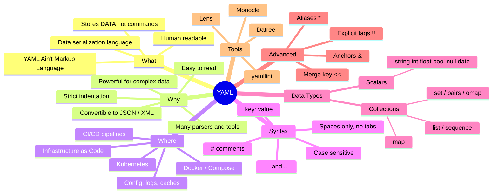

**Why this video matters:** YAML is used *everywhere* in the rest of the bootcamp — Docker, Kubernetes, cloud providers, IaC, pipelines. Think of it as the "ABCs of DevOps".

---

## 2. What is YAML?

| Item | Detail |
|---|---|
| **Full form (old)** | **Y**et **A**nother **M**arkup **L**anguage |
| **Full form (new)** | **Y**AML **A**in't **M**arkup **L**anguage (a *recursive acronym*) |
| **Type** | Data serialization language / data format (**not** a programming language) |
| **File extensions** | `.yaml` or `.yml` (both are fine) |
| **Purpose** | Store and exchange data, especially **configuration** |
| **Readability** | Human-readable, minimal punctuation |
| **Limitation** | Stores **only data** — no commands, no `if/else`, no loops |

### Key points to remember
- ✅ It is a **data format**, similar in purpose to **JSON** and **XML**.
- ✅ It can store **data (objects)**, not just *documents* — that is why the name changed from "Yet Another *Markup* Language" to "YAML *Ain't* Markup Language".
- ❌ You **cannot** write commands/logic in YAML (unlike Java, Python, etc.).
- ✅ Storing data this way in files is called **data serialization**.

> 🧠 **Recursive acronym:** YAML's expansion contains "YAML" itself — just like recursion in programming (a function calling itself).

---

## 3. Markup language vs Data format

**What is a markup language?** (HTML is the classic example)

HTML doesn't *style* a page (that's CSS) and it isn't a *programming* language. Its job is to describe **structure and parent-child relationships**: what goes inside what.

```
Page
 └── Header
 └── Table
 └── List
      └── Bullet point
           └── Paragraph
```

So a **markup language** → describes the structure/layout of **documents**.

**Why YAML is "ain't markup":** YAML is meant to store **data/objects**, not just document structure.

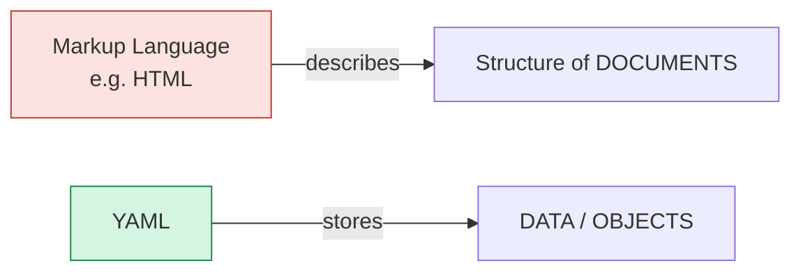

---

## 4. Data Serialization & Deserialization

### 4.1 The problem
Imagine a **Student object** in memory with `rollNumber`, `name`, `marks`. You want to share it with:
- an Android app
- a web app
- a machine-learning model

Each system stores data **differently** in memory. We need **one common format** every system can read.

### 4.2 The solution

| Term | Meaning | Direction |
|---|---|---|
| **Serialization** | Convert an in-memory **object** (code + data, complex data structure) into a **stream of bytes / text** that can be stored or transmitted | Object → File/DB/Network |
| **Deserialization** | Rebuild the **object** from that stream/file | File/DB/Network → Object |

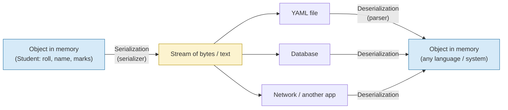

**Easy memory trick**
- **Object → file = Serialization**
- **File → object = Deserialization**

### 4.3 Data Serialization Languages
Languages/formats used to represent that data as text:

- **YAML**
- **JSON**
- **XML**

> Similar thing you already see with JSON: an API returns JSON → you convert it into objects in your code. Same idea.

---

## 5. Why YAML? Benefits & Where It's Used

### 5.1 Benefits

| # | Benefit | Explanation |
|---|---|---|
| 1 | **Simple & easy to read** | Human-friendly, little noise (no braces, no closing tags) |
| 2 | **Strict syntax** | Indentation matters (like Python) — forces clean structure |
| 3 | **Easily convertible** | YAML ⇄ JSON ⇄ XML |
| 4 | **Widely supported** | Most programming languages have YAML libraries |
| 5 | **Powerful for complex data** | Nested lists/maps, anchors for reuse, multiple docs |
| 6 | **Great tooling** | Parsers, validators, linters, GUI tools |
| 7 | **Easy parsing** | *Parsing* = reading the data; many parsers exist |

### 5.2 Where it's used

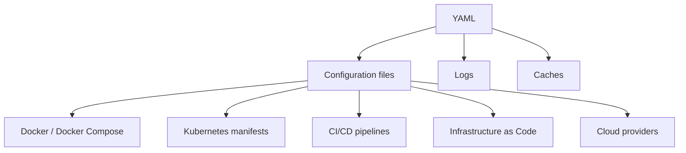

### 5.3 Kubernetes intuition (from the lecture)
You tell Kubernetes: *"Run my app on 10 servers, at most 5 instances per server."* Kubernetes creates **objects** (Pods, Deployments, …) for that. You describe the object you want in a **YAML file** and give it to Kubernetes → it creates the object. (Clients in Java/Python also exist, but YAML is the standard.)

---

## 6. YAML vs JSON vs XML

All three are **data serialization languages**. Same data — a **School** with a name, a principal, and a list of students (roll number, name, marks):

### 6.1 XML (Extensible Markup Language)
```xml
<?xml version="1.0" encoding="UTF-8"?>
<school>
    <name>DPS</name>
    <principal>Someone</principal>
    <students>
        <student>
            <rollNumber>23</rollNumber>
            <name>Kunal Kushwaha</name>
            <marks>94</marks>
        </student>
    </students>
</school>
```
- Needs **version** and **encoding** declaration (`UTF-8`).
- Every tag must be **opened and closed**.
- Verbose → **hard for humans to read** when files get big.

### 6.2 JSON (JavaScript Object Notation)
```json
{
  "school": {
    "name": "DPS",
    "principal": "Someone",
    "students": [
      {
        "rollNumber": 23,
        "name": "Kunal Kushwaha",
        "marks": 94
      }
    ]
  }
}
```
- `{ }` → **one entity (object)**, `[ ]` → **collection (array)**.
- **Keys must be strings** (in double quotes) — you can't use a bare number as a key.
- Popular in JavaScript, APIs, MongoDB.
- More readable than XML, but lots of braces/quotes/commas.

### 6.3 YAML
```yaml
school:
  name: DPS
  principal: Someone
  students:
    - rollNumber: 23
      name: Kunal Kushwaha
      marks: 94
```
- **Cleanest** of the three. Structure comes from indentation; `-` marks list items.

### 6.4 Comparison table

| Feature | YAML | JSON | XML |
|---|---|---|---|
| Full form | YAML Ain't Markup Language | JavaScript Object Notation | Extensible Markup Language |
| Human readability | ⭐⭐⭐ Best | ⭐⭐ Good | ⭐ Poor for big files |
| Syntax noise | Very low | Medium (`{}` `[]` `""` `,`) | High (open/close tags) |
| Comments | ✅ `# comment` | ❌ Not supported | ✅ `<!-- -->` |
| Structure via | Indentation | Braces / brackets | Tags |
| Quotes required for strings | Usually no | Always (`"..."`) | No (text between tags) |
| Data types | Auto-detected + explicit tags | string, number, bool, null, array, object | Everything is text unless schema'd |
| Multiple documents per file | ✅ (`---`) | ❌ | ❌ |
| Reuse (anchors/aliases) | ✅ | ❌ | ❌ |
| Typical use | Config (K8s, Docker, CI/CD) | APIs, web, NoSQL | Legacy/enterprise systems, SOAP |

> 🆕 YAML 1.2 is (almost) a **superset of JSON** — most valid JSON is also valid YAML. That's why flow style (§8) looks like JSON.

---

## 7. Syntax Rules

### 7.1 The golden rules

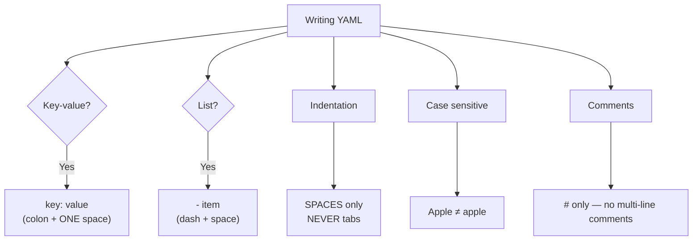

| Rule | Detail | Example |
|---|---|---|
| **Key-value pair** | `key: value` — need a **space after the colon** | `apple: red fruit` |
| **Indentation = structure** | Child items are indented under parent. Be consistent (2 spaces is common) | see below |
| **Spaces, not tabs** | Tabs cause errors | — |
| **Case sensitive** | `Apple` and `apple` are different keys | — |
| **Lists** | Use `-` (dash + space) | `- mango` |
| **Comments** | `#` to end of line. **No multi-line comment** — put `#` on every line | `# note` |
| **Extension** | `.yaml` or `.yml` | `hello.yaml` |
| **Document start** | `---` (optional for single doc) | — |
| **Document end** | `...` (optional) | — |

### 7.2 Basic example (from the lecture)
```yaml
# Key-value pairs (a "map" / dictionary / hash map)
apple: a red fruit
1: Kunal's roll number        # even a number can be a key in YAML (not in JSON)

# List (sequence)
# fruits
- apple
- mango
- banana
```
> ⚠️ In a *real* file you can't mix top-level map entries and a top-level list in one document — the lecture used `---` separators to show several independent examples (see §13). Below, each is a separate valid doc.

### 7.3 Indentation matters — the cities example

**✅ Correct** (block style):
```yaml
cities:
  - New Delhi
  - Mumbai
  - Gujarat
```

**❌ Wrong indentation → error** (what the validator complained about in the lecture):
```yaml
cities:
  - New Delhi
 - Mumbai        # <-- misaligned: parser error "not matching with the block"
    - Gujarat
```

**What happens with no structure at all?** If you just type words on separate lines with no `key:` or `-`, YAML either merges them into one string or throws an error. Every line has to be part of a recognisable structure (`key: value`, `- item`, or a continuation of a multi-line scalar).

### 7.4 Comments
```yaml
# This is a comment
name: Kunal        # inline comment
# For a "multi-line" comment
# you must repeat the hash
# on every single line
```

---

## 8. Block Style vs Flow Style

YAML offers **two ways** to write collections.

### 8.1 Block style (indentation-based)
```yaml
cities:
  - New Delhi
  - Mumbai
  - Gujarat

mango:
  color: yellow
  type: fruit
  age: 56
```

### 8.2 Flow style (JSON-like, single line)
```yaml
cities: [New Delhi, Mumbai, Gujarat]

mango: {color: yellow, type: fruit, age: 56}
```

| | Block | Flow |
|---|---|---|
| Looks like | Python / outline | JSON |
| Relies on indentation? | Yes | **No** — good if you want to avoid indentation errors |
| List | `- a` per line | `[a, b, c]` |
| Map | `k: v` per line | `{k: v, k2: v2}` |
| Best for | Long / nested data | Short, compact data |

> Flow style is *basically JSON*, but values don't need quotes in YAML (in JSON strings must be quoted).

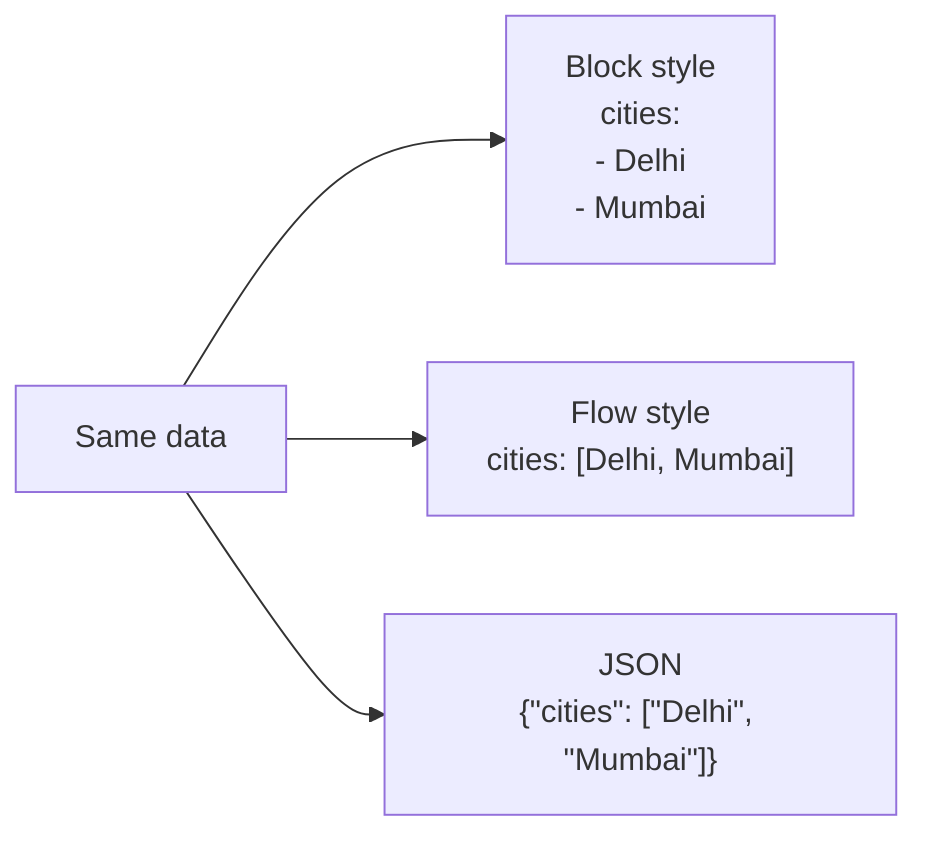

---

## 9. Scalar Data Types

A **scalar** = a single value. Syntax: `variable_name: value` (colon + **one space** + value).

YAML **auto-detects** the type of unquoted values.

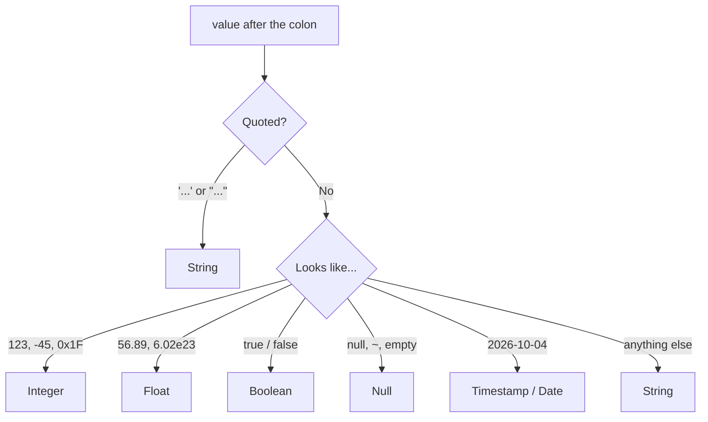

### 9.1 Strings — 3 ways to write a single-line string

```yaml
name: Kunal Kushwaha          # 1. plain (no quotes)
fruit: "apple"                # 2. double quotes
job: 'software engineer'      # 3. single quotes
```

| Style | Escape sequences (`\n`, `\t`) work? | Use when |
|---|---|---|
| Plain | No | Simple text |
| `'single'` | **No** (literal). Write a literal `'` as `''` | Text with special characters |
| `"double"` | **Yes** (`\n`, `\t`, `\"`, unicode) | You need escapes |

> 🧠 Quote a string whenever it contains `:` followed by space, ` #`, starts with special chars (`*`, `&`, `!`, `{`, `[`, `@`, `%`), or *looks like* another type (e.g. `"true"`, `"123"`, `"null"`).

### 9.2 Multi-line strings

Sometimes you have long text (e.g. a bio) across several lines. If you write it plainly, the parser errors out. Use a **block scalar indicator**:

| Indicator | Name | Behaviour |
|---|---|---|
| `\|` | **Literal** | **Keeps every newline** exactly as written |
| `>` | **Folded** | Newlines become **spaces** → ends up as **one single line** |

> ⚠️ The transcript garbled these symbols (it says "a dash" and "this character"). The real indicators are the **pipe `|`** (preserve new lines) and the **greater-than `>`** (fold into one line).

```yaml
# Literal: new lines are preserved
bio: |
  Hey, my name is Kunal Kushwaha.
  I am a very nice dude.

# Folded: lines are joined into one line (with spaces)
message: >
  This is a really long line
  that I want to write over
  multiple lines for readability
  but it is stored as ONE line.
```

Result in memory:
```
bio     = "Hey, my name is Kunal Kushwaha.\nI am a very nice dude.\n"
message = "This is a really long line that I want to write over multiple lines for readability but it is stored as ONE line.\n"
```

🆕 **Chomping indicators** (control the trailing newline):

| Suffix | Meaning |
|---|---|
| `\|` / `>` | **clip** — keep a single final newline (default) |
| `\|-` / `>-` | **strip** — remove the final newline |
| `\|+` / `>+` | **keep** — keep all trailing newlines |

```yaml
script: |-
  echo "hello"
  echo "world"
```

### 9.3 Integers

```yaml
number: 5473          # integer (auto-detected)
```

Other integer forms (lecture):

| Kind | Prefix | Example |
|---|---|---|
| Decimal | none | `45`, `-45`, `0` |
| Binary | `0b` | `0b1100` |
| Octal | `0` (YAML 1.1) / `0o` (YAML 1.2) | `014` / `0o14` |
| Hexadecimal | `0x` | `0x1F` |
| With separators | `_` underscores | `540_000` (= 540000) |

### 9.4 Floats

```yaml
marks: 56.89          # float
infinity: .inf        # infinity   (also -.inf)
not_a_number: .nan    # Not a Number
avogadro: 6.023e+23   # exponent form
```

### 9.5 Booleans

```yaml
is_student: true
has_car: false
```
- Lecture note: you can also write `True`, `TRUE`, `False`, `FALSE`.
- Lecture also mentioned `yes` / `no`.

> ⚠️ 🆕 **Version caveat:** in **YAML 1.1** (older; used by PyYAML, Ruby's Psych default) `yes/no/on/off/y/n` are *booleans*. In **YAML 1.2** (current spec) only `true`/`false` are booleans. This causes the infamous **"Norway problem"**: `country: NO` may parse as `false`! → **Safest practice: always use `true` / `false`, and quote strings like `"NO"`.**

### 9.6 Null

Represents "no value". Any of these:
```yaml
surname: null
surname: Null
surname: NULL
surname: ~         # tilde works too
surname:           # empty value is also null
```

### 9.7 Dates & Timestamps

```yaml
date: 2026-10-04                              # date only
datetime_utc: 2026-10-04T10:30:00Z            # UTC ("Z")
datetime_india: 2026-10-04 16:00:00 +05:30    # with time zone (IST = UTC+5:30)
datetime_no_tz: 2026-10-04 10:30:00           # no zone → assumed UTC
```
Data type name: **`timestamp`** (`!!timestamp`). If no time zone is given, UTC is assumed.

### 9.8 Summary table of scalar types

| Type | Tag | Examples |
|---|---|---|
| String | `!!str` | `hello`, `"hi"`, `'hi'` |
| Integer | `!!int` | `0`, `45`, `-45`, `0b1010`, `0xFF`, `540_000` |
| Float | `!!float` | `56.89`, `.inf`, `-.inf`, `.nan`, `6.02e23` |
| Boolean | `!!bool` | `true`, `false` |
| Null | `!!null` | `null`, `~`, *(empty)* |
| Timestamp | `!!timestamp` | `2026-10-04`, `2026-10-04T10:30:00Z` |

---

## 10. Specifying Types Explicitly (`!!` tags)

YAML guesses types automatically, but you can **force** a type with a **tag**: `!!type value`.

```yaml
# Integers
zero: !!int 0
positive: !!int 45
negative: !!int -45
binary: !!int 0b1100
octal: !!int 014
hex: !!int 0x1F
with_separator: !!int 540_000

# Floats
marks: !!float 56.89
infinity: !!float .inf
nan: !!float .nan

# Boolean / String
flag: !!bool true
word: !!str 123          # forces the NUMBER 123 to be read as the STRING "123"

# Null
nothing: !!null ~

# Timestamp
created: !!timestamp 2026-10-04T10:30:00Z
```

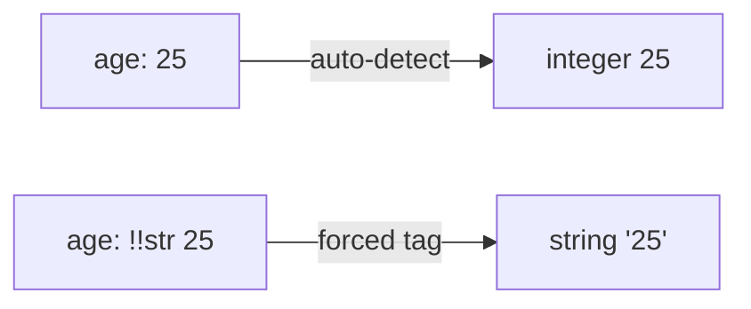

**Pattern:** `key: !!<type> value`

---

## 11. Collections / Advanced Data Types

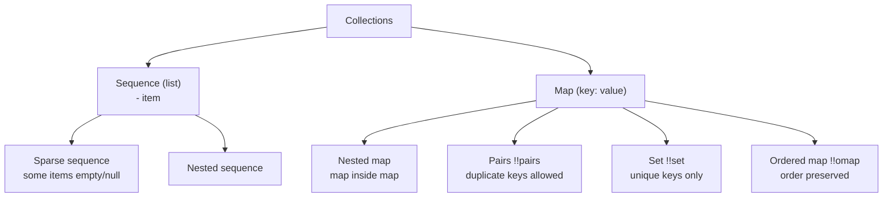

### 11.1 Sequence (list / array)
```yaml
# Block style
student:
  - Kunal
  - 23
  - 94

# Flow style
student: [Kunal, 23, 94]
```
Think: **array / list** — ordered, can contain duplicates.

### 11.2 Sparse sequence
Some items are **empty/null**.
```yaml
sparse:
  - hey
  -
  - how
  - null
  - ~
```
In memory: `["hey", null, "how", null, null]`

### 11.3 Nested sequence
A list **inside** a list (extra indentation under a lone `-`):
```yaml
-
  - mango
  - apple
  - banana
-
  - marks
  - roll number
  - date
```
Equivalent flow style: `[[mango, apple, banana], [marks, roll number, date]]`

### 11.4 Map (key-value pairs / hash map)
```yaml
person:
  name: Kunal Kushwaha
  age: 25
  job: student
```

### 11.5 Nested map (map inside a map)
```yaml
person:
  name: Kunal Kushwaha
  roll:
    age: 78
    job: student
```
Flow equivalent: `person: {name: Kunal Kushwaha, roll: {age: 78, job: student}}`

### 11.6 Pairs (`!!pairs`) — one key, multiple values (duplicate keys)
A normal map can't repeat keys. For *"a person who is both a student and a teacher"*:
```yaml
example: !!pairs
  - job: student
  - job: teacher
```
Parsed into an **array of single-entry maps**:
```json
{"example": [["job","student"], ["job","teacher"]]}
```
(Exact shape depends on the parser; in the lecture's converter it became an array of `{job: ...}` objects.)

Flow style: `example: !!pairs [job: student, job: teacher]`

### 11.7 Set (`!!set`) — only unique values
No values, only **keys** (marked with `?`). Duplicates collapse.
```yaml
names: !!set
  ? Kunal
  ? Rahul
  ? Kunal       # duplicate → ignored / not allowed
```
Result: `names = {Kunal, Rahul}`

### 11.8 Ordered map (`!!omap`) — "dictionary" in the lecture
When **order matters** and each key's value is itself a structure:
```yaml
people: !!omap
  - Kunal:
      name: Kunal Kushwaha
      age: 25
      height: 5.9
  - Rahul:
      name: Rahul P
      age: 50
      height: 5.8
```

Structure:
```
people
 ├── Kunal
 │     ├── name
 │     ├── age
 │     └── height
 └── Rahul
       ├── name
       ├── age
       └── height
```

> ⚠️ In the lecture the "dictionary" example is essentially a **map of maps** (works without a tag too):
> ```yaml
> people:
>   Kunal: {name: Kunal Kushwaha, age: 25, height: 5.9}
>   Rahul: {name: Rahul P, age: 50, height: 5.8}
> ```
> Use `!!omap` only if you need guaranteed **ordering**.

### 11.9 🆕 Very common pattern: List of maps
```yaml
students:
  - rollNumber: 12
    name: Asha
    marks: 67
  - rollNumber: 13
    name: Ravi
    marks: 81
```
This is the shape of most Kubernetes fields (`containers:`, `ports:`, `env:`).

### 11.10 Comparison table

| Type | Tag | Duplicates? | Ordered? | Syntax hint |
|---|---|---|---|---|
| Sequence | `!!seq` | ✅ yes | ✅ yes | `- item` |
| Map | `!!map` | ❌ keys unique | usually | `key: value` |
| Pairs | `!!pairs` | ✅ keys may repeat | ✅ | list of `- k: v` |
| Set | `!!set` | ❌ unique | no | `? item` |
| Ordered map | `!!omap` | ❌ keys unique | ✅ guaranteed | list of `- k: v` |

---

## 12. Anchors, Aliases & Merge Keys

### 12.1 The problem — repetition
```yaml
person1:
  favourite_fruit: mango
  dislikes: grapes
person2:
  favourite_fruit: mango       # ← repeated
  dislikes: grapes             # ← repeated
person3:
  favourite_fruit: mango       # ← repeated
  dislikes: grapes             # ← repeated
# 1000 people → 2000 repeated lines!
```

### 12.2 The solution — **Anchors** (`&`) and **Aliases** (`*`)

| Symbol | Name | Meaning |
|---|---|---|
| `&name` | **Anchor** | *"What do I want to copy?"* — label a block |
| `*name` | **Alias** | *"Where do I paste it?"* — reuse the anchored block |
| `<<:` | **Merge key** | Merge the anchored map's keys into the current map (lets you **override**) |

> ⚠️ The transcript says "at the rate" — that's the **`&`** (ampersand) anchor symbol (the speaker said "@" loosely); aliases use **`*`** (the lecture says "star").

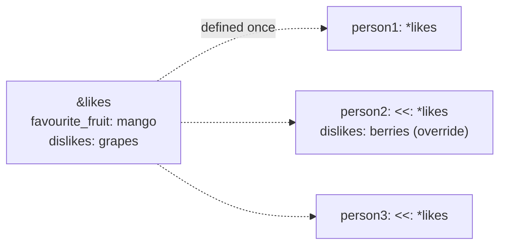

### 12.3 Full example

```yaml
likes: &likes                     # ANCHOR: name it "likes"
  favourite_fruit: mango
  dislikes: grapes

person1: *likes                   # ALIAS: person1 = exact copy of likes

person2:
  <<: *likes                      # MERGE: copy everything from likes...
  dislikes: berries               # ...then OVERRIDE dislikes

person3:
  <<: *likes                      # MERGE with no changes
  name: Rahul                     # plus extra keys of its own
```

**Resolved result (what the parser sees):**
```yaml
likes:   {favourite_fruit: mango, dislikes: grapes}
person1: {favourite_fruit: mango, dislikes: grapes}
person2: {favourite_fruit: mango, dislikes: berries}   # overridden
person3: {favourite_fruit: mango, dislikes: grapes, name: Rahul}
```

### 12.4 Rules
- Anchor must be defined **before** it's used (top-to-bottom).
- `*alias` alone → full copy, **no overrides**.
- `<<: *alias` → copy **then** add/override keys.
- Merge key `<<` works with maps (supported by most parsers; formally from YAML 1.1).
- 🆕 Used a lot in **docker-compose** and **CI pipelines** (e.g. shared job settings).

---

## 13. Multiple Documents in One File

A single `.yaml` file can contain **zero or more documents**.

| Marker | Meaning |
|---|---|
| `---` | **Start** of a new document (separator) |
| `...` | **End** of a document (optional) |

```yaml
---
# Document 1: a map
apple: red fruit
1: Kunal's roll number
---
# Document 2: a list
- apple
- mango
- banana
---
# Document 3: a block with a nested list
cities:
  - New Delhi
  - Mumbai
  - Gujarat
...
```

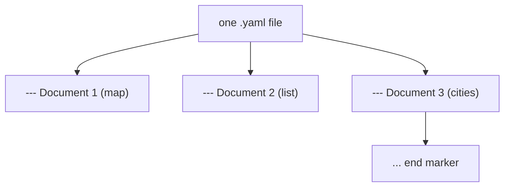

**Why it matters (Kubernetes):** one file can define a **Pod**, a **Deployment**, and an **Ingress**, each as its own document separated by `---`.

---

## 14. Working with YAML in Code (Python)

🆕 *Not in the lecture* — it shows **serialization/deserialization** in action.

```bash
pip install pyyaml
```

**student.yaml**
```yaml
school:
  name: DPS
  principal: Someone
  students:
    - rollNumber: 23
      name: Kunal Kushwaha
      marks: 94.5
      active: true
      surname: null
```

**Deserialization — YAML file → Python object**
```python
import yaml

with open("student.yaml") as f:
    data = yaml.safe_load(f)          # ALWAYS prefer safe_load

print(data["school"]["name"])                    # DPS
print(data["school"]["students"][0]["marks"])    # 94.5  (float)
print(type(data["school"]["students"][0]["active"]))  # <class 'bool'>
```

**Serialization — Python object → YAML**
```python
import yaml

student = {"rollNumber": 23, "name": "Kunal", "marks": 94.5}
print(yaml.safe_dump(student, sort_keys=False))
# rollNumber: 23
# name: Kunal
# marks: 94.5
```

**Multi-document file**
```python
with open("multi.yaml") as f:
    for doc in yaml.safe_load_all(f):
        print(doc)
```

**YAML ⇄ JSON conversion**
```python
import yaml, json

with open("student.yaml") as f:
    as_json = json.dumps(yaml.safe_load(f), indent=2)
print(as_json)
```

> ⚠️ **Security:** use `yaml.safe_load`, **not** `yaml.load` (older/unsafe loader can construct arbitrary Python objects → code execution risk).

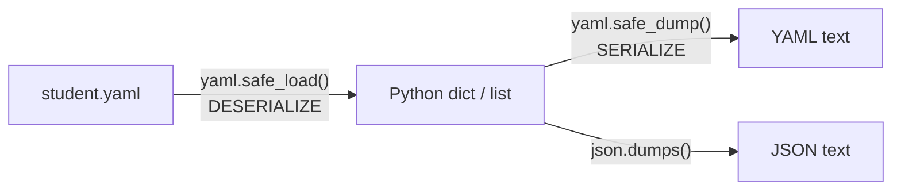

---

## 15. Real-World DevOps YAML Examples

🆕 *Preview of what you'll write throughout the bootcamp.*

### 15.1 Kubernetes Pod
```yaml
apiVersion: v1              # string
kind: Pod                   # what object to create
metadata:                   # nested map
  name: my-app
  labels:
    app: web
spec:
  containers:               # list of maps
    - name: nginx
      image: nginx:1.27
      ports:
        - containerPort: 80
      env:
        - name: MODE
          value: "production"   # quoted to stay a string
```

### 15.2 Kubernetes multi-document (Deployment + Service)
```yaml
apiVersion: apps/v1
kind: Deployment
metadata:
  name: my-app
spec:
  replicas: 3
  selector:
    matchLabels: {app: web}
  template:
    metadata:
      labels: {app: web}
    spec:
      containers:
        - name: nginx
          image: nginx:1.27
---
apiVersion: v1
kind: Service
metadata:
  name: my-app-svc
spec:
  selector: {app: web}
  ports:
    - port: 80
      targetPort: 80
```

### 15.3 Docker Compose
```yaml
services:
  web:
    image: nginx:1.27
    ports:
      - "8080:80"            # quoted! "8080:80" could be parsed oddly otherwise
  db:
    image: postgres:16
    environment:
      POSTGRES_PASSWORD: example
    volumes:
      - dbdata:/var/lib/postgresql/data
volumes:
  dbdata:
```

### 15.4 CI/CD pipeline (GitHub Actions style)
```yaml
name: CI
on:
  push:
    branches: [main]
jobs:
  build:
    runs-on: ubuntu-latest
    steps:
      - uses: actions/checkout@v4
      - name: Run tests
        run: |
          pip install -r requirements.txt
          pytest
```

### 15.5 How Kubernetes uses your YAML
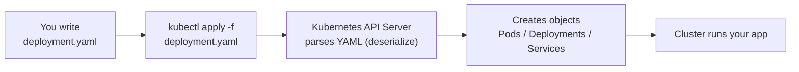

---

## 16. Tools for YAML

Tools mentioned in the lecture (links were in the video description):

| Tool | What it does | Notes |
|---|---|---|
| **YAML Lint** (yamllint.com) | Paste YAML → check if it's valid; shows indentation errors | Used in the lecture demo |
| **JSON ⇄ YAML online converters** | Convert between formats | Used to show JSON→YAML |
| **Datree** | Validates Kubernetes manifests / YAML structure & policies | ⚠️ **See note below** |
| **Monocle (by Kubeshop)** | Navigate/manage large Kubernetes YAML manifest files easily | Check the project's current status before relying on it |
| **Lens (K8s Lens IDE)** | GUI for Kubernetes — create/edit resources by clicking; it generates the YAML for you; shows cluster CPU/memory usage | Great for learning & day-to-day work |
| **VS Code** | Editor used in the lecture (YAML extension adds validation/schema hints) | 🆕 |

> 🌐 **Update from the web (Datree):** the video recommends Datree, but **Datree's company closed in July 2023**. Its repos are archived (no new features/security patches); the CLI can still run in *offline mode*. Actively maintained alternatives for K8s/YAML policy checking: **Kyverno**, **OPA Gatekeeper**, **Conftest**, **Checkov**.

🆕 **Other handy tools (not in lecture):**
- **`yamllint`** — CLI linter (`pip install yamllint`; `yamllint file.yaml`)
- **`yq`** — "jq for YAML": query/edit YAML from the command line
- **`kubeconform`** — validates Kubernetes manifests against official schemas
- **VS Code "YAML" extension (Red Hat)** — schema validation + autocomplete

---

## 17. Common Mistakes & Debugging

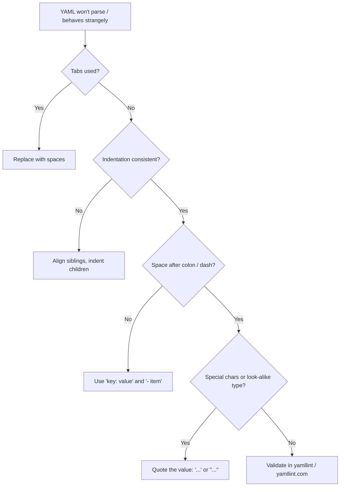

| Mistake | Wrong | Right |
|---|---|---|
| Tabs for indentation | `<TAB>name: x` | `··name: x` (spaces) |
| No space after colon | `name:Kunal` | `name: Kunal` |
| Inconsistent indent | misaligned `- item` | align siblings |
| Colon inside value | `time: 12:30` (may parse as number/sexagesimal in 1.1) | `time: "12:30"` |
| Value looks like boolean | `country: NO` | `country: "NO"` |
| Value looks like number | `version: 1.10` → `1.1` | `version: "1.10"` |
| Port mapping | `- 80:80` | `- "80:80"` |
| Wrong case | `Name` vs `name` | keys are case-sensitive — stay consistent |
| Multi-line text unquoted | text on 2 lines | use `\|` or `>` |
| Using JSON-only rules | quoting every key | not required in YAML |
| Duplicate keys | `a: 1` then `a: 2` | keys must be unique (last may silently win!) |
| Using alias before anchor | `*x` before `&x` | define the anchor first |

---

## 18. One-Page Cheat Sheet

```yaml
# ─────────────── BASICS ───────────────
---                              # document start
key: value                       # map entry (space after colon!)
# comment                        # only single-line comments
...                              # document end

# ─────────────── SCALARS ──────────────
string_plain: hello
string_dq: "hello\n"             # escapes work
string_sq: 'it''s fine'          # '' = literal quote
integer: 42
negative: -45
hex: 0x1F
binary: 0b1100
octal: 014                       # 0o14 in YAML 1.2
big: 540_000
float: 56.89
exp: 6.023e+23
inf: .inf
nan: .nan
bool_t: true
bool_f: false
nothing: null                    # or ~ or empty
date: 2026-10-04
timestamp: 2026-10-04T10:30:00Z

# ─────────────── MULTI-LINE ───────────
literal: |                       # keep newlines
  line 1
  line 2
folded: >                        # join lines with spaces
  line 1
  line 2

# ─────────────── EXPLICIT TYPES ───────
forced_str: !!str 123
forced_float: !!float 1
forced_int: !!int "42"           # tag casts where valid

# ─────────────── COLLECTIONS ──────────
list_block:
  - a
  - b
list_flow: [a, b, c]
map_block:
  k1: v1
  k2: v2
map_flow: {k1: v1, k2: v2}
nested:
  - [x, y]
  - [z]
list_of_maps:
  - name: A
    age: 1
  - name: B
    age: 2
pairs: !!pairs
  - job: student
  - job: teacher
unique: !!set
  ? one
  ? two
ordered: !!omap
  - first: 1
  - second: 2

# ─────────────── REUSE ────────────────
base: &base                      # anchor
  color: red
  size: M
item1: *base                     # alias (exact copy)
item2:
  <<: *base                      # merge
  size: L                        # override
```

---

## 19. Revision Questions & Practice

### 19.1 Quick-fire Q&A (cover the right column and test yourself)

| # | Question | Answer |
|---|---|---|
| 1 | Full form of YAML? | *YAML Ain't Markup Language* (originally *Yet Another Markup Language*) |
| 2 | Why was the name changed? | It stores **data/objects**, not just documents like a markup language |
| 3 | Is YAML a programming language? | No — a **data serialization language/format** |
| 4 | Can YAML contain commands/logic? | No, **only data** |
| 5 | Define serialization | Converting an in-memory object into a byte stream/text (file, DB, network) |
| 6 | Define deserialization | Reconstructing the object from that stream/file |
| 7 | Name 3 data serialization languages | YAML, JSON, XML |
| 8 | File extensions? | `.yaml`, `.yml` |
| 9 | Tabs or spaces? | **Spaces only** |
| 10 | Is YAML case-sensitive? | Yes |
| 11 | Multi-line comments? | Not supported — use `#` on every line |
| 12 | Separator between documents? | `---` (end marker `...`) |
| 13 | Syntax of a key-value pair? | `key: value` (space after colon) |
| 14 | How to write a list? | `- item` per line, or `[a, b, c]` |
| 15 | Block vs flow style? | Block = indentation-based; Flow = JSON-like `[]` `{}` |
| 16 | Ways to write strings? | Plain, `'single'`, `"double"` (+ `\|` and `>` for multi-line) |
| 17 | Difference between `\|` and `>`? | `\|` keeps newlines; `>` folds them into one line |
| 18 | How to write null? | `null`, `Null`, `NULL`, `~`, or empty |
| 19 | Special float values? | `.inf`, `-.inf`, `.nan` |
| 20 | How to force a type? | `key: !!int 45`, `!!str`, `!!float`, … |
| 21 | Default timezone for timestamps with none? | UTC |
| 22 | Set vs Pairs? | Set = unique, no values (`?`); Pairs = duplicate keys allowed |
| 23 | What do `&`, `*`, `<<` do? | Anchor (define), alias (reuse), merge (reuse + override) |
| 24 | Which Kubernetes tool gives a GUI so you needn't write YAML? | **Lens** |
| 25 | Which Python call to load YAML safely? | `yaml.safe_load()` |

### 19.2 Hands-on exercises

**Exercise 1 — Student profile.** Write YAML for: name (string), age (int), CGPA (float), is_active (bool), middle_name (null), joined (date).

<details><summary>Solution</summary>

```yaml
name: Kunal Kushwaha
age: 25
cgpa: 8.9
is_active: true
middle_name: null
joined: 2026-10-04
```
</details>

**Exercise 2 — School.** Convert this JSON to YAML:
```json
{"school": {"name": "DPS", "students": [{"roll": 1, "name": "A"}, {"roll": 2, "name": "B"}]}}
```
<details><summary>Solution</summary>

```yaml
school:
  name: DPS
  students:
    - roll: 1
      name: A
    - roll: 2
      name: B
```
</details>

**Exercise 3 — Anchors.** Five employees share `dept: DevOps` and `shift: night`. Employee 4 works the `day` shift. Avoid repetition.

<details><summary>Solution</summary>

```yaml
defaults: &defaults
  dept: DevOps
  shift: night

emp1: {<<: *defaults, name: A}
emp2: {<<: *defaults, name: B}
emp3: {<<: *defaults, name: C}
emp4: {<<: *defaults, name: D, shift: day}
emp5: {<<: *defaults, name: E}
```
</details>

**Exercise 4 — Spot the bugs.**
```yaml
name:Kunal
age: 25
  city: Delhi
hobbies:
- cricket
 - chess
```
<details><summary>Answer</summary>

1. `name:Kunal` → missing space after colon.
2. `city: Delhi` is wrongly indented under a scalar (`age: 25`) → align with `age`.
3. `- chess` is indented differently from `- cricket` → align both list items.

Fixed:
```yaml
name: Kunal
age: 25
city: Delhi
hobbies:
  - cricket
  - chess
```
</details>

**Exercise 5 — Multi-doc.** Write one file with two documents: a Pod and a Service (hint: `---`). See §15.2.

### 19.3 Suggested next steps
1. Write each example above in VS Code and validate with **yamllint**.
2. Convert YAML ⇄ JSON with an online converter and compare the output.
3. Load a YAML file in Python (`safe_load`) and print its types.
4. Install **Lens** (or `kubectl` + a local cluster) before the Kubernetes section.
5. 📣 As the instructor suggests: **learn in public** — post a screenshot of your notes/practice with the hashtag `#DevOpsWithKunal`.

---

### 📌 Notes on the source transcript
- The lecture is an *auto-transcript*, so some symbols were lost: `|` and `>` for multi-line strings (it said "a dash" / "this character"), `&` for anchors ("at the rate"), `?` for sets, `!!` for type tags ("exclamation exclamation").
- A few terms were loosely used in the lecture: "dictionary" for `!!omap`; "variable" for a key; "block code" for block style. These notes use the standard names.
- The instructor mentioned timestamps to jump to sections; the transcript order is: intro → what is YAML → serialization → benefits → demo (key-value, lists, case sensitivity, indentation, documents, flow style, comments) → data types → explicit types → advanced types → anchors → XML/JSON/YAML comparison → tools.
